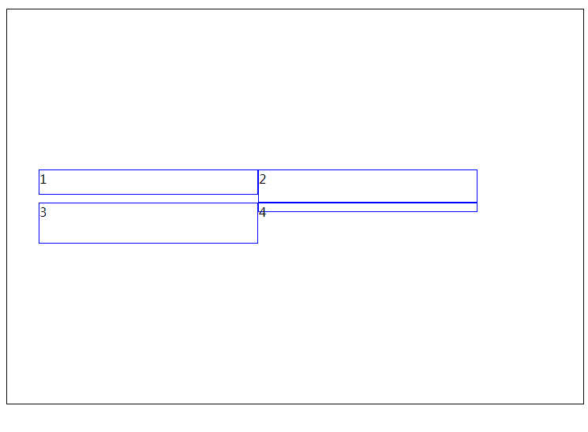
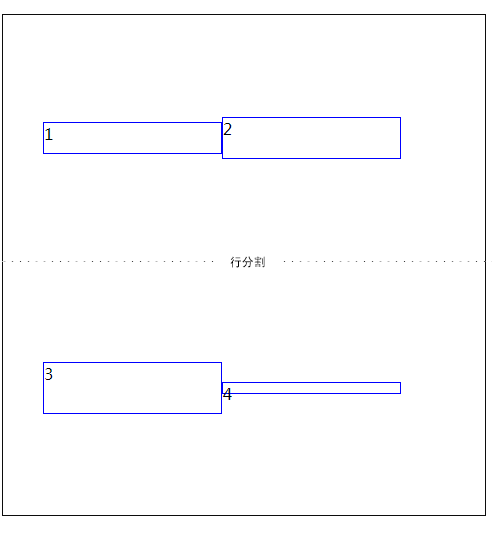

# .contain{ }

```
display:flex //下级dom都变成了类似inline-bolck显示
```
### 水平方向

##### justify-content水平方向的排布方式

```
justify-content:flex-start|flex-end|center|space-between|space-around|initial|inherit;
```


### 垂直方向

##### align-content垂直方向行之间排布方式(必须开启wrap那怕是一行)

```js
align-content:flex-start|flex-end|center|space-between|space-around  |initial|inherit|stretch(默认);
```


```html
<!DOCTYPE html PUBLIC "-//W3C//DTD XHTML 1.0 Transitional//EN"
  "http://www.w3.org/TR/xhtml1/DTD/xhtml1-transitional.dtd">
<meta>
<html xmlns="http://www.w3.org/1999/xhtml">
<head>
</head>

<body>

<ul class="container">
  <li class="item" style="height: 30px">
    1
  </li>
  <li class="item" style="height: 40px">
    2
  </li>
  <li class="item" style="height: 50px">
    3
  </li>
  <li class="item" style="height: 10px">
    4
  </li>


</ul>

</body>

<style>
*{
  margin: 0;
  padding: 0;
}

  .container {
    display: flex;
    border: 1px solid #0c0c0c;
    height: 500px;
    align-items: self-start;
  }

  .item {
    border: 1px solid blue;
    list-style: none;
    width: 40%;

  }

<!-------------------------------  -->
  .container {
    flex-wrap: wrap;
    align-content: center;
  }
</style>


</html>

```



##### align-items:每一行的元素 垂直方向的_对齐方式_

因为是垂直方向的一行,所以没有space-around,space-between等等

```
align-items: stretch(默认,一行内拉伸)|flex-start | flex-end | center | baseline 
```


```html
<!DOCTYPE html PUBLIC "-//W3C//DTD XHTML 1.0 Transitional//EN"
  "http://www.w3.org/TR/xhtml1/DTD/xhtml1-transitional.dtd">
<meta>
<html xmlns="http://www.w3.org/1999/xhtml">
<head>
</head>

<body>

<ul class="container">
  <li class="item" style="height: 30px">
    1
  </li>
  <li class="item" style="height: 40px">
    2
  </li>
  <li class="item" style="height: 50px">
    3
  </li>
  <li class="item" style="height: 10px">
    4
  </li>


</ul>

</body>

<style>

*{
  margin: 0;
  padding: 0;
}
  .container {
    display: flex;
    border: 1px solid #0c0c0c;
    height: 500px;
    align-items: self-start;
  }

  .item {
    border: 1px solid blue;
    list-style: none;
    width: 40%;

  }

<!--------------行与行之间对齐方式是html默认的-----------------  -->
  .container {
    flex-wrap: wrap;
    align-items: center;
  }
</style>


</html>


```



# .item{ }

### 设置某个item在一行内的排列方式
```
align-self:flex-start | flex-end | center | baseline | stretch | auto;
//align-self属性允许单个项目有与其他项目不一样的对齐方式，可覆盖align-items属性。默认值为auto，表示继承父元素的align-items属性
```


### item的宽度(拉伸,缩放,尺寸)

```
max-width //优先级最高
```


```
flex:flex-grow flex-shrink flex-basis 
```
```
width //优先级最低
```

### item的高度 


```
height:50px
```

### item子元素的一些属性失效

```
设为 Flex 布局以后，item子元素的float、clear和vertical-align 属性将失效。
```

# 英

```
just: 正在的
align: 竖直的
item:一件元素
self:(myself)
just-content: 水平方向的内容
align-content: 竖直方向 的内容
align-item:竖直方向   一个元素
align-self:竖直方向 本元素

```