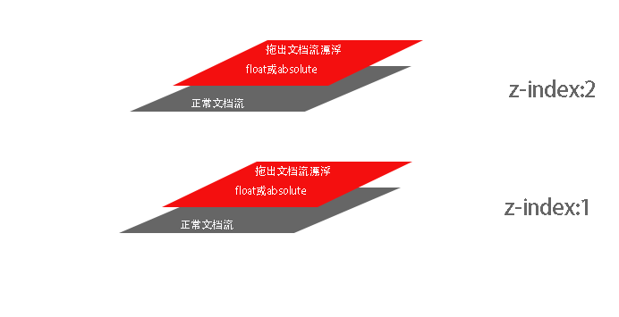

# 一、什么是文档流？
将窗体自上而下分成一行一行，并在每行中按从左至右依次排放元素，称为文档流，也称为普通流。

这个应该不难理解，HTML中全部元素都是盒模型，盒模型占用一定的空间，依次排放在HTML中，形成了文档流。

# 脱离文档流

###  定义
元素脱离文档流之后，将不再在文档流中占据空间，而是处于浮动状态（可以理解为漂浮在文档流的上方）。脱离文档流的元素的定位基于正常的文档流，当一个元素脱离文档流后，依然在文档流中的其他元素将忽略该元素并填补其原先的空间。

### 如何脱离

##### 1：float
使用float可以脱离文档流。

注意！！！：使用float脱离文档流时，其他盒子会无视这个元素，但其他盒子内的文本依然会为这个元素让出位置，环绕在该元素的周围。

##### 2：absolute
absolute称为绝对定位，因为使用absolute脱离文档流后的元素，是相对于该元素的父类（及以上，如果直系父类元素不满足条件则继续向上查询）元素进行定位的，并且这个父类元素的position必须是非static定位的（static是默认定位方式）。

##### 3：fixed
完全脱离文档流，相对于浏览器窗口进行定位。（相对于浏览器窗口就是相对于html）。

# z-index分层

