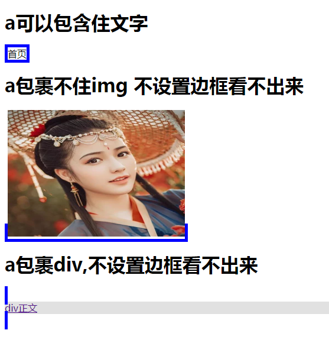
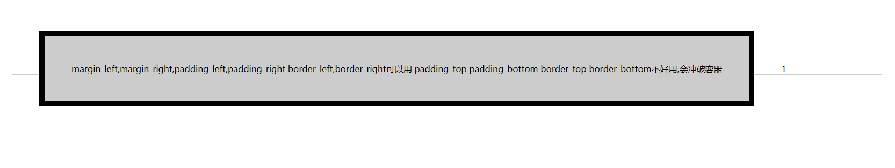

# 块元素和内联元素
css属性|块级元素	| 内联可替换元素 <br />img,input textarea,select,viedeo |内联非替换元素	
   ---|---                    |---                                                                     |---                     
级别 | 容器级 |空级别	| 文本级                                           
另起一行| √  |×	|×                 
高度| √ |√	|×
宽度| √ |√	|×
上下margin| √ |	√|x
左右margin | √ | √ |**√**
上下padding| √ |√	| 乄上下补丁会冲破容器 
左右padding| √ |√ |**√**
上下border| √ |√	| 乄上下border会冲破容器 
左右border| √ |√ |**√**
行高| √ |×|×
Text-align| √ |√|×

# < A >包含dom

```html
<!DOCTYPE html PUBLIC "-//W3C//DTD XHTML 1.0 Transitional//EN"
        "http://www.w3.org/TR/xhtml1/DTD/xhtml1-transitional.dtd">
<html xmlns="http://www.w3.org/1999/xhtml">
<head>
    <meta http-equiv="Content-Type" content="text/html; charset=utf-8"/>
    <title>无标题文档</title>
</head>
<style>
    div {
        background: #e1e1e1
    }

    a {
        border: 5px solid blue
    }

</style>


<body>

<h1>a可以包含住文字</h1>


<a>首页</a>


<h1>a包裹不住img 不设置边框看不出来</h1>

<a href="#">
    </a>


<h1>a包裹div,不设置边框看不出来</h1>

<a href="">
    <div>
        div正文

    </div>
</a>


</body>
</html>


```



# 内联元素的margin padding会冲破上级容器

```html
<meta charset="UTF-8">

<div style="border: 1px solid #ccc">

    <span class="padding-margin">margin-left,margin-right,padding-left,padding-right border-left,border-right可以用 padding-top padding-bottom border-top border-bottom不好用,会冲破容器</span>1
</div>
<style>
  body{
    margin: 150px;
  }
    .padding-margin {

        margin-top: 50px; /* 不可用*/
        margin-bottom: 50px; /*不可用*/
        margin-left: 50px; /*可用*/
        margin-right: 50px; /*可用*/
        padding-left: 50px; /*可用*/
        padding-right: 50px; /*可用*/
        padding-top: 50px; /*不好用会冲破容器*/
        padding-bottom: 50px; /*不好用会冲破容器*/
        border: 10px solid #000; /*可用,上下border也会冲破容器*/
        width: 300px; /*不可用*/
        height: 300px; /*不可用*/
        background: #ccc;
        line-height: 1; /*不可用*/
    }
</style>

```

