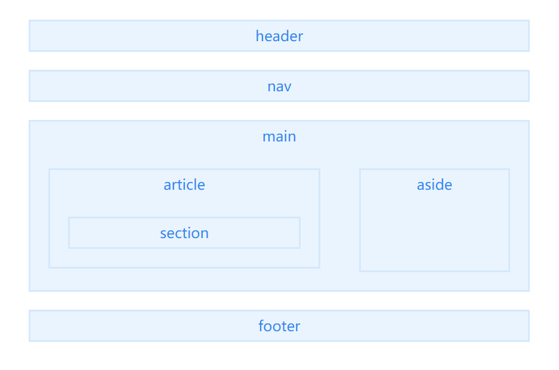

# html5语义化标签

### seo

```html
< title></title>：简短、描述性、唯一（提升搜索引擎排名）。

搜索引擎会将title作为判断页面主要内容的指标，有效的title应该包含几个与页面内容密切相关的关键字，建议将title核心内容放在前60个字符中。
```

### 布局

 

```html

<header></header>：页眉通常包括网站标志、主导航、全站链接以及搜索框。也适合对页面内部一组介绍性或导航性内容进行标记。

<nav></nav>：标记导航，仅对文档中重要的链接群使用。html5规范不推荐对辅助性页脚链接使用nav，除非页脚再次显示顶级全局导航、或者包含招聘信息等重要链接。

<main></main>：页面主要内容，一个页面只能使用一次。如果是web应用，则包围其主要功能。

<article></article>：包含像报纸一样的内容= =||是这么理解的，表示文档、页面、应用或一个独立的容器。article可以嵌套article，只要里面的article与外面的是部分与整体的关系。

<section></section>：具有相似主题的一组内容，比如网站的主页可以分成介绍、新闻条目、联系信息等条块。 如果只是为了添加样式，请用div！

<aside></aside>：指定附注栏，包括引述、侧栏、指向文章的一组链接、广告、友情链接、相关产品列表等。如果放在main内，应该与所在内容密切相关。

<footer></footer>：页脚，只有当父级是body时，才是整个页面的页脚。

```

### 文本内容

```html

<h1></h1>：h1~h6分级标题，用于创建页面信息的层级关系。对于搜索引擎而言，如果标题与搜索词匹配，这些标题就会被赋予很高的权重，尤其是h1。

<figure></figure>：创建图（默认有40px左右margin）。

<figcaption></figcaption>：figure的标题，必须是figure内嵌的第一个或者最后一个元素。

<cite></cite>：指明引用或者参考，如图书的标题，歌曲、电影、等的名称，演唱会、音乐会、规范、报纸、或法律文件等。只用于参考源本身，而不是从中引述。

<blockquoto></blockquoto>：引述文本，默认新的一行显示。

<q></q>：短的引述（跨浏览器问题，尽量避免使用）。可以对blockquoto和q元素使用cite属性（不是cite元素！），对搜索引擎自动化工具有用。cite=“URL”引述来源地址。

<time></time>：标记时间。datetime属性遵循特定格式，如果忽略此属性，文本内容必须是合法的日期或者时间格式。     不再相关的时间用s标签。

<abbr></abbr>：解释缩写词。使用title属性可提供全称，只在第一次出现时使用就ok。abbr[title]{ border-bottom:1px dotted #000; }

<dfn></dfn>：定义术语元素，与定义必须紧挨着，可以在描述列表dl元素中使用。

<address></address>：作者、相关人士或组织的联系信息（电子邮件地址、指向联系信息页的链接）。如果提供整个页面的作者联系信息，一般放在页面级footer里。不能包含文档或者文档等其他内容。

<code></code>：标记代码。包含示例代码或者文件名 （< &lt;  > &gt;）

<meter></meter>：表示分数的值或者已知范围的测量结果。如投票结果。<meter value="0.2" title=”Miles“>20%completed</meter>

<progress></progress>：完成进度。可通过js动态更新value。

```

### 文本格式

```html
<big> </big>

<small></small>：指定细则，输入免责声明、注解、署名、版权。只适用于短语，不要用来标记“使用条款”、“隐私政策”等长的法律声明。

<strong></strong>：表示内容重要性。

<em></em>：标记内容着重点（大量用于提升段落文本语义）。 在HTML5中em是表示强调的唯一元素，而strong则表示重要程

<mark></mark>：突出显示文本（yellow），提醒读者。

<b></b>：出于实用目的提醒读者的一块文字，不传达任何额外的重要性

<i></i>：不同于其他文字的文字= =|||这个翻译真的是······

<del></del>：移除的内容。

<ins></ins>：添加的内容。 少有的既可以包围块级，又可以包围短语内容的元素。

<pre></pre>：预格式化文本。保留文本固有的换行和空格。

```

### 无语义

```html
<div></div> ——块级通用容器；
<span></span>——短语内容无语义容器。
```

