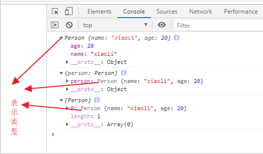

# 表示类型而不是实例的变量名

```js
  function Person(name, age) {
    this.name = name
    this.age = age
  }

  const person = new Person('xiaoli', 20)
  console.log(person)
  console.log({person})
  console.log([person])
```





