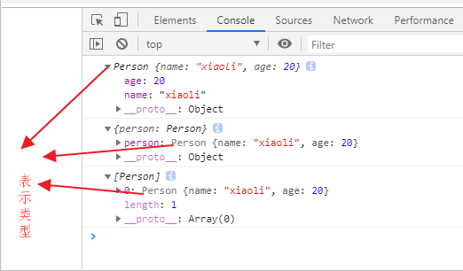
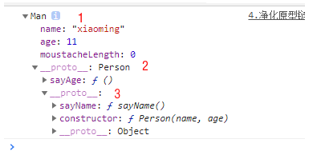

# 表示类型

```js
  function Person(name, age) {
    this.name = name
    this.age = age
  }

  const person = new Person('xiaoli', 20)
  console.log(person)
  console.log({person})
  console.log([person])
```




# 继承和实例本质是通过复制原型完成的




###### 1处

xiaoming是Man类型的  

说明xiaoming复制了人类的方法 ,

说明xiaoming复制了 Man.prototype,

复制是通过了`xiaoming.__proto`__完成的

###### 2处

xiaoming是Person类型的,

说明xiaoming复制了男人的方法

说明xiaoming复制了 Person.prototype

复制是通过`xiaoming.__proto__.__proto__`完成的

###### 3处

xiaoming是Object类型的,

说明xiaoming复制了Object的方法

说明xiaoming复制了 Object.prototype

复制是通过`xiaoming.__proto__.__proto__.__proto__`完成的