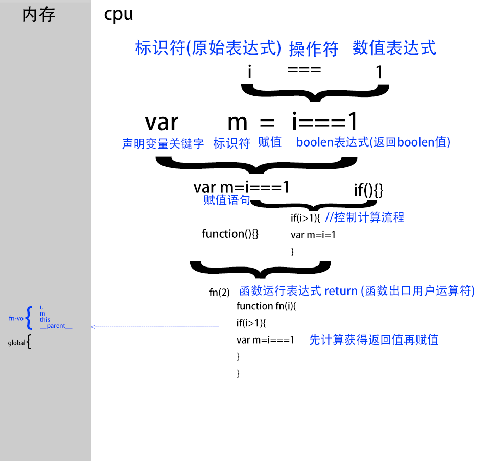

# 函数和对象

|    | 函数   | 对象: |
| ------ | --------------- | ------ |
|        |函数语句+静态键值对        | 键值对          |
|  | 操作 | 记录            |
|  | 做什么 | 谁去做 |
|  | 原型里复制了Object.prototype | 原型为 Object.prototype |
|  | 函数可以作为对象的方法 | 对象可以作为函数的参数 |

例: 

`docoment.add`onclick监听event的动作

 event记录事件状态

  el.dispatchEvent(evt ) 触发事件

### 对象

"对象"=== "引用类型" ==="键值对"

# 载荷
载荷（payload, 类似于飞机上承载的物品 )

,指数据{a:1}

# 循环、迭代、遍历和递归

 loop、iterate、traversal和recursion这几个词是计算机技术书中经常会出现的几个词汇。众所周知，这几个词分别翻译为：循环、迭代、遍历和递归。乍一看，这几个词好像都与重复（repeat）有关，但有的又好像不完全是重复的意思。那么这几个词到底各是什么含义，有什么区别和联系呢？下面就试着解释一下。

- 循环（loop），指的是在满足条件的情况下，重复执行同一段代码。比如，while语句。

- 迭代（iterate），指的是按照某种顺序逐个访问列表中的每一项。比如:

    for语句   for...in   for....of

   arr.foreach(item=>{})

- 遍历（traversal），指的是按照一定的规则访问树形结构中的每个节点，而且每个节点都只访问一次。

- 递归（recursion），指的是一个函数不断调用自身的行为。比如，以编程方式输出著名的斐波纳契数列。

有了以上定义，这几个概念之间的区别其实就比较清楚了。至于它们之间的联系，严格来讲，它们似乎都属于算法的范畴。换句话说，它们只不过是解决问题的不同手段和方式，而本质上则都是计算机编程中达成特定目标的途径。
