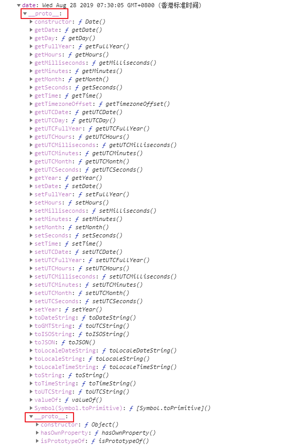
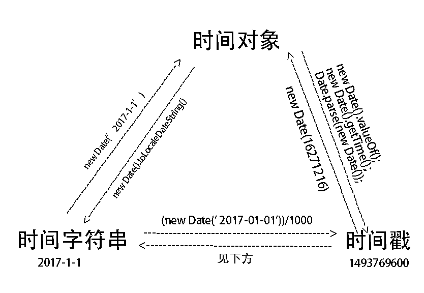

# 新建Date对象

```
new Date()//Tue Sep 03 2019 20:30:41 GMT+0800 (香港标准时间)
new Date(' 2017-05-03')//Wed May 03 2017 00:00:00 GMT+0800 (香港标准时间)
new Data('时间戳')//Wed May 03 2017 00:00:00 GMT+0800 (香港标准时间)
```

#  全部属性(真实对象键值对)



# 转化

                                                                

```js
 //第一种
 function getLocalTime(nS) {     
   return new Date(parseInt(nS) * 1000).toLocaleString().replace(/:\d{1,2}$/,' ');     
 }     
 alert(getLocalTime(1293072805)); //结果是2010年12月23日 10:53

 //第二种    
 function getLocalTime(nS) {     
     return new Date(parseInt(nS) * 1000).toLocaleString().substr(0,17)
 }     
 alert(getLocalTime(1293072805));
 //第三种  
     function getLocalTime(nS) {     
       return new Date(parseInt(nS) * 1000).toLocaleString().replace(/年|月/g, "-").replace(/日/g, " ");      
    }     
     alert(getLocalTime(1177824835)); //格式为：2010-10-20 10:00:00
```
