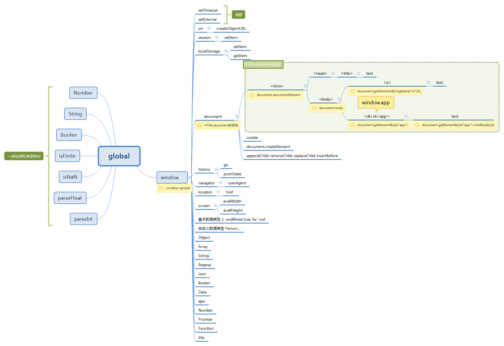
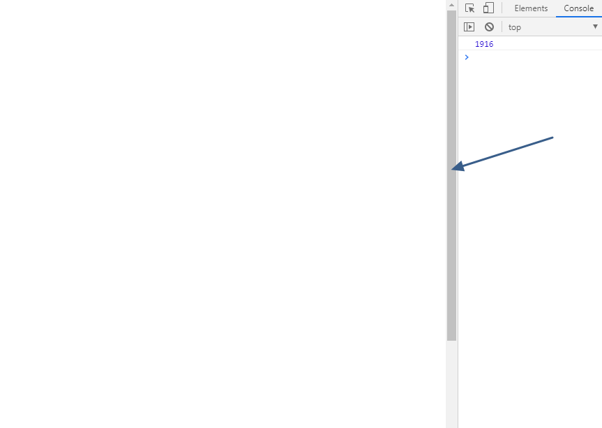
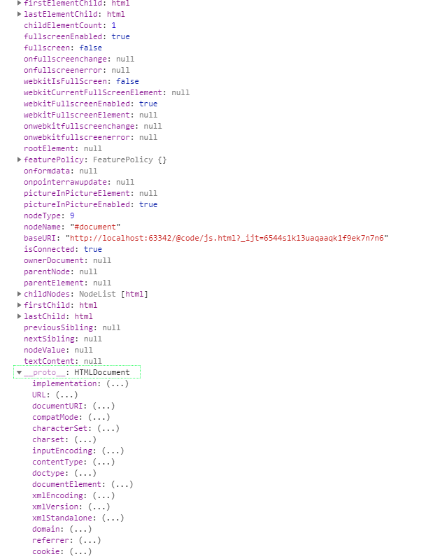
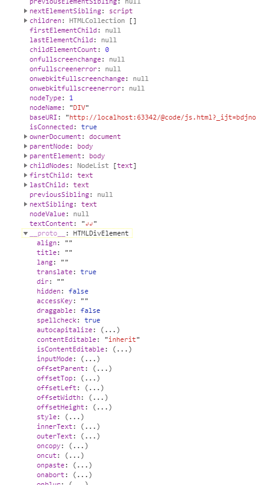

# Windows

**window对象：表示浏览器中打开的窗口。**

[](./img/global.xmind)

**window的滚动条**

```html
<!--
div撑大了documentElement
documentElement的高度为1900px,超出了浏览器的窗口(window),
 window默认css属性window{overflow: auto;} 不超出window滚动条不显示 超出了滚动条显示
 -->
<div style="height: 1900px">

</div>

<style>
    window{overflow: auto;}
</style>

<script>

  console.log(document.documentElement.offsetHeight)

</script>
```



## setTimeout()执行一次

```js
let i=0
    setTimeout(() => {
        i++
        console.log(i)
    }, 1000)
//1
```
## setInterval() 时钟频率执行

```js
    let i = 0
    setInterval(() => {

        i++;
        console.log(i);
    }, 1000)

/*
1,
2,
3,
4
*/
```

 打开和关闭定时器

```html
<body>
<button onclick="start()">start</button>
<button onclick="stop()">stop</button>
<script type="text/javascript">
    var interval = null;//全局变量

    var i = 0; //i全局变量
    function start() {
      //启动计时器赋值给全局变量,为了能够clearInterval取到值
        interval = setInterval(() => {
            i++;
            console.log(i);
        }, 1000);//启动计时器，调用overs函数，
    }


    function stop() {

        clearInterval(interval); //关闭计时器

    }

</script>
</body>


```


## open() 新开window窗口打开链接

```js
  window.open("http://www.runoob.com");
```

## location

### location.href  读取和设置本窗口的地址

```js
  window.location.href = "http://www.baidu.com"

```

## screen

### screen.availWidth

  `console.log(screen.availWidth, screen.availHeight);`

## navigator

### navigator.userAgent

```
navigator.userAgent
```

## history

### history.pushState()

```html
<!DOCTYPE html>
<html lang="en">
<head>
    <meta charset="UTF-8">
    <title>测试</title>
    <script src="https://cdn.bootcss.com/jquery/3.3.1/jquery.js"></script>
</head>

<body>
<button onclick="history.go(-1);render()">history.go(-1)</button>
<button onclick="history.go(1); render()">history.go(1)</button>


<br>
<!--路由meta 原理history.state-->
<button onclick='history.pushState({state: 1}, "newtitle","1.html?b=1"); render()'>pushState添加一条历史记录</button>

<button onclick='history.pushState({state: 2}, "newtitle","2.html?b=1"); render()'>pushState添加一条历史记录</button>
<div id="app">

</div>

<script>

    function render() {
        document.getElementById('app').innerText = history.state.state
        console.log(history)
    }


</script>
</body>

</html>
```

```html
<!DOCTYPE html>
<html lang="en">
<head>
    <meta charset="UTF-8">
    <title>Title</title>
</head>
<body>
<div>
    <button onclick="history.go(-1)">history.go(-1)</button>
    <button onclick="history.go(1)">history.go(1)</button>

    <br>
    <button class="btn" onclick="btnFun();">点击新增一条历史记录</button>
</div>
<script>
    console.log('增加历史记录前 state的值：',history.state); // null
    function btnFun() {//点击事件
        // 增加一个历史记录
        history.pushState('a',null,'2.html?b=1');
        console.log('state的值',history.state); // a
    };
    window.addEventListener('popstate',function() {
        var state = history.state;//取出state值
        //注意：在此处时（点击后退按钮时），state的值已经为null
        // （因为返回时历史记录会被删除，浏览器动作）
        console.log('点击后退按钮后 state的值：',state); // null
        //判断，想要执行的操作

    });
</script>
</body>
</html>

```


### history.go()

```html
<!DOCTYPE html>
<html lang="en">
<head>
    <meta charset="UTF-8">
    <title>测试</title>
    <script src="https://cdn.bootcss.com/jquery/3.3.1/jquery.js"></script>
</head>

<body>
<button onclick="history.go(-1);render()">history.go(-1)</button>
<button onclick="history.go(1); render()">history.go(1)</button>


<br>
<!--路由meta 原理history.state-->
<button onclick='history.pushState({state: 1}, "newtitle","1.html?b=1"); render()'>pushState添加一条历史记录</button>

<button onclick='history.pushState({state: 2}, "newtitle","2.html?b=1"); render()'>pushState添加一条历史记录</button>
<div id="app">

</div>

<script>

    function render() {
        document.getElementById('app').innerText = history.state.state
        console.log(history)
    }


</script>
</body>

</html>
```

```html
<!DOCTYPE html>
<html lang="en">
<head>
    <meta charset="UTF-8">
    <title>Title</title>
</head>
<body>
<div>
    <button onclick="history.go(-1)">history.go(-1)</button>
    <button onclick="history.go(1)">history.go(1)</button>

    <br>
    <button class="btn" onclick="btnFun();">点击新增一条历史记录</button>
</div>
<script>
    console.log('增加历史记录前 state的值：',history.state); // null
    function btnFun() {//点击事件
        // 增加一个历史记录
        history.pushState('a',null,'2.html?b=1');
        console.log('state的值',history.state); // a
    };
    window.addEventListener('popstate',function() {
        var state = history.state;//取出state值
        //注意：在此处时（点击后退按钮时），state的值已经为null
        // （因为返回时历史记录会被删除，浏览器动作）
        console.log('点击后退按钮后 state的值：',state); // null
        //判断，想要执行的操作

    });
</script>
</body>
</html>

```

## url

### url.createObjectURL()

```html
<input type="file" id="btn" accept="image/*" value="upload"/>


<script>

  btn.addEventListener('change', function () {
    let file = this.files[0];
    img.src = URL.createObjectURL(file)
  })

</script>

```

## session

```js
const obj = {a: 1, b: 2}
 sessionStorage.setItem("obj", obj);

```

```
   let i = sessionStorage.getItem('obj')
    console.log(i.a)
```

## localStorage

```js
 const obj = {a: 1, b: 2}
localStorage.setItem('obj', obj);
```

```js
console.log(i.a)
```


## document

1、document对象：代表给定浏览器窗口中的 HTML 文档。就是html标签


[](./img/global.xmind)


### 新建doucment对象

浏览器链接页面时间会初始化这个document对象,

```
<html>
<body>
  <div id="app" class="cs" data-src="datasrc">
    <h1>h1标题</h1>
    <p>段落</p>
  </div>
</body>
</html>
```

### document对象

document是HTMLdocument的实例,注入在window上,代表整个文档



```javascript
console.log(Object.getPrototypeOf(document))
console.log(Object.getOwnPropertyNames(document))//["location"]
console.log(Object.keys(document))//["location"]      
```

### document.location

```
document.location===window.location
```

### document.cookie

> JavaScript 可以使用 **document.cookie** 属性来创建 、读取、及删除 cookie。

##### JavaScript 中，创建 cookie 如下所示：

```
document.cookie="username=John Doe";
```

##### 您还可以为 cookie 添加一个过期时间（以 UTC 或 GMT 时间）。默认情况下，cookie 在浏览器关闭时删除：

```
document.cookie="username=John Doe; expires=Thu, 18 Dec 2043 12:00:00 GMT";
```

##### 您可以使用 path 参数告诉浏览器 cookie 的路径。默认情况下，cookie 属于当前页面。

1、服务器端每次访问的cookie是每次请求头中发送给服务器端的

2、客户端每次请求只发送当前路径下和“直系”关系的父路径的cookie（父路径的页面是不能访问子路径和兄弟路径的cookie的）

3、setcookie如果不设置路径，默认为当前页面的路径，父亲路径的页面是无法访问的

4 "/"这个根路径可以在任何路径下访问，求简单可以把cookie都放在这里。

```
document.cookie="username=John Doe; expires=Thu, 18 Dec 2043 12:00:00 GMT; path=/";
```

#####  JavaScript 读取 Cookie的函数封装

```js
    function setCookie(cname, cvalue, exdays) {
      var d = new Date();
      d.setTime(d.getTime() + (exdays * 24 * 60 * 60 * 1000));
      var expires = "expires=" + d.toGMTString();
      document.cookie = cname + "=" + cvalue + "; " + expires;
    }

    function getCookie(cname) {
      var name = cname + "=";
      var ca = document.cookie.split(';');
      for (var i = 0; i < ca.length; i++) {
        var c = ca[i].trim();
        if (c.indexOf(name) == 0) {
          return c.substring(name.length, c.length);
        }
      }
      return "";
    }
```

### doument的节点

>  通过 JavaScript访问document的对象， 可访问 创建 修改和删除document对象的某个节点。

##### document和document节点的关系

注入关系,document节点是document的key


[](./img/global.xmind)


##### 创建新的document的节点

> el是HTMLDivElement的实例,注意对比el的原型和document的原型是不同的

###### 字面量创建(用于新建对象和控制台打印)

```
<div id='app'></div>
```

###### document.createElement创建节点

```
var el = document.createElement("A");
```

##### 获取已有节点对象

###### getElementById

```javascript
const el=document.getElementById("app") //返回dom节点对象
```

###### id简写

```html


<p id="text">
  hello
</p>
<script>
  console.log(img)
  console.log(text)
  img.src = 'http://img.hb.aicdn.com/ee9c62e8caf1b7907072b90b8058b87b2b92b237102ea-4LB0wq_sq320'
  text.style.fontSize = '100px'

</script>

```

###### vue的ref

```
vue-$refs//返回dom节点对象和自定义组件对象
```

##### el节点实例的所有属性(真实对象数据结构)





通过属性访问当前节点的父、子和同胞


##### el节点对象和vue对象比较

| dom                                  | vue组件                               |
| ------------------------------------ | ------------------------------------- |
| dom标签在html渲染时间运行dom构造函数 | vue组件标签在模板渲染时间运行构造函数 |
| dom属性就是构造函数的参数            | 自定义标签的属性就是vue构造函数的属性 |

##### el节点对象的使用场景

###### vue组件对象注入el对象


###### 指令的回调参数也是el对象


###### 全局对象event注入了el对象

```
event.target===el
```
