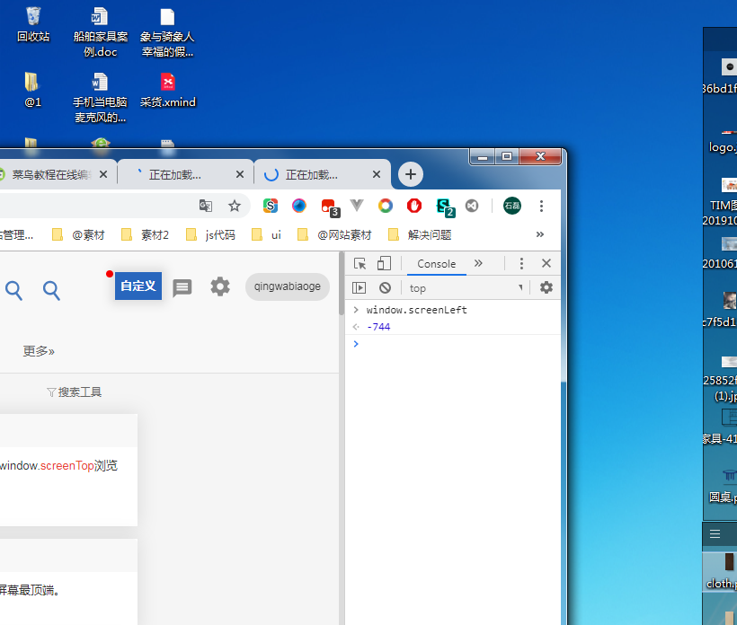

# Windows(js操纵浏览器)


**window对象：表示浏览器中打开的窗口。**

## ==onload==

```
 window.onload = function () {
  // 当页面加载完成执行
  // 当页面完全加载所有内容（包括图像、脚本文件、CSS 文件等）执行
}
```

## ==onunload==

```
window.onunload = function () {
  // 当用户退出页面时执行
}
```

## ==onresize==

 重置浏览器窗口大小

## ==scroll==

....

## ==close()==

关闭窗口

## ==closed()==

....

## *outerWidth*-innerHeight-screenLeft-screenTop

```
console.log('win-innerHeight', innerHeight)
console.log('win-outerHeight', outerHeight)
console.log('win-innerWidth', innerWidth)
console.log('win-outerWidth', outerWidth)
console.log('win-screenLeft', screenLeft)
console.log('win-screenTop',  screenTop)
console.log('-----------------------')
```


## screen

##### screen.availWidth

屏幕的尺寸

  `console.log(screen.availWidth, screen.availHeight);`

## screenLeft 

浏览器界面左上角 在屏幕中的坐标        




## setTimeout()执行一次

```js
let i=0
    setTimeout(() => {
        i++
        console.log(i)
    }, 1000)
//1
```

## setInterval() 时钟频率执行

```js
    let i = 0
    setInterval(() => {

        i++;
        console.log(i);
    }, 1000)

/*
1,
2,
3,
4
*/
```

 打开和关闭定时器

```html
<body>
<button onclick="start()">start</button>
<button onclick="stop()">stop</button>
<script type="text/javascript">
    var interval = null;//全局变量

    var i = 0; //i全局变量
    function start() {
      //启动计时器赋值给全局变量,为了能够clearInterval取到值
        interval = setInterval(() => {
            i++;
            console.log(i);
        }, 1000);//启动计时器，调用overs函数，
    }


    function stop() {

        clearInterval(interval); //关闭计时器

    }

</script>
</body>


```

## alert()

- alert()
- prompt()
- confirm()

## open() 新开window窗口打开链接

```js
  window.open("http://www.runoob.com");
```

## replace( )

 替换新的网址

## location

##### location.href  读取和设置本窗口的地址

```js
  window.location.href = "http://www.baidu.com"

```

##### location.reload() 

刷新页面

##### location.replace

location.replace(“http://www.baidu.com”)


## navigator

##### navigator.userAgent

对象 记录浏览类型/内核/操作系统等信息

```
navigator.userAgent
```

## history

##### history.pushState()

```html
<!DOCTYPE html>
<html lang="en">
<head>
    <meta charset="UTF-8">
    <title>测试</title>
    <script src="https://cdn.bootcss.com/jquery/3.3.1/jquery.js"></script>
</head>

<body>
<button onclick="history.go(-1);render()">history.go(-1)</button>
<button onclick="history.go(1); render()">history.go(1)</button>


<br>
<!--路由meta 原理history.state-->
<button onclick='history.pushState({msg: 1}, "newtitle","1.html?b=1"); render()'>pushState添加一条历史记录</button>

<button onclick='history.pushState({msg: 2}, "newtitle","2.html?b=1"); render()'>pushState添加一条历史记录</button>
<div id="app">

</div>

<script>

    function render() {
        document.getElementById('app').innerText = JSON.stringify(history.state)
        console.log(history)
    }


</script>
</body>

</html>
```

```html
<!DOCTYPE html>
<html lang="en">
<head>
    <meta charset="UTF-8">
    <title>Title</title>
</head>
<body>
<div>
    <button onclick="history.go(-1)">history.go(-1)</button>
    <button onclick="history.go(1)">history.go(1)</button>

    <br>
    <button class="btn" onclick="btnFun();">点击新增一条历史记录</button>
</div>
<script>
    console.log('增加历史记录前 state的值：',history.state); // null
    function btnFun() {//点击事件
        // 增加一个历史记录
        history.pushState('a',null,'2.html?b=1');
        console.log('state的值',history.state); // a
    };
    window.addEventListener('popstate',function() {
        var state = history.state;//取出state值
        //注意：在此处时（点击后退按钮时），state的值已经为null
        // （因为返回时历史记录会被删除，浏览器动作）
        console.log('点击后退按钮后 state的值：',state); // null
        //判断，想要执行的操作

    });
</script>
</body>
</html>

```


##### history.go()

```html
<!DOCTYPE html>
<html lang="en">
<head>
    <meta charset="UTF-8">
    <title>测试</title>
    <script src="https://cdn.bootcss.com/jquery/3.3.1/jquery.js"></script>
</head>

<body>
<button onclick="history.go(-1);render()">history.go(-1)</button>
<button onclick="history.go(1); render()">history.go(1)</button>


<br>
<!--路由meta 原理history.state-->
<button onclick='history.pushState({state: 1}, "newtitle","1.html?b=1"); render()'>pushState添加一条历史记录</button>

<button onclick='history.pushState({state: 2}, "newtitle","2.html?b=1"); render()'>pushState添加一条历史记录</button>
<div id="app">

</div>

<script>

    function render() {
        document.getElementById('app').innerText = history.state.state
        console.log(history)
    }


</script>
</body>

</html>
```

```html
<!DOCTYPE html>
<html lang="en">
<head>
    <meta charset="UTF-8">
    <title>Title</title>
</head>
<body>
<div>
    <button onclick="history.go(-1)">history.go(-1)</button>
    <button onclick="history.go(1)">history.go(1)</button>

    <br>
    <button class="btn" onclick="btnFun();">点击新增一条历史记录</button>
</div>
<script>
    console.log('增加历史记录前 state的值：',history.state); // null
    function btnFun() {//点击事件
        // 增加一个历史记录
        history.pushState('a',null,'2.html?b=1');
        console.log('state的值',history.state); // a
    };
    window.addEventListener('popstate',function() {
        var state = history.state;//取出state值
        //注意：在此处时（点击后退按钮时），state的值已经为null
        // （因为返回时历史记录会被删除，浏览器动作）
        console.log('点击后退按钮后 state的值：',state); // null
        //判断，想要执行的操作

    });
</script>
</body>
</html>

```

## URL

##### URL.createObjectURL()

```html
<input type="file" id="btn" accept="image/*" value="upload"/>


<script>

  btn.addEventListener('change', function () {
    let file = this.files[0];
      //本地对象缩略图
    img.src = URL.createObjectURL(file)
  })

</script>

```

## sessionStorage

```js
const obj = {a: 1, b: 2}
 sessionStorage.setItem("obj", obj);

```

```
   let i = sessionStorage.getItem('obj')
console.log(i.a)
```

## localStorage

```js
 const obj = {a: 1, b: 2}
localStorage.setItem('obj', obj);
```

```js
console.log(i.a)
```

```
event.target===el
```
