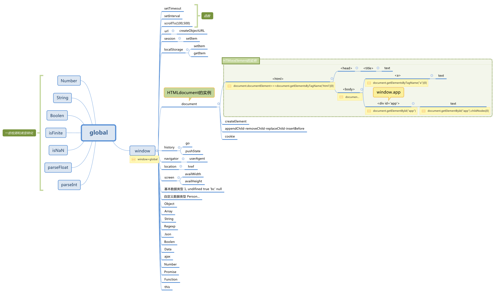

## document(js操控html)

**document对象**


```html
<!DOCTYPE html>
<html lang="en">
<head>
    <meta charset="UTF-8">
    <title>Title</title>
</head>
<body>
<div id="app">

</div>


</body>

<script>
    //document对象,windown顶部对象,
    console.log(document)
    console.log({document})


    console.log(Object.getPrototypeOf(document)) //"HTMLDocument"
    console.log(Object.getOwnPropertyNames(document))//["location"]
    console.log(Object.keys(document))//["location"]
 


</script>
</html>
  
```

### ==document.ready==

ready 当标签节点加载完成以后执行，不会等待资源加载

```
document.ready = function(e){
}
```


### document.location

```
document.location===window.location
```


### document.cookie

> JavaScript 可以使用 **document.cookie** 属性来创建 、读取、及删除 cookie。

##### JavaScript 中，创建 cookie 如下所示：


```
document.cookie="username=John Doe";
```

##### 您还可以为 cookie 添加一个过期时间（以 UTC 或 GMT 时间）。默认情况下，cookie 在浏览器关闭时删除：

```
document.cookie="username=John Doe; expires=Thu, 18 Dec 2043 12:00:00 GMT";
```

##### 您可以使用 path 参数告诉浏览器 cookie 的路径。默认情况下，cookie 属于当前页面。

1、服务器端每次访问的cookie是每次请求头中发送给服务器端的

2、客户端每次请求只发送当前路径下和“直系”关系的父路径的cookie（父路径的页面是不能访问子路径和兄弟路径的cookie的）

3、setcookie如果不设置路径，默认为当前页面的路径，父亲路径的页面是无法访问的

4 "/"这个根路径可以在任何路径下访问，求简单可以把cookie都放在这里。

```
document.cookie="username=John Doe; expires=Thu, 18 Dec 2043 12:00:00 GMT; path=/";
```

#####  JavaScript 读取 Cookie的函数封装

```js
    function setCookie(cname, cvalue, exdays) {
      var d = new Date();
      d.setTime(d.getTime() + (exdays * 24 * 60 * 60 * 1000));
      var expires = "expires=" + d.toGMTString();
      document.cookie = cname + "=" + cvalue + "; " + expires;
    }

    function getCookie(cname) {
      var name = cname + "=";
      var ca = document.cookie.split(';');
      for (var i = 0; i < ca.length; i++) {
        var c = ca[i].trim();
        if (c.indexOf(name) == 0) {
          return c.substring(name.length, c.length);
        }
      }
      return "";
    }
```


### doument的节点对象

document节点是document的key


[](./img/global.xmind)


##### 获取已有节点对象

###### 获得html

```js
 var el = document.documentElement
```

###### 获得body

```
  var el = document.body
```

###### getElementById

```javascript
const el=document.getElementById("app") //返回dom节点对象
```

id绑定到了window

```html


<p id="text">
  hello
</p>
<script>
  console.log(img)
  console.log(text)
  img.src = 'http://img.hb.aicdn.com/ee9c62e8caf1b7907072b90b8058b87b2b92b237102ea-4LB0wq_sq320'
  text.style.fontSize = '100px'

</script>

```

###### vue的ref

```
vue-$refs//返回dom节点对象和自定义组件对象
```

##### 通过属性访问当前节点的父、子和同胞


##### 对子节点的操作的方法

```js
   function appendChild_() {
        persons.appendChild(wangjianlin);//添加

    }

    function replaceChild_() {
        persons.replaceChild(shilei, wangjianlin);//修改
    }

    function removeChild_() {
        persons.removeChild(shilei);//删除
    }
```

##### 创建新的document的节点

###### 字面量创建(用于新建对象和控制台打印)

```
<div id='app'></div>
```

###### document.createElement创建节点

```
var el = document.createElement("A");
```

##### el节点实例的所有属性(真实对象数据结构)

div是HTMLDivElement的实例,注意对比div的原型和document的原型是不同的


##### el节点对象和vue对象比较

| el                                    | vue组件                           |
| ------------------------------------- | --------------------------------- |
| div是HTMLDivElement的实例             | Cl是vue的实例                     |
| div标签的属性就是HTMLDivElement的参数 | cl标签的的属性是Vue构造函数的参数 |

##### el节点对象的使用场景

###### vue组件对象注入el对象


###### 指令的回调参数也是el对象


###### 全局对象event注入了el对象

```
event.target===el
```

## document.createElement

```html
<body>


</body>

<meta charset="uft-8">
<script>
  function addElement() {
    //创建新节点对象
    var el = document.createElement("A");

    //通过 . 设置系统属性
    el.id = 'app'
    el.target = '_black'

    //设置和获取系统属性和自定义属性
    el.setAttribute('href', '#')
    el.getAttribute('href')//获得href
    el.setAttribute('someattr', '123')
    //移除系统属性和自定义属性
    el.removeAttribute('id')
    //在el节点下级插入文本
    var text = document.createTextNode("Hi there and greetings!");
    el.appendChild(text);

    //el插入到body
    document.body.appendChild(el)
  }

  addElement()
</script>

```

## document.cookie

```html
<script>
  document.cookie = "obj={'a':1}";
  const i = document.cookie;
  console.log(i)
</script>

```

