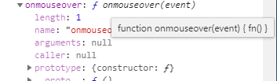

# 三种方式可以为DOM元素注册事件的处理函数

```html
<!--方式1，
双引号里可以放任何语句,
this===当前dom对象
优势可以自定义传参
-->
<button onmouseover="fn()" id="btn">btn</button>


<script>

  function fn() {
    //event 其实是window全局变量,注意不是global
    console.log(window.event)
  }
  const el = document.getElementById('btn')


  //方式2
    el.onmouseout = fn


    //方式3
    el.addEventListener('click', fn, false)
    setTimeout(() => {
            el.removeEventListener("click", fn, false);  //有效！
        }, 3000
    )

</script>

```




# 事件+触发

| Event      | 新建Envet实例          | 为DOM元素注册事件处理函数     | 派发事件            |
| ---------- | ---------------------- | ----------------------------- | ------------------- |
| 原生事件   | 自动实例化对象event    | 三种方式                      | 鼠标键盘点击        |
| 自定义事件 | e=new  Event('build' ) | el.addEventListener( 'build') | el.dispatchEvent(e) |

## 原生事件+键盘鼠标触发

传统方式

## 原生事件+程序触发

```html

<button id="click">Click me!</button>

<script type="text/javascript">
window.onload = function () {
  var btn = document.querySelector('#click')
  //绑定事件
  btn.addEventListener('click', function (e) {
    alert('okk!')
  }, false)

  var e = new Event('click')
  btn.dispatchEvent(e)
  console.log(e)
}
</script>


```


## 自定义事件+程序触发

dispatchEvent() 方法给节点分派(分给)一个==合成事件==。

### 第1种方式：

creatEvent-------initEvent--------dispatchEvent

##### 1. createEvent（eventType）

该方法将创建一种新的事件类型，该类型由参数 *eventType* 指定。注意，该参数的值不是要创建的事件接口的名称，而是定义那个接口的 DOM 模块的名称。

参数：eventType 共5种类型：
  Events ：包括所有的事件.

```
     HTMLEvents：包括 'abort', 'blur', 'change', 'error', 'focus', 'load', 'reset', 'resize', 'scroll', 'select',
                  'submit', 'unload'. 事件
     UIEevents ：包括 'DOMActivate', 'DOMFocusIn', 'DOMFocusOut', 'keydown', 'keypress', 'keyup'.
                 间接包含 MouseEvents.
     MouseEvents：包括 'click', 'mousedown', 'mousemove', 'mouseout', 'mouseover', 'mouseup'.
     MutationEvents:包括 'DOMAttrModified', 'DOMNodeInserted', 'DOMNodeRemoved',
                   'DOMCharacterDataModified', 'DOMNodeInsertedIntoDocument',
                   'DOMNodeRemovedFromDocument', 'DOMSubtreeModified'.
```

```
 
  onload 事件会在页面或图像加载完成后立即发生
    支持onload事件的标签 <body>, <frame>, <frameset>, <iframe>, , <link>, <script>
    
```

##### 2.在createEvent后必须初始化，为大家介绍5种对应的初始化方法

  HTMLEvents 和 通用 Events：
     **initEvent**( 'type', bubbles, cancelable )
  UIEvents ：
      **initUIEvent**( 'type', bubbles, cancelable, windowObject, detail )
  MouseEvents：
      **initMouseEvent**( 'type', bubbles, cancelable, windowObject, detail, screenX, screenY,
          clientX, clientY, ctrlKey, altKey, shiftKey, metaKey, button, relatedTarget )
  MutationEvents ：
      **initMutationEvent**( 'type', bubbles, cancelable, relatedNode, prevValue, newValue, attrName, attrChange )

##### 3. dispatchEvent(eventObj),

​       btn.dispatchEvent(event) 触发谁的事件

​       eventObj 参数是一个描述事件的 ActionScript 对象

==还可用自定义函数控制谁触发==


在调用 dispatchEvent() 方法之前，必须在代码中对其进行声明，此外，还必须创建一个事件对象以传递给 dispatchEvent()。该事件对象包含侦听器可用来处理该事件的有关信息。

##### 例子：

```js
var rect={   dispatch : function(el ,type){

        try{

            if(el.dispatchEvent){

                var evt = document.createEvent('Event');

                evt.initEvent(type,true,true);

                el.dispatchEvent(evt);

            }else if(el.fireEvent){

                el.fireEvent('on'+type);

            }

        }catch(e){};

    }};
```

### 第2种方式

```html
<meta charset="UTF-8">
<div id="app">

</div>

<script type="text/javascript">
/* 创建一个事件对象，名字为newEvent，类型为build */
var newEvent = new Event('build', { bubbles: true, cancelable: true, composed: true })

/* 给这个事件对象创建一个属性并赋值 */
newEvent.name = '新的事件！'

/* 建立事件处理函数 */
app.addEventListener('build', function () {
  alert('你触发了自定义事件！' + newEvent.name)
}, false)

/* 触发自定义事件 */
app.dispatchEvent(newEvent)
console.log(newEvent)
</script>

```

