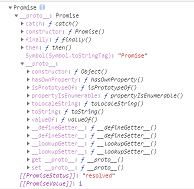

# 实例的所有方法(真实对象键值对)



### .then()  .catch()

```js
new Promise((resolve,reject)=>{.....})
                         .then(res=>{})
                         .catch(err=>{})
```

# Promise的静态函数

### Promise.rejec( )

拒绝的原因

```
  Promise.reject('renson');
```


# promise的作用


### 1异步队列,不影响执行主程序

1. 返回异步的promise对象,


2. 用.then().catch()或 async  fn( ){ await} 接收值
3. 普通程序流不能接受promise对象,


### 2.避免了回调地狱: 


promise对象可以在函数体任意级别 resove值, 普通函数和异步函数的return不行,

### 3.承诺接收promise

then接收不到Promise对象值绝不运行
```javascript
    new Promise((resolve) => {
    }).then((res) => console.log(1))

```
await等待不到Promise对象 后面的代码绝不运行

### 4.两个值可以做选择逻辑

例: element的对话框

```
.then().catch(),
```


# 回调 promise asyncawait比较


# 返回值为promise对象的函数

自定义return promise

    function fn(){
     return new promise(()=>)
    }
    
    fn().then()

自定义异步函数

````javascript
async function f() {
    return 1
}

f().then()
````

axios 异步函数


    axios.post("/brandUpdate",para).then

mogoose异步函数

````
Dog.find({name:'小黑'}).then()
````

vm.$nextTick()

```javascript

vm.$nextTick=function(){

return new Promise((resolve,reject)=>{})
}

```

#  兼容  回调  async和 promise的写法

```html
 <script>
    /*,若不传入回调函数，则会返回一个 promise,mongose vue的$nexttick 都是这样做的*/

    const i = 1

    function asynFn(callback) {

        const promise = new Promise((resolve, reject) => {
            if (i > 0) {
                setTimeout(() => {
                    resolve(i + 1)
                }, 500)
            } else {
                reject(new Error('err'))
            }

        })
        if (callback) {

            promise.then(res => {
                callback(false, res)
            })
                .catch(err => {
                    callback(err)
                })
        } else {
            return promise
        }
    }
   //写法1
    asynFn((err, res) => {
        if (err) {
            console.log(err)
        } else {
            console.log(res)


        }

    })
//写法2
    asynFn().then(res => console.log(res)).catch(err => {
        console.log(err)
    })
//写法3
    async function  f() {
        const i=await asynFn()
        console.log(i)
    }
    f()
</script>

```

