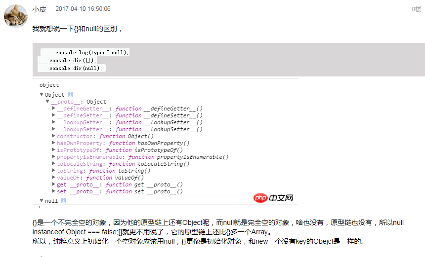

# 基本类型
```
console.log(Boolean(undefined))//false
console.log(Boolean(null))//false
console.log(Boolean(''))//false
console.log(Boolean(0))//false
console.log(Boolean('0')) //true
```

```
console.log([][0])//undefined
console.log(Boolean([][0]))//false
console.log({}.a) //undefined
console.log(Boolean({}.a))//false
```


# 对象类型和包装对象类型(全是true)

```
 console.log(Boolean(new String('')))//ture
console.log(Boolean(new Boolean(false)))//ture
console.log(Boolean(new Number(0))) //true
```

```
console.log(Boolean([]))//true
console.log(Boolean({}))//true
console.log(Boolean(function () {}))//true
```




```
boolen(0)===0  //这时0并非包装对象 

0.tostring() //这时转化为包装对象类型

``` 

