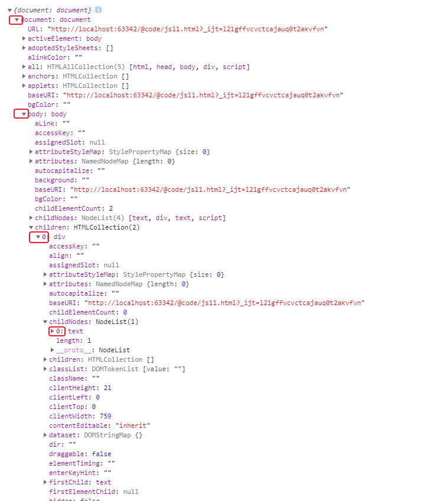
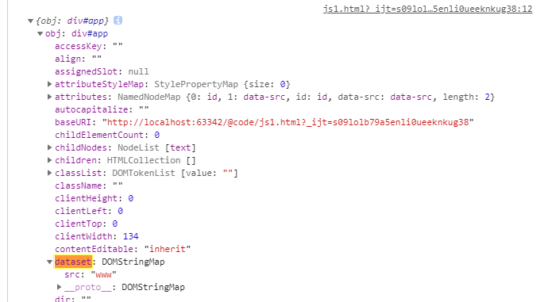
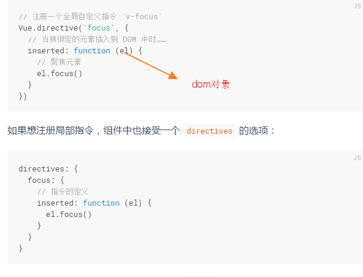

# document

浏览器链接页面时间会初始化这个document对象,然后注入在window上可以通过window.document访问

```
<html>
<body>
  <div id="app" class="cs" data-src="datasrc">
    <h1>h1标题</h1>
    <p>段落</p>
  </div>
</body>
</html>
```




# document 树结构


通过 HTML DOM，树中的所有节点均可通过 JavaScript 进行访问。所有 HTML 元素（节点）均可被修改，也可以创建或删除节点。

### document对象的属性

```javascript
    console.log(Object.getPrototypeOf(document))//HTMLDocument {Symbol(Symbol.toStringTag): "HTMLDocument", constructor: ƒ}
      console.log(Object.getOwnPropertyNames(document))//["location"]
      console.log(Object.keys(document))//["location"]
      
```


# el节点

 每个html的dom节点都封装成一个node对象(对象里包含属性和方法)

### 返回节点对象

```javascript
el=document.getElementById("id") //返回dom节点对象

vue-$refs//返回dom节点对象和自定义组件对象
```
### 节点的所有属性




### 节点父、子和同胞


### el对象和vue对象

dom |vue组件
--------|-----------
dom标签在html渲染时间运行dom构造函数   |vue组件标签在模板渲染时间运行构造函数
dom属性就是构造函数的参数 |自定义标签的属性就是vue构造函数的属性   

```html
<div id="app" data-src="www">
    <h1></h1>
</div>

<script>
    const obj = document.getElementById('app')
    console.log({obj})

</script>

```
### el对象的使用
##### vue组件对象注入el对象


##### 指令的回调参数也是el对象



##### 全局对象event注入了el对象

```
event.target
```
