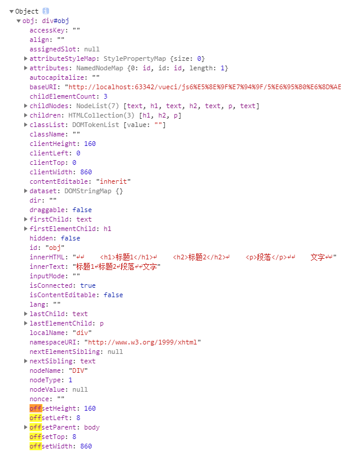
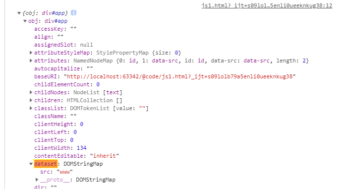

# el对象和vue对象

dom    |vuedom   |  生成对象  
--------|-----------|---------
标签   |自定义的标签|对象构造函数运行式
标签的属性 |自定义标签的属性|构造函数的属性   

```html
<div id="app" data-src="www">
    <h1></h1>
</div>

<script>
    const obj = document.getElementById('app')
    console.log({obj})

</script>

```


# el

 每个html的dom节点都封装成一个node对象(对象里包含属性和方法)


### 返回el对象

```
el=document.getElementById("id")

vue-$refs
```
### 返回当前el的子级el对象

### 返回当前el的父级el对象 


### 返回当前el的其他信息



### 属性值(构造函数参数)




# 注入el对象
### vue组件对象注入el对象


### 指令的回调参数也是el对象


### event全局对象注入了el对象

```
event.target

```
