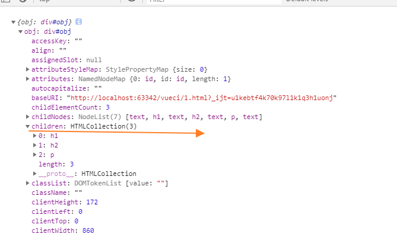
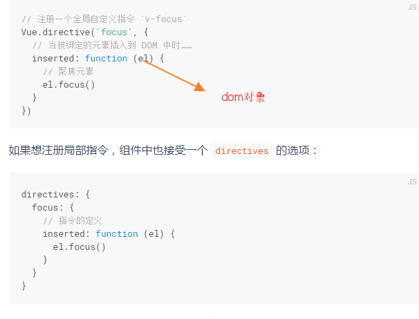

[TOC]
# dom 树


通过 HTML DOM，树中的所有节点均可通过 JavaScript 进行访问。所有 HTML 元素（节点）均可被修改，也可以创建或删除节点。

# 节点父、子和同胞
节点树中的节点彼此拥有层级关系。

父（parent）、子（child）和同胞（sibling）等术语用于描述这些关系。父节点拥有子节点。同级的子节点被称为同胞（兄弟或姐妹）。

* 在节点树中，顶端节点被称为根（root）
* 每个节点都有父节点、除了根（它没有父节点）
* 一个节点可拥有任意数量的子
*  同胞是拥有相同父节点的节点
下面的图片展示了节点树的一部分，以及节点之间的关系：


### 请看下面的 HTML 片段：

```html

<html>
  <head>
    <title>DOM 教程</title>
  </head>
  <body>
    <h1>DOM 第一课</h1>
    <p>Hello world!</p>
  </body>
</html>


从上面的 HTML 中：

* <html> 节点没有父节点；它是根节点
* <head> 和 <body> 的父节点是 <html> 节点
* 文本节点 "Hello world!" 的父节点是 <p> 节点
并且：

* <html> 节点拥有两个子节点：<head> 和 <body>
* <head> 节点拥有一个子节点：<title> 节点
* <title> 节点也拥有一个子节点：文本节点 "DOM 教程"
* <h1> 和 <p> 节点是同胞节点，同时也是 <body> 的子节点
并且：

* <head> 元素是 <html> 元素的首个子节点
* <body> 元素是 <html> 元素的最后一个子节点
* <h1> 元素是 <body> 元素的首个子节点
*  <p> 元素是 <body> 元素的最后一个子节点

```

# el对象和vue对象

dom |vue组件
--------|-----------
dom标签就是dom实例化   |vue组件标签就是vue构造函数运行
dom属性就是构造函数的参数 |自定义标签的属性就是vue构造函数的属性   

```html
<div id="app" data-src="www">
    <h1></h1>
</div>

<script>
    const obj = document.getElementById('app')
    console.log({obj})

</script>

```


# el

 每个html的dom节点都封装成一个node对象(对象里包含属性和方法)


### 返回el对象

```
el=document.getElementById("id")

vue-$refs
```
### el对象的属性值

 el.children



 el.parent 返回当前el的父级el对象 
 


 返回当前el的其他信息


el.dataset 属性值(构造函数参数)


# 注入el对象
### vue组件对象注入el对象


### 指令的回调参数也是el对象



### event全局对象注入了el对象

```
event.target

```
