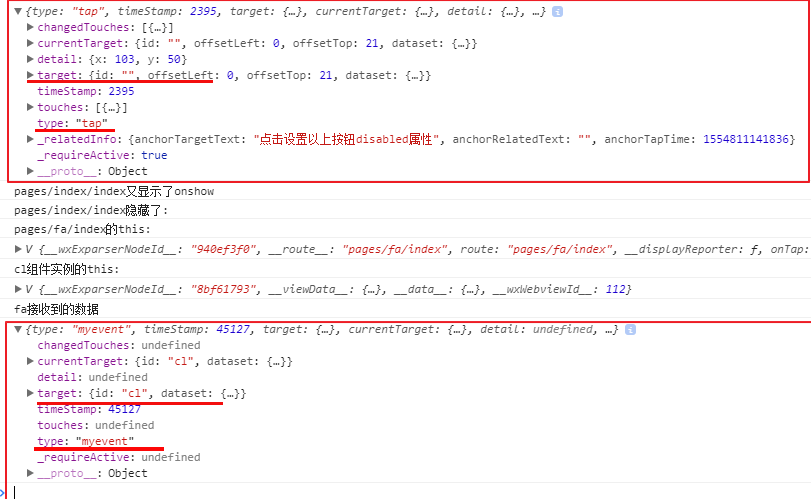

# 原生event对象

### event

event本质上window的全局变量包含事件名称,注入被操作el对象到target键


### eventType

##### 原生eventType共有5种类型：

- *HTMLEvents*：包括 'abort', 'blur', 'change', 'error', 'focus', 'load', 'reset', 'resize', 'scroll', 'select', 'submit', 'unload'.
- *UIEevents* ：包括 'DOMActivate', 'DOMFocusIn', 'DOMFocusOut', 'keydown', 'keypress', 'keyup'.
- *MouseEvents*：包括 'click', 'mousedown', 'mousemove', 'mouseout', 'mouseover', 'mouseup'.
- *MutationEvents*:包括 'DOMAttrModified', 'DOMNodeInserted', 'DOMNodeRemoved','DOMCharacterDataModified','DOMNodeInsertedIntoDocument', 'DOMNodeRemovedFromDocument', 'DOMSubtreeModified'.

上述加粗的是经常会用到的事件类型

##### 自定义eventType

````
...
````


### 3种方式注册event,修改全局变量event

```html
<!--方式1，
双引号里可以放任何语句,
this===当前dom对象
优势可以自定义传参
-->
<button onmouseover="fn(),console.log(this)" id="btn">btn</button>


<script>

    console.log(event) //undifine也不是err 说明event声明过,事件操作只是为event赋值

  
    function fn() {
        //event 其实是window全局变量,注意不是global
        console.log(window.event)
    }

    
   const el = document.getElementById('btn')
    //方式2
    el.onmousedown = fn

    //方式3
    el.addEventListener('click', fn, false)
    setTimeout(() => {
            el.removeEventListener("click", fn, false);  //有效！
        }, 3000
    )

</script>

```

# 小程序的event

注入了el对象,表示本事件点击了哪个目标元素(target)

### event数据结构



# vue的$event

### $event数据结构

##### vue组件的$event可以自定义任何值 

```
    <cl @click="fn($event)"></cl>
----------------------------------
    var cl = {
        template:`<div @click="click">事件</div>`,
        methods: {
           click:function () {

               this.$emit('click', 123)
           }
        }

    }
    const vm = new Vue({
        el: '#app',
        components: {cl},
        data: {
            msg: 'msg'
        },
        methods:{

            fn($event){
                console.log($event)
            }

        }
    })
```

#####  vue组件上可以使用原生dom的event(原理是vue组件上的监听自动加到子组件的最外层)

```
@click.native即可
```

### eventType

##### 原生eventType

```
<button @click=""></button>
```

##### 自定义eventType

```html
<el-button @click=""></el-button>

<!--子组件-->
<script>

</script>
```

### 1种事件注册方式

```
<button @click=""></button>
```

```html
<el-button @myevent=""></el-button>
```

