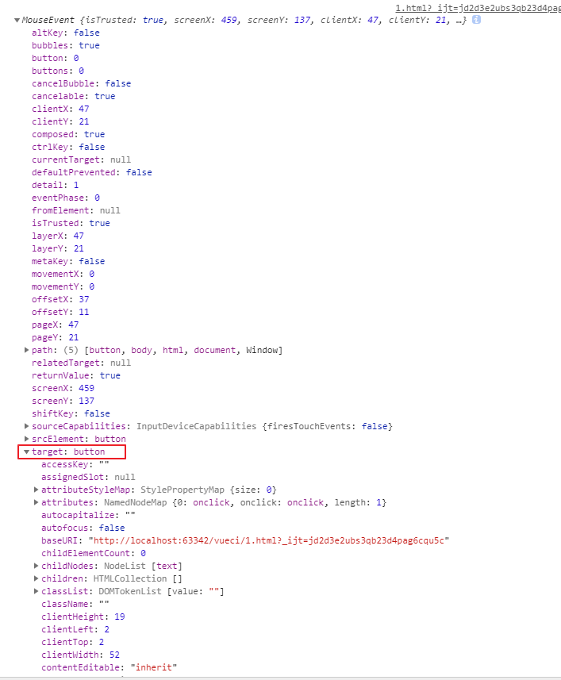

# event对象

> event本质上window的全局变量


# 3种事件注册  修改全局变量event

```html

<!--方式1，
双引号里可以放任何语句,
this===当前dom对象
优势可以自定义传参
-->
<button onmouseover="fn(),console.log(this)" id="btn">btn</button>


<script>

    console.log(event) //undifine也不是err 说明event声明过,事件操作只是为event赋值

    const el = document.getElementById('btn')
    function fn() {
        //event 其实是window全局变量,注意不是global
        console.log(window.event)
    }

    //方式2
    el.onmousedown = fn

    //方式3
    el.addEventListener('click', fn, false)
    setTimeout(() => {
            el.removeEventListener("click", fn, false);  //有效！
        }, 3000
    )

</script>

```
# event的数据结构
### event对象包含事件名称,注入被操作el对象到target键





### 小程序的event也注入了el对象,表示本事件点击了哪个目标元素(target)


### vue组件的$event可以自定义任何值 

```
    <cl @click="fn($event)"></cl>
----------------------------------
    var cl = {
        template:`<div @click="click">事件</div>`,
        methods: {
           click:function () {

               this.$emit('click', 123)
           }
        }

    }
    const vm = new Vue({
        el: '#app',
        components: {cl},
        data: {
            msg: 'msg'
        },
        methods:{

            fn($event){
                console.log($event)
            }

        }
    })
```

###  vue组件上使用原生dom的event

```
加click.native即可
```
