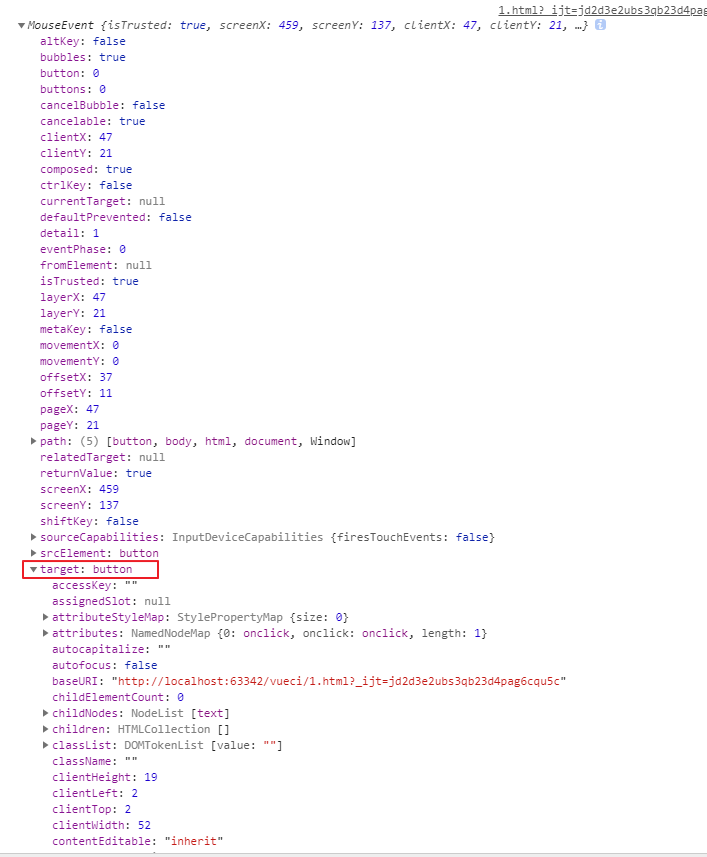

# event


### html的event也注入的el对象,表示本事件点击了哪个目标元素(target)





### 小程序的event也注入了el对象,表示本事件点击了哪个目标元素(target)


### vue组件的event可以自定义任何值 

下边是模拟小程序和dom的

```
    <cl @click="fn($event)"></cl>
----------------------------------
    var cl = {
        template:`<div @click="click">事件</div>`,
        methods: {
           click:function () {

               this.$emit('click', 123)
           }
        }

    }
    const vm = new Vue({
        el: '#app',
        components: {cl},
        data: {
            msg: 'msg'
        },
        methods:{

            fn($event){
                console.log($event)
            }

        }
    })
```

###  vue组件的event可以使用dom默认的event

```
加click.native即可
```

# 本质都是(原生)都是设置好函数运行表达式给子组件回调

子组件回调父组件的函数,向父组件传值

### js原生事件:
系统子组件a回调传参

```
    <a  onclick="fn(event,'msg')">原生组件传参</a><!--#2-->
    

 el.addEventListener('click', function (event) {
        //原理是function定义式内可以放任何表达式和语句
        f(event)
    })
 
```


### vue
vue自定义事件:子组件import父组件的函数,回调传参

```
 <cl @click="click" @click2="click2"></cl>
 <!--设置好要回调的函数的表达式:click 交给子组件函数回调-->
```

vue 函数做参数:子组件import父组件的函数,回调传参
```
 <cl :click="click" :click2="click2"></cl>
 <!--设置好要回调的函数的表达式:click 交给子组件函数回调-->
```

### 小程序
小程序自定义事件:子组件import父组件的函数,回调传参

```
 <cl bindtap="tap" ></cl>
 <!--设置好要回调的函数的表达式:click 交给子组件函数回调-->
```
