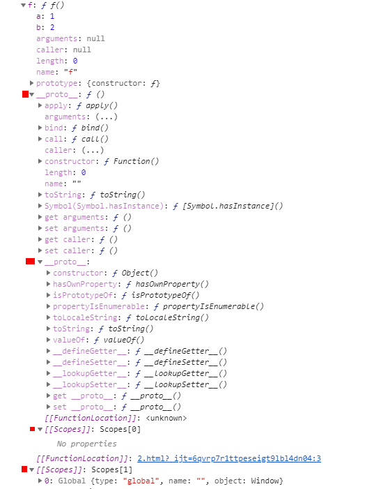

# 函数对象

### 创建函数对象

##### 构造函数创建对象

```javascript
new Function('a', 'b', 'return a + b');
```

##### 直面量(用于新建对象和控制台打印)

```
  function f(a,b) {return a + b}//语法糖等价上面的构造函数生成

    f.a = 1
    f.b = 2
    console.log(f)//  function f() {} 打印出来的只是直面量表达式

```

### 赋值给变量

```js
const fn=function(){} //fn里存内存地址0x0001

```

### 弱类型扩展静态函数和静态变量

```
fn.a=1//对象键值对可扩展
```

### 变量Fn/new Funciton()/function fn(){}和()计算得到return返回值

> 引用类型fn赋值:对于同一个引用变量fn, 赋值到任何地方只是复制了一个内存地址,函数堆内存没有改变,还是同一个函数

自执行

       (function () {
                    var i=0
                    i += 1
                    i *=5
                    console.log(i)
                })()

声明函数,然后执行区别于声明变量,上下文栈准备阶段已经赋值

         function f() {
                            var i=0
                            i += 1
                            i *=5
                            console.log(i)
                        }
                 f()
赋值执行-递归


采用函数表达式声明函数时，function命令后面不带有函数名。如果加上函数名，该函数名只在函数体内部有效，在函数体外部无效。

```
var print = function x(){
  console.log(typeof x);
};

console.log(x)
// ReferenceError: x is not defined

print()
// function
````
```
//无限递归
 var print = function fn() {
        console.log('1')
        fn()
    };
    print()

```


赋值给f后f()执行

```

        var f=function () {
                    var i=0
                    i += 1
                    i *=5
                    console.log(i)
                }
         f()

```

回调参数 函数做参数

```

var i = 1

function fn() {//1函数声明 自由变量在哪个作用域取值在声明时间已经确定
    console.log(i)
}

function fn2(f) {
    var i = 2
    f()//调到fn里执行,确定自由变量的值
}

fn2(fn)

```


赋值执行5-闭包


````
    var i = 1
    var fn = function () {
        var i = 2

        function fn2() {
            console.log(i)
        }

        return fn2
    }
    var f = fn() //fn2的地址复制给f
    f()//2
````


Object.fn() 先计算出地址再运行

```
     obj={fn:function () {
            console.log(this)
        }}
    console.log(obj.fn)//fn
    obj.fn()//obj
```
```
 i = 1
    const fn = function () {
        console.log(this)
        console.log(i)
    }
    obj = {a: 1, fn}
    fn()  // window,1
    obj.fn()//obj,1
```

arry

    arr=[function () {
        console.log(1)
    },2]
        arr[0]()
require'xxx'()
     
     moudle.exports=route(){.....}
     -------------------------  
     const route=require('route')()


指定this的值运行

      fn.call(obj,a,b)

指定参数运行

```

 var f=function (i) {
                
                i += 1
                i *=5
                console.log(i)
            }
     f(1)

```
> __这里很特殊__

```

    function fn() {
        console.log(arguments) //[1,2]
    }

    fn(1,2)


```

在指定时间执行


      setTimeout(function(){},3000)  

异步事件调用执行

````

 事件驱动(onclik事件触发运行/路由切换钩子触发构造函数运行,造成了局部组件)

 vue异步组件:切换路由 会触发webpack下载代码事件和异步运行vue构造函数

````


# 所有属性(真实数据结构) in




### Function.protype
```javascript
   const Fn = function () {
        console.log(Fn.arguments)
        console.log(Fn.arguments.callee)
    }
    Fn.a = 10
    Fn()
   
    

  //1.原型属性Function.prototype---------------
   console.log({'Function.protype': Object.getPrototypeOf(fn)})
  /*{ 
    apply: ? apply()
    arguments: (...)
    bind: ? bind()
    call: ? call()
    caller: (...)
    constructor: ? Function()
    length: 0
    name: ""
    toString: ? toString()
    Symbol(Symbol.hasInstance): ? [Symbol.hasInstance]()
    get arguments: ? ()
    set arguments: ? ()
    get caller: ? ()
    set caller: ? ()
    }*/

```
### OwnProperty
```js
  //2.Own属性,Function构造生成---------------------    
    console.log(Object.getOwnPropertyNames(Fn))//(6)["length", "name", "arguments", "caller", "prototype", "a"]
     console.log(Fn.name)

```
### keys
```js

    //3.可枚举属性:静态变量,静态方法--------------------
     console.log(Object.keys(Fn)) //['a']


     //for..in还能枚举出 

    for (item in f) {
        console.log(item) //a,b

    }
```


# Function和对象的关系

fn继承于Object.protype,是对象类型

 new fn创造新的对象实例