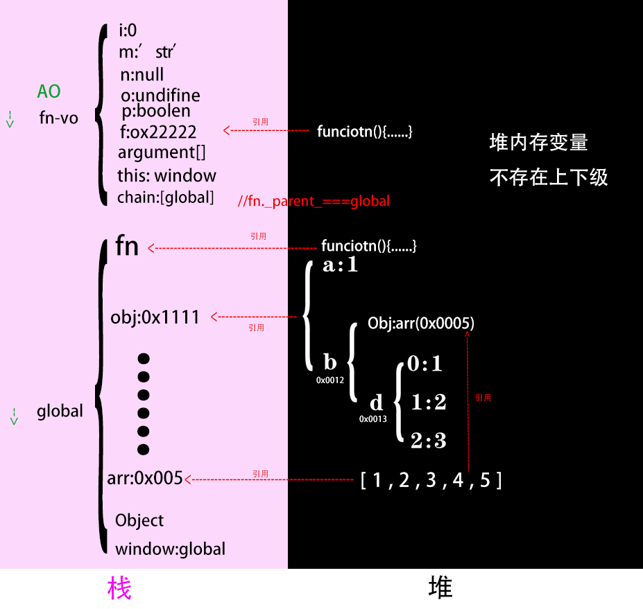
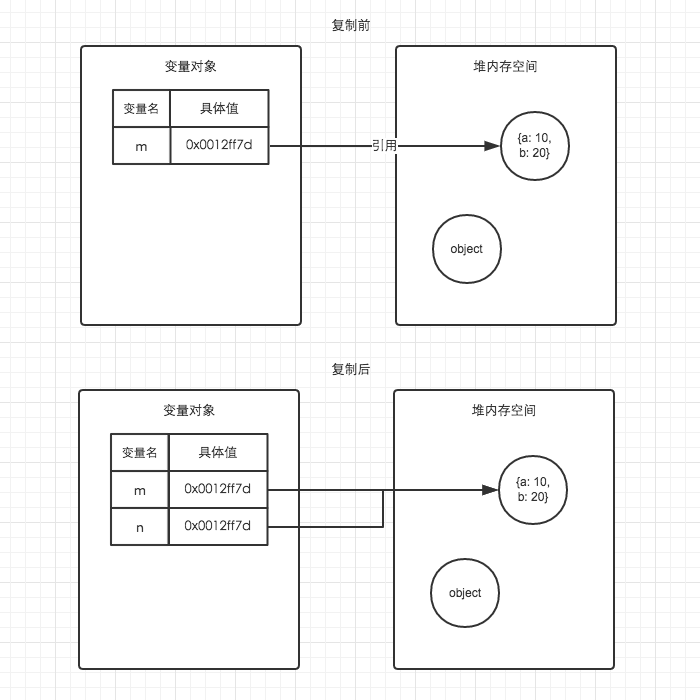
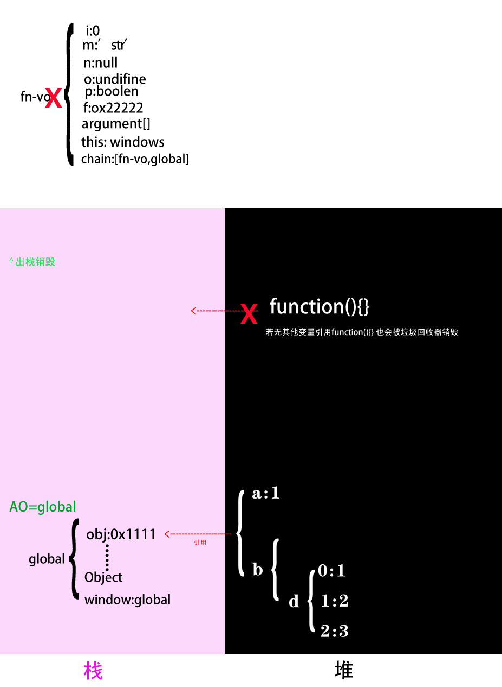
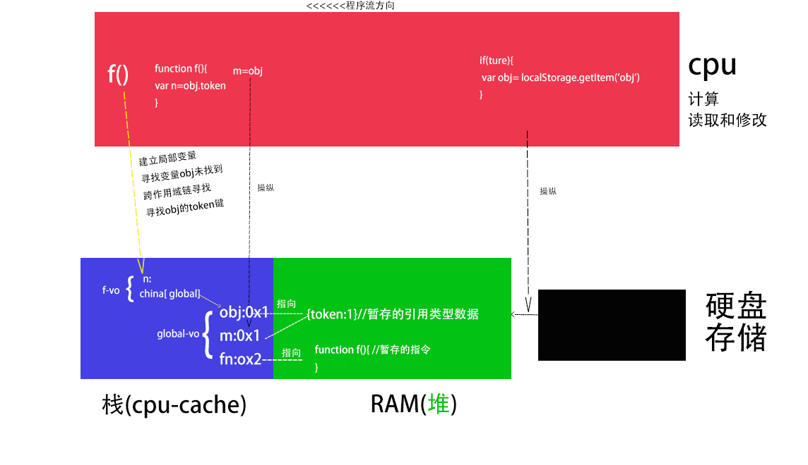
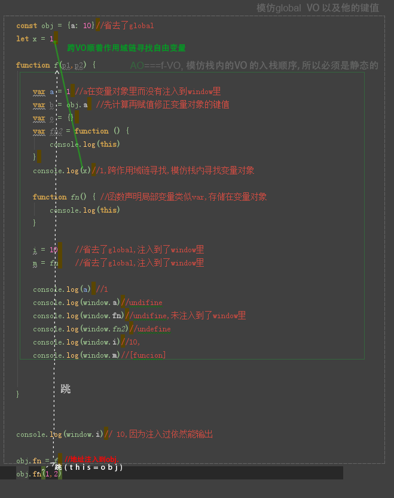

[[toc]]
# 堆栈结构

### 栈(存放变量对象,变量对象存放变量,变量里存基本类型和引用类型地址)

* 一种后进先出的的数据结构,
* 数据大小确定，内存空间大小系统分配和回收(垃圾回收器)。


### 堆(树结构键值对,存放引用类型)

* 堆可以被看成是一棵树(通过键值对一分多)，
* 每个空间大小不一样，程序猿分配空间。


# 函数调用才会进栈->建立函数上下文栈

> 打开页面代码顺序(包含import里的代码)调用执行(执行运算符|函数运行表达式),只有函数调用,才会建立函数上下文栈,运行局部作用域的代码


> 被调用时执行,函数的变量后面的(参数)表示运行


> 对于同一个变量fn, 复制到任何地方只是复制了一个内存地址,函数堆内存没有改变,还是同一个函数,this和参数对于不同的调用会赋不同值

>__运行:内存地址f,f()__

自执行

       (function () {
                    var i=0
                    i += 1
                    i *=5
                    console.log(i)
                })()

声明函数,然后执行区别于声明变量,上下文栈准备阶段已经赋值

         function f() {
                            var i=0
                            i += 1
                            i *=5
                            console.log(i)
                        }
                 f()
赋值执行-递归


采用函数表达式声明函数时，function命令后面不带有函数名。如果加上函数名，该函数名只在函数体内部有效，在函数体外部无效。

```
var print = function x(){
  console.log(typeof x);
};

x
// ReferenceError: x is not defined

print()
// function
````
```
//无限递归
 var print = function fn() {
        console.log('1')
        fn()
    };
    print()

```


赋值给f后f()执行

```

        var f=function () {
                    var i=0
                    i += 1
                    i *=5
                    console.log(i)
                }
         f()

```

回调参数 函数做参数

```

var i = 1

function fn() {//1函数声明 自由变量在哪个作用域取值在声明时间已经确定
    console.log(i)
}

function fn2(f) {
    var i = 2
    f()//调到fn里执行,确定自由变量的值
}

fn2(fn)

```


赋值执行5-闭包


````
    var i = 1
    var fn = function () {
        var i = 2

        function fn2() {
            console.log(i)
        }

        return fn2
    }
    var f = fn() //fn2的地址复制给f
    f()//2
````


Object.fn() 先计算出地址再运行

```
     obj={fn:function () {
            console.log(this)
        }}
    console.log(obj.fn)//fn
    obj.fn()//obj
```
```
 i = 1
    const fn = function () {
        console.log(this)
        console.log(i)
    }
    obj = {a: 1, fn}
    fn()  // window,1
    obj.fn()//obj,1
```

arry

    arr=[function () {
        console.log(1)
    },2]
        arr[0]()
require'xxx'()
     
     moudle.exports=route(){.....}
     -------------------------  
     const route=require('route')()


指定this的值运行

      fn.call(obj,a,b)

指定参数运行

```

 var f=function (i) {
                
                i += 1
                i *=5
                console.log(i)
            }
     f(1)

```
> __这里很特殊__

```

    function fn() {
        console.log(arguments) //[1,2]
    }

    fn(1,2)


```


在指定时间执行


      setTimeout(function(){},3000)  


异步事件调用

````

2. 事件驱动(onclik事件触发运行/路由切换钩子触发构造函数运行,造成了局部组件)

3. __vue异步组件:__切换路由 会触发webpack下载代码事件和异步运行vue构造函数

````


# 变量对象

这是一个实例,下边是对实例的分析
```
     let x = 1//不会注入到global-vo,window,
    var store = {a: 10} //store爲this版的全局變量
    function f(p1, p2) {

        let a = 1 //a在fn-vo里而不在global-vo所以没有注入到window里
        var b = this.store.i  //先计算再赋值修正fn-vo的键值
        var o = {}
        var fn2 = function () {
            console.log(this)
        }
        console.log(x)//1,跨作用域链寻找,模仿栈内寻找变量对象

        function fn() { //函数声明局部变量类似var,存储在f-vo
            console.log(this)
        }

        i = 10    //省去了global,注入到了window里
        m = fn    //省去了global,注入到了window里,fn会销毁,fn对应地址的函数对象不会销毁


    }
    var arr=[1,2,3,4,5]
    const obj = {store, f,arr}//注入了global-vo,window ,

    obj.f(1, 2)
    console.log(window.i)// 10,因为注入到了global,global是全局的永远不出栈
    m()// 对内存中的地址未销毁,window.m===#0x00001

```


### 全局上下文vo,运行前准备阶段,进栈的数据


```


 global={
    Math:<...>,
   String:<...>,
    ....
    ....
                 //不会出现的 x:1
    store:oxxxx1
    arr:0x0005
    f:0xxxxxx2
    obj:0xxxxxx1
    window:global
    this:window

 };   
 ```
 


访问一般省去global

global是js的原生变量对象,但是window不是原生的而是bom(浏览器的窗口对象),window引用了global对象

window.a=10;//===global.window.a=10===global.a=10;

小程序没有window 有js原生的global

node没有window 有global

### 函数上下文vo


#####  f()函数上下文栈 代码运行前的准备阶段,`进栈的数据

变量对象为

```
vo= {

fn:0x000001 //开辟堆内存空间0x000001 赋值给fn,如果此时有同名的变量fn 函数fn先初始化,程序会优先访问0x000001

            //a=undefine 这个是不会出现的 因为let不会提前进栈 不会提前进栈准备

b:undefine
o:undefine
fn2:undefine

arguments:{
0:1,1:2,length:2
}

this:obj

chain:[global] //作用域链原理 foo._parent_===global
}


```


##### 函数上下文栈运行阶段 


```

VO= {
fn:ox000003 
a:1 //代码运行的此处a才被声明,然后赋值
b:2  //obj.a,首先作用域链搜索obj,先让obj和'a'经过cpu计算得到值2,然后2赋值给i
o: #0x000000 //开辟堆内存空间{}复制地址#0x000002给o

fn2:0x000002
        //cpu计算时间访问作用域链寻找x的值
arguments:{
0:1,1:2,length:2
}

this:obj

chain:[global]

}

AO=VO
```

```

window={
...
...
i:10, //赋值语句更改global键值
m:ox0000001 //赋值语句更改global键值
}

```





##### 变量的复制,在变量对象内部进行





##### 变量对象出栈


   1. __局部变量:__ 函数(栈stack)进栈后,编译器为局部变量分配的栈内存空间,函数出栈后变量销毁,释放内存空间，如何栈内的变量没有变量引用也会由js垃圾回收器销毁

   2. __global变量:__ global变量在程序进入global上下文栈建立栈内存空间,一直存在,不存在出栈,所以global变量不会释放；



# 硬件和程序

变量对象赋值修正  指令和变量对象读入到cpu

```javascript
if(ture){
 var obj= localStorage.getItem('obj')
}

m=obj

function f(){
var m=obj.token
}

f()

```





# 内存地址的访问

推测所谓的内存地址是内存的__首地址__,任何对象都可以通过地址在变量对象访问,对象和对象自己没有从属关系
```

const obj1 = {a: 1, b: {c: 3}}

const obj2=obj1.b
obj2.c=4
console.log(obj1)  //{a: 1, b: {c: 3}}

```


# 静态作用域

> 作用:js代码是静态作用域,为了让cpu分析时确定入栈顺序 {作用域包含关系}

> 不管是引入赋值再运行,module,回调函数,还是构造函数的配置文件里的钩子函数,都是如此


### 赋值再运行




### module


# this赋值


obj调用

```
obj={fn:function(){this.i}}

obj.fn--------> this===obj

```

函数里嵌套的函数,f()没有注入window,默认分配windows

```

function(){

function f(){
console.log(this.i) //this===windows
}
f()
}()

```
```
    const obj = {
        fn() {
            console.log(this)
        }

    }

    const f = obj.fn //只是赋值了内存地址,没运行和this没什么关系

    f()


```

call apply指定this

```
obj={}
function fn(){
console.log(this)
}

fn.call(obj)

```

new 的原理就是 P.call(new Object())

```
function P(){
this.i=1
this.m=2
console.log(this)
}
const p=new P()

```

prototype的this也是实例化对象本身
```
obj.__proto__=Fn.prototype


```

 箭头函数内部this继承其父函数的this,为了方便使用上级函数的this才引入的
 
```
其父函数的this,
```


method（this）不算method函数作用域因为是指令就是操作符一样


````
   var a=1
    function fn(i) {
        var a=2
        console.log(i)
    }
    fn(this.a)//此处this为window,()并非是函数内部不会间隔作用域
````

# 作用域链

作用于链也适用参数,从进栈顺序寻找也可以知道这点

```
    function f(a, b) {
        function f(a) {
            console.log(a, b) //undefined ,2
        }

        f()
    }

    f(1, 2)

```
参数的默认值
```
    function f(a, b) {
        function f(a=10) {
            console.log(a, b) //10 ,2
        }

        f()
    }

    f(1, 2)

```