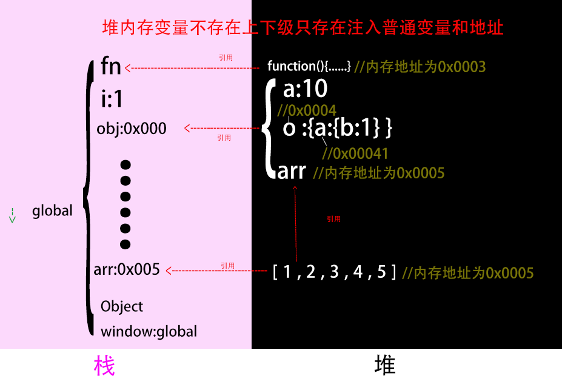
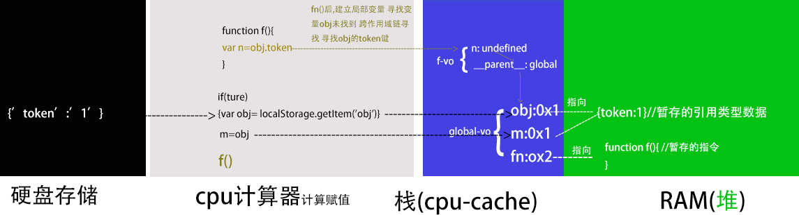
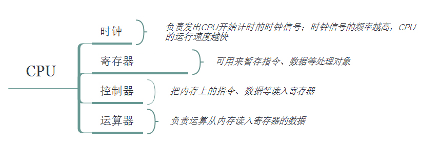
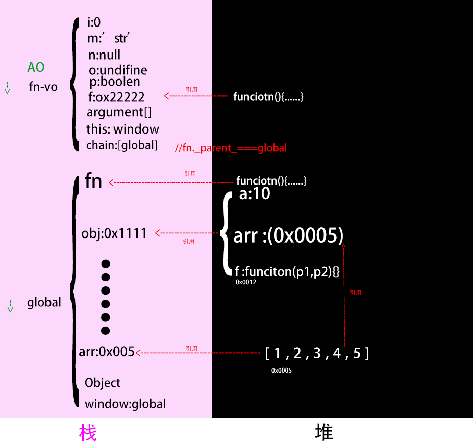
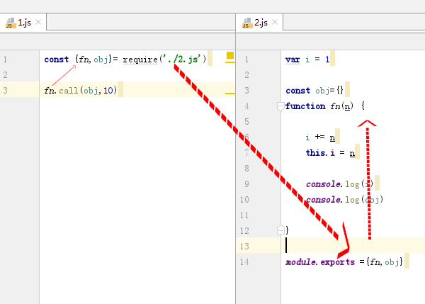
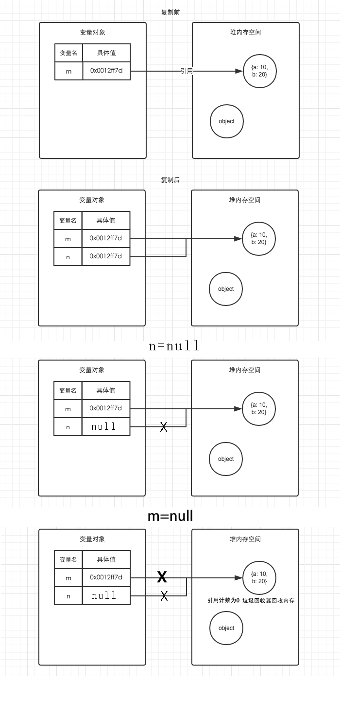
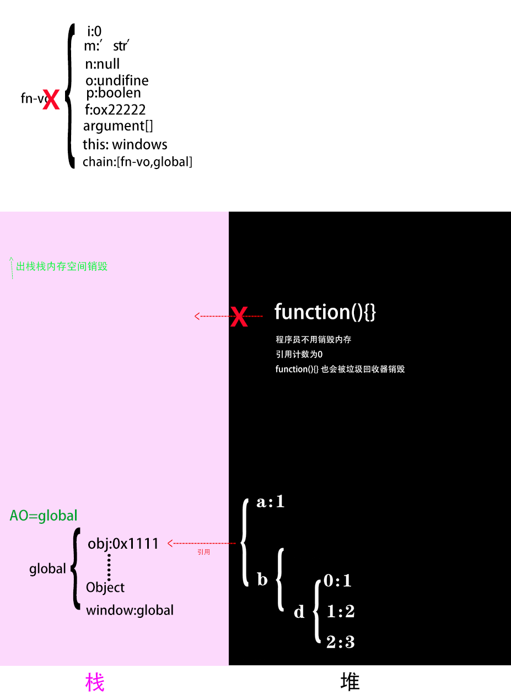

# 堆栈结构

### 栈

##### 结构

* 一种后进先出的的数据结构,
* 数据大小确定，内存空间大小系统分配和回收(垃圾回收器)。


##### 存放内容

栈存放变量对象,

变量对象存放变量,

变量里存基本类型和引用类型地址

### 堆

#####  结构

* 堆可以任意放置的
* 每个空间大小不一样，程序猿分配空间。
* 对象可以被看成是树结构(通过键值对一分多)


# 引用类型变量存放内存地址,普通类型变量存放基本值

推测所谓的内存地址是内存的 **首地址** ,任何对象都可以通过地址在变量对象访问,对象和对象自己没有从属关系

```javascript
//{c: 3}有自己的内存地址0x12122
const obj1 = {a: 1, b: {c: 3}}
const obj2=obj1.b //得到内存地址
obj2.c=4
console.log(obj1)  //{a: 1, b: {c: 4}}

```



# 函数调用才会进栈,建立函数上下文栈

> __运行:内存地址f,f()__只有函数调用,才会建立函数上下文栈才执行函数作用域里的代码,作用域可以是函数作用域和文件作用域里函数作用域

# 硬件和程序

变量对象赋值修正  指令和变量对象读入到cpu

```javascript
if(ture){
 var obj= localStorage.getItem('obj')
}

m=obj

function f(){
var m=obj.token
}

f()

```





# 函数上下文栈

这是一个实例,下边是对实例的分析
```javascript
  
      let g1 = 1//不会注入到global-vo,window,存放在在一个叫Script的作用域里,
      var store = {a: 10} //store全局变量,为方便this.store调用注入到对象中
      function g_fn(p1, p2) {
  
          console.log(fn)//function(){console.log(this)}, 
          //console.log(a)// &报错 
          console.log(b) //&undefined ,
  
  
          //1,跨作用域链寻找,模仿栈内寻找变量对象-----------------------------
          console.log(g1)
          // 2.变量声明,也可以提供给下级的作用域使用---------------------------
          
          function fn() {  // 1.提前进栈准备赋值undifine 2.赋值 3.覆盖同名变量
                          console.log(this)
                      }
          let a = 1  //let不会提前进栈准备
          var b=a   //1.提前进栈准备赋值undifine,计算时间赋值a的值1
          var fn2 = function () { //var变量只提前进栈准备
                        console.log(this)
                    }
                   
          var i = this.store.a  // 先计算再赋值修正fn-vo的键值
  
          var obj1 = {}
          var obj2=obj1//赋值内存地址
  
     
          //3  参数,还可以给下级作用域使用---------------------------
          console.log(p1,p2) //提前进栈准备,赋值
          console.log(arguments)
  
          //4.this被赋值---------------------------------
          console.log(this)
          
         //注入到global
          g2 = 10    //省去了global,注入到了window里
          g3 = fn    //省去了global,注入到了window里,fn会销毁,fn对应地址的函数对象不会销毁
  
  
      }
      var g_arr=[1,2,3,4,5]
      const g_obj = {store, g_fn,g_arr}//注入了global-vo,window ,
      g_obj.g_fn(1, 2)
  
      console.log(g2)// 10,因为注入到了global,global是全局的永远不出栈
      g3()// 对内存中的地址未销毁,window.m===#0x00001

```

### global-vo进栈,程序初始化

global访问一般省去global

global是js的原生变量对象,但是window不是原生的而是bom(浏览器的窗口对象),

_window引用了global对象_

window.g1===global.window.g1===global.g1

小程序没有window 有js原生的global

node没有window 有global


```javascript


 global={
    
 /*----------所有global变量不销毁都提供给下级的作用域,所以全局变量比较消耗内存----*/   
 //系统变量   
    Math:<...>,
   String:<...>,
    ....
    ....
 // 用户全局变量
      *g1:1,   //let变量,这个不会出现的因为g1没注入到global
    store:oxxxx1,
    g_fn:0xxxxxx2
    g_arr:0x0005
    g_obj:0xxxxxx1
     
//this指针 
     this:window
     
//windows和global的关系   
    window:global
     
     
   

 };   
```

### fn-vo入栈


#####  fn(),函数运行准备阶段,fn-vo里的数据

```javascript
//变量对象vo 活动对象AO
AO=fn_vo= {

    //---------------------作用域内变量的种类----------------------

//1.自由变量,这里也是局部变量- 给下级作用域提供作用于链
fn:0x000001, // Ⅰ .开辟堆内存空间0x000001 赋值给fn,Ⅱ.如果此时有同名的变量fn 函数fn先初始化,程序会优先访问0x000001

* a:undefine //let变量 这个是不会出现的 因为let不会提前进栈准备
b:undefine, //var变量会提前进栈设置undefined


i:undefine,

obj1:undefine,
obj2:undefine,


fn2:undefine,//var生命函数,此阶段不会赋值

//2.参数变量--给下级作用域提供作用于链
arguments:{
0:1,1:2,length:2
},
p1:1,
p2:2,

//3.this变量-不能给下级提供作用于链,下级是箭头函数就可以提供
  this:obj,

//4. 父级的作用域的自由变量
chain:[global] //作用域链原理 foo._parent_===global
}


```
global

```javascript
global:{
    //.....
}
```


##### fn() 函数运行阶段 fn-vo的数据


```javascript

AO=fn_VO= {
//1.自由变量----------------------------------
fn:ox000003 ,
a:1 ,//let变量代码运行的此处a才被声明,然后赋值
b:1, //var变量赋值

    
i:2,  //obj.a,首先作用域链搜索obj,先让obj和'a'经过cpu计算得到值2,然后2赋值给

obj1: #0x000000, //开辟堆内存空间{}复制地址#0x000002给o
obj2: #0x000000, //和m指向同一地址

fn2:0x000002,
//cpu计算时间访问作用域链寻找g1的值
    
//2.参数变量    
arguments:{
0:1,1:2,length:2
},
p1:1,
p2:2,
//3.this变量    
this:obj,
//4.父级的作用域的自由变量
chain:[global]

}

```

```

window={
...
...
g2:10, //赋值语句更改global键值
g3:ox0000001 //赋值语句更改global键值
}

```




##### 函数上下文栈里的变量对象fn-vo的数据

###### 自由变量

var let const 声明


######  arguments

实参赋值给形参和arguments

参数可以设置默认值
```javascript
  
        function f(a=10) {
            console.log(a, b) //10 ,undefine
            console.log(arguments)//[10 ,undefine]
        }

        f()
   


```

######  this在上下文进栈时间被赋值

1. obj调用

```javascript
obj={fn:function(){this.i}}

obj.fn--------> this===obj

```
```javascript
obj={i:1,fn (n){console.log(n,this)}}

obj.fn(1) //obj fn () 1 四个计算函数运行,并赋值this=obj

const f=obj.fn //obj,fn 计算得到f的内存地址

f()//window.f() 1 计算函数运行 this=window

```

```javascript
//静态函数调用也是如此
    function Person(name, surname) {
      
    
    }


    Person.fn = function () {
      //对象调用函数
        console.log(this) //Person
    }


    //對象調用fn
    Person.fn()

```

2. call apply指定this运行

```javascript
obj={}
function fn(){
console.log(this)
}

fn.call(obj,arguments)

```

```javascript
    const arr = [10, 2, 3]
    const i = arr.sort((a, b) => a - b)//arr调用sort,this===arr; 回调参数做参数
    //下边的和上边的等价
    const m = Array.prototype.sort.call(arr, (a, b) => a - b)//call(arr ),this===arr;回调参数做参数
```

3. new 的原理就是 P.call(new Object(  ))

```javascript
function P(){
this.i=1
this.m=2
console.log(this)
}
const p=new P()

```

4. prototype的this也是实例化对象本身

```javascript
obj.__proto__=Fn.prototype

```
5. 函数里嵌套的函数,无法给this赋值,默认分配windows,但是f没有注入window,是局部变量

```javascript

function(){

function f(){
console.log(this.i) //this===windows
}
f()
}()

```

6. this变量:

```
箭头函数内部this继承其父函数的this,类似作用域链
   
作用:为了方便使用上级函数的this才引入的
```

7. fn（this）不算method函数作用域 是操作符

````javascript
   var a=1
    function fn(i) {
        var a=2
        console.log(i)
    }
    fn(this.a)//此处this为window,()并非是函数内部不会间隔作用域
````


##### 变量的静态作用域:代码模仿fn-vo入栈

> 作用:js代码是静态作用域,用于cpu找出作用域包含关系,fn.__ parent 


> 不管是引入赋值再运行,module,回调函数,都是如此




##### 变量的作用域链

作用于链也适用参数 自由变量 this(下级是箭头函数)

```javascript
   function outer(i) {
        const inner = () => console.log(this, i) //{},1
        inner()
    }

    const obj = {}
    outer.call(obj, 1)
```


##### 变量的复制,在变量对象内部进行





### fn-vo出栈与js垃圾回收器 


   1. __局部变量:__ 函数(栈stack)进栈后,编译器为局部变量分配的栈内存空间,函数出栈后变量销毁,释放内存空间，堆中的对象没有栈变量引用也会销毁

   2. __global变量:__ global变量在程序进入global上下文栈建立栈内存空间,一直存在,不存在出栈,所以global变量不会释放,所以一般不要建立global变量；

```javascript
AO=global={
...
...
g2:10, //赋值语句更改global键值 
g3:ox0000001 //赋值语句更改global键值
}

```





