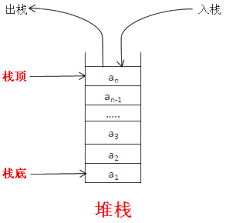
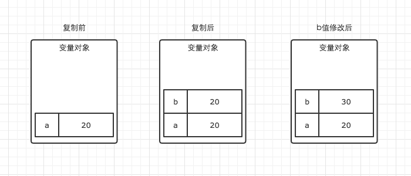

# 堆,栈,VO,AO,变量,基本类型值,引用类型值关系图


# 堆栈结构

### 栈

##### 结构

* 一种后进先出的的数据结构,
* 数据大小确定，内存空间大小系统分配和回收(垃圾回收器)。




##### 存放内容

栈存放变量对象,

变量对象存放变量,

变量里存基本类型和引用类型地址

### 堆

#####  结构

* 堆可以任意放置的
* 堆存放对象,可以被看成是树结构(通过键值对一分多)


# 函数调用才会进栈,建立函数上下文栈

> __运行:内存地址f,f()__只有函数调用,才会建立函数上下文栈才执行函数作用域里的代码,作用域可以是函数作用域和文件作用域里函数作用域

# 硬件和程序

变量对象赋值修正  指令和变量对象读入到cpu

```javascript
if(ture){
 var obj= localStorage.getItem('obj')
}

m=obj

function f(){
var m=obj.token
}

f()

```


# 内存中的函数上下文栈

这是一个实例,下边是对实例的分析
```javascript
  
      let g1 = 1//不会注入到global-vo,window,存放在在一个叫Script的作用域里,
      var store = {a: 10} //store全局变量,为方便this.store调用注入到对象中
      function g_fn(p1, p2) {
  
          console.log(fn)//function(){console.log(this)}, 
          //console.log(a)// &报错 
          console.log(b) //&undefined ,
  
  
          //1,跨作用域链寻找,模仿栈内寻找变量对象-----------------------------
          console.log(g1)
          // 2.变量声明,也可以提供给下级的作用域使用---------------------------
          
          function fn() {  // 1.提前进栈准备赋值undifine 2.赋值 3.覆盖同名变量
                          console.log(this)
                      }
          let a = 1  //let不会提前进栈准备
          var b=a   //1.提前进栈准备赋值undifine,计算时间赋值a的值1
          var fn2 = function () { //var变量只提前进栈准备
                        console.log(this)
                    }
                   
          var i = this.store.a  // 先计算再赋值修正fn-vo的键值
  
          var obj1 = {}
          var obj2=obj1//赋值内存地址
  
     
          //3  参数,还可以给下级作用域使用---------------------------
          console.log(p1,p2) //提前进栈准备,赋值
          console.log(arguments)
  
          //4.this被赋值---------------------------------
          console.log(this)
          
         //注入到global
          g2 = 10    //省去了global,注入到了window里
          g3 = fn    //省去了global,注入到了window里,fn会销毁,fn对应地址的函数对象不会销毁
  
  
      }
      var g_arr=[1,2,3,4,5]
      const g_obj = {store, g_fn,g_arr}//注入了global-vo,window ,
      g_obj.g_fn(1, 2)
  
      console.log(g2)// 10,因为注入到了global,global是全局的永远不出栈
      g3()// 对内存中的地址未销毁,window.m===#0x00001

```

### global-vo进入内存里的函数上下文栈,程序初始化

global访问一般省去global

##### window引用了global对象

window.g1===global.window.g1===global.g1

global是js的原生变量对象,但是window不是原生的而是bom(浏览器的窗口对象),

##### 小程序没有window 有js原生的global

##### node没有window 有global


```javascript


 global={
    
 /*----------所有global变量不销毁都提供给下级的作用域,所以全局变量比较消耗内存----*/   
 //系统变量   
    Math:<...>,
   String:<...>,
    ....
    ....
 // 用户全局变量
      *g1:1,   //let变量,这个不会出现的因为g1没注入到global
    store:oxxxx1,
    g_fn:0xxxxxx2
    g_arr:0x0005
    g_obj:0xxxxxx1
     
//this指针 
     this:window
     
//windows和global的关系   
    window:global
     
     
   

 };   
```

### fn-vo进入内存里的函数上下文内存栈


#####  fn(),函数运行准备阶段,fn-vo里的变量

```javascript
//变量对象vo 活动对象AO
AO=fn_vo= {

    //---------------------作用域内变量的种类----------------------

//1.自由变量,这里也是局部变量- 给下级作用域提供作用于链
fn:0x000001, // Ⅰ .开辟堆内存空间0x000001 赋值给fn,Ⅱ.如果此时有同名的变量fn 函数fn先初始化,程序会优先访问0x000001

* a:undefine //let变量 这个是不会出现的 因为let不会提前进栈准备
b:undefine, //var变量会提前进栈设置undefined


i:undefine,

obj1:undefine,
obj2:undefine,


fn2:undefine,//var生命函数,此阶段不会赋值

//2.参数变量--给下级作用域提供作用于链
arguments:{
0:1,1:2,length:2
},
p1:1,
p2:2,

//3.this变量-不能给下级提供作用于链,下级是箭头函数就可以提供
  this:obj,

//4. 父级的作用域的自由变量
chain:[global] //作用域链原理 foo._parent_===global
}


```
global-vo

```javascript
global:{
    //.....
}
```


##### fn() ,函数运行阶段 fn-vo里的变量


```javascript

AO=fn_VO= {
//1.自由变量----------------------------------
fn:ox000003 ,
a:1 ,//let变量代码运行的此处a才被声明,然后赋值
b:1, //var变量赋值

    
i:2,  //obj.a,首先作用域链搜索obj,先让obj和'a'经过cpu计算得到值2,然后2赋值给

obj1: #0x000000, //开辟堆内存空间{}复制地址#0x000002给o
obj2: #0x000000, //和m指向同一地址

fn2:0x000002,
//cpu计算时间访问作用域链寻找g1的值
    
//2.参数变量    
arguments:{
0:1,1:2,length:2
},
p1:1,
p2:2,
//3.this变量    
this:obj,
//4.父级的作用域的自由变量
chain:[global]

}

```

```

window={
...
...
g2:10, //赋值语句更改global键值
g3:ox0000001 //赋值语句更改global键值
}

```


##### 变量赋值操作

*  变量存放引用类型内存地址,
*  变量存放基本类型的值

推测所谓的内存地址是内存的 **首地址** ,任何对象都可以通过地址访问,对象和对象之间没有从属关系

```javascript
//{c: 3}有自己的内存地址0x12122
const obj1 = {a: 1, b: {c: 3}}
const obj2=obj1.b //得到内存地址
obj2.c=4
console.log(obj1)  //{a: 1, b: {c: 4}}

```


###### 普通表达式赋值给变量

````javascript
var i=10+'abc';

/*
var 关键字
i标识符
var i 声明变量
10+'abc' 直面量进行计算
= 赋值运算符
i=10+1; 赋值语句
i=20; 第二个赋值语句
var i=10+1 声明+赋值语句

*/
````

###### 引用类型赋值给变量

* 字面量表达式,地址赋值给变量

````javascript
var i={a:1}

var i=function(){}

var i=[1,2,3]
````

* 对象创建表达式,地址赋值给变量

````
var obj={a:1}

var arr=[1,2,3]

````
* 对象访问表达式,返回值赋值给变量

````
var obj={a:1,b:{}}
const i=obj.a  //计算得出基本值,然后赋值
const i=obj.b  //计算得到地址然后赋值
````


* 函数表达式赋值给变量

```
var fn //1.声明变量

fn=function(){} //定义函数, 给变量fn赋值 1位置的变量fn发生变化
```

````
    var i = 1
    var fn = //2函数地址复制给fn
        function () {//1函数定义,作用域在函数定义时就已经确定了
        console.log(i)
    }
    const fn2 = function () {
        var i = 2
        var f = fn //3 fn存的地址复制给f,变量声明和变量赋值操作,并没有重新定义函数
        f()
    }
    fn2()

````

##### 变量对象fn-vo里的变量种类

###### 自由变量

var let const 声明


######  参数类型变量

实参赋值给形参,和形参顺序顺序有关和形参的标识符是什么无关

```html
<script>

  function fn(x, y) { 
  console.log(x,y)
  }


  const name = '石磊',
        age = 18
  fn(name, age)
</script>

```

实参包装成arguments, 

```html
<script>

  function fn() { //实参赋值给形参 只和顺序有关和自定义参数名无关
    console.log(arguments[0],arguments[1])
  }


  const name = '石磊',
        age = 18
  fn(name, age)
</script>
```


参数可以设置默认值

```javascript
  
        function f(a=10) {
            console.log(a, b) //10 ,undefine
            console.log(arguments)//[10 ,undefine]
        }

        f()
   
```

######  this变量

>  在上下文进栈时间被赋值

1. this在浏览器中默认赋值window,严格模式默认undifined,文件作用域用的严格模式

   ```html
   <!-- 1.html -->
   <script>
     console.log(this)// windows
   
   
   </script>
   
   ```

   ```js
   //1.js
   console.log(this) //undefined
   
   const obj = {
     fn() {
       function f() {
   
         console.log(this) //undefined
       }
   
       f()
     }
   }
   
   obj.fn()
   
   ```

2. obj调用

```javascript
obj={fn:function(){this.i}}

obj.fn--------> this===obj

```
```javascript
obj={i:1,fn (n){console.log(n,this)}}

obj.fn(1) //obj fn () 1 四个计算函数运行,并赋值this=obj

const f=obj.fn //obj,fn 计算得到f的内存地址

f()//window.f() 1 计算函数运行 this=window

```

```javascript
//静态函数调用也是如此
    function Person(name, surname) {
      
    
    }


    Person.fn = function () {
      //对象调用函数
        console.log(this) //Person
    }


    //對象調用fn
    Person.fn()

```
```js
  const obj = {}

  function fn() {
    this.a = 1
  }

  function f() {
    this.fn = fn
    this.fn()
  }

  f.call(obj)

  console.log(obj)
```

```html
<!-- #1-->
<!--1.html -->
<body>
<meta charset="UTF-8">
<script src="https://cdn.bootcss.com/vue/2.5.17-beta.0/vue.js"></script>
<link href="https://cdn.bootcss.com/animate.css/3.7.0/animate.css" rel="stylesheet">


<script type="module">
  import config from './1.js';

  const vm = new Vue(config)
  vm.fn()
  vm.fn2()
</script>

```

```js
<!-- #2 -->
//1.js
console.log(this)// 未赋值默认为undifined

export default {
  data() {
    return {msg: 'msg'}
  },
  methods: {
    fn() {
      console.log(this) //vm
    },
    fn2: () => {
      console.log(this) //继承上级函数作用域的undifined
    }
  }

}

```

2. call apply指定this运行

```javascript
obj={}
function fn(){
console.log(this)
}

fn.call(obj,arguments)

```

```javascript
    const arr = [10, 2, 3]
    const i = arr.sort((a, b) => a - b)//arr调用sort,this===arr; 回调参数做参数
    //下边的和上边的等价
    const m = Array.prototype.sort.call(arr, (a, b) => a - b)//call(arr ),this===arr;回调参数做参数
```

3. new 的原理就是 P.call(new Object(  ))

```javascript
function P(){
this.i=1
this.m=2
console.log(this)
}
const p=new P()

```

4. prototype的this也是实例化对象本身

```javascript
obj.__proto__=Fn.prototype

```
5. 函数里嵌套的函数,无法给this赋值,默认分配windows,但是f没有注入window,是局部变量

```javascript

function(){

function f(){
console.log(this.i) //this===windows
}
f()
}()

```

6. this变量:

   箭头函数内部this不能被赋值,只能继承其父函数的this,类似作用域链

   作用:为了方便使用上级函数的this才引入的

```js
  const obj = {
    a: 1,
    fn: () => {
      console.log(this) //windows
    }
  }
  const obj2 = {}

  obj.fn.call(obj2)

```

```js
  var i = 1

  const config = {

    template: `
    <div>
    <button @click="fn">fn</button>
     <button @click="fn2">fn2</button>

</div>
    `,
    methods: {
      fn() {
        console.log(this)
      },
      fn2: () => {
        console.log(this.i) //windows
      }

    }
  }

  new Vue(config).$mount('#app')
```


1. fn（this）不算method函数作用域 是操作符

````javascript
   var a=1
    function fn(i) {
        var a=2
        console.log(i)
    }
    fn(this.a)//此处this为window,()并非是函数内部不会间隔作用域
````

##### 未赋值的变量默认是undifined

###### 自由变量

变量声明

```javascript
let i

//i===undefine
```

解构赋值

```javascript
 let {a,b}={a:1}   // let obj={a:1}, obj.b undefine

//b===undefine
```

###### 参数型类型变量

- 函数参数

函数参数也是变量的一种,没赋值的形参默认也是undefined

- 构造函数参数

构造函数也是函数的一种 ,没赋值的形参默认也是undefined

```js
function Person(){}

Person( )
```

const obj={}(构造函数this语法糖)后，才能用obj.a,没赋值的形参默认也是undefined

```javascript
   let obj = {}//要先定义obj

    console.log(obj.a)
    console.log(obj.b)
    console.log(obj.c)

```

Array=[] {构造函数语法糖}声明数组变量arr 才能用arr[0],没赋值默认都是undefine

```javascript
  let arr=[]
  console.log( arr[0],arr[1])


let [a,b]=[1]

//b=== undefine
```

vue标签本质也是构造函数

```html
<mybutton type=""></mybutton>

<!-- 
构造函数调用new button(),实参传值给形参未赋值的形参为undefine 
-->
```

###### this对象

严格模式默认undefine

```js
  "use strict"
  function fn() {

    console.log(this) //undefine
  }

  fn()
```


###### f()的默认返回值

函数没有返回值默认返回undefined

##### 静态作用域

> js代码使用静态作用域,目的是为了代码模仿fn-vo入栈,确定作用域包含关系,fn.__ parent 


> 不管是引入赋值再运行,module,回调函数,都是如此


##### 静态作用域链

###### 下级作用域可使用上级变量,

作用于链也适用参数 自由变量 this(下级是箭头函数)

```javascript
   function outer(i) {
        const inner = () => console.log(this, i) //{},1
        inner()
    }

    const obj = {}
    outer.call(obj, 1)
```

###### 静态作用域内的变量引入到全局

1. 函数闭包
2. import

##### 变量的复制操作

在变量对象内部进行




### fn-vo出栈与js垃圾回收器 


##### 局部变量 

函数(栈stack)进栈后,编译器为局部变量分配的栈内存空间,函数出栈后变量销毁,释放内存空间，堆中的对象没有栈变量引用也会销毁

##### global变量:

global变量在程序进入global上下文栈建立栈内存空间,一直存在,不存在出栈,所以global变量不会释放,所以一般不要建立global变量；

```javascript
AO=global={
...
...
g2:10, //赋值语句更改global键值 
g3:ox0000001 //赋值语句更改global键值
}

```


