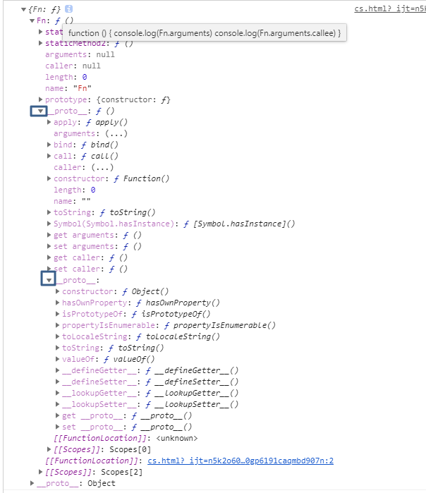

# 所有属性(真实数据结构) in

```js
  const Fn = function () {
    console.log(Fn.arguments)
    console.log(Fn.arguments.callee)
  }
  Fn.staticMethod1 = function () {
  }
  Fn.staticMethod2 = function () {
  }
  console.log({Fn})
```





##### Function.protype

```javascript
  //1.原型属性Function.prototype---------------
   console.log({'Function.protype': Object.getPrototypeOf(fn)})
  /*{ 
    apply: ? apply()
    arguments: (...)
    bind: ? bind()
    call: ? call()
    caller: (...)
    constructor: ? Function()
    length: 0
    name: ""
    toString: ? toString()
    Symbol(Symbol.hasInstance): ? [Symbol.hasInstance]()
    get arguments: ? ()
    set arguments: ? ()
    get caller: ? ()
    set caller: ? ()
    }*/

```

##### OwnProperty

```js
  //2.Own属性,Function构造生成---------------------    
    console.log(Object.getOwnPropertyNames(Fn))//(6)["length", "name", "arguments", "caller", "prototype","staticMethod1","staticMethod2"]


```

##### keys

```js
    //3.可枚举属性:静态变量,静态方法--------------------
     console.log(Object.keys(Fn)) //[staticMethod1,staticMethod2]

     //for..in还能枚举出 

    for (item in f) {
        console.log(item) //staticMethod1,staticMethod2

    }
```


#  
