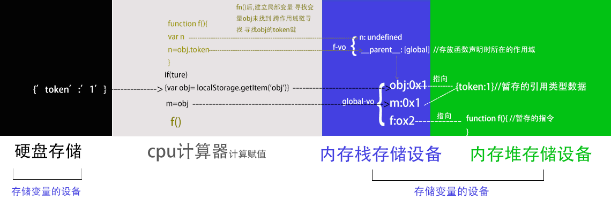
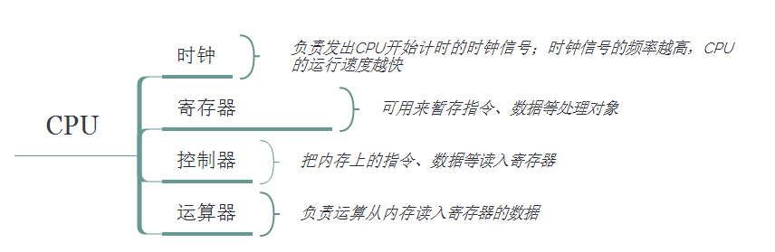
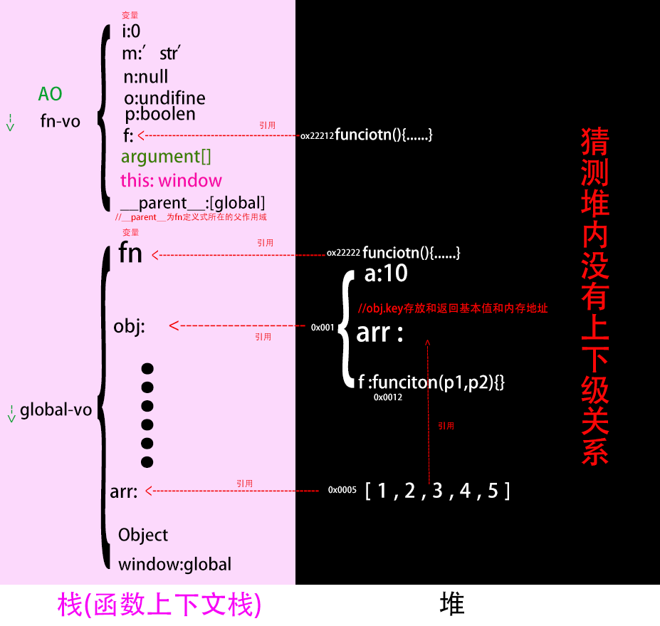
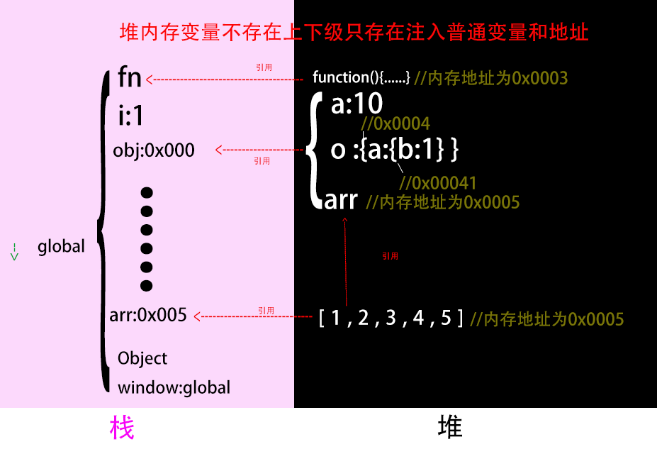
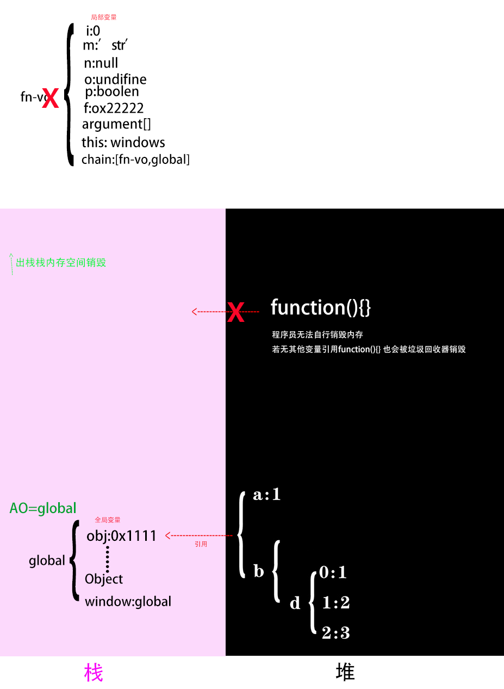
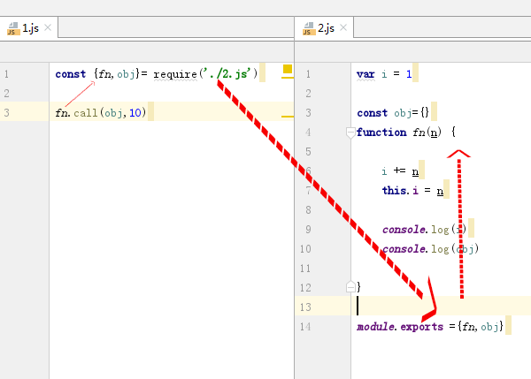
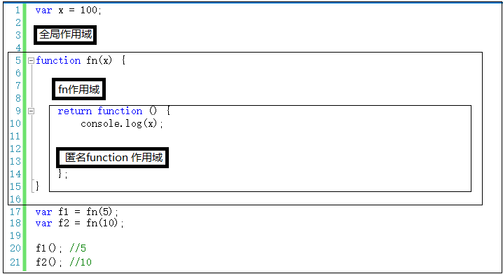
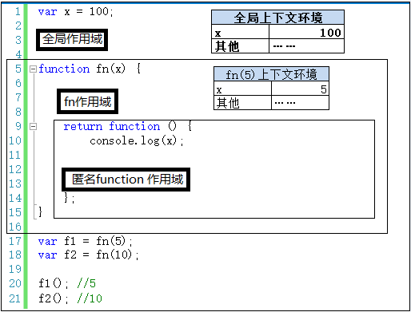

# 硬件和程序

变量对象赋值修正  指令和变量对象读入到cpu





# 内存堆栈

### 栈

##### 存放普通类型和内存地址

普通类型和内存地址

##### 结构

* 一种后进先出的的数据结构,
* 数据大小确定，内存空间大小系统分配和回收(垃圾回收器)。


##### 存放内容

- 函数上下文栈存放{变量对象},
- {变量对象}存放变量,
- 变量里存放:
   - 表达式返回基本类型的值
- 表达式返回引用类型的值的地址
    
 <center><small> 堆,栈,VO(变量对象),AO(活动对象),变量,基本类型值,引用类型值关系图</small></center>
### 堆

##### 存放引用类型数据

存放引用类型的数据类型(键值对)

#####  结构

* 堆可以任意放置的
* 对象和对象之间没有从属关系,每个对象类型都是并排放置的
* 任何对象都可以通过地址访问,推测所谓的内存地址是内存的 **首地址** 

```javascript
   //{c: 3}有自己的内存地址0x12122
   const obj1 = {a: 1, b: {c: 3}}
   const obj2=obj1.b //得到{c: 3}的内存地址
   obj2.c=4
   console.log(obj1)  //{a: 1, b: {c: 4}}
   
```

   


# 函数上下文栈和变量

### 这是一个实例,下边是对实例的分析

```javascript
  
      let g1 = 1//不会注入到global-vo,存放在在一个叫Script的作用域里,
      var store = {a: 10} //store全局变量,为方便this.store调用注入到对象中
      function g_fn(p1, p2) {//g_obj.g_fn(1, 2)后fn-vo进栈
  
          console.log(fn)//function(){console.log(this)}, 提前进栈准备并赋值
          //console.log(a)// &报错 let未提前进栈准备
          console.log(b) //&undefined ,提前进栈准备没赋值
  
  
          //1,跨作用域链寻找,模仿栈内寻找变量对象-----------------------------
          console.log(g1)
          // 2.变量声明,也可以提供给下级的作用域使用---------------------------
          
          function fn() {   console.log(this)}// 1.提前进栈准备声明变量 2.覆盖同名变量3.赋值
          let a = 1  //let不会提前进栈准备
          var b=a   //1.上下文准备阶段赋值undifine,计算时间赋值a的值1
          var fn2 = function () { //var变量只提前进栈准备
                        console.log(this)
                    }
                   
          var i = this.store.a  // 先计算再赋值修正fn-vo的键值
  
          var obj1 = {}
          var obj2=obj1//赋值内存地址
  
     
          //3  参数,还可以给下级作用域使用---------------------------
          console.log(p1,p2) //1.提前进栈准备,2.赋值
          console.log(arguments)
  
          //4.this被赋值---------------------------------
          console.log(this)
          
         //注入到global
          g2 = 10    //省去了global,注入到了window里
          g3 = fn    //省去了global,注入到了window里,fn会销毁,fn对应地址的函数对象不会销毁
  
  
      }
      var g_arr=[1,2,3,4,5]
      const g_obj = {store, g_fn,g_arr}//注入了global-vo,window ,
      g_obj.g_fn(1, 2)
  
      console.log(g2)// 10,因为注入到了global,global是全局的永远不出栈
      g3()// 对内存中的地址未销毁,window.m===#0x00001

```

### global-vo进入内存里的函数上下文栈,程序初始化

##### 浏览器中lobal引用了window对象

window.g1 = = = global.window.g1 = = =global.g1

global是js的原生变量对象,但是window不是原生的而是bom(浏览器的窗口对象),


```javascript
 global={  
 /*----------所有global变量不销毁都提供给下级的作用域,所以全局变量比较消耗内存----*/   
 //系统变量   
    Math:<...>,
   String:<...>,
    ....
    ....
 // 用户全局变量
      *g1:1,   //let变量,这个不会出现的因为g1没注入到global
    store:oxxxx1,
    g_fn:0xxxxxx2
    g_arr:0x0005
    g_obj:0xxxxxx1
     
//this指针 
     this:window
     
//windows和global的关系   
    window:global
     
 };   
```

##### 小程序没有window 有js原生的global

##### node没有window 有global
##### global访问一般省去global

```js
function(){

console.log(event)
i=1

}

```

### fn-vo进入内存里的函数上下文内存栈

> 函数调用变量才会进栈,建立函数上下文栈
>
> 变量Fn/new Funciton()/function fn(){}和()表达式计算


#####  fn(),函数运行准备阶段,栈内存的fn-vo里的变量

```javascript
//变量对象vo 活动对象AO
AO=fn_vo= {

    //---------------------作用域内变量的种类----------------------

//1.自由变量,这里也是局部变量- 给下级作用域提供作用于链
fn:0x000001, // Ⅰ .开辟堆内存空间0x000001 赋值给fn,Ⅱ.如果此时有同名的变量fn 函数fn先初始化,程序会优先访问0x000001

* a:undefine //let变量 这个是不会出现的 因为let不会提前进栈准备
b:undefine, //var变量会提前进栈设置undefined


i:undefine,

obj1:undefine,
obj2:undefine,


fn2:undefine,//var生命函数,此阶段不会赋值

//2.参数变量--给下级作用域提供作用于链
arguments:{
0:1,1:2,length:2
},
p1:1,
p2:2,

//3.this变量-不能给下级提供作用于链,下级是箭头函数就可以提供
  this:obj,

//4. 从父级的作用域的自由变量
chain:[global] // foo._parent_===global,为取得父作用域的自由变量的值,先寻找父作用域,父作用域为当前函数声明时候所在的作用域,因为声明时候的作用域是不变的,所以函数作用域是是静态的
}


```
global-vo

```javascript
global:{
    //.....
}
```


##### fn() ,函数运行阶段 栈内存的fn-vo里的变量


```javascript

AO=fn_VO= {
//1.自由变量----------------------------------
fn:ox000003 ,
a:1 ,//let变量代码运行的此处a才被声明,然后赋值
b:1, //var变量赋值

    
i:2,  //obj.a,首先作用域链搜索obj,先让obj和'a'经过cpu计算得到值2,然后2赋值给

obj1: #0x000000, //开辟堆内存空间{}复制地址#0x000002给o
obj2: #0x000000, //和m指向同一地址

fn2:0x000002,
//cpu计算时间访问作用域链寻找g1的值
    
//2.参数变量    
arguments:{
0:1,1:2,length:2
},
p1:1,
p2:2,
//3.this变量    
this:obj,
//4.父级的作用域的自由变量
chain:[global]

}

```

```js

window={
...
...
g2:10, //赋值语句更改global键值
g3:ox0000001 //赋值语句更改global键值
}
```

示意图


### fn-vo出栈 变量销毁与js垃圾回收器 



##### 局部变量 

函数(栈stack)进栈后,编译器为局部变量分配的栈内存空间,函数出栈后变量销毁,释放内存空间，堆中的对象没有栈变量引用也会销毁

##### global变量:

global变量在程序进入global上下文栈建立栈内存空间,一直存在,不存在出栈,所以global变量不会释放,所以一般不要建立global变量；

```javascript
AO=global={
...
...
g2:10, //赋值语句更改global键值 
g3:ox0000001 //赋值语句更改global键值
}

```

### 在函数作用域里直接模拟入栈分析代码


# 作用域和变量

> (全局作用域也是函数作用域的一种)

### 变量类型

###### 基本变量

`undefined,boolen ,number string null`

###### 引用变量

```
array
object
function
/reg/
其他自定义的键值对
```

### 变量种类

1. 自由参数: 内部变量临时状态
2. 参数 :函数的数据入口
3. this :取其他对象的值
4. return :函数的数据出口

### 不同种类的变量声明

##### 自由变量

6种方式声明

```javascript
let i=1
const i=2
var i=3
function fn(){}
class
import a from './export' //import引入局部作用域的变量做全局变量
let {a,b}={a:1}  //解构赋值
```

##### 参数

不需要声明

##### this

不需要声明

### 变量的赋值

##### 自由变量

1. 表达式返回普通类型,赋值给变量

```javascript
var i=10+'abc';

/*
var 关键字
i标识符
var i 声明变量
10+'abc' 直面量进行计算
= 赋值运算符
i=10+1; 赋值语句
i=20; 第二个赋值语句
var i=10+1 声明+赋值语句

*/
```

2.  表达式返回引用类型,赋值给变量

字面量表达式,地址赋值给变量

```javascript
var i={a:1}

var i=function(){}

var i=[1,2,3]
```

对象创建表达式,地址赋值给变量

```
var obj={a:1}

var arr=[1,2,3]

```

对象访问表达式,返回值赋值给变量

```
var obj={a:1,b:{}}
const i=obj.a  //计算得出基本值,然后赋值
const i=obj.b  //计算得到地址然后赋值
```

函数表达式赋值给变量

```
var fn //1.声明变量

fn=function(){} //定义函数, 给变量fn赋值 1位置的变量fn发生变化
```

```
    var i = 1
    var fn = //2函数地址复制给fn
        function () {//1函数定义,作用域在函数定义时就已经确定了
        console.log(i)
    }
    const fn2 = function () {
        var i = 2
        var f = fn //3 fn存的地址复制给f,变量声明和变量赋值操作,并没有重新定义函数
        f()
    }
    fn2()

```

import把引用类型赋值给变量

```js
//export
export.default={a:1}
```

```js
//import
import obj from'./export.js'
obj.b=2
console.log(obj)//{a:1,b:2}
```

##### 参数类型变量

1. 实参赋值给形参,和形参顺序顺序有关和形参的标识符是什么无关

```html
<script>

  function fn(x, y) { 
  console.log(x,y)
  }


  const name = '石磊',
        age = 18
  fn(name, age)
</script>

```

实参包装成arguments, 

```html
<script>

  function fn() { //实参赋值给形参 只和顺序有关和自定义参数名无关
    console.log(arguments[0],arguments[1])
  }


  const name = '石磊',
        age = 18
  fn(name, age)
</script>
```

参数可以设置默认值

```javascript
  
        function f(a=10) {
            console.log(a, b) //10 ,undefine
            console.log(arguments)//[10 ,undefine]
        }

        f()
   
```

2. 读取和对象类型的参数

```js
const ctx={a:1}

function f(ctx) {
    ctx.b=2
}
f(ctx)


```

##### this变量

在上下文准备时间被赋值

1. this在浏览器中默认值window,严格模式默认undefined,文件作用域用的严格模式

```html
   <!-- 1.html -->
   <script>
     console.log(this)// windows
   
   </script>
   
```

​     函数里嵌套的函数,无法给this赋值,默认分配windows,但是f没有注入window,是局部变量

```js
   //1.js
   console.log(this) //undefined
   
   const obj = {
     fn() {
       function f() {
   
         console.log(this) //undefined
       }
   
       f()
     }
   }
   
   obj.fn()
   
```

2. obj调用

```javascript
obj={fn:function(){this.i}}

obj.fn--------> this===obj

```

```javascript
obj={i:1,fn (n){console.log(n,this)}}

obj.fn(1) //obj fn () 1 四个计算函数运行,并赋值this=obj

const f=obj.fn //obj,fn 计算得到f的内存地址

f()//window.f() 1 计算函数运行 this=window

```

```javascript
//静态函数调用也是如此
    function Person(name, surname) {
      
    
    }


    Person.fn = function () {
      //对象调用函数
        console.log(this) //Person
    }


    //對象調用fn
    Person.fn()

```

```js
  const obj = {}

  function fn() {
    this.a = 1
  }

  function f() {
    this.fn = fn
    this.fn()
  }

  f.call(obj)

  console.log(obj)
```

```html
<!-- #1-->
<!--1.html -->
<body>
<meta charset="UTF-8">
<script src="https://cdn.bootcss.com/vue/2.5.17-beta.0/vue.js"></script>
<link href="https://cdn.bootcss.com/animate.css/3.7.0/animate.css" rel="stylesheet">


<script type="module">
  import config from './1.js';

  const vm = new Vue(config)
  vm.fn()
  vm.fn2()
</script>

```

```js
<!-- #2 -->
//1.js
console.log(this)// 未赋值默认为undifined

export default {
  data() {
    return {msg: 'msg'}
  },
  methods: {
    fn() {
      console.log(this) //vm
    },
    fn2: () => {
      console.log(this) //继承上级函数作用域的undifined
    }
  }

}

```

2. call apply指定this运行

```javascript
obj={}
function fn(){
console.log(this)
}

fn.call(obj,arguments)

```

```javascript
    const arr = [10, 2, 3]
    const i = arr.sort((a, b) => a - b)//arr调用sort,this===arr; 回调参数做参数
    //下边的和上边的等价
    const m = Array.prototype.sort.call(arr, (a, b) => a - b)//call(arr ),this===arr;回调参数做参数
```

3. new 的原理就是 Fn.call(new Object(  ))

```javascript
function Fn(){
this.i=1
this.m=2
console.log(this)
}
const p=new Fn()

```

4. prototype的this也是实例化对象本身

```javascript
obj.__proto__=Fn.prototype

```

5. 箭头函数里this变量:

箭头函数内部this不能被赋值,只能继承其父函数的this,类似作用域链

作用:为了方便使用上级函数的this才引入的

```js
  const obj = {
    a: 1,
    fn: () => {
      console.log(this) //windows
    }
  }
  const obj2 = {}

  obj.fn.call(obj2)

```

```javascript
  var i = 1

  const config = {

    template: `
    <div>
    <button @click="fn">fn</button>
     <button @click="fn2">fn2</button>

</div>
    `,
    methods: {
      fn() {
        console.log(this)
      },
      fn2: () => {
        console.log(this.i) //this===windows,i=1
      }

    }
  }

  new Vue(config).$mount('#app')
```

6. fn（this）不算method函数作用域 是操作符

```javascript
   var a=1
    function fn(i) {
        var a=2
        console.log(i)
    }
    fn(this.a)//此处this为window,()并非是函数内部不会间隔作用域
```


### 未赋值的变量===undifined

##### 自由变量

未赋值的变量为undifined

```
let i //i=undefined
```

##### 参数

函数参数也是变量的一种,没赋值的形参默认也是undefined

```js
function f(i){
console.log(i)
}
f(i)
```

构造函数也是函数的一种 ,没赋值的形参默认也是undefined

```js
function Person(){}

Person( )
```

const obj={}(构造函数this语法糖), 没赋值的形参默认也是undefined

```javascript
   let obj = {}//要先定义obj

    console.log(obj.a)
    console.log(obj.b)
    console.log(obj.c)

```

Array=[] {构造函数语法糖}声明数组变量arr 才能用arr[0],没赋值默认都是undefine

```javascript
  let arr=[]
  console.log( arr[0],arr[1])


let [a,b]=[1]

//b=== undefine
```

vue组件本质也是构造函数

```html
<mybutton type=""></mybutton>

<!-- 
构造函数调用new button(),实参传值给形参未赋值的形参为undefine 
-->
```

##### 严格模式下的this的值默认undefine

```js
  "use strict"
  function fn() {
    console.log(this) //undefine
  }

  fn()
```

### 3种变量的作用域链

数据向下级作用域传递数据的机制

可使用fn-vo.__ parent__的变量(函数定义式所在的父作用域里的变量)

##### 自由变量 

##### 参数 

##### this(仅限于箭头函数作用域里)

```javascript
   function outer(i) {
        const inner = () => console.log(this, i) //{},1
        inner()
    }

    const obj = {}
    outer.call(obj, 1)
```

### 局部作用域内的变量赋值到到全局

1. 函数返回值-闭包
2. import

### 变量的复制操作

在变量对象内部进行


### 函数作用域隔离变量

同名变量就近原则

### js函数的静态作用域

##### 原因

为了在当前函数作用域取得父作用域的自由变量的值,先寻找父作用域,父作用域为当前函数声明时候所在的作用域,因为声明时的作用域是不变的,所以函数作用域也是静态的

*1. 按照函数定义式分析代码:*


2. 对象内声明的函数一样,寻找作用于链,就是需要父作用域,就是寻找本函数声明的作用域


3. 不管是引入赋值再运行,module,回调函数,都是如此



# 函数作用域和上下文栈区别

本系列用了大量的篇幅讲解了上下文环境和作用域，有些人反映这两个是一回儿事。本文就用一个小例子来说明一下，作用域和上下文环境绝对不是一回事儿。

再说明之前，咱们先用简单的语言来概括一下这两个的区别。

**00 上下文环境：**

可以理解为一个看不见摸不着的对象（有若干个属性），虽然看不见摸不着，但确实实实在在存在的，因为所有的变量都在里面存储着，要不然咱们定义的变量在哪里存？

另外，对于函数来说，上下文环境是在调用时创建的，这个很好理解。拿参数做例子，你不调用函数，我哪儿知道你要给我传什么参数？

**01 作用域：**

首先，它很抽象。第二，记住一句话：除了全局作用域，只有函数才能创建作用域。创建一个函数就创建了一个作用域，无论你调用不调用，函数只要创建了，它就有独立的作用域，就有自己的一个“地盘”。

**02 两者：**

一个作用域下可能包含若干个上下文环境。有可能从来没有过上下文环境（函数从来就没有被调用过）；有可能有过，现在函数被调用完毕后，上下文环境被销毁了；有可能同时存在一个或多个（闭包）。

 

上面的文字不理解没关系，且看下面的例子。

第一，除了全局作用域外，每个函数都要创建一个作用域。作用域之间的变量是相互独立的。因此，全局作用域中的x和fn作用域中的x，两者毫无关系，互不影响，和平相处。



 

第二，程序执行之前，会生成全局上下文环境，并在程序执行时，对其中的变量赋值。


 

第三，程序执行到第17行，调用fn(5)，会产生fn(5)的上下文环境，并压栈，并设置为活动状态。


 

第四，执行完第17行，fn(5)的返回值赋值给了f1。此时执行上下文环境又重新回到全局，但是fn(5)的上下文环境不能就此销毁，因为其中有闭包的引用（可翻看前面文章，此处不再赘述）。



 

第五，继续执行第18行，再次调用fn函数——fn(10)。产生fn(5)的上下文环境，并压栈，并设置为活动状态。但是此时fn(5)的上下文环境还在内存中——一个作用域下同时存在两个上下文环境。

