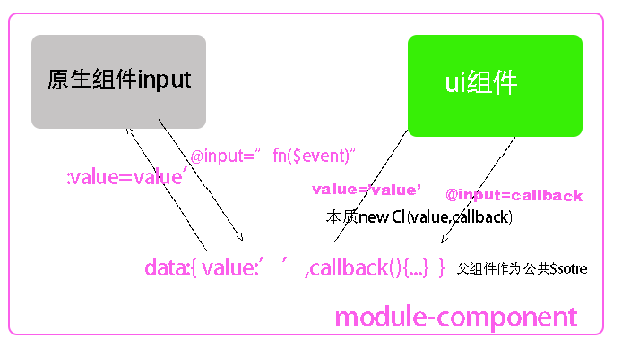
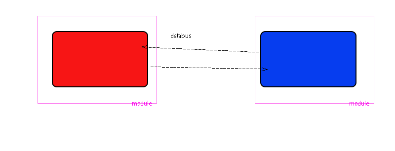

# 作用域

|                                    | 块作用域             | 函数作用域(global也算函数作用域)          | 文件作用域                                |
| ---------------------------------- | -------------------- | ----------------------------------------- | ----------------------------------------- |
| 隔离变量类型                       | const let            | const let var                             | const let var                             |
|                                    |                      |                                           |                                           |
| 作用域内声明自由变量               | √                    | √                                         | √                                         |
| 传入参数变量(函数作用域入口)       | x                    | √                                         | √                                         |
| 传入this变量(引用其他的对象的类型) | 继承函数作用域的this | 箭头函数继承this,<br />普通函数如传入this | 箭头函数继承this,<br />普通函数如传入this |
| 作用域链继承上面三个               | √                    | √                                         | √                                         |
|                                    |                      |                                           |                                           |
| 暴漏                               | x                    | return  (包括闭包)                        | exprort{ }                                |
| 全局变量的方式引入                 |                      | const i=fn()                              | import obj from './export'                |
| 暴漏赋值的同时执行代码             | 直接执行代码         | √                                         | √                                         |

### vue组件的本质是import也许是构造函数待定

|                | js import                               | vue ,import 父组件,父子通信              |
| -------------- | --------------------------------------- | ---------------------------------------- |
| 引入基本类型值 | 在export方作用域修改,import方会跟随改变 | 在父组件修改,子组件会跟随改变,单向数据流 |
| 引入引用类型   | 在import方可以修改                      | 在子组件可以直接修改                     |


# 暴漏通信

### 以作用域链通信(一般是全局变量)

> 本质: 
>
> * 把自由变量和
>
> * this作为实例的某个属性,在构造函数里调用

###### 1. global.xxx

向下级函数作用域通信

```js
var i=1 ; global.i=1 
window.session
window.cookie
window.history
```

###### 2.声明全局变量但不注入global节省内存

import声明全局作用域变量 不注入global,估计为了节省内存

```js
//export.js

export let i = 1
//在自己的文件作用域运行 修改自由变量
export function fn(n) {
    i = n * 2
    console.log(i)
}
console.log(123)
```

```js
//import.js
//import声明全局变量,还执行export.js文件作用域里的代码
import {i, fn} from './export'

    fn(10)

```

const let 声明全局变量不注入global,估计为了节省内存

```
const i=1
```

###### 3.把const import声明的全局变量批量注入到每个对象的key里,通过`this`调用

```js
improt store from ‘./export’

const obj1={
      function fn(){ this.store},
     store
}

```

### 靠回调函数参数通信

本质就是函数参数变量赋值

参数的函数的入口

return是函数的出口

实参赋值给形参变量,默认形参undifine		

# 应用:vue通信

| __本质__     | this.key做全局变量 | 回调函数     | global.route变量做全局变量 | $store变量做全局变量 |
| ------------ | ------------------ | ------------ | -------------------------- | -------------------- |
| __使用场景__ | 适合组件内部通信用 | 适合父子通信 | 适合页面间较少的数据       | 适合页面间较多的数据 |

### 组件内通信 this全局变量

```js
data(){
return{value:''}
}
```


### 组件文件间通信

#####  同父的组件(包括原生组件) 本质是回调函数 




##### 跨父子通信(this.$store=new Vuex())本质是全局变量通信-import

###### 1. 通过vuex通信,$store的地址注入到每个组件里, 组件通过this.$store通信   , vue监听$store变化,{{$store.state.xxx}}更新到视图


```js
   let store = {
        state: undefined,
        setState(i) {
            this.state = i
        }
    }

    class Vm {
        constructor(a, b) {
            this.a = a;
            this.b = b;
            this.$store = store
        }
    }

    let vm = new Vm(1, 2)
    vm.$store.setState(3)

    let vm2 = new Vm(10, 20)
    vm2.$store.setState(30)

```

###### 2. databus通信(本质估计是回调函数)


```js
  Vue.prototype.$eventBus = new Vue() //$eventBus在一个组件

  Vue.component('cl1', {
    data() {
      return {value: ''}
    },
    template: `<ul><li v-for="item in 10" @click="$eventBus.$emit('sent',item)">{{item}}</li></ul>`

  })
  Vue.component('cl2', {
    data() {
      return {value: ''}
    },
    template: `<div>{{value}}</div>`,
    mounted() {

      this.$eventBus.$on('sent', res => {
        this.value = res
      })
    }

  })

  const vm = new Vue({
    el: '#app',


  })

```

###### 3. 跨路由通信(通过浏览器history栈通信,本质是global变量)


