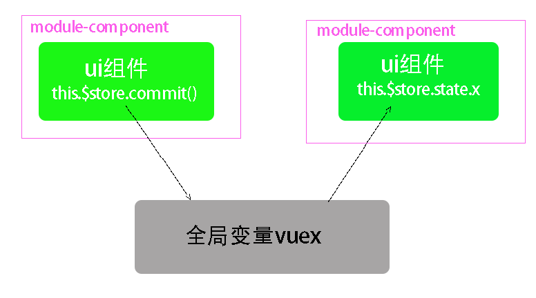

# 作用域

|                                | 块作用域     | 函数作用域(global也算函数作用域) | 文件作用域                 |
| ------------------------------ | ------------ | -------------------------------- | -------------------------- |
| 隔离变量类型                   | const let    | const let var                    | const let var              |
| 改变自己作用域里的自由变量     | √            | √                                | √                          |
| 通过作用于链改变父级的自由变量 | √            | √                                | x                          |
| 传入参数变量                   | x            | √                                | √                          |
| 传入this变量                   |              | √                                | √                          |
| 暴露                           | x            | return  (包括闭包)               | exprort{ }                 |
| 暴漏变量赋值给全局变量         |              | const i=fn()                     | import obj from './export' |
| 暴漏赋值的同时执行代码         | 直接执行代码 | √                                | √                          |


# 暴漏通信

### 自由变量向下级块作用域通信

```js
    //global作用域暴漏---------------------
    let i = 1

    function fn(n) {
        console.log(n)
    }

   
    {
         //下级块作用域----------------------
        i = 10
        fn(i + 10)

    }
```


#### 通过全局自由变量向下级作用域通信通信

##### 1. global.i

向下级函数作用域通信

```js
var i=1 ; global.i=1 
window.session
window.cookie
window.history
```

##### 2.声明全局变量但不注入global节省内存

###### import声明全局作用域变量 不注入global,估计为了节省内存

```js
//export.js

export let i = 1
//在自己的文件作用域运行 修改自由变量
export function fn(n) {
    i = n * 2
    console.log(i)
}
console.log(123)
```

```js
//import.js
//import声明全局变量,还执行export.js文件作用域里的代码
import {i, fn} from './export'

    fn(10)

```

###### const let 声明全局变量不注入global,估计为了节省内存

```
const i=1
```

##### 3.把const import声明的全局变量再注入到每个对象的key里,方便使用

```js
improt store from ‘./export’

const obj1={
      function fn(){ this.store},
     store
}

```


### 靠回调函数通信

形参变量,默认形参undifine


### this变量通信

​			


# 应用:vue通信

### 组件内通信 this值

```js
data(){
return{value:''}
}
```


### 组件文件间通信

#####  同父的组件(包括原生组件) 


##### 跨父子通信(this.$store=new Vuex())本质是全局变量通信

###### 1. 通过公共的爷爷通信(传值传参)

###### 2. 通过vuex通信,$store 注入到每个组件里,vue监听Store更新到视图



```
   let store = {
        state: undefined,
        setState(i) {
            this.state = i
        }
    }

    class Vm {
        constructor(a, b) {
            this.a = a;
            this.b = b;
            this.$store = store
        }
    }

    let vm = new Vm(1, 2)
    vm.$store.setState(3)

    let vm2 = new Vm(10, 20)
    vm2.$store.setState(30)

```

###### 3. databus通信(本质是回调)


###### 跨路由通信(通过浏览器history栈通信)

| 路由跳转效果                            | fancybox效果和tab效果                                   |
| --------------------------------------- | ------------------------------------------------------- |
| 跳转页面                                | show=true                                               |
| 使用传送端组件的数据,本质是全局变量通信 | 使用父组件的数据,本质是函数参数通信 new Cl(value,input) |
|                                         |                                                         |


