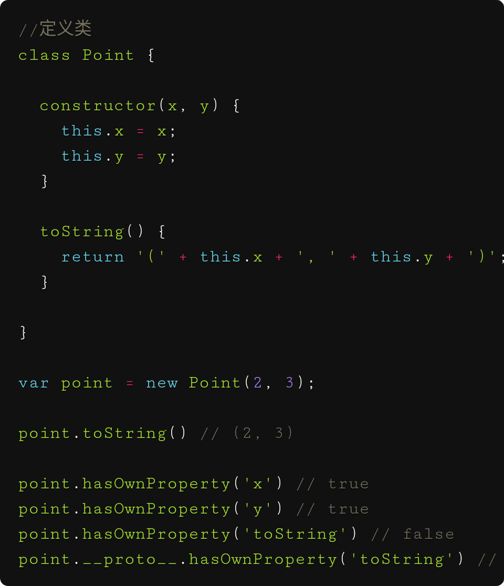

>prototype:[英:原型]

>property:[英:属性]

--------------------

# 类是概念

类:一类事物,比如数字类 , 字符串类, 对象类->数组类,动物类 ->狗类

类的本质是创造一类的若干对象的构造函数,类是构造函数的语法糖

```
 Class={
    staticFn:()=>{...}
    protorype:{
               instaceFn(){}
               }


   }

Class.staticFn:()

Class.protorype.instaceFn()
```

# 类的三要素
### 1.   封装,函数封装, 私有变量不允许实例化对象访问,静态函数不允许子类继承
### 2.   继承和extend,本质修改代码,对原始的蓝图进行修改,产生新型号汽车的蓝图,用于生成新的汽车

```javascript
class StangtanaCar1000{
//一些代码
}

class StangtanaCar2000 extends StangtanaCar1000{
   //另外一些代码
    
}

```
### 3.多态

一个函数适用不同的类 

因为js是动态语言,js天生多态

静态语言的函数规定的有参数类型,只有响应的参数类型才可以用此函数

# 类似的实例化

### 本质是copy代码

 像某个型号汽车建设蓝图,生产这个型号的汽车 const car1=new SangtanaCar001()

### js类生成实例化对象也可以扩展

因为js是一种动态语言


# 构造函数未传参的参数和普通函数一样默认undefine

vue对象的默认属性的值undefined构造函数调用new button(),实参传值给形参未赋值的形参为undefine


 

# js内置构造类
##### Object

js以不用类是通过Object实例化无限扩展比如{I:1 fn }

##### Array


