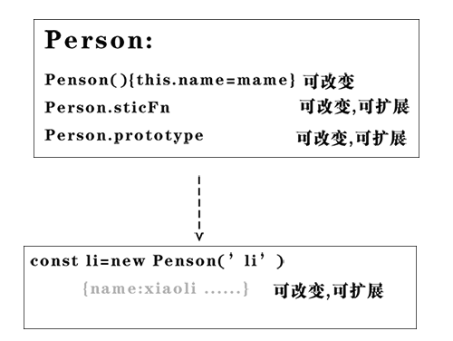
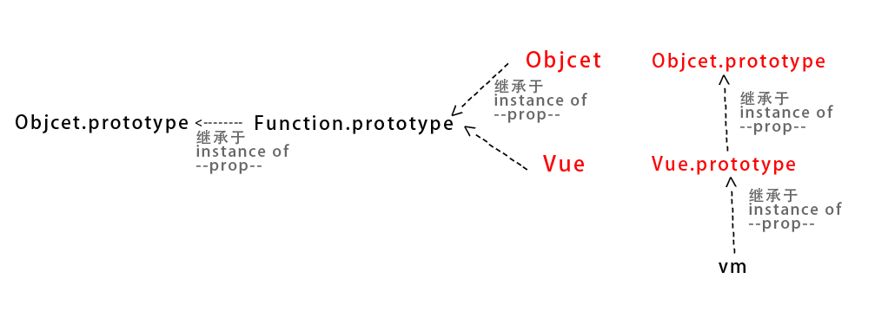
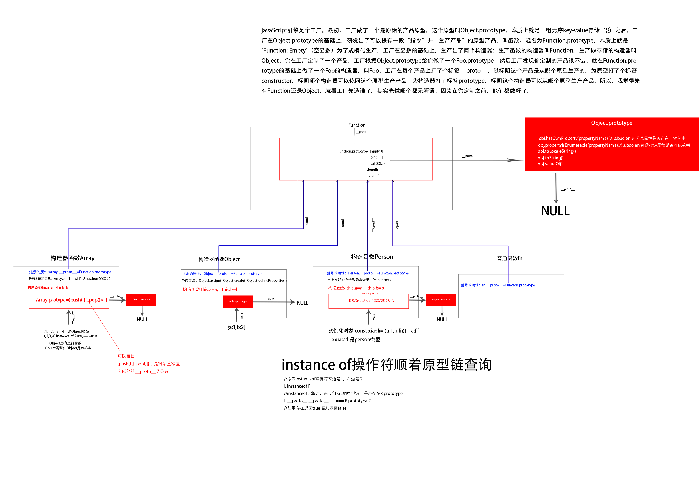

# 类-类型-实例


类:同类型 同class -> 定义构造函数Person

实例化对象: const xiaoli=new Person()

实例化对象属于类型: xiaoli是Person类型的

# 原型构造

### 作用

用函数生成键值对

### js弱类型 键值对一切可变



### 继承于原型prototype ,并非被继承于构造函数



```
例如 vm=new Vue({})

vm 继承于Vue.prototype(这是一个对象),Vue只是一个辅助构造函数,携带了静态函数和静态属性

Vue.prototype是一个对象继承于Object.prototype,Object只是一个辅助构造函数

这些辅助构造函数Object,Vue继承于 Function.prototype,Function.prototype继承于Object.prototype

```

### 继承关系




# 函数和对象的关系

>Object Array等构造器是函数,函数创造对象
fn instaceof Objcet===true,所以函数实例fn是对象

### 函数辅助构造对象

##### {a:1,b:2}

{a:1,b:2}等价于new object({a:1,b:2}) ,建立对象没有Fn构造函数的辅助


##### new Fn(i,m)

new Fn(i,m)等价于Fn(i,m).call(new Objcet())

有构造函数辅助生成对象

可以设置函数参数

### 函数属于对象类型

```
funcion fn(a,b){

return a+b
}

fn.a=1
fn.b=2

```

```
const fn=new Function('a', 'b', 'return a + b');

```

```
fn instaceof Objcet===true
```
# 静态函数和实例方法

静态函数适合所有实例用的工具函数
```javascript
Dog.Create({id:1})
Dog.find({id:1})
Dog.remove({id:2})
dog.update({id:3})
```


实例方法适合个例用的方法
```javascript

instance.showInfo

```

实例化对象
```javascript
const dog=new Dog({id:5})
```

