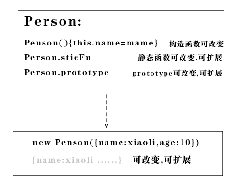
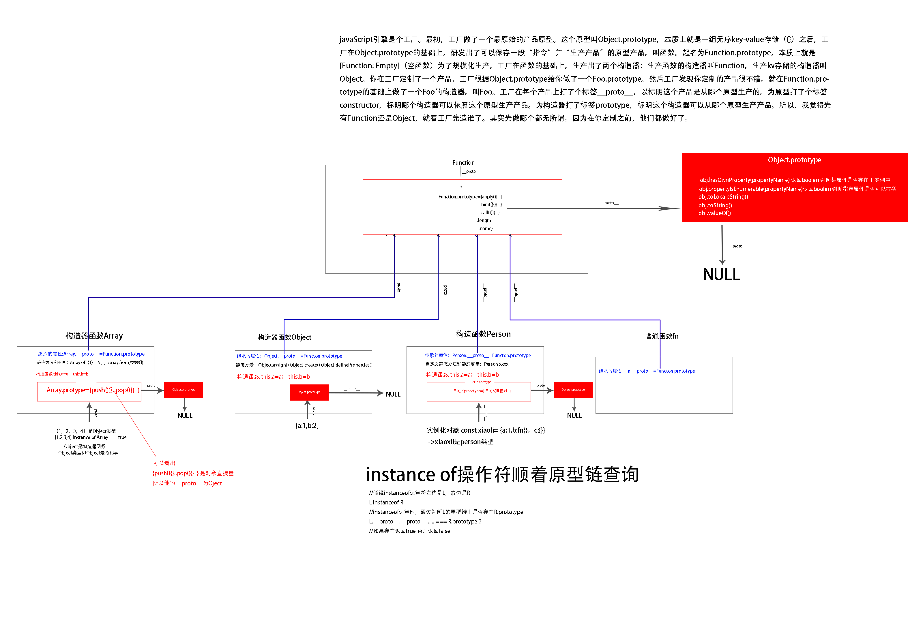

# 类是概念


### 类:同类型 同class 一类事物

* 数字类 
* 字符串类
* 对象类->数组类
* 动物类 ->狗类
```javascript
function Person(){
    this.name=name
    thie.age=age
}
```

### 实例化对象: 

实例化对象属于某一类型,表示此类的某一个单例, xiaoli是Person类型的

```javascript
const xiaoli=new Person()
```


# 类的三要素
### 1.   封装

函数封装, 私有变量不允许实例化对象访问,静态函数不允许子类继承

### 2.   继承和extend

本质修改代码,对原始的蓝图进行修改,产生新型号汽车的蓝图,用于生成新的汽车

```javascript
class StangtanaCar1000{
//一些代码
}

class StangtanaCar2000 extends StangtanaCar1000{
   //另外一些代码
    
}

```
### 3.多态

##### 动态语言和静态语言


静态语言:
的函数规定的有参数类型,需要验证类型才能使用函数

js是动态语言:
不用检查函数的参数类型,在计算时间才确定变量类型,天生就是多态

 构造函数的键值对一切可变




##### 定义

一个函数适用于不同类型的对象， 一种解耦机制,将是什么和做什么分开:

java是:
```                 
是什么:类(实例方法写在两个到多个类中)
           
做什么:函数(调用方法写在超类中)
``` 
js是:    

```
像什么:对象(实例方法写在两个多个类中)
做什么:函数(调用方法写在任何地方)

```


##### js语言最直观的本事就是多态

```javascript

var  a  =  5;
console.log(a);
 
a="str";
 
console.log(a)
```

##### 多态实例1 

一个函数适用于一个对象

```javascript

    var googleMap = {
        show: function () {
            console.log('开始渲染谷歌地图');
        }
    };
    var renderMap = function () {
        googleMap.show();
    };
    renderMap(); // 输出：开始渲染谷歌地图

```
一个函数适用于不同的对象
```javascript
var googleMap = {
    show: function(){
        console.log( '开始渲染谷歌地图' );
    }
};
var baiduMap = {
    show: function(){
        console.log( '开始渲染百度地图' );
    }
};
var renderMap = function( type ){
    if ( type === 'google' ){
        googleMap.show();
    }else if ( type === 'baidu' ){
        baiduMap.show();
    }
};
renderMap( 'google' ); // 输出：开始渲染谷歌地图
renderMap( 'baidu' ); // 输出：开始渲染百度地图


//添加新实例
   var sosoMap = {
        show: function () {
            console.log('开始渲染搜搜地图');
        }
    };
    renderMap(sosoMap);
```

拓展版

```javascript

var googleMap = {
    show: function(){
        console.log( '开始渲染谷歌地图' );
    }
};
var baiduMap = {
    show: function(){
        console.log( '开始渲染百度地图' );
    }
};

var renderMap = function( map ){
if ( map.show instanceof Function ){
map.show();
}
};
renderMap( 'google' ); // 输出：开始渲染谷歌地图
renderMap( 'baidu' ); // 输出：开始渲染百度地图

```

##### 多态实例2

```javascript


//超类
function Animal(sound) {
    this.duckSinging = function () {
        console.log(sound);
    }
}

//两个实例化对象
var duck = new Animal('嘎嘎嘎')
var chicken = new Animal('嘎嘎嘎')


var choir = []; // 合唱团

//一个函数适合不同类
var joinChoir = function (animal) {//检查动物类型java静态类型是这样做的
    if (animal && typeof animal.duckSinging === 'function') {
        choir.push(animal);
        console.log('恭喜加入合唱团');
        console.log('合唱团已有成员数量:' + choir.length);
    }
};

joinChoir(duck); // 恭喜加入合唱团
joinChoir(chicken); // 恭喜加入合唱团
```

# 类的实例化

### 生成类的实例
 
```javascript
  const car1=new SangtanaCar001()
```


### js类生成实例化对象也可以扩展

因为js是一种动态语言,计算时间才确定类型


# 静态函数和实例方法

静态函数适合所有实例用的工具函数
```javascript
Dog.Create({id:1})
Dog.find({id:1})
Dog.remove({id:2})
dog.update({id:3})
```


# 实例方法适合个例用的方法
```javascript

instance.showInfo

```

实例化对象
```javascript
const dog=new Dog({id:5})
```

# class封装
class的本质是创造一类的若干对象的构造函数,类是构造函数的语法糖

```
 Class={
    staticFn:()=>{...}
    protorype:{
               instaceFn(){}
               }


   }

Class.staticFn:()

Class.protorype.instaceFn()
```
```javascript

 class Point {
        static staticFn() {
            console.log('staticFn')
        }

        constructor(x, y) {
            this.x = x;
            this.y = y;
        }

        get value() {
            console.log('Getting the current value!');
            return this.x;
        }

        toString() {
            return '(' + this.x + ', ' + this.y + ')';
        }
    }

    const point = new Point(1, 2)

    console.log(point)

    class Point_extend extends Point {


        cs() {
            console.log('cs')
        }
    }

    //类能继承静态函数
    Point_extend.staticFn()

    const point_extend = new Point_extend(10, 20)

    console.log(point_extend)

```


# 原型构造


### 构造函数和对象的关系


##### 函数属于对象类型

```
funcion fn(a,b){

return a+b
}

fn.a=1
fn.b=2

```

```
const fn=new Function('a', 'b', 'return a + b');

```

```
fn instaceof Objcet===true
```


##### 函数copy原型对象创造新对象

```javascript
 const obj={a:1,b:2} //等价于new object({a:1,b:2}) //等价于 OBjcet.protype+{a:1,b:2}
```    

```javascript
function fn(m,n){return m+n} //等价于new Function(m,n,'return m+n')
//等价于 Object.protype+Fn.protype+{arguments: null, caller: null,  length: 2 ,  name: "f"}
```
```javascript
function fn(m,n){return m+n}  fn.a=10,fn.b=20
//等价于 Object.protype+Fn.protype+{arguments: null, caller: null,  length: 2 ,  name: "f",a:10,b:20}
```

```javascript
//等价于 Object.prootye+{name:sven}+{a:1}
    var obj = {name: 'sven'};
    const obj2 = Object.create(obj, {
        "a": {value: 1, congigurable: false, enumerable: true, writable: true},
    })
    console.log(obj2)
```

 构造函数未传参的参数和普通函数一样默认undefine

```
例如:
Vue.component('Btn',{}) 
等价于
function Btn(color='red'){
}

构造函数调用new button(),
等价于<btn/>
```


### 原型链


