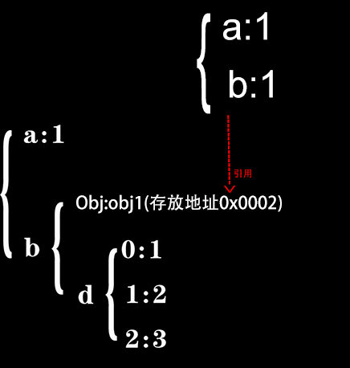
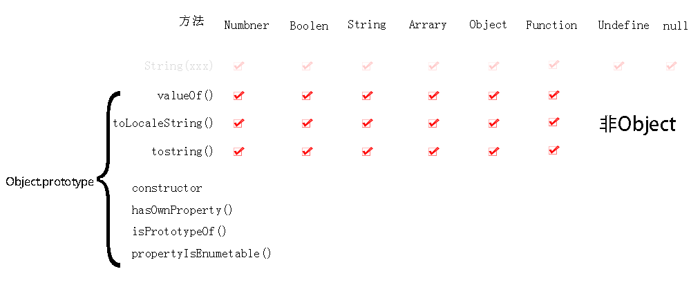
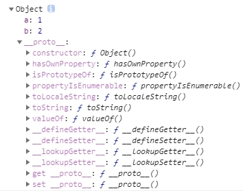
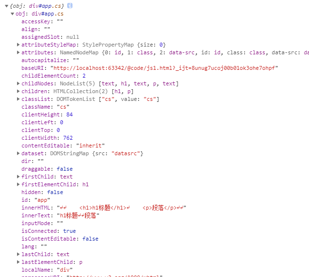

# 创建新对象


### new 操作符
```

    //模拟new new都做了什么
    var obj = new Object();
    obj.__proto__ = Person.prototype;
    var res = Person.call(obj, 'xiaohong', 12)// 改变obj的值

    if (typeof res === Object) {//判断function的返回值 若返回值为对象 person就为这个返回值了 构造函数废了
        person = res
    }
    else { //如果返回值为undefine或者基础变量 构造函数成功
        person = obj

    }


```


### new Fn()

用函数控制生成对象

```
 new Fn() 等价于Fn.call(new Object,1,2,3)
 
new Object({a:1,b:2})

new Array(1,2,3) 

```


### json直面量语法糖

```
{a:1,b:2} [1,2,3]
```


### Object.creat()

```
    var obj = Object.create({})
```


```
    var obj = Object.create({},{
        "a":{value :1,congigurable :false,enumerable :true,writable:true},
        "b":{value :2,congigurable :false,enumerable :true,writable:true},
        "c":{value :3,congigurable :false,enumerable :true,writable:true}
    });

    console.log(obj.a)//输出 1
    console.log(obj.b)//输出 2
    console.log(obj.c)//输出 3

```


#属性


> __所有属性:__  判断:in 列出: obj  

>> __原型属性对象包:__ 判断:Person.prototype.isprototypeof(person),
                列出: Object.getPrototypeOf(obj)

>> __自己的属性:__ 判断:obj.hasOwnProperty(propertyName) 列出:Object.getOwnPropertyNames(obj)

>>> __不可枚举的属性__

>>> __可枚举的属性:__  判断 obj.propertyIsEnumerable(propertyName) 列出:Object.keys(obj), for...in


### 判断某个属性所在范围
##### in操作符 判断是否有此属性
判断对象是否有某属性(返回Boolean) (in操作符是针对key的)

````
'constructor' in {a:1}

'__proto__' in {a:1}

'a'in{a:1}

0 in [1,2] //true

'hasOwnProperty'in{a:1}
````


#####  .hasOwnProperty 
通过构造函数里this.xx创建的键(语法糖{xx:1})+属性定义器定义的键

````
obj.hasOwnProperty(a) 返回boolen 

````

#####  .propertyIsEnumerable 判断对象的某个属性是否可枚举


````
obj.propertyIsEnumerable(propertyName)返回boolen 判断指定属性是否可以枚举
````


----------------
### 列出属性

##### 列出自己的属性 


构造函数this生成的属性+属性定义器对对象的扩展

```
Object.getOwnPropertyNames(obj)//返回数组getOwnPropertyNames末尾带s
```

##### 枚举出可枚举的属性
for循环语句+in操作符 列出可枚举的key,并对其操作 (in操作符是针对key的)

```
	for....in
```

for....of 枚举出可枚举的value,用于可迭代类型(array)

```
	for....of
```

  Object.keys(obj) 列出可枚举的key返回数组

````
    Object.keys(obj)
  
````
Object.values(obj)列出可枚举的value返回数组

```
  Object.values(obj)

```


##### 判断或获得原型对象

###### 判断是否是对象的原型

```
 person instanceof(Person)
```

```

Person.prototype.isprototypeof(person)

```

###### 获得原型对象

````

obj.__proto__

````


````
Object.getPrototypeOf(obj)              //和obj._proto_功能相同

````


# hasOwnProperty属性

### obj.a的本质,赋值和返回值(地址或普通值)

```

obj={}
obj.a=2//赋值普通值
console.log(obj.a)//取得普通值
obj.b={i:1}//赋值地址
console.log(obj.b)//获得地址

```
 obj.a 和obj 无上下级关系 都是平级



```

    obj = {a: {i: 1}}
    const obj2 = obj.a //获得地址
    obj2.i=10
    console.log(obj)//{a: {i: 10}}

```


### 创建 修改Own属性


##### json直面量表示法(键都是json字符串):

```

obj={

        'fn'() {
            console.log('fn')
        },
        '0'(){
            console.log(0)
        }

}
obj[”a”]
obj.a等价于 obj[”a”]
obj[’0’]
obj[0]  等价于 obj[’0’]
const i='color'  obj[i+'primary'],变量做键值
   


```


 数组


```
arry[0]
arry['0']

```

 类数组对象


```
let ArrayLike = { 0 : "a", 1 : "b", 2 : "c" ,length:3};

ArrayLike[2]
ArrayLike['2']
```

 字符串(类数组)

```
let str = 'abc'

str[1]
str['1']
```


##### 先定义obj 才能用obj.a,没赋值默认都是undifine

```
   let obj = {}//要先定义obj再设置obj.a才行

    console.log(obj.a)
    console.log(obj.b)
    console.log(obj.c)
```

arr=[] 才能用arr[0],没赋值默认都是undifine

```
  let arr=[]
  console.log( arr[0],arr[1])
```


##### 属性定义器 键值也是字符串


````
    obj = {a: 1, b: 2}


    Object.defineProperty(obj, 'c', {//可以改变其他属性的值，可以把其他属性的值赋值给自己
        configurable: false,
        enumerable: true,
        set: function () {
            this.a = 0
        },
        get: function () {
            return this.b
        }

    })
    obj.c = 3 //set触发tis.a=0
    console.log(obj)//除非get
````


````
 obj = {a: 1, b: 2, c: 3}
    Object.defineProperty(obj, 'd', {
        configurable: false,
        enumerable: false,
        writable: true,
        value: 4
    })

````


### 删除键

```
delate(obj.a)
```


# Object.protype

一切皆是对象,继承对象的protype所以所有对象都可以用以下方法





# ...操作符 对象解构赋值
 
```
let {..obj}={a,...rest}={a,b,c,d}={a:1,b:2}
let [...array]=[a,..rest]=[a,,c]=[a,b,c,d]=[1,2,3]//d的值为underline
let { ...obj}='123'  //这种情况字符串会自动封装对象类型                                       
```


# 对象合并


##### 合并后改变了内存地址

```
    const obj = {a: 1}, obj2 = {a:10,b: 20}
   console.log({...obj,...obj2}) //{a:10,b: 20}

```

```
  const obj = [10], obj2 =[10,20]
   console.log([...obj,...obj2]) //[10,10,20]
```

##### 合并而不改变内存地址

```
 Object.assign({a: 1}, {a:10,b: 20})//{a: 10,b: 22}
 Object.assign({a: 1}, [1, 2, 3])//{0: 1, 1: 2, 2: 3, a: 1}
Object.assign({a: 1}, '123') //{0: "1", 1: "2", 2: "3", a: 1}
```
```
Object.assign([1,2,3],[4,5,6]//[1,2,3]
Object.assign([1,2,3],'456') //["4", "5", "6"]
```


# Object.is()比较是否相等


##### 引用类型:必须是同一地址的对象
```

Object.is([],[]) //false
   
[]===[]//false

object
```

##### 普通类型

值相等就相等

---------------------
 Object.is()，其行为与===基本一致，不过有两处不同：

```
+0 === -0 //true
NaN === NaN // false

Object.is(+0, -0) // false
Object.is(NaN, NaN) // true
```


# 表达式和实际对象


### obj

##### 直面量语法糖

```
obj={} //语法糖等级于new Object({})
obj.a=1
obj.b=2
console.log(obj)//{a:1,b;2}  打印出来的只是直面量表达式
```

##### 实际对象



##### 无法和运行操作符()进行计算操作 obj()错误

### function,带函数定义式 可以和()计算的对象

继承于对象还能创造新对象
##### 直面量语法糖


```
  function f(a,b) {return a + b}//语法糖等价new Function('a', 'b', 'return a + b');

    f.a = 1
    f.b = 2
    console.log(f)//  function f() {} 打印出来的只是直面量表达式

```
##### 实际对象


  for..in还能枚举出 

```
  

    for (item in f) {
        console.log(item) //a,b
    }

```


#####  可以和运行操作符()进行计算操作 fn()


### array

##### 直面量语法糖

```
const arr=[] //语法糖等级于new Array()
arr[0]=1
arr[1]=2
console.log(arr)//[1,2] 打印出来的只是表达式
```

##### 实际对象


##### 无法和运行操作符()进行计算操作 arr()错误


### dom

##### 直面量
```
<div id="app" class="cs" data-src="datasrc">

    <h1>h1标题</h1>
    <p>段落</p>
</div>

```

##### 真实对象



# 对象间的函数通信


等同于两个对象内的函数通信


# 一切皆是对象(键值对)

 都是`{prop:'',fn(){}}`的形式,不同的是静态方法和实例化对象的属性和方法不同

``` 
                                         Functon

                                            ↓

构造器函数:      (Object)                   Array             自己写的构造函数(Vue,nuxt,Koa)        String
                  ↓                         ↓                         ↓                          ↓        
           {a:1,b:2,tostring(){}..}  {0:1,1:2,length:2}       {i:1,fn:()=>{}}            {0:1,1:2,length: 0,indexOf(){}}

```


>_原型 :[英]prototype_  

>_属性: [英]Property_