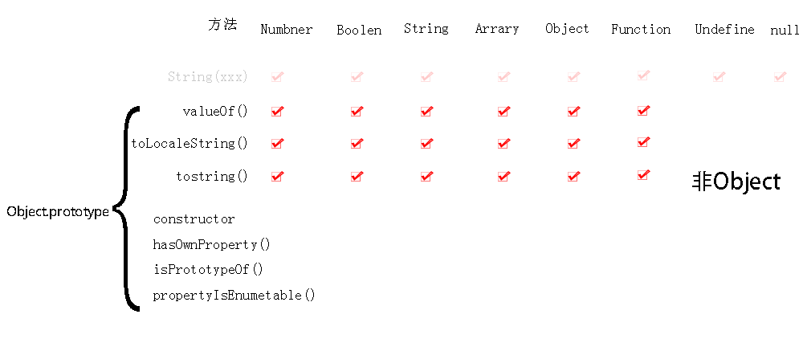

[^1]: prototype:原型 
[^2]: Property: 属性

# 判断是否为Object类型

```js
typeof(obj)
obj instance of Object
```

# Object.is()  ===  比较对象实例是否相等

##### 相同处

引用类型:同一地址的对象才相等

```
Object.is([],[]) //false
[]===[]//false
```

普通类型:值相等就相等

##### 两处不同：

```
+0 === -0 //true
NaN === NaN // false

Object.is(+0, -0) // false
Object.is(NaN, NaN) // true
```


# 实例化对象属性分类

> __所有属性:__ 
>
> * 判断:in 
>
> * 列出: obj  

>> __原型属性对象包:__
>>
>> * 判断:Person.prototype.isprototypeof(person),
>> * 列出: Object.getPrototypeOf(obj)

>> __OwnProperty:__ 
>>
>> * 判断:obj.hasOwnProperty(propertyName) 
>>
>> * 列出:Object.getOwnPropertyNames(obj)

>>> __可枚举的属性:__  
>>>
>>> * 判断 obj.propertyIsEnumerable(propertyName) 
>>> * 列出:Object.keys(obj), for...in

>>> __不可枚举的own属性__

注:只有属性判断组用的对Object的实例方法

## in操作符 所有属性


>  in判断对象是否有某属性(返回Boolean,in操作符是针对key的)

````javascript
'constructor' in {a:1}

'__proto__' in {a:1}

'a'in{a:1}

0 in [1,2] //true

'hasOwnProperty'in{a:1}
````

### 1.prototype[^1] 原型属性

##### 判断prototype是否是对象的原型


```
Person.prototype.isprototypeof(person)
```
```
 person instanceof(Person)
```

##### 获得原型对象


````js
obj.__proto__
arr.__proto__
````


````js
Object.getPrototypeOf(obj)              //和obj._proto_功能相同
Object.getPrototypeOf(arr)   
````

##### 访问原型对象的方法

```js
const obj={a:1}
Object.protype.valueof(obj)
obj.valueof()
```

### 2.OwnProperty[^2]

##### 定义

自己创造的属性,不是从原型copy的

#####   判断是否是OwnProperty

````js
const obj={a:1}
obj.hasOwnProperty(a) 返回boolen
  const arr=[1,2,3]
  console.log(arr.hasOwnProperty(0),arr.hasOwnProperty('length')) //true

````
##### 列出OwnProperty

```
const obj={a:1}
Object.getOwnPropertyNames(obj)//['a']
  const arr=[1,2,3]
  console.log(Object.getOwnPropertyNames(arr))//["0", "1", "2", "length"]

```


### 3.enumerableProperty[^2]


#####  判断对象的某个属性是否可枚举


````
obj.propertyIsEnumerable(propertyName)返回boolen 判断指定属性是否可以枚举
console.log(arr.propertyIsEnumerable(0))//true

````


##### 枚举出可枚举的属性
for....in操作符 列出可枚举的key (in操作符是针对key的)

```
	for....in
```

for....of 枚举出可枚举的value,用于可迭代类型(array)

```
	for....of
```


Object.keys(obj) 列出可枚举的key返回数组

````ts
 Object.keys(obj)['a','b']
 console.log(Object.keys(arr)) //["0", "1", "2"]
````
Object.values(obj)列出可枚举的value返回数组

```
  Object.values(obj)
```
##### 枚举类型转JSON

JSON.stringify( )   列出obj返回json字符串

```
JSON.stringify(obj) 
```

##### 合并可枚举对象

######  合并后改变了内存地址

```js
const obj = {a: 1}, obj2 = {a:10,b: 20}
console.log({...obj,...obj2}) //{a:10,b: 20}
```

```js
const obj = [10], obj2 =[10,20]
console.log([...obj,...obj2]) //[10,10,20]
```

######  Object.assign合并而不改变内存地址

```js
Object.assign({a: 1}, {a:10,b: 20})//{a: 10,b: 22}
Object.assign({a: 1}, [1, 2, 3])//{0: 1, 1: 2, 2: 3, a: 1}
Object.assign({a: 1}, '123') //{0: "1", 1: "2", 2: "3", a: 1} //字符串自动封装对象了
Object.assign(vue_instance,{msg:'msg'})
```

```js
Object.assign([1,2,3],[4,5,6]//[1,2,3]
Object.assign([1,2,3],'456') //["4", "5", "6"]
```

# 实例的所有实例属性

### __ proto __:Object.prototype



### ownProperty

```
const obj={a:1}
obj.hasOwnProperty(a) 返回boolen 
Object.getOwnPropertyNames(obj)//['a']
```

### key

```
obj.propertyIsEnumerable('a')
obj.propertyIsEnumerable(propertyName)返回boolen 判断指定属性是否可以枚举
```

