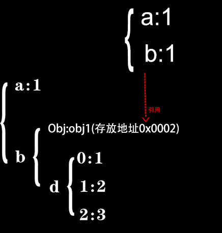

# 一切皆是对象(键值对)

对象===键值对

 都是`{prop:'',fn(){}}`的形式

```
                                         Functon

                                            ↓

构造器函数:      (Object)                   Array             自己写的构造函数(Vue,nuxt,Koa)        String
                  ↓                         ↓                         ↓                          ↓        
           {a:1,b:2,tostring(){}..}  {0:1,1:2,length:2}       {i:1,fn:()=>{}}            {0:1,1:2,length: 0,indexOf(){}}

```

> _原型 :[英]prototype_  

> _属性: [英]Property_

# Object

### 创建新对象


##### json直面量语法糖

```
{a:1,b:2}
```

##### new Object() 等价json语法糖

```
new Object({a:1,b:2})
```

#####  person=new Person(...)

创建其他类型的对象,用构造函数控制其 **"型"**

```javascript

    //模拟new new都做了什么
    var obj = new Object();
    obj.__proto__ = Person.prototype;
 
    var res = Person.call(obj, 'xiaohong', 12) // 改变obj的值

    if (typeof res === Object) {  //判断function的返回值, 若Person()返回值为对象 person=res
        person = res
    }
  
    else {  //如果返回值为undefine或者基础变量 构造函数成功
        person = obj

    }

```
```javascript
    function Person(name, age) {
        this.name = name
        this.age = age
        return {a: 1}
    }

    console.log(new Person('xiaoming', 11)) //{a: 1}
```
```javascript
new Array(1,2,3) 
```

##### Object.creat(__proto__,{})


```javascript
    var obj = Object.create({},{
        "a":{value :1,congigurable :false,enumerable :true,writable:true},
        "b":{value :2,congigurable :false,enumerable :true,writable:true},
        "c":{value :3,congigurable :false,enumerable :true,writable:true}
    });

    console.log(obj.a)//输出 1
    console.log(obj.b)//输出 2
    console.log(obj.c)//输出 3

```

### 判断是否对象类型

```
typeof(obj)
obj instance of Object
```

### 属性

##### 属性范围

> __所有属性:__ 
>
> * 判断:in 
>
> * 列出: obj  

>> __原型属性对象包:__
>>
>> * 判断:Person.prototype.isprototypeof(person),
>> * 列出: Object.getPrototypeOf(obj)

>> __OwnProperty:__ 
>>
>> * 判断:obj.hasOwnProperty(propertyName) 
>>
>> * 列出:Object.getOwnPropertyNames(obj)

>>> __可枚举的属性:__  
>>>
>>> * 判断 obj.propertyIsEnumerable(propertyName) 
>>> * 列出:Object.keys(obj), for...in

>>> __不可枚举的own属性__

注:只有属性判断组用的对Object的实例方法

##### 所有属性 


判断对象是否有某属性(返回Boolean) (in操作符是针对key的)

````javascript
'constructor' in {a:1}

'__proto__' in {a:1}

'a'in{a:1}

0 in [1,2] //true

'hasOwnProperty'in{a:1}
````

##### 1.Object.prototype

###### 判断prototype是否是对象的原型


```

Person.prototype.isprototypeof(person)

```
```
 person instanceof(Person)
```

###### 获得原型对象


````

obj.__proto__

````


````
Object.getPrototypeOf(obj)              //和obj._proto_功能相同

````

Object.protype为

一切皆是对象,继承对象的protype所以所有对象都可以用以下方法


##### 2.OwnProperty
###### 定义

自己创造的属性,不是从原型copy的

######   判断是否是OwnProperty

````
obj.hasOwnProperty(a) 返回boolen 
````
###### 添加修改删除own属性

>  json直面量表示法(键都是字符串obj.a或者obj[' ']):

构造函数this创建的属性(包括枚举型和不可枚举型),以及以后扩展的属性

```javascript
    function Fn(name, age) {
        this.name = name;
        Object.defineProperty(this, 'age', {
            configurable: false,//不可删除
            enumerable: false,//不可枚举
            writable: true,//可读性
            value: age//value,可写
        })
    }

    const i = new Fn('小女', 21)
    console.log(Object.keys(i))
```

```

obj={

        'fn'() {
            console.log('fn')
        },
        '0'(){
            console.log(0)
        }

}
obj[”a”]
obj.a等价于 obj[”a”]
obj[’0’]
obj[0]  等价于 obj[’0’]
const i='color'  obj[i+'primary'],变量做键值[i+'primary']返回字符串
   

 //数组
arry[0]
arry['0']


 //类数组对象
let ArrayLike = { 0 : "a", 1 : "b", 2 : "c" ,length:3};
ArrayLike[2]
ArrayLike['2']


 //字符串(类数组)


let str = 'abc'

str[1]
str['1']


//先定义obj 才能用obj.a,没赋值默认都是undifine


   let obj = {}//要先定义obj再设置obj.a才行

    console.log(obj.a)
    console.log(obj.b)
    console.log(obj.c)


//arr=[] 才能用arr[0],没赋值默认都是undifine


  let arr=[]
  console.log( arr[0],arr[1])
```

删除键

```
delate(obj.a)
```

本质:赋值obj和'a'计算后的返回值(地址或普通值)

```

obj={}
obj.a=2//赋值普通值
console.log(obj.a)//取得普通值
obj.b={i:1}//赋值地址
console.log(obj.b)//获得地址

```
obj.a 和obj 无上下级关系 都是平级



```

    obj = {a: {i: 1}}
    const obj2 = obj.a //获得地址
    obj2.i=10
    console.log(obj)//{a: {i: 10}}

```

> 属性定义器 键值也是字符串


````
    obj = {a: 1, b: 2}


    Object.defineProperty(obj, 'c', {//可以改变其他属性的值，可以把其他属性的值赋值给自己
        configurable: false,
        enumerable: true,
        set: function () {
            this.a = 0
        },
        get: function () {
            return this.b
        }

    })
    obj.c = 3 //set触发tis.a=0
    console.log(obj)//除非get
````


````
 obj = {a: 1, b: 2, c: 3}
    Object.defineProperty(obj, 'd', {
        configurable: false,
        enumerable: false,
        writable: true,
        value: 4
    })

````


##### 3.enumerableProperty


######  判断对象的某个属性是否可枚举


````
obj.propertyIsEnumerable(propertyName)返回boolen 判断指定属性是否可以枚举
````


###### 枚举出可枚举的属性
for....in操作符 列出可枚举的key (in操作符是针对key的)

```
	for....in
```

for....of 枚举出可枚举的value,用于可迭代类型(array)

```
	for....of
```


Object.keys(obj) 列出可枚举的key返回数组

````
    Object.keys(obj)
  
````
Object.values(obj)列出可枚举的value返回数组

```
  Object.values(obj)
```
JSON.stringify( )   列出obj返回json字符串
```
JSON.stringify(obj) 
```

###### 合并可枚举对象

 合并后改变了内存地址

```
const obj = {a: 1}, obj2 = {a:10,b: 20}
console.log({...obj,...obj2}) //{a:10,b: 20}
```

```
const obj = [10], obj2 =[10,20]
console.log([...obj,...obj2]) //[10,10,20]
```

 合并而不改变内存地址

```
Object.assign({a: 1}, {a:10,b: 20})//{a: 10,b: 22}
Object.assign({a: 1}, [1, 2, 3])//{0: 1, 1: 2, 2: 3, a: 1}
Object.assign({a: 1}, '123') //{0: "1", 1: "2", 2: "3", a: 1}
```

```
Object.assign([1,2,3],[4,5,6]//[1,2,3]
Object.assign([1,2,3],'456') //["4", "5", "6"]
```

### Object.is()===比较是否相等

##### 相同之处

引用类型:同一地址的对象才相等

```
Object.is([],[]) //false
[]===[]//false
```

普通类型:值相等就相等

#####  两处不同：

```
+0 === -0 //true
NaN === NaN // false

Object.is(+0, -0) // false
Object.is(NaN, NaN) // true
```


### 对象间的函数通信

等同于两个对象内的函数通信


_split分裂,splice剪接 ,slice 一部分@名词_

# Array

### 创建数组

##### new Array()
```javascript
new Array(3); //new可省略, [null,null,null]`

new Array("Greg"); //  new可省略, ["Greg"]`

```
##### 语法糖

```
[1,true,'str']
```

##### Array.of（1）
```javascript
 Array.of（1）  //[1]
 Array.of（1，2，3）//[1,2,3]
```
##### 类数组转数组

```javascript
let ArrayLike = { 0 : "a", 1 : "b", 2 : "c" ,length:3};
Array.from(ArrayLike)

```
##### 数组和字符串互转  Array.protorype.join()

```javascript
'1234'.split('')
```
```
[...'abc']
```

```
[1, 2, 3, 4].join('-')
```

### 判断是否数组类型

1. 检测是不是数组 Array.isArray(arr)

2. arr instanceof Array //操作符不用.和括号

3. Array.protype.isprotypeof(arr)

### 所有属性 in


```javascript
    const arr = [1]
//1.原型属性
    console.log(Array.prototype.isPrototypeOf(arr))
    console.log(Object.getPrototypeOf(arr)) //[constructor: ƒ, concat: ƒ, copyWithin: ƒ, fill: ƒ, find: ƒ, …]

//2.own属性
   console.log(arr.hasOwnProperty('length'))
    console.log(Object.getOwnPropertyNames(arr)) //["0", "length"]

//3.Enumerable属性
    console.log(arr.propertyIsEnumerable(0))
    console.log(Object.keys(arr)) //["0"]

```

### Array.prototype

##### 栈方法修改数组(只有此组改变原数组)

###### 栈方法修改添加删除

push  pop  unshift shift

```
    const arr = [1, 2, 3, 4]
          arr2=arr.push(5)//arr2函数返回值 arr是被影响的值
    console.log(arr)// [1,2,3,4,5]
    console.log(arr2) // 5

```

###### 任意位置增删改
```javascript
const arr = [1, 2, 3, 4]
arr2=arr.splice(1,1,'a','b')
console.log(arr)//[1,'a','b',3,4]
console.log(arr2)//[2]
//在位置2开始删除1项插入'a','b',函数返回删除的1项[2]

```

###### 填充数组(改变原数组)

     instance.fill(’qsl’,1,4) //填充qsl在位置2到5不包含5


##### 和string相同的方法(不改变原数组)


###### slice截取

```
instance.slice（1，4）\\截取数组2到5不包含5

instance.slice（-3，-1）\\倒数第4到倒数第2不包含4
```


###### contact(不改变原数组)
```

//arr和类数组拥有
     const arr = [1, 2, 3], arr2 = [1,2,4, 5]
    allarry=arr.concat(arr2)
    console.log(arr) //[1,2,3]
    console.log(allarry) //[1,2,3,4,5]

```


###### includes

```
 arr.includes(1)  //判断arr是否包含1 返回boolen,

 arr.includes({a:1})  //不能判断深层次包含
```


###### indexOf


```
1. arr.indexOf(1)  //从前往后数第一个1的索引
2. arr.lastindexOf(1’) //从后往前数第一个1的索引
3. arr.indexOf({a: 10}) //无法使用,返回-1
```


##### 数组迭代方法(不改变原数组)

###### 判断所有项符合某条件 返回boolen

```
 Array.protype.every((item,index,self) => {})
```
###### 判断是否有符合某条件的项 返回boolen
```
 Array.protype.some((item,index,self) => {})
 
```

###### 映射—>按照某条件返回数组


```
  Array.protype.map((item,index,self) => {})
 
```

###### filter过滤—>符合某条件的元素 返回数组


```
 Array.protype.filter((item,index,self) => {})
```

###### forEach

```
 Array.protype.forEach((item,index,self) => {})
```

###### 数组搜索

```
3. arr.find(function(item, index, self) { return item>1 }) //查找第一个值
4. arr.findindex(function(item, index, self) { return item > 9 }) //查找第一个索引
```

例

```
arr=[{a:1,id:1},{b:2,id:2}]    已知id：2 可以删除{b:2,id:2}吗?
------------------------
arr=[{a:1,id:1},{b:2,id:2},{b:2,id:3}]
 const index =arr.findIndex((item,index,arr)=>{return item.id===3})
```

###### 排序

```
 Array.protype.sort((a,b)=>b-a)

 Array.protype.reverse()//反转
```

###### 相加reduce

```
array.reduce(function(accumulator, currentValue, currentIndex, array), initialValue)；

accumulator：上一次调用回调返回的值，或者是提供的初始值（initialValue）

currentValue：数组中正在处理的元素

currentIndex：数据中正在处理的元素索引，如果提供了 initialValue ，从0开始；否则从1开始

array： 调用 reduce 的数组

initialValue：可选项，其值用于第一次调用 callback 的第一个参数。如果没有设置初始值，则将数组中的第一个元素作为初始值。空数组调用reduce时没有设置初始值将会报错。

 
```

**浏览器兼容性:**

IE>=9 , PS: IE不支持ES6的箭头函数。

```
   let array = [
        {
            name: 'apple',
            price: 10
        }, 
        {
            name: 'banana',
            price: 9
        }
    ];

    let sumprice = 0;
    for (let index = 0; index < array.length; index++) {
        const element = array[index];
        sumprice += element.price;
    }
    console.log('for example sumprice',sumprice);

    sumprice = array.reduce(function (total, currentValue, currentIndex, arr) {
        return total + currentValue.price;
    }, 0);
    console.log('for reduce sumprice',sumprice);

```

### ownProperty
```javascript
['leng',
'0',
'1']
```

### keys(EnumerableProperty()
```javascript
['0',
'1']
```
#####  枚举出值
```
for循环

for....of

forEach

Object.keys(arr)
```

#####  枚举类型合并

Object.assign()静态方法合并数组(改变原数组,不改变地址)

```
Object.assign()
```

```
[...[1,2],...[3,4]]
```

### null,undefine 不能用数组方法的解决方法

数组的方法的主题必须是数组 若为null,undefine就不是数组会报错__ 


解决方法1 先判断是否爲数组

```
if(Array.isArray(arr)){

arr.filter(..)
}

```

解决方法2 , ||


```

const arr=null

const _arr=arr||[]

const arr2=_arr.filter(..)

```


# Function

fn继承于Object   fn还能创造新对象实例

### 创建对象

##### 构造函数创建对象

```javascript
new Function('a', 'b', 'return a + b');
```

##### 直面量语法糖等价构造函数创建

```
  function f(a,b) {return a + b}//语法糖等价上面的构造函数生成

    f.a = 1
    f.b = 2
    console.log(f)//  function f() {} 打印出来的只是直面量表达式

```

### 所有属性 in


##### 判断和取得属性

```javascript
    const Fn = function () {
    }
    Fn.a = 10
    
   console.log({'Function.protype': Object.getPrototypeOf(fn)})

  //原型属性Function.prototype
    console.log(Object.getPrototypeOf(Fn))  
  /*  apply: ƒ apply()
    arguments: (...)
    bind: ƒ bind()
    call: ƒ call()
    caller: (...)
    constructor: ƒ Function()
    length: 0
    name: ""
    toString: ƒ toString()
    Symbol(Symbol.hasInstance): ƒ [Symbol.hasInstance]()
    get arguments: ƒ ()
    set arguments: ƒ ()
    get caller: ƒ ()
    set caller: ƒ ()*/

    
    //Own属性,Function构造生成    
    console.log(Object.getOwnPropertyNames(Fn))//(6)["length", "name", "arguments", "caller", "prototype", "a"]

    //可枚举属性:静态变量,静态方法
     console.log(Object.keys(Fn)) //['a']


  //for..in还能枚举出 

    for (item in f) {
        console.log(item) //a,b

    }
```


##### 可以和运行操作符()进行计算操作 fn()

```
fn()
```


# Dom节点

### html创建

```
<html>
<body>
  <div id="app" class="cs" data-src="datasrc">
    <h1>h1标题</h1>
    <p>段落</p>
  </div>
</body>
</html>
```

### 所有属性


### 获得document对象和节点

```javascript
    console.log(Object.getPrototypeOf(document))//HTMLDocument {Symbol(Symbol.toStringTag): "HTMLDocument", constructor: ƒ}
      console.log(Object.getOwnPropertyNames(document))//["location"]
      console.log(Object.keys(document))//["location"]
      
      console.log({app: document.body.childNodes[1]})

```

# RegExp

### 构造函数生成对象

```javascript
new RegExp('\d','i')
```

### 直面量语法糖等价构造函数创建

```javascript
    const reg = /\w{3}/i
    reg.a = 10
    console.log({reg})
```

### 所有属性(显示不准确,看下边)


### 判断和获得属性信息

```javascript
   const reg = /\w{3}/i
    reg.a = 10
    console.log({reg})

    console.log(RegExp.prototype.isPrototypeOf(reg))
    console.log(Object.getPrototypeOf(reg))


    console.log(reg.hasOwnProperty('lastIndex'))//true
    console.log(Object.getOwnPropertyNames(reg))//["lastIndex", "a"]


    console.log(reg.propertyIsEnumerable('a'))//true
    console.log(Object.keys(reg))//['a']

```

