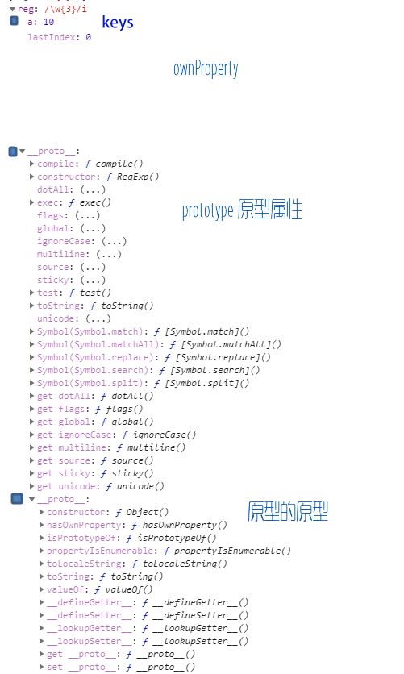

# 构造函数建立实例

```
var re = new RegExp('hello','g');   //代替/hello/g
```

# 字面量(用于建立对象和控制台打印)

### gmi修饰符:

/g [英]globe: 对大小写不敏感 

/m [英]multi-line :多行匹配

/i  [英]ignoreCase:对大小写不敏感

```javascript
    const str = 'qinshilei\nqinshiwei'

    const reg = /qi\w/
    const reg_ = /^QI\w/gmi


    console.log(str.match(reg)) //["qin", index: 0, input: "qinshilei_qinshiwei", groups: undefined]
    console.log(str.match(reg_))//["qin", "qin"]


    console.log(str.replace(reg, 'wang')) //wangshilei↵qinshiwei
    console.log(str.replace(reg_, 'wang'))//wangshilei↵wangshiwei
    console.log(str.replace(reg, item => item.toUpperCase())) //QINshilei↵qinshiwei
    console.log(str.replace(reg_, item => item.toUpperCase()))//QINshilei↵QINshiwei


    console.log(str.search(reg)) //0
    console.log(str.search(reg_))//0   //****唯一 一个不响应global,为搜索的第一个词


    console.log(reg.test(str))//true
    console.log(reg_.test(str))//true


    console.log(reg.exec(str))//["qin", index: 0, input: "qinshilei↵qinshiwei", groups: undefined]  ,这个是str.match(reg)的逆运算
    console.log(reg_.exec(str))//["qin", index: 10, input: "qinshilei↵qinshiwei", groups: undefined]//匹配最后一个
```


###  转意字符匹配若干范围(单字符)
```
 . 代表任意字符
\. 表示真实的.

\n   换行  ~next

\t   制表 tab制表符

\r   回车  ~enter

\s   空格  ~space

\S   非空格

\d   数字1位  ~[英]digit

\D   非数字

\w   字符 ( 字母 ，数字，下划线_ )   //[英]word

\W   非字符

```

### 自定义匹配(单字符) 

#####  [-] 自定义匹配范围 

[a-zA-z]匹配英文大小写

[0-3]匹配0，1，2，3

[0-9]* 匹配数字（注意后面有 *，可以为空）

[0-9]+ 匹配数字（注意后面有 +，不可以为空）

##### [ ^  ]排除后的范围匹配

[  ^ ]表示排除  [ ^  \s ]

[^ 0-3 ]匹配 4，5，6，7，8，9

### 匹配位置$ ^

匹配输入字符串的结尾位置。如果设置了 RegExp 对象的 Multiline 属性，则 $ 也匹配 '\n' 或 '\r'。要匹配 $ 字符本身，请使用 \$。

```
var str = 'my name is shilei'

const reg = /lei$/

console.log(reg.test(str)) //true

console.log(reg.exec(str)) //['lei']

```


### 次数

##### ?
 runo? 可以匹配 run 或者 runo，? 问号代表前面的字符最多只可以出现一次（0次、或1次）。**

##### +
 runoo+b，可以匹配 runoob、runooob、runoooooob 等，+ 号代表前面的字符必须至少出现一次（1次或多次）。
##### *
 runoo * b，可以匹配 runob、runoob、runoooooob 等，* 号代表字符可以不出现，也可以出现一次或者多次（0次、或1次、或多次）。


##### {}
{}一般用来表示匹配的长度，

\s{3} 表示匹配三个空格，

\s{1,3}表示匹配一到三个空格。

o{,3}

(a|b){3,}

##### 贪婪模式和懒惰模式

###### 贪婪模式* +

" * "限定符和" + "限定符都是__贪婪的__，因为它们会尽可能多的匹配文字，

如：``如果用正则匹配src中内容非懒惰模式匹配`/src=".*"/`

匹配结果是：`src="test.jpg" width="60px" height="80px"`意思是从="往后匹配，直到最后一个 **"** 匹配结束

###### 懒惰模式正则?

在它们的后面加上一个?就可以实现非贪婪或最少匹配。

`/src=".*?"/`

结果：`src="test.jpg"`因为匹配到第一个 **"** 就结束了一次匹配。不会继续向后匹配。因为他懒惰嘛。


```
const str = ``

const reg = /src=".*?"/
 
console.log(reg.test(str))
console.log(reg.exec(str))

```


### 分组和捕获()

##### 分组

###### 多字符
一个分组中可以像上面这样有一个具体的表达式，这样可以优雅地表达一个重复的字符串

```
/(ha){3}/
/hahaha/

```
###### 或操作

或操作（|）或操作

```
（a|b）匹配a或者b
```

##### 捕获和不捕获

###### 捕获类型()

-  对reg.test()的影响: 括号分组

-  对reg.exec()的影响: 括号部分捕获并把括号部分的捕获值赋值到reg.exec('xxx')[1]


>  访问捕获的内容

1. reg.exec('xxx')[1]

```
    const reg = /(doubi) is a doubi/
    const arr=reg.exec('doubi is a doubi')
    console.log(arr)// [0: "doubi is a doubi" 1: "doubi"]

```
2. 可以通过RegExp.$1访问,

``` 
    console.log(RegExp.$1 )//doubi,记忆窍门:和$1===reg.exec('xxx')[1}
```

3. 在表达式里通过/1访问

```

   const reg = /(doubi) is a \1/
    console.log(reg.exec('doubi is a doubi'))// [0: "doubi is a doubi" 1: "doubi"]
    console.log(RegExp.$1 )//doubi

```


###### 非捕获(?:)

- 对reg.test()的影响: 括号分组

- 对reg.exec()的影响: 括号部分不捕获


```

const reg = /kid is (?:doubi)*/

const str='kid is  doubidoubidoubi'
console.log(reg.test(str))// true
console.log(reg.exec(str))// [0:kid is]


```

###### 非捕获前瞻(?=)  

- 对reg.test()的影响:可以用括号分组,往前看一下是否有相等的值,有则返回true

- 对reg.exec()的影响:括号部分不捕获


```
   const reg = /kid is a (?=doubi)/
   console.log(reg.exec('kid is a doubi'))// [0:kid is a] 
```


```
//开头就前瞻
const reg = /^(?=haha)/
const str = "hahahamimimi"


console.log(reg.test(str))//true
```

######  非捕获前瞻否定(?!)  

- 对reg.test()的影响: 往前看一下是否有不相等的值,有则返回true

- 对reg.exec()的影响: 括号部分不捕获


```

     const reg = /kid is a (?!doubi)/

    console.log(reg.test('kid is a doubi')) // false
    console.log(reg.test('kid is a shabi')) // true
    console.log(reg.exec('kid is a doubi'))// null
    console.log(reg.exec('kid is a shabi'))// ['0':"kid is a"]
```


# 对象赋值给变量可扩展

```js
const reg=/\w/  //对象的内存地址赋值给变量
```

# 弱类型对象扩展

```
reg.a=1  //弱类型可扩展
```

# 所有属性in(真实对象)




```javascript
   const reg = /\w{3}/i
    reg.a = 10
    console.log({reg})

    console.log(RegExp.prototype.isPrototypeOf(reg))
    console.log(Object.getPrototypeOf(reg))

/*    compile: ƒ compile()
    constructor: ƒ RegExp()
    dotAll: (...)
    exec: ƒ exec()
    flags: (...)
    global: (...)
    ignoreCase: (...)
    multiline: (...)
    source: (...)
    sticky: (...)
    test: ƒ test()
    toString: ƒ toString()
    unicode: (...)
    Symbol(Symbol.match): ƒ [Symbol.match]()
    Symbol(Symbol.matchAll): ƒ [Symbol.matchAll]()
    Symbol(Symbol.replace): ƒ [Symbol.replace]()
    Symbol(Symbol.search): ƒ [Symbol.search]()
    Symbol(Symbol.split): ƒ [Symbol.split]()
    get dotAll: ƒ dotAll()
    get flags: ƒ flags()
    get global: ƒ global()
    get ignoreCase: ƒ ignoreCase()
    get multiline: ƒ multiline()
    get source: ƒ source()
    get sticky: ƒ sticky()
    get unicode: ƒ unicode()
    __proto__: Object*/
   

    console.log(reg.hasOwnProperty('lastIndex'))//true
    console.log(Object.getOwnPropertyNames(reg))//["lastIndex", "a"]


    console.log(reg.propertyIsEnumerable('a'))//true
    console.log(Object.keys(reg))//['a']

```


### RegExp.prototype

##### reg.test(str),reg. exec(str)匹配第一个就结束

```javascript
const reg = /[1-2]/
const str = 'a123'

//1.reg匹配部分字符串就为ture
const i = reg.test(str) //true


//2.reg匹配部分字符串 并把第一个匹配的部分放到返回值的数组arr0,括号捕获放到数组arr1
const arr = reg.exec(str) //[ '1', index: 1, input: 'a123', groups: undefined ]
```

##### reg.test判定为true, reg.exe(str)才不是undifined 

```javascript
reg.test判定为true, reg.exe(str)才不是undifined 
```

### ownProperty

```
["lastIndex", "a"]
```

### key

['a']

# 常用正则

``` javascript

匹配中文：[\u4e00-\u9fa5]
行首行尾空格：^\s*|\s*$
Email：^\w+@[a-z0-9]+(\.[a-z]+){1,3}$
网址：[a-zA-z]+://[^\s]*
QQ号：[1-9][0-9]{4,9}
邮政编码：[1-9]\d{5}
身份证：[1-9]\d{14}|[1-9]\d{17}|[1-9]\d{16}x

```

str.repalce(reg,fn(item){})替换网址
```
    function replaceReg(reg, str) {
        return str.replace(reg, function (item) {
            return `<a href="item">${item}</a>`;
        })
    }

    var reg = /http:\/\/[\w-]*(\.[\w-]*)+/ig;
    var str = '将一个用户输入的一段文字中的url替换成可以点击的link地址。测试一下：http://www.ablanxue.com紧接着中文，还有    http://www.baidu.com';
    document.write(replaceReg(reg, str));

```

# 注意
正则在部分代码里必须使用new RegExp _否则无效_

```
 const filter=new RegExp(this.filter)
```


