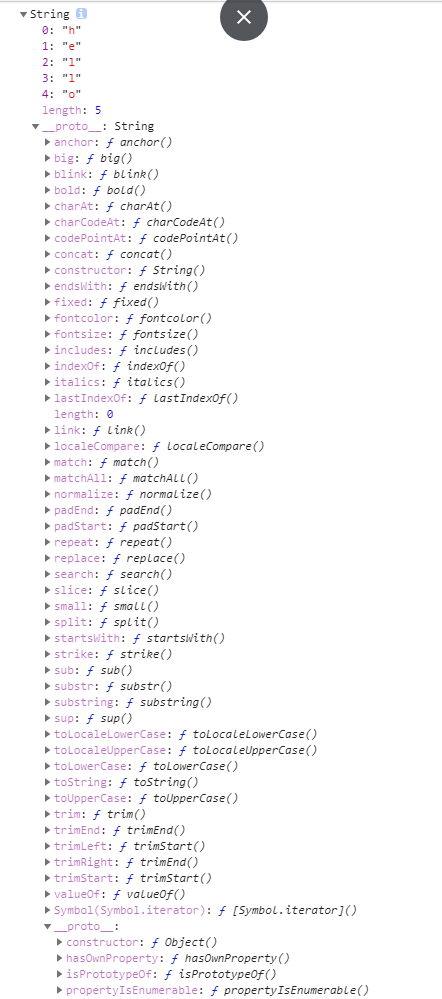

# String

### 新建对象

##### new String

```
new String('hello')
```

##### 字面量(用于建立普通值和控制台打印)

```
'hello'
```

### 赋值给变量

```js
const str=new String('hello')//在栈中存放基本值,如用到方法是临时封装成对象
```

### 弱类型对象扩展

```
str.a=1//js弱类型可扩展
```


# 所有属性(真实对象键值对)



### own属性 key属性

```js
  const str=new String('hello')
  console.log(Object.getPrototypeOf(str)) //String.prototype
  console.log(Object.getOwnPropertyNames(str))//["0", "1", "2", "3", "4", "length"]
  console.log(Object.keys(str))//["0", "1", "2", "3", "4"]
```

### String.prototype

##### 和数组相同的公共方法

|公共方法|array|string（类数组）|Function|
|----|----|-----|-----|
|length|✓|✓|✓类数组参数|
|includes()|✓|✓||
|indexOf()|✓|✓||
|lastIndexOf()|✓|✓||
|concat()|✓|✓||
|截取|sclice|slice;substring(a,b) b>a||
|填充|fill(’qsl’,1,4))|padStart(7,'111111')|


##### 截取
###### substring
```
substring(0,30) //参数2的值要比参数1大
```

###### slice

```
var str='abcdefg'; 
str.slice(1)   //bcdefg      
str.slice(1,3)  // bc
str.slice(3,1) // ""
```

##### 去除空格

```

str.trim('   123')
```

##### 判断是否以xxx开头结尾

endsWith()

startsWith()

##### 自动补全
###### padStart()

pad~padding 补丁

    a=`love`.padStart(7, '1111'); // 字符串love补足7位 用‘1111’补
###### padEnd()

##### 重复

```
repeat()
```


