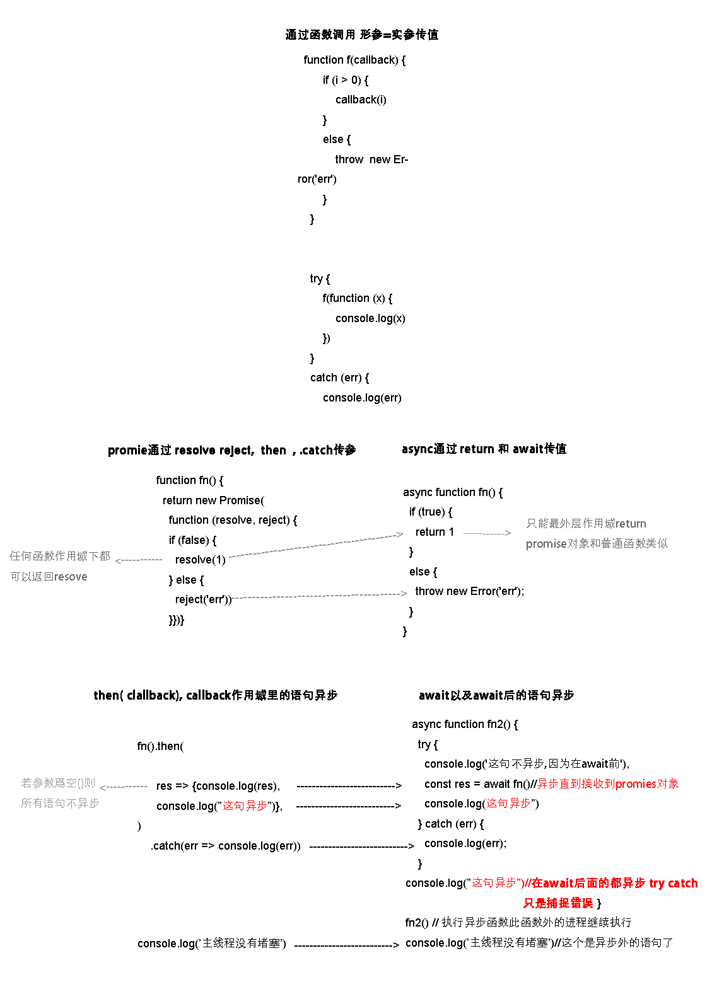

# promise的作用


### 1异步队列,不影响执行主程序


1. 返回异步的promise对象,


2. 用.then().catch()或 async  fn(){ await} 接收,普通程序流不能接受promise对象,


### 2.避免了回调地狱:


promise对象可以在函数体任意级别 resove值, 普通函数和异步函数的return不行,

### 3.两个值可以做选择逻辑

例: element的对话框

```
.then().catch(),

 async  fn(){ await} 
```

### 4.承诺接受,then接收不到值绝不运行

```
    new Promise((resolve) => {
    }).then((res) => console.log(1))

```


# 回调 promise asyncawait比较





# 返回promise对象的函数

自定义return promise

    function fn(){
     return new promise(()=>)
    }

    fn().then()

自定义异步函数

````
async function f() {
    return 1
}

f().then()
````

axios 异步函数
	
 

    axios.post("/brandUpdate",para).then

mogoose异步函数

````
Dog.find({name:'小黑'}).then()
````

vm.$nextTick()

```

vm.$nextTick()

```