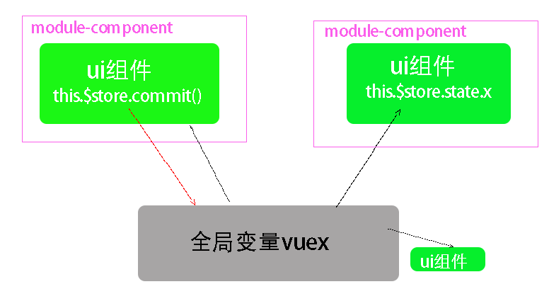

#  作用域

| .                                  | 块作用域             | 函数作用域                                | global            | module                              |
| ---------------------------------- | -------------------- | ----------------------------------------- | ----------------- | ----------------------------------- |
| 隔离变量类型                       | const let            | const let var                             | 全局变量          | 临时的全局变量,变量没有使用就会销毁 |
|                                    |                      |                                           |                   |                                     |
| 作用域内声明自由变量               | √                    | √                                         | √                 | √                                   |
| 参数(数据的入口和出口)             | x                    | fn( p1,callback),作为数据的入口和出口     | x                 | x                                   |
| 传入this变量(引用其他的对象的类型) | 继承函数作用域的this | 箭头函数继承this,<br />普通函数如传入this | window和undefined | undefined                           |
| 作用域链                           | √                    | √                                         | √                 | √                                   |
|                                    |                      |                                           |                   |                                     |
| 返回关键字                         | do(浏览器未支持)     | return i (一般用于计算)                   | x                 |                                     |
| 返回值                             | 浏览器未支持         | const res=fn(p1)                          | x                 |                                     |

# 作用域之间通信

## 靠全局变量通信(一般用于文件间)

### 1. global.xxx

向下级函数作用域通信

```js
var i=1 ; global.i=1 
window.session
window.cookie
window.history
```

### 2.module文件作用域:

##### 声明到文件作用域并没有注入global

import声明全局作用域变量 不注入global, 存放在module中,不使用时间会销毁

```js
//#1  export.js

export let i = 1
//在自己的文件作用域运行 修改自由变量
export function fn(n) {
    i = n * 2
    console.log(i)
}
console.log('会跟随引入运行')
```

##### 引入方的文件作用域内使用输出方文件作用域的数据

```js
//#2  import.js
//import声明全局变量,还执行export.js文件作用域里的代码
import {i, fn} from './export'

    fn(10)

```


|                                                              | 闭包作用域          | 文件作用域(exprot{i,fn})     |
| ------------------------------------------------------------ | ------------------- | ---------------------------- |
| 输出方文件作用域的暴露关键字                                 | return{i,n}         | exprort{I,fn }               |
| 赋值给引入方的文件作用域的变量                               | const {i,refn}=fn() | import {i,fn}from './export' |
| 接口类型   (引入方的i如果是普通值会随着expor.js里的i的改变而改变,node的const=reuire()就不会) |                     | √                            |
| 暴漏赋值的同时执行代码                                       | √                   | √                            |

### 3.module文件作用域通信版版+注入到对象,

把const import声明的全局变量,再批量注入到对象的key里,通过`this`方便调用

```js
improt store from ‘./export’

const obj1={
      function fn(){ this.store},
     store
}

```

## 靠参数通信

本质就是函数参数变量赋值,实参赋值给形参变量,默认形参undefined		

参数 i 的函数数据的入口

参数callback作为函数数据的出口/使用promise可以用return做数据出口

return是函数的计算值


**例:**

```js
// 参数1 为数据入口,参数2为数据出口
Dog.find({name:'小黑'},(err,res)=>{console.log(res)})

```

```html
//vue父子通信
<man :name:"name" @say="fn"></man>
```

```html
//插槽通信
<cl v-slot='{vlaue}'> {{value}}   </cl>
```

```js
wx.request({
  url: 'test.php', //仅为示例，并非真实的接口地址
  data: {
    x: '',
    y: ''
  },
  header: {
    'content-type': 'application/json' // 默认值
  },
  success (res) {
    console.log(res.data)
  }
})
```


# 应用:vue通信

| __使用场景__ | 组件内部通信用     | 父子通信                   | 相应路由变化传少量数值,$route变化,然后引发异步数据或者相应的vuex数据 | 一般用于全局变量,<br />所有组件公用数据,每个组件都可以对此数据__增删改查__ |
| ------------ | ------------------ | -------------------------- | ------------------------------------------------------------ | ------------------------------------------------------------ |
| __本质__     | this.key做全局变量 | fn(I,callback)做入口和出口 | global.route变量做全局变量                                   | $store变量做全局变量                                         |

### 组件内通信 this全局变量

```js
data(){
return{value:''}
}
```


### 父子组件通信

**本质**  本质是回调函数 


### vuex全局配置文件

**本质:**是全局变量通信,存放全局状态供若干组件使用,

建立$store,

通过mixin把$store的地址注入到每个组件里, 

一个组件都能更新$store

 其他vue组件监听$store变化,{{$store.state.xxx}}更新到视图




```js
   let store = {
        state: undefined,
        setState(i) {
            this.state = i
        }
    }

    class Vm {
        constructor(a, b) {
            this.a = a;
            this.b = b;
            this.$store = store
        }
    }

    let vm = new Vm(1, 2)
    vm.$store.setState(3)

    let vm2 = new Vm(10, 20)
    vm2.$store.setState(30)

```

### ui组件间通信

**本质:**databus通信($eventBus作为全局变量)


```js
  Vue.prototype.$eventBus = new Vue() //$eventBus在一个组件

  Vue.component('cl1', {
    data() {
      return {value: ''}
    },
    template: `<ul><li v-for="item in 10" @click="$eventBus.$emit('sent',item)">{{item}}</li></ul>`

  })
  Vue.component('cl2', {
    data() {
      return {value: ''}
    },
    template: `<div>{{value}}</div>`,
    mounted() {

      this.$eventBus.$on('sent', res => {
        this.value = res
      })
    }

  })

  const vm = new Vue({
    el: '#app',


  })

```

### 页面组件通信

**本质**是global.history变量,通过浏览器history栈通信

