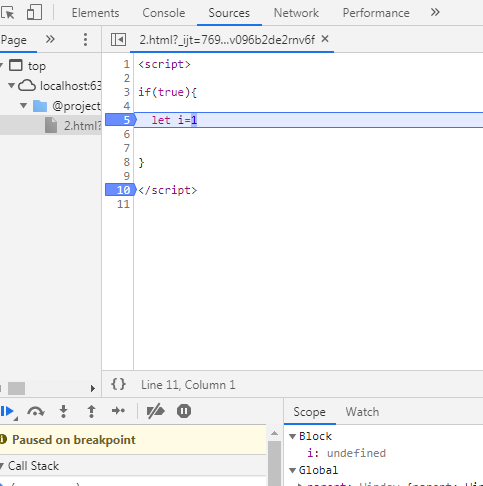

# 块级作用域

```js
if(true){

  let i=1

}
```



### **do表达式 通信**(浏览器还不支持)

让块代码有返回值

```
let a = {
  let b = 1
}
a获取不到b的值,因为块级作用域不返回值
```

```
let a = do {
    let b = 1
}
现在一个提案在块级作用域前加do,即可得到返回值
```

### 为什么需要块级作用域？

ES5 只有全局作用域和函数作用域，没有块级作用域，这带来很多不合理的场景。

第一种场景，块作用域的内层var变量提升,可能会覆盖外层变量。

```javascript
var tmp = new Date();

function f() {
    //var tmp 会前置
  console.log(tmp);// undefined
  if (false) {
    var tmp = 'hello world';
  }
}

f(); 
```

上面代码的原意是，`if`代码块的外部使用外层的`tmp`变量，内部使用内层的`tmp`变量。但是，函数`f`执行后，输出结果为`undefined`，原因在于变量提升，导致内层的`tmp`变量覆盖了外层的`tmp`变量。

第二种场景，用来计数的循环变量泄露为全局变量。

```javascript
var s = 'hello';

for (var i = 0; i < s.length; i++) {
  console.log(s[i]);
}

console.log(i); // 5
```

上面代码中，变量`i`只用来控制循环，但是循环结束后，它并没有消失，泄露成了全局变量。

第三种块级作用域的出现，实际上使得获得广泛应用的匿名立即执行函数表达式（匿名 IIFE）不再必要了。

```javascript
// IIFE 写法
(function () {
  var tmp = ...;
  ...
}());

// 块级作用域写法
{
  let tmp = ...;
  ...
}
```


### 块

### ES6 的块级作用域

`let`实际上为 JavaScript 新增了块级作用域。

```javascript
function f1() {
  let n = 5;
  if (true) {
    let n = 10;
  }
  console.log(n); // 5
}
```

上面的函数有两个代码块，都声明了变量`n`，运行后输出 5。这表示外层代码块不受内层代码块的影响。如果两次都使用`var`定义变量`n`，最后输出的值才是 10。

ES6 允许块级作用域的任意嵌套。

```javascript
{{{{
  {let insane = 'Hello World'}
  console.log(insane); // 报错
}}}};
```

上面代码使用了一个五层的块级作用域，每一层都是一个单独的作用域。第四层作用域无法读取第五层作用域的内部变量。

内层作用域可以定义外层作用域的同名变量。

```javascript
{{{{
  let insane = 'Hello World';
  {let insane = 'Hello World'}
}}}};
```

### 块级作用域与函数声明

函数能不能在块级作用域之中声明？这是一个相当令人混淆的问题。

ES5 规定，函数只能在顶层作用域和函数作用域之中声明，不能在块级作用域声明。

```javascript
// 情况一
if (true) {
  function f() {}
}

// 情况二
try {
  function f() {}
} catch(e) {
  // ...
}
```

上面两种函数声明，根据 ES5 的规定都是非法的。

但是，浏览器没有遵守这个规定，为了兼容以前的旧代码，还是支持在块级作用域之中声明函数，因此上面两种情况实际都能运行，不会报错。

ES6 引入了块级作用域，明确允许在块级作用域之中声明函数。ES6 规定，块级作用域之中，函数声明语句的行为类似于`let`，在块级作用域之外不可引用。

```javascript
function f() { console.log('I am outside!'); }

(function () {
  if (false) {
    // 重复声明一次函数f
    function f() { console.log('I am inside!'); }
  }

  f();
}());
```

上面代码在 ES5 中运行，会得到“I am inside!”，因为在`if`内声明的函数`f`会被提升到函数头部，实际运行的代码如下。

```javascript
// ES5 环境
function f() { console.log('I am outside!'); }

(function () {
  function f() { console.log('I am inside!'); }
  if (false) {
  }
  f();
}());
```

ES6 就完全不一样了，理论上会得到“I am outside!”。因为块级作用域内声明的函数类似于`let`，对作用域之外没有影响。但是，如果你真的在 ES6 浏览器中运行一下上面的代码，是会报错的，这是为什么呢？

```javascript
// 浏览器的 ES6 环境
function f() { console.log('I am outside!'); }

(function () {
  if (false) {
    // 重复声明一次函数f
    function f() { console.log('I am inside!'); }
  }

  f();
}());
// Uncaught TypeError: f is not a function
```

上面的代码在 ES6 浏览器中，都会报错。

原来，如果改变了块级作用域内声明的函数的处理规则，显然会对老代码产生很大影响。为了减轻因此产生的不兼容问题，ES6 在[附录 B](http://www.ecma-international.org/ecma-262/6.0/index.html#sec-block-level-function-declarations-web-legacy-compatibility-semantics)里面规定，浏览器的实现可以不遵守上面的规定，有自己的[行为方式](http://stackoverflow.com/questions/31419897/what-are-the-precise-semantics-of-block-level-functions-in-es6)。

- 允许在块级作用域内声明函数。
- 函数声明类似于`var`，即会提升到全局作用域或函数作用域的头部。
- 同时，函数声明还会提升到所在的块级作用域的头部。

注意，上面三条规则只对 ES6 的浏览器实现有效，其他环境的实现不用遵守，还是将块级作用域的函数声明当作`let`处理。

根据这三条规则，浏览器的 ES6 环境中，块级作用域内声明的函数，行为类似于`var`声明的变量。上面的例子实际运行的代码如下。

```javascript
// 浏览器的 ES6 环境
function f() { console.log('I am outside!'); }
(function () {
  var f = undefined;
  if (false) {
    function f() { console.log('I am inside!'); }
  }

  f();
}());
// Uncaught TypeError: f is not a function
```

考虑到环境导致的行为差异太大，应该避免在块级作用域内声明函数。如果确实需要，也应该写成函数表达式，而不是函数声明语句。

```javascript
// 块级作用域内部的函数声明语句，建议不要使用
{
  let a = 'secret';
  function f() {
    return a;
  }
}

// 块级作用域内部，优先使用函数表达式
{
  let a = 'secret';
  let f = function () {
    return a;
  };
}
```

另外，还有一个需要注意的地方。ES6 的块级作用域必须有大括号，如果没有大括号，JavaScript 引擎就认为不存在块级作用域。

```javascript
// 第一种写法，报错
if (true) let x = 1;

// 第二种写法，不报错
if (true) {
  let x = 1;
}
```

上面代码中，第一种写法没有大括号，所以不存在块级作用域，而`let`只能出现在当前作用域的顶层，所以报错。第二种写法有大括号，所以块级作用域成立。

函数声明也是如此，严格模式下，函数只能声明在当前作用域的顶层。

```javascript
// 不报错
'use strict';
if (true) {
  function f() {}
}

// 报错
'use strict';
if (true)
  function f() {}
```

### let 命令

##### 基本用法

ES6 新增了`let`命令，用来声明变量。它的用法类似于`var`，但是所声明的变量，只在`let`命令所在的代码块内有效。

```javascript
{
  let a = 10;
  var b = 1;
}

console.log(a) // ReferenceError: a is not defined.
console.log(b) // 1
```

##### 块作用域有效

上面代码在代码块之中，分别用`let`和`var`声明了两个变量。然后在代码块之外调用这两个变量，结果`let`声明的变量报错，`var`声明的变量返回了正确的值。这表明，`let`声明的变量只在它所在的代码块有效。

`for`循环的计数器，就很合适使用`let`命令。

```javascript
for (let i = 0; i < 10; i++) {
  // ...
}

console.log(i);
// ReferenceError: i is not defined
```

上面代码中，计数器`i`只在`for`循环体内有效，在循环体外引用就会报错。

下面的代码如果使用`var`，最后输出的是`10`。

```javascript
var a = [];
for (var i = 0; i < 10; i++) {
  a[i] = function () {
    console.log(i);
  };
}
a[6](); // 10
```

上面代码中，变量`i`是`var`命令声明的，在全局范围内都有效，所以全局只有一个变量`i`。每一次循环，变量`i`的值都会发生改变，而循环内被赋给数组`a`的函数内部的`console.log(i)`，里面的`i`指向的就是全局的`i`。也就是说，所有数组`a`的成员里面的`i`，指向的都是同一个`i`，导致运行时输出的是最后一轮的`i`的值，也就是 10。

如果使用`let`，声明的变量仅在块级作用域内有效，最后输出的是 6。

```javascript
var a = [];
for (let i = 0; i < 10; i++) {
  a[i] = function () {
    console.log(i);
  };
}
a[6](); // 6
```

上面代码中，变量`i`是`let`声明的，当前的`i`只在本轮循环有效，所以每一次循环的`i`其实都是一个新的变量，所以最后输出的是`6`。你可能会问，如果每一轮循环的变量`i`都是重新声明的，那它怎么知道上一轮循环的值，从而计算出本轮循环的值？这是因为 JavaScript 引擎内部会记住上一轮循环的值，初始化本轮的变量`i`时，就在上一轮循环的基础上进行计算。

另外，`for`循环还有一个特别之处，就是设置循环变量的那部分是一个父作用域，而循环体内部是一个单独的子作用域。

```javascript
for (let i = 0; i < 3; i++) {
  let i = 'abc';
  console.log(i);
}
// abc
// abc
// abc
```

上面代码正确运行，输出了 3 次`abc`。这表明函数内部的变量`i`与循环变量`i`不在同一个作用域，有各自单独的作用域。

##### 不存在变量提升

`var`命令会发生“变量提升”现象，即变量可以在声明之前使用，值为`undefined`。这种现象多多少少是有些奇怪的，按照一般的逻辑，变量应该在声明语句之后才可以使用。

为了纠正这种现象，`let`命令改变了语法行为，它所声明的变量一定要在声明后使用，否则报错。

```javascript
// var 的情况
console.log(foo); // 输出undefined
var foo = 2;

// let 的情况
console.log(bar); // 报错ReferenceError
let bar = 2;
```

上面代码中，变量`foo`用`var`命令声明，会发生变量提升，即脚本开始运行时，变量`foo`已经存在了，但是没有值，所以会输出`undefined`。变量`bar`用`let`命令声明，不会发生变量提升。这表示在声明它之前，变量`bar`是不存在的，这时如果用到它，就会抛出一个错误。

##### **暂时性死区**

###### 本质

==暂时性死区的本质就是，只要一进入当前作用域，所要使用的变量就已经存在了，但是不可获取，只有等到声明变量的那一行代码出现，才可以获取和使用该变量。==

只要块级作用域内存在`let`命令，它所声明的变量就“绑定”（binding）这个区域，不再受外部的影响。

```javascript
var tmp = 123;

if (true) {
  tmp = 'abc'; // ReferenceError
  let tmp;
}
```

上面代码中，存在全局变量`tmp`，但是块级作用域内`let`又声明了一个局部变量`tmp`，导致后者绑定这个块级作用域，所以在`let`声明变量前，对`tmp`赋值会报错。

==ES6 明确规定，如果区块中存在`let`和`const`命令，这个区块对这些命令声明的变量，从一开始就形成了封闭作用域。凡是在声明之前就使用这些变量，就会报错。==

总之，在代码块内，使用`let`命令声明变量之前，该变量都是不可用的。这在语法上，称为“暂时性死区”（temporal dead zone，简称 TDZ）。

```javascript
if (true) {
  // TDZ开始
  tmp = 'abc'; // ReferenceError
  console.log(tmp); // ReferenceError

  let tmp; // TDZ结束
  console.log(tmp); // undefined

  tmp = 123;
  console.log(tmp); // 123
}
```

上面代码中，在`let`命令声明变量`tmp`之前，都属于变量`tmp`的“死区”。

“暂时性死区”也意味着`typeof`不再是一个百分之百安全的操作。

```javascript
typeof x; // ReferenceError
let x;
```

上面代码中，变量`x`使用`let`命令声明，所以在声明之前，都属于`x`的“死区”，只要用到该变量就会报错。因此，`typeof`运行时就会抛出一个`ReferenceError`。

作为比较，如果一个变量根本没有被声明，使用`typeof`反而不会报错。

```javascript
typeof undeclared_variable // "undefined"
```

上面代码中，`undeclared_variable`是一个不存在的变量名，结果返回“undefined”。所以，在没有`let`之前，`typeof`运算符是百分之百安全的，永远不会报错。现在这一点不成立了。这样的设计是为了让大家养成良好的编程习惯，变量一定要在声明之后使用，否则就报错。

有些“死区”比较隐蔽，不太容易发现。

```javascript
function bar(x = y, y = 2) {
  return [x, y];
}

bar(); // 报错
```

上面代码中，调用`bar`函数之所以报错（某些实现可能不报错），是因为参数`x`默认值等于另一个参数`y`，而此时`y`还没有声明，属于“死区”。如果`y`的默认值是`x`，就不会报错，因为此时`x`已经声明了。

```javascript
function bar(x = 2, y = x) {
  return [x, y];
}
bar(); // [2, 2]
```

另外，下面的代码也会报错，与`var`的行为不同。

```javascript
// 不报错
var x = x;

// 报错
let x = x;
// ReferenceError: x is not defined
```

上面代码报错，也是因为暂时性死区。使用`let`声明变量时，只要变量在还没有声明完成前使用，就会报错。上面这行就属于这个情况，在变量`x`的声明语句还没有执行完成前，就去取`x`的值，导致报错”x 未定义“。

ES6 规定暂时性死区和`let`、`const`语句不出现变量提升，主要是为了减少运行时错误，防止在变量声明前就使用这个变量，从而导致意料之外的行为。这样的错误在 ES5 是很常见的，现在有了这种规定，避免此类错误就很容易了。

总之，暂时性死区的本质就是，只要一进入当前作用域，所要使用的变量就已经存在了，但是不可获取，只有等到声明变量的那一行代码出现，才可以获取和使用该变量。

##### 不允许重复声明

`let`不允许在相同作用域内，重复声明同一个变量。

```javascript
function func() {
    // 报错
  let a = 10;
  var a = 1;
}


function func() {
    // 报错
  let a = 10;
  let a = 1;
}
```

因此，不能在函数内部重新声明参数。

```javascript
function func(arg) {
   // 报错
  let arg;
}
func(1) 

function func(arg) {
  {
    let arg;// 不报错新建了块作用域
      console.log(arg)
  }
}
func(1) 
```

### const 命令

##### 基本用法

`const`声明一个只读的常量。一旦声明，常量的值就不能改变。下面代码表明改变常量的值会报错。

```javascript
const PI = 3.1415;
PI // 3.1415

PI = 3;
// TypeError: Assignment to constant variable.
```

`const`声明的变量不得改变值，这意味着，`const`一旦声明变量，就必须立即初始化，不能留到以后赋值,下面代码表示，对于`const`来说，只声明不赋值，就会报错。

```javascript
const foo;
// SyntaxError: Missing initializer in const declaration
```

##### 块作用域有效

`const`的作用域与`let`命令相同：只在声明所在的块级作用域内有效。

```javascript
if (true) {
  const MAX = 5;
}

MAX // Uncaught ReferenceError: MAX is not defined
```

##### 不存在变量提升(暂时性死区)

`const`命令声明的常量也是不提升，同样存在暂时性死区，只能在声明的位置后面使用,下面代码在常量`MAX`声明之前就调用，结果报错。

```javascript
if (true) {
  console.log(MAX); // ReferenceError
  const MAX = 5;
}
```

##### 不允许重复声明

`const`声明的常量，也与`let`一样不可重复声明。

```javascript
var message = "Hello!";
let age = 25;

// 以下两行都会报错
const message = "Goodbye!";
const age = 30;
```

##### const本质

`const`实际上保证的，并不是变量的值不得改动，而是变量指向的那个内存地址所保存的数据不得改动。对于简单类型的数据（数值、字符串、布尔值），值就保存在变量指向的那个内存地址，因此等同于常量。但对于复合类型的数据（主要是对象和数组），变量指向的内存地址，保存的只是一个指向实际数据的指针，`const`只能保证这个指针是固定的（即总是指向另一个固定的地址），至于它指向的数据结构是不是可变的，就完全不能控制了。因此，将一个对象声明为常量必须非常小心。

```javascript
const foo = {};

// 为 foo 添加一个属性，可以成功
foo.prop = 123;
foo.prop // 123

// 将 foo 指向另一个对象，就会报错
foo = {}; // TypeError: "foo" is read-only
```

上面代码中，常量`foo`储存的是一个地址，这个地址指向一个对象。不可变的只是这个地址，即不能把`foo`指向另一个地址，但对象本身是可变的，所以依然可以为其添加新属性。

下面是另一个例子。

```javascript
const a = [];
a.push('Hello'); // 可执行
a.length = 0;    // 可执行
a = ['Dave'];    // 报错
```

上面代码中，常量`a`是一个数组，这个数组本身是可写的，但是如果将另一个数组赋值给`a`，就会报错。

如果真的想将对象冻结，应该使用`Object.freeze`方法。

```javascript
const foo = Object.freeze({});

// 常规模式时，下面一行不起作用；
// 严格模式时，该行会报错
foo.prop = 123;
```

上面代码中，常量`foo`指向一个冻结的对象，所以添加新属性不起作用，严格模式时还会报错。

除了将对象本身冻结，对象的属性也应该冻结。下面是一个将对象彻底冻结的函数。

```javascript
var constantize = (obj) => {
  Object.freeze(obj);
  Object.keys(obj).forEach( (key, i) => {
    if ( typeof obj[key] === 'object' ) {
      constantize( obj[key] );
    }
  });
};
```

##### 作用:

可以防止对象地址被篡改,例如prototype

### let和var声明过程

我们都知道var有变量提升的阶段，而let没有，并且let创建的变量有块级私有作用域

还是看实例吧

```js
if('m' in window){
    var m=m && 12;
} 
console.log(m);
```

输出结果是undefined,和你预期想的一样吗？

知识点：首先，基于var声明全局变量，也相当于给window设置了一个属性；

其次，var存在变量提升，那么就相当于在window下已经声明了m，但并未赋值，所以是undefined

最后，m= m && 12= undefined && 12= undefined

补：(与运算：左为真，返回右边；左为假，返回左边)

重：var创建变量时，第一步是声明一个变量，第二步是在堆内存中创建一个值，第三步是把声明的变量与这个值连接起来。

（2）

if的()和{}是一个作用域

```js
let n=10;
if(!(n in window)){
    let n=n+30;
}
```


这段代码运行时会报错，Cannot access 'n' before initialization

原因（重）：let创建变量时，第一步先准备值，第二步声明变量，第三步把值与变量连起来。

在方法体内，在执行第一步的时候创建n+30，此时块级作用域的n就没有声明，所以如上报错。

（补） 词法分析：let n

           1)当前变量n是块级作用域的私有变量
    
           2）n是基于ES6创建的，不会变量提升

你可能恍然大悟，别急，再来看下一道。

（3）

```js
let n=10;
if(!(n in window)){
    let m=n+30;
}
console.log(n);
```


细心一点会发现，这道题就是把上一道题中的let n=n+30改成了let m=n+30;没错就是这细微的改变结果截然不同。

结果：10

为什么会这样呢？我想这个问题想了一阵，我总觉得结果应该和上一个一样啊，最后终于通了！

原因：对于m=n+30，当创建n+30时，由于if方法体内没有创建n(没有let n),所以不形成私有块级作用域，n继承上边的，n=10,m=n+30=10+30=40;所以不报错，并且最终输出n=10

我今天是get到了，原来自己之前都是知其然，但不知其所以然啊~

### for的块作用域

1. ( )中每次循环变量i都被重新声明

```js
var a = [];
for (let i = 0; i < 10; i++) {
  a[i] = function () {
    console.log(i);
  };
}
a[6](); // 6
```
变量i是let声明的，当前的i只在本轮循环有效，所以每一次循环的i其实都是一个新的变量，所以最后输出的是6。你可能会问，如果每一轮循环的变量i都是重新声明的，那它怎么知道上一轮循环的值，从而计算出本轮循环的值？这是因为 JavaScript 引擎内部会记住上一轮循环的值，初始化本轮的变量i时，就在上一轮循环的基础上进行计算。

2. ，for循环还有一个特别之处，**()和{}是两个块作用域而且父子嵌套**,就是设置循环变量的那部分是一个父作用域，而循环体内部是一个单独的子作用域。

```javascript
for (let i = 0; i < 3; i++) {
  let i = 'abc';
  console.log(i);
}
// abc
// abc
// abc
```
上面代码正确运行，输出了 3 次abc。这表明函数内部的变量i与循环变量i不在同一个作用域，有各自单独的作用域。


