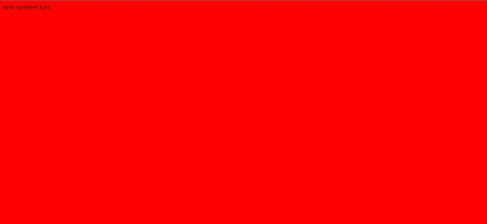

# 定义

在函数外部能修改这个函数的内部变量 叫闭包

```javascript
    function outer(){
        var i=1
        console.log('outer（）中的i:'+i)//只运行了一次,outer()调用
        return function (){
            i++ // 因为使用栈内存变量i , i的变量对象无法出栈, 每运行一次i加1
            console.log('闭包里的i:'+i)
        };

    }
    var outObj = outer();//运行一次
    outObj();//&2，执行i += 1后，val还在
    outObj();//&3
    outObj = null;//val 被回收
    var outObj1 = outer();
    outObj1();//&2
    outObj1();//*3
```

```javascript
   function outer() {
        var i = 1

        return function () {
            i++ // 因为使用栈内存变量i , i的变量对象无法出栈, 每运行一次i加1
            return i
        };

    }

    var outObj = outer();//运行一次
   console.log( outObj());
    console.log(outObj());

```

# 关于javascript的闭包、模块化以及单例模式

为什么放在一起？
模块化本身就自带闭包性质的体现。下面代码：

```
<span style="white-space:pre">	</span>//定义可多次实例化的模块foo
        function foo () {
            console.log("foo run");
            var num = 0;
            return {
                addNum: function () {
                    num++;
                },
                showNum: function () {
                    console.log(num);
                }
            }
        }
```


        var bar = foo();
        var zar = foo();
        bar.addNum();
        bar.showNum();
        zar.showNum();
     
        //使用IIFE的方式实例化模块tar，单例模式
        //IIFE会建立新作用域。这里因为在运行结束后返回了一个含有该作用域引用的函数，形成闭包
        var tar = (function () {
            console.log("tar run");
            var num = 0;
            return {
                addNum: function () {
                    num++;
                },
                showNum: function () {
                    console.log(num);
                }
            }
        })()
        tar.showNum();

什么是闭包呢？看下图：


# 深入理解javascript系列(十):模块化与闭包

**如果想在所有的地方都能访问同一个变量，那么应该怎么办呢？**

**在实践中这种场景很多，比如全局的状态管理。**

但前面我们介绍过，在实际开发中，不要轻易使用全局变量，那又该怎么办呢？模块化的思维能够帮助我们解决这个问题。

模块化开发是目前最流行，也是必须要掌握的一种开发思路。而模块化其实是建立在单例模式基础之上的，因此模块化开发和闭包息息相关。

目前流行的模块化开发思路，无论是require，还是ES6的modules，虽然实现方式不同，但是核心思路一样。因此为了方便大家理解模块化的思维，这里就以建立在函数自执行基础上的单例模式为例，一起来感受一下模块化开发的魅力。

**第一，请记住：每一个单例就是一个模块。**

其实，你也知道，每一个文件也是一个模块。而这里把每一个单例模式假想成一个单独的文件即可。定义一个模块，而变量名就是模块名。

```
var module_test = (function() {
    
})();复制代码
```

**第二，每一个模块要想与其他模块交互，则必须有获取其它模块的能力，例如requirejs中的require与ES6modules中的import。**

```
//require
var $ = require('jquery');

//es6 modules
import $ from 'jquery';复制代码
```

**第三，每一个模块都应该有对外的接口，以保证与其他模块交互的能力。这里直接使用return返回一个字面量对象的方式来对外提供接口。（你可以回顾一下现在那些模块的导出是多么便捷）**

```
var module_test = (function() {
      ...
      
      return {
          testfn1: function() {},
          testfn2: function() {}
      }  
})();复制代码
```

在我们结合一个简单的案例来走一遍模块化开发的流程。**这个例子想要实现的功能是每个一秒，body的背景色就随着一个数字的递增在固定的三种颜色之间切换。**

（1）**首先创建一个专门用来管理全局状态的模块。这个模块中有一个私有变量保存了所有的状态值，并对外提供了访问与设置这个私有变量的方法**，代码如下：
```
var module_status = (function() {
    var status = {
        number: 0,
        color: null
    }

    var get = function(prop) {
        return status[prop];
    }
    
    var set = function(prop,value) {
        status[prop] = value;
    }

    return {
        get,
        set
    }
})();复制代码
```

（2）在来创建一个模块，这个模块专门负责body背景颜色的改变。

```
var module_color = (function() {
    
    //假装用这种方式执行第二步引入模块
    //类似 import state from 'module_status';

    var state = module_status;
    var colors = ['yellow','#ccc','red'];

    function render() {
        var color = colors[state.get('number') % 3];
        document.body.style.backgroundColor = color;
    }

    return {
        render
    }
})();复制代码
```

在这个模块，引入了状态管理的模块，并且将颜色的管理与改变方式都定义在该模块中，因此在使用时我们只需调用render方法就可以了。

接下来我们还需要创建另外一个模块来负责显示当前的number的值，用于参考对比。

```
var module_context = (function() {
    var state = module_status;

    function renderNumber() {
        document.body.innerHTML = 'now number is' + state.get('number');
    }

    return {
        renderNumber
    }
})()复制代
```

这些功能模块都创建完毕后，最后我们只需创建一个主模块即可。这个主模块的目的就是借助功能模块，来实现我们想要的效果。

```
var module_main = (function() {
    var state = module_status;
    var color = module_color;
    var context = module_context;

    setInterval(function() {
        var newNumber = state.get('number') + 1;
        state.set('number',newNumber);

        color.render();
        context.renderNumber();
    },1000)
})();复制代码
```

好了，整一个模块化就完成了。你可以将整段代码插入到一个HTML文件script标签下即可看到展示效果。

```
<!DOCTYPE html>
<html lang="en">
<head>
    <meta charset="UTF-8">
    <title>change yourself</title>
</head>
<body>
<div id="app"></div>
</body>
</html>
<script>
    var module_status = (function() {
        var status = {
            number: 0,
            color: null
        }

        var get = function(prop) {
            return status[prop];
        }

        var set = function(prop,value) {
            status[prop] = value;
        }

        return {
            get,
            set
        }
    })();

    var module_color = (function() {

        //假装用这种方式执行第二步引入模块
        //类似 import state from 'module_status';

        var state = module_status;
        var colors = ['yellow','#ccc','red'];

        function render() {
            var color = colors[state.get('number') % 3];
            document.body.style.backgroundColor = color;
        }

        return {
            render
        }
    })();

    var module_context = (function() {
        var state = module_status;

        function renderNumber() {
            document.body.innerHTML = 'now number is' + state.get('number');
        }

        return {
            renderNumber
        }
    })();

    var module_main = (function() {
        var state = module_status;
        var color = module_color;
        var context = module_context;

        setInterval(function() {
            var newNumber = state.get('number') + 1;
            state.set('number',newNumber);

            color.render();
            context.renderNumber();
        },1000)
    })();
</script>复制代码
```

运行以上完整代码，就可以看到如果效果啦



当然它是每个一秒变一次的....