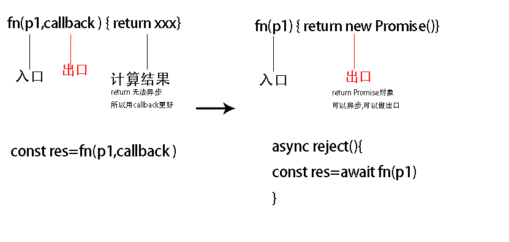
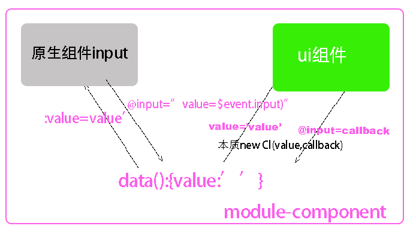
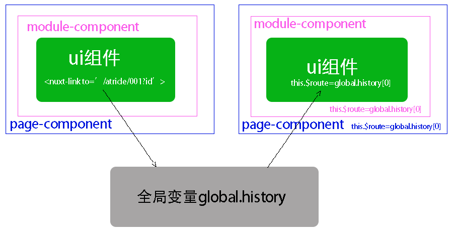

#  作用域

| \                            | global            | 块作用域             | 函数作用域                                                   | Script                 | 闭包                    | es6-module                                                   | node-module                         |
| ---------------------------- | ----------------- | -------------------- | ------------------------------------------------------------ | ---------------------- | ----------------------- | ------------------------------------------------------------ | ----------------------------------- |
| 隔离变量类型                 | 全局作用域        | const let            | const let var function                                       | const let class import | const let var function  | const let var  functionclass import                          | const let var  functionclass import |
|                              |                   |                      |                                                              |                        |                         |                                                              |                                     |
| 自由变量(作用域链)           | √                 | √                    | √                                                            | √                      | √                       | √                                                            | √                                   |
| 参数                         | x                 | x                    | fn(p1,callback),==作为数据的入口和出口== 例如fs.writeFile('./..' callback) | x                      | √                       | x                                                            | x                                   |
| 传入this变量(赋值对象的地址) | window和undefined | 继承函数作用域的this | 箭头函数继承this,<br />普通函数指定this                      | undefined              | 指定this                | undefined                                                    | global                              |
|                              |                   |                      |                                                              |                        |                         |                                                              |                                     |
| 输出关键字                   | x                 | do(浏览器未支持)     | return i (==返回值作为出口==) 例如fs.writeFileasync(path)    | x                      | ==return{ }==           | ==export{ }<br />export default==                            | ==modules.export==                  |
| 引入关键字                   |                   |                      | ==const i= fn( )==                                           |                        | ==const {i,refn}=fn()== | import {i,fn}from './export'<br />==接口类型   (引入方的i如果是普通值会随着expor.js里的i的改变而改变,)== | ==const i=require('')==             |

# 作用域之间通信

## 靠全局变量通信(一般用于文件间,global.xxx)

向下级函数作用域通信

```js
var i=1 ; global.i=1 
window.session
window.cookie
window.history
```

## es6-module\node-module\closure\return 出口通信

##### 输出方文件作用域的变量并没有注入global

import声明全局作用域变量 不注入global, 存放在module作用域里,不使用时间会销毁

```js
//#1  export.js

export let i = 1
//在自己的文件作用域运行 修改自由变量
export function fn(n) {
    i = n * 2
    console.log(i)
}
console.log('会跟随引入运行')
```

##### 引入变量到引入方文件作用域

```js
//#2  import.js
//import声明全局变量,还执行export.js文件作用域里的代码
import {i, fn} from './export'

    fn(10)

```

###### 先声明变量再引入变量到引入方文件作用域+注入到每个对象(发布-订阅模式 方便通信)

先const import声明的全局变量,再批量注入到对象的key里,通过`this`方便调用

```js
improt store from ‘./export’

const obj1={
      function fn(){ this.store},
     store
}

```

## 靠参数通信

本质就是函数参数变量赋值,实参赋值给形参变量,默认形参undefined		

参数 i 的函数数据的入口

参数callback作为函数数据的出口/使用promise可以用return做数据出口

return是函数的计算值



**例:**

```js
// 参数1 为数据入口,参数2为数据出口
Dog.find({name:'小黑'},(err,res)=>{console.log(res)})

```

```html
//vue父子通信
<man :name:"name" @say="fn"></man>
```

```html
//插槽通信
<cl v-slot='{vlaue}'> {{value}}   </cl>
```

```js
wx.request({
  url: 'test.php', //仅为示例，并非真实的接口地址
  data: {
    x: '',
    y: ''
  },
  header: {
    'content-type': 'application/json' // 默认值
  },
  success (res) {
    console.log(res.data)
  }
})
```


# 应用:vue通信

| __使用场景__ | 组件内部通信用     | 父子通信                   | 相应路由变化传少量数值,$route变化,然后引发异步数据或者相应的vuex数据 | 一般用于全局变量,<br />所有组件公用数据,每个组件都可以对此数据__增删改查__ |
| ------------ | ------------------ | -------------------------- | ------------------------------------------------------------ | ------------------------------------------------------------ |
| __本质__     | this.key做全局变量 | fn(I,callback)做入口和出口 | global.route变量做全局变量                                   | $store变量做全局变量                                         |

### 组件内通信 this.msg做公共变量

```js
data(){
return{value:''}
}
```


### 父子组件通信

**本质**  本质是回调函数 




### 非父子组件间通信

##### vuex

**本质:**发布订阅模式,$store作为公共变量通信,存放全局状态供若干组件使用,

建立$store,

通过mixin把$store的地址注入到每个组件里, 

一个组件都能更新$store

 其他vue组件监听$store变化,{{$store.state.xxx}}更新到视图


```js
   let store = {
        state: undefined,
        setState(i) {
            this.state = i
        }
    }

    class Vm {
        constructor(a, b) {
            this.a = a;
            this.b = b;
            this.$store = store
        }
    }

    let vm = new Vm(1, 2)
    vm.$store.setState(3)

    let vm2 = new Vm(10, 20)
    vm2.$store.setState(30)

```

##### $eventBus

**本质:**databus通信($eventBus作为公共变量)


```js
  Vue.prototype.$eventBus = new Vue() //$eventBus在一个组件

  Vue.component('cl1', {
    data() {
      return {value: ''}
    },
    template: `<ul><li v-for="item in 10" @click="$eventBus.$emit('sent',item)">{{item}}</li></ul>`

  })
  Vue.component('cl2', {
    data() {
      return {value: ''}
    },
    template: `<div>{{value}}</div>`,
    mounted() {

      this.$eventBus.$on('sent', res => {
        this.value = res
      })
    }

  })

  const vm = new Vue({
    el: '#app',


  })

```

### 页面组件通信

**本质**是global.history变量,通过浏览器history栈通信

