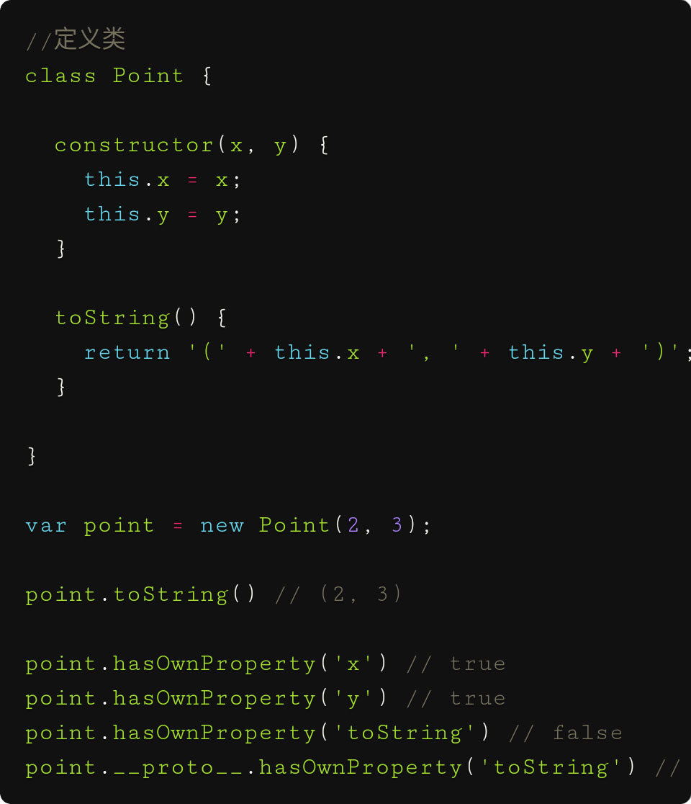

>prototype:[英:原型]

>property:[英:属性]

--------------------

# 类是概念

 类的作用是创造一类的若干对象的函数

类是构造函数的语法糖

 类本质是一个构造函数


```
 Class={
    staticFn:()=>{...}
    protorype:{
               instaceFn(){}
               }


   }

Class.staticFn:()

Class.protorype.instaceFn()
```
# 类的作用

### 产生对象

不用每个对象都要写一遍代码,解决代码冗余的问题

一切对象都是通过 new Fn(),构造函数的运行产生出来的,自己定义不同的构造函数，生产出各种对象

[1,2,3]是new Array (1,2,3)的语法糖

### 复用代码
 像某个型号汽车建设蓝图,生产这个型号的汽车
 类的作用,为了复用代码,extend 是扩展代码


### 类的扩展 extend
对原始的蓝图进行修改,产生新型号汽车的蓝图,用于生成新的汽车


# 类的特征


##### 类的三要素
1.   封装 私有变量不允许实例化对象访问,静态函数不允许子类继承
2.   继承 减少代码冗余,prototype复制一份给子类,this生成实例的hasOwnProp属性
3.   多态

##### 构造函数未传参的参数和普通函数一样默认undefine

vue对象的默认属性的值undefined构造函数调用new button(),实参传值给形参未赋值的形参为undefine

##### 构造函数this生成的属性和原型继承生成的属性
this生成的属性xxx,用Object.hasOwnPropory(xxx)===true

 

# js内置构造类
##### Object

js以不用类是通过Object实例化无限扩展比如{I:1 fn }

##### Array


# 类生成实例化对象也可以扩展


