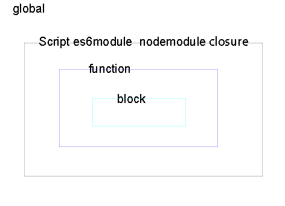
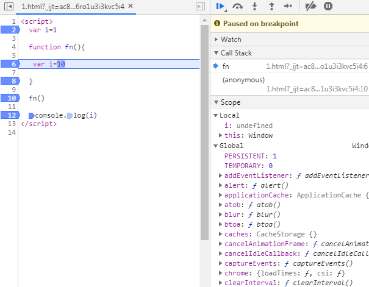
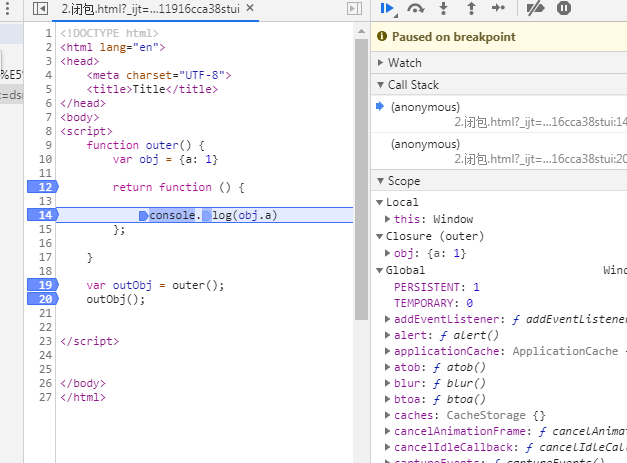
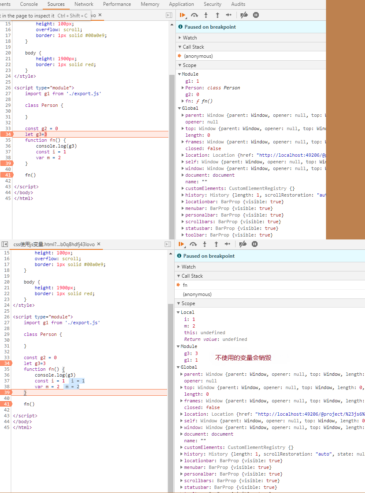
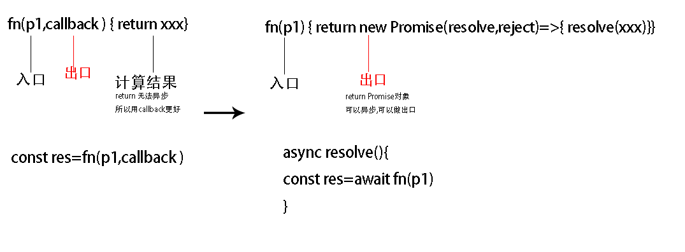
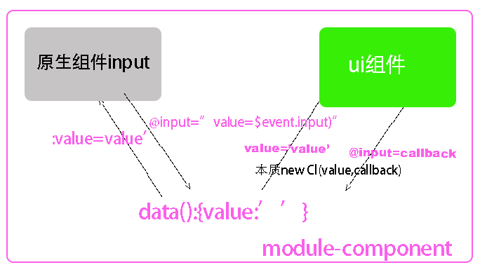
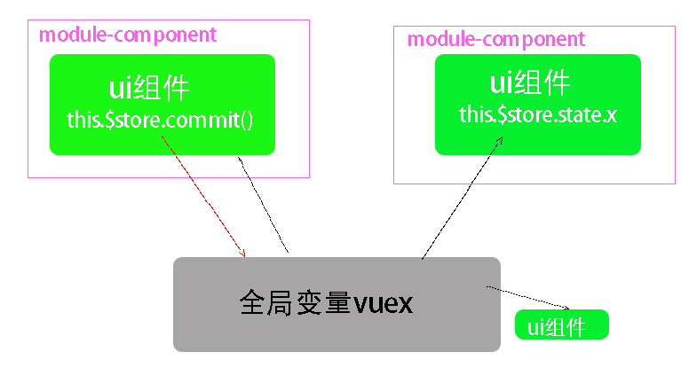
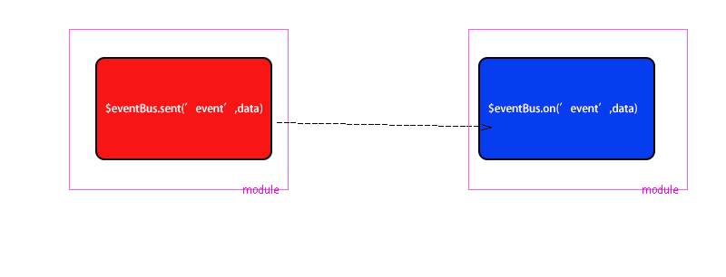

#  作用域



| \                          | global                  | Script          | es6-module                                                   | node-module                         | 闭包                      | 块作用域                 | 函数作用域                                                   |
| -------------------------- | ----------------------- | --------------- | ------------------------------------------------------------ | ----------------------------------- | ------------------------- | ------------------------ | ------------------------------------------------------------ |
| 声明自由变量的关键字       | i:1                     | const let class | const let var  functionclass import                          | const let var  functionclass import | const let var function    | const let                | const let var function                                       |
| 参数类型变量               | x                       | x               | x                                                            | x                                   | x                         | x                        | fn(p1,callback),==作为数据的入口和出口== <br />例如fs.writeFile('./..' callback) |
| this                       | window/global/undefined | undefined       | undefined                                                    | global                              | window                    | 继承上级函数作用域的this | 箭头函数继承this,<br />普通函数指定this                      |
|                            |                         |                 |                                                              |                                     |                           |                          |                                                              |
| 输出数据到作用域外的关键字 | x                       | x               | ==export{ i,fn}<br />export default{i,fn}==                  | ==modules.export==                  | ==return{i,f }==          | do(浏览器未支持)         | return i (==异步函数return作为出口==) 例如const i=await fs.writeFile(path) |
| 引入关键字                 | x                       | x               | import {i,fn}from './export'<br />==接口类型   (引入方的i如果是普通值会随着expor.js里的i的改变而改变,)== | ==const obj=require('')==           | ==const {i,f}=closure()== | cosnt i=do()             | ==const i= fn( )==                                           |

### function


 

### script

const let class的作用域


### closure




### module




使用:*.vue ,  *.js封装成文件作用域,vue运行构造函数时间调用

```
export default{
async data(){ return{}},
data(){ return{}},
methods:{}

}
```

# 作用域之间通信

## 靠全局作用域里的变量通信(global.history等系统变量)

向下级函数作用域通信

```js
var i=1 ; 
global.i=1 
window.session
window.cookie
window.history
```

## 模块化通信async function\es6-module\node-module\closure

##### export.js文件作用域的变量并没有注入global存放在module作用域里,不使用时间会销毁

```js
//#1  export.js

export let i = 1
//在自己的文件作用域运行 修改自由变量
export function fn(n) {
    i = n * 2
    console.log(i)
}
console.log('会跟随引入运行')
```

##### 引入变量到import.js文件作用域

```js
//#2  import.js
//import声明全局变量,还执行export.js文件作用域里的代码
import {i, fn} from './export'

    fn(10)

```

###### 引入变量到import.js文件作用域+注入到每个使用他的对象

先const import声明的全局变量,再批量注入到对象的key里,通过`this`方便调用

```js
improt store from ‘./export’

const obj1={
      function fn(){ this.store},
     store
}

```

## 回调函数通信

本质就是函数参数变量赋值,实参赋值给形参变量,默认形参undefined		

参数 i 的函数数据的入口

参数callback作为函数数据的出口/使用promise可以用return做数据出口

return是函数的计算值



**例:**

```js
// 参数1 为数据入口,参数2为数据出口
Dog.find({name:'小黑'},(err,res)=>{console.log(res)})

```

```html
//vue父子通信
<man :name:"name" @say="fn"></man>
```

```html
//插槽通信
<cl v-slot='{vlaue}'> {{value}}   </cl>
```

```js
wx.request({
  url: 'test.php', //仅为示例，并非真实的接口地址
  data: {
    x: '',
    y: ''
  },
  header: {
    'content-type': 'application/json' // 默认值
  },
  success (res) {
    console.log(res.data)
  }
})
```

# javascript的闭包、模块化以及单例模式

为什么放在一起？
模块化本身就自带闭包性质的体现。下面代码：

```js
//定义可多次实例化的模块foo
        function foo () {
            console.log("foo run");
            var num = 0;
            return {
                addNum: function () {
                    num++;
                },
                showNum: function () {
                    console.log(num);
                }
            }
        }
```

```js
    var bar = foo();
    var zar = foo();
    bar.addNum();
    bar.showNum();
    zar.showNum();
 
    //使用IIFE的方式实例化模块tar，单例模式
    //IIFE会建立新作用域。这里因为在运行结束后返回了一个含有该作用域引用的函数，形成闭包
    var tar = (function () {
        console.log("tar run");
        var num = 0;
        return {
            addNum: function () {
                num++;
            },
            showNum: function () {
                console.log(num);
            }
        }
    })()
    tar.showNum();
```

什么是闭包呢？看下图：


### 深入理解javascript系列(十):模块化与闭包

**如果想在所有的地方都能访问同一个变量，那么应该怎么办呢？**

**在实践中这种场景很多，比如全局的状态管理。**

但前面我们介绍过，在实际开发中，不要轻易使用全局变量，那又该怎么办呢？模块化的思维能够帮助我们解决这个问题。

模块化开发是目前最流行，也是必须要掌握的一种开发思路。而模块化其实是建立在单例模式基础之上的，因此模块化开发和闭包息息相关。

目前流行的模块化开发思路，无论是require，还是ES6的modules，虽然实现方式不同，但是核心思路一样。因此为了方便大家理解模块化的思维，这里就以建立在函数自执行基础上的单例模式为例，一起来感受一下模块化开发的魅力。

**第一，请记住：每一个单例就是一个模块。**

其实，你也知道，每一个文件也是一个模块。而这里把每一个单例模式假想成一个单独的文件即可。定义一个模块，而变量名就是模块名。

```
var module_test = (function() {
    
})();复制代码
```

**第二，每一个模块要想与其他模块交互，则必须有获取其它模块的能力，例如requirejs中的require与ES6modules中的import。**

```
//require
var $ = require('jquery');

//es6 modules
import $ from 'jquery';
```

**第三，每一个模块都应该有对外的接口，以保证与其他模块交互的能力。这里直接使用return返回一个字面量对象的方式来对外提供接口。（你可以回顾一下现在那些模块的导出是多么便捷）**

```
var module_test = (function() {
      ...
      
      return {
          testfn1: function() {},
          testfn2: function() {}
      }  
})();
```

在我们结合一个简单的案例来走一遍模块化开发的流程。**这个例子想要实现的功能是每个一秒，body的背景色就随着一个数字的递增在固定的三种颜色之间切换。**

（1）**首先创建一个专门用来管理全局状态的模块。这个模块中有一个私有变量保存了所有的状态值，并对外提供了访问与设置这个私有变量的方法**，代码如下：

```
var module_status = (function() {
    var status = {
        number: 0,
        color: null
    }

    var get = function(prop) {
        return status[prop];
    }
    
    var set = function(prop,value) {
        status[prop] = value;
    }

    return {
        get,
        set
    }
})();复制代码
```

（2）在来创建一个模块，这个模块专门负责body背景颜色的改变。

```
var module_color = (function() {
    
    //假装用这种方式执行第二步引入模块
    //类似 import state from 'module_status';

    var state = module_status;
    var colors = ['yellow','#ccc','red'];

    function render() {
        var color = colors[state.get('number') % 3];
        document.body.style.backgroundColor = color;
    }

    return {
        render
    }
})();复制代码
```

在这个模块，引入了状态管理的模块，并且将颜色的管理与改变方式都定义在该模块中，因此在使用时我们只需调用render方法就可以了。

接下来我们还需要创建另外一个模块来负责显示当前的number的值，用于参考对比。

```
var module_context = (function() {
    var state = module_status;

    function renderNumber() {
        document.body.innerHTML = 'now number is' + state.get('number');
    }

    return {
        renderNumber
    }
})()复制代
```

这些功能模块都创建完毕后，最后我们只需创建一个主模块即可。这个主模块的目的就是借助功能模块，来实现我们想要的效果。

```
var module_main = (function() {
    var state = module_status;
    var color = module_color;
    var context = module_context;

    setInterval(function() {
        var newNumber = state.get('number') + 1;
        state.set('number',newNumber);

        color.render();
        context.renderNumber();
    },1000)
})();复制代码
```

好了，整一个模块化就完成了。你可以将整段代码插入到一个HTML文件script标签下即可看到展示效果。

```
<!DOCTYPE html>
<html lang="en">
<head>
    <meta charset="UTF-8">
    <title>change yourself</title>
</head>
<body>
<div id="app"></div>
</body>
</html>
<script>
    var module_status = (function() {
        var status = {
            number: 0,
            color: null
        }

        var get = function(prop) {
            return status[prop];
        }

        var set = function(prop,value) {
            status[prop] = value;
        }

        return {
            get,
            set
        }
    })();

    var module_color = (function() {

        //假装用这种方式执行第二步引入模块
        //类似 import state from 'module_status';

        var state = module_status;
        var colors = ['yellow','#ccc','red'];

        function render() {
            var color = colors[state.get('number') % 3];
            document.body.style.backgroundColor = color;
        }

        return {
            render
        }
    })();

    var module_context = (function() {
        var state = module_status;

        function renderNumber() {
            document.body.innerHTML = 'now number is' + state.get('number');
        }

        return {
            renderNumber
        }
    })();

    var module_main = (function() {
        var state = module_status;
        var color = module_color;
        var context = module_context;

        setInterval(function() {
            var newNumber = state.get('number') + 1;
            state.set('number',newNumber);

            color.render();
            context.renderNumber();
        },1000)
    })();
</script>复制代码
```

运行以上完整代码，就可以看到如果效果啦


当然它是每个一秒变一次的....


# 应用:vue通信

| __使用场景__ | 组件内部通信用                 | 父子通信                   | 相应路由变化传少量数值,route变化,然后引发异步数据或者相应的vuex数据 | 一般用于全局变量,<br />所有组件公用数据,每个组件都可以对此数据__增删改查__ |
| ------------ | ------------------------------ | -------------------------- | ------------------------------------------------------------ | ------------------------------------------------------------ |
| __本质__     | this.key/this.$store做全局变量 | fn(I,callback)做入口和出口 | global.route变量做全局变量                                   | $store变量做全局变量                                         |

### 组件内通信 this.key做公共变量

```js
data(){
return{value:''}
}
```


### 父子组件通信

**本质**  本质是回调函数  参数通信




### 非父子组件间通信

##### vuex 

module通信

$store作为公共变量,存放全局状态供若干组件使用,

通过mixin把$store的地址注入到每个组件里, 

一个组件都能更新$store

 其他vue组件监听$store的变化更新到视图




```js
   let store = {
        state: undefined,
        setState(i) {
            this.state = i
        }
    }

    class Vm {
        constructor(a, b) {
            this.a = a;
            this.b = b;
            this.$store = store
        }
    }

    let vm = new Vm(1, 2)
    vm.$store.setState(3)

    let vm2 = new Vm(10, 20)
    vm2.$store.setState(30)

```

##### $eventBus

**本质:**databus通信($eventBus作为公共变量 module通信)



```js
  Vue.prototype.$eventBus = new Vue() //$eventBus在一个组件

  Vue.component('cl1', {
    data() {
      return {value: ''}
    },
    template: `<ul><li v-for="item in 10" @click="$eventBus.$emit('sent',item)">{{item}}</li></ul>`

  })
  Vue.component('cl2', {
    data() {
      return {value: ''}
    },
    template: `<div>{{value}}</div>`,
    mounted() {

      this.$eventBus.$on('sent', res => {
        this.value = res
      })
    }

  })

  const vm = new Vue({
    el: '#app',


  })

```

### 页面组件通信

**本质**是global.history变量,通过浏览器history栈通信

