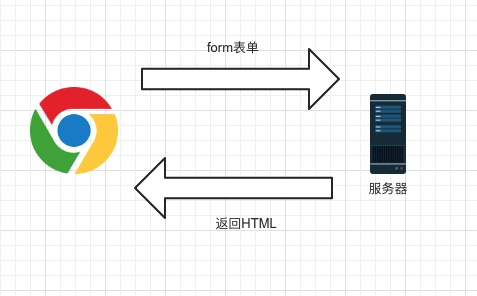
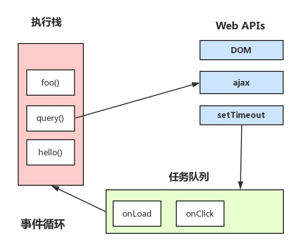
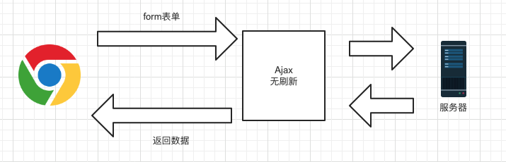

### Ajax和form的局别

前端程序员常说的Ajax是 `Asynchronous JavaScript and XML`的缩写，意思是异步网络请求。区别于传统web开发中采用的同步方式。

Ajax带来的最大影响就是页面可以无刷新的请求数据。以往，页面表单提交数据，在用户点击完”submit“按钮后，页面会强制刷新一下，体验十分不友好。

### 传统web请求方式：

页面跳转通信

form提交需要action到php页面和后端进行数据提交和拉取

### 使用Ajax后请求：

另开异步进程  页面不跳转通信

网页不发生form提交,通过ajax后端进行数据提交和拉取

### 携带cookie

ajax不能携带cookie,http请求可以携带cookie

