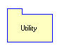
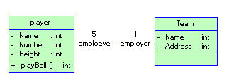
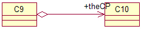

#### 结构元素

结构元素包括，类，对象，接口，用例，参与者。

##### 类图

类图图示

   类图是UML中最基本的元素了吧？根据OO的思想“天下一切皆对象”，而类是对象的抽象。 
   左侧图示为一个类图。顶端“ClassName”表示类名 
   中间部分为该类的属性，其中分别表示为可访问性，属性名，以及属性的数据类型。 
   第三部分为该类的方法，包括方法的可访问性，方法名，方法的参数以及方法的返回值。 
   需要说明的是：

- ​     “#”表示protected 
  ​     “+”表示Public
  ​     “-”表示private
  ​                   “i”表示internal

对象图图示

##### 对象图

右侧图示为一对象图，该对象为类className类的一个实例对象

该图第一部分说明了该对象为className的一个实例，第二部分指定了该实例的属性值。该图指定的是一个特殊的实例的对象，如果要代表className的所有的对象可省略掉对象名，即为“:ClassName”。

##### 接口

类图图示

左图为一个比较简单的接口事例图示。与类图差不多，该图示分为三部分，第一部分为接口名，为了更明确的标明其“接口”的身份通常以“I”开头。第二部分为属性，第三部分为方法。

 

##### 用例与参与者

下图为一简单的用例视图。小人表示参与者，而椭圆表示的是用例。

用例与参与者图示

包图图示

##### 包

右侧图示为一包图，该图示为一名称为Utility的工具包。

包用来组织类，被包含在包里的类一般通过如Utility::StrUtility的形式来反应该类的路径。

#### 关系

   关系元素包括了聚集，组成，实现，继承，依赖，关联等。

##### 关联

关联图示

   关联是类之间的联系，如篮球队员与球队之间的关联（下图所示）。其中，关联两边的"employee"和“employer”标示了两者之间的关系，而数字表示两者的关系的限制，是关联两者之间的多重性。通常有“*”（表示所有，不限），“1”（表示有且仅有一个），“0...”（表示0个或者多个），“0，1”（表示0个或者一个），“n...m”(表示n到m个都可以),“m...*”（表示至少m个）。
   在关联中有一种叫“限定关联”，还有一种谓之自身关联。另外，对象之间的关联就没那么复杂，只是将类的关联实例化而已。

##### 依赖

依赖图示

依赖是表示一个类中使用了另外一个类，最常用的依赖是在类A的方法中使用了类B，那么A依赖B。如上图所示。

##### 继承

继承图示

这里的继承是指子类对父类的关系。理解面向对象的各位对继承应该不陌生。啥也不说，看看图好了。
继承使用空心箭头表示继承的方向，用实线连接。

##### 实现

实现图示

实现指的是类对接口的实现。接口实现的表示与继承的表示差不多，只是将实线变为了虚线。

##### 聚集

聚集图示

一个类可能有几个部分类聚集在一起而成。如：电脑主机由CPU，主板，光驱....等组成。类与类之间是“整体-部分”的关系。

##### 组合

组成图示

组成是强类型的聚集，每个部分体只能属于一个整体。如桌子由桌腿和桌面组成。

# [UML类图关系大全](http://www.cnblogs.com/riky/archive/2007/04/07/704298.html)

1、关联

双向关联：
C1-C2：指双方都知道对方的存在，都可以调用对方的公共属性和方法。

在GOF的设计模式书上是这样描述的：虽然在分析阶段这种关系是适用的，但我们觉得它对于描述设计模式内的类关系来说显得太抽象了，因为在设计阶段关联关系必须被映射为对象引用或指针。对象引用本身就是有向的，更适合表达我们所讨论的那种关系。所以这种关系在设计的时候比较少用到，关联一般都是有向的。

使用ROSE 生成的代码是这样的：

class C1 
...{
public:
  C2* theC2;

};

class C2 
...{
public:
  C1* theC1;

};

双向关联在代码的表现为双方都拥有对方的一个指针，当然也可以是引用或者是值。

单向关联:
C3->C4：表示相识关系，指C3知道C4，C3可以调用C4的公共属性和方法。没有生命期的依赖。一般是表示为一种引用。

生成代码如下：

class C3 
...{
public:
  C4* theC4;

};

class C4 
...{

};

单向关联的代码就表现为C3有C4的指针，而C4对C3一无所知。

自身关联（反身关联）：
自己引用自己，带着一个自己的引用。

代码如下：

class C14 
...{
public:
  C14* theC14;

};

就是在自己的内部有着一个自身的引用。

2、聚合/组合

当类之间有整体-部分关系的时候，我们就可以使用组合或者聚合。

聚合：表示C9聚合C10，但是C10可以离开C9而独立存在（独立存在的意思是在某个应用的问题域中这个类的存在有意义。这句话怎么解，请看下面组合里的解释）。

代码如下：

class C9 
...{
public:
  C10 theC10;

};

class C10 
...{

};

 

组合（也有人称为包容）：一般是实心菱形加实线箭头表示，如上图所示，表示的是C8被C7包容，而且C8不能离开C7而独立存在。但这是视问题域而定的，例如在关心汽车的领域里，轮胎是一定要组合在汽车类中的，因为它离开了汽车就没有意义了。但是在卖轮胎的店铺业务里，就算轮胎离开了汽车，它也是有意义的，这就可以用聚合了。在《敏捷开发》中还说到，A组合B，则A需要知道B的生存周期，即可能A负责生成或者释放B，或者A通过某种途径知道B的生成和释放。

他们的代码如下：

class C7 
...{
public:
  C8 theC8;

};

class C8 
...{
};

可以看到，代码和聚合是一样的。具体如何区别，可能就只能用语义来区分了。

3、依赖

依赖:
指C5可能要用到C6的一些方法，也可以这样说，要完成C5里的所有功能，一定要有C6的方法协助才行。C5依赖于C6的定义，一般是在C5类的头文件中包含了C6的头文件。ROSE对依赖关系不产生属性。

注意，要避免双向依赖。一般来说，不应该存在双向依赖。

ROSE生成的代码如下：

// C5.h
#include "C6.h"

class C5 
...{

};

// C6.h
#include "C5.h"

class C6
...{

};

虽然ROSE不生成属性，但在形式上一般是A中的某个方法把B的对象作为参数使用(假设A依赖于B)。如下：

#include "B.h"
class A
...{
     void Func(B &b);
}

那依赖和聚合\组合、关联等有什么不同呢？

关联是类之间的一种关系，例如老师教学生，老公和老婆，水壶装水等就是一种关系。这种关系是非常明显的，在问题领域中通过分析直接就能得出。

依赖是一种弱关联，只要一个类用到另一个类，但是和另一个类的关系不是太明显的时候（可以说是“uses”了那个类），就可以把这种关系看成是依赖，依赖也可说是一种偶然的关系，而不是必然的关系，就是“我在某个方法中偶然用到了它，但在现实中我和它并没多大关系”。例如我和锤子，我和锤子本来是没关系的，但在有一次要钉钉子的时候，我用到了它，这就是一种依赖，依赖锤子完成钉钉子这件事情。

组合是一种整体-部分的关系，在问题域中这种关系很明显，直接分析就可以得出的。例如轮胎是车的一部分，树叶是树的一部分，手脚是身体的一部分这种的关系，非常明显的整体-部分关系。

上述的几种关系（关联、聚合/组合、依赖）在代码中可能以指针、引用、值等的方式在另一个类中出现，不拘于形式，但在逻辑上他们就有以上的区别。

这里还要说明一下，所谓的这些关系只是在某个问题域才有效，离开了这个问题域，可能这些关系就不成立了，例如可能在某个问题域中，我是一个木匠，需要拿着锤子去干活，可能整个问题的描述就是我拿着锤子怎么钉桌子，钉椅子，钉柜子；既然整个问题就是描述这个，我和锤子就不仅是偶然的依赖关系了，我和锤子的关系变得非常的紧密，可能就上升为组合关系（让我突然想起武侠小说的剑不离身，剑亡人亡...）。这个例子可能有点荒谬，但也是为了说明一个道理，就是关系和类一样，它们都是在一个问题领域中才成立的，离开了这个问题域，他们可能就不复存在了。

4、泛化（继承）

泛化关系：如果两个类存在泛化的关系时就使用，例如父和子，动物和老虎，植物和花等。
ROSE生成的代码很简单，如下：

#include "C11.h"

class C12 : public C11
...{
};

5、这里顺便提一下模板

上面的图对应的代码如下：

template<int>
class C13 
...{
};

这里再说一下重复度，其实看完了上面的描述之后，我们应该清楚了各个关系间的关系以及具体对应到代码是怎么样的，所谓的重复度，也只不过是上面的扩展，例如A和B有着“1对多”的重复度，那在A中就有一个列表，保存着B对象的N个引用，就是这样而已。

好了，到这里，已经把上面的类图关系说完了，希望你能有所收获了，我也费了不少工夫啊（画图、生成代码、截图、写到BLOG上，唉，一头大汗）。不过如果能让你彻底理解UML类图的这些关系，也值得了。:)

+++++++++++++++++++++++++++++++++++++++++++++++++++++

在UML建模中，对类图上出现元素的理解是至关重要的。开发者必须理解如何将类图上出现的元素转换到Java中。以java为代表结合网上的一些实例，下面是个人一些基本收集与总结：

 

基本元素符号：

 

\1. 类（Classes）

类包含3个组成部分。第一个是Java中定义的类名。第二个是属性（attributes）。第三个是该类提供的方法。

属性和操作之前可附加一个可见性修饰符。加号（+）表示具有公共可见性。减号（-）表示私有可见性。#号表示受保护的可见性。省略这些修饰符表示具有package（包）级别的可见性。如果属性或操作具有下划线，表明它是静态的。在操作中，可同时列出它接受的参数，以及返回类型，如下图所示：

 

　　2. 包（Package）

包是一种常规用途的组合机制。UML中的一个包直接对应于Java中的一个包。在Java中，一个包可能含有其他包、类或者同时含有这两者。进行建模时，你通常拥有逻辑性的包，它主要用于对你的模型进行组织。你还会拥有物理性的包，它直接转换成系统中的Java包。每个包的名称对这个包进行了惟一性的标识。

　　3. 接口（Interface）

接口是一系列操作的集合，它指定了一个类所提供的服务。它直接对应于Java中的一个接口类型。接口既可用下面的那个图标来表示（上面一个圆圈符号，圆圈符号下面是接口名，中间是直线，直线下面是方法名），也可由附加了<<interface>>的一个标准类来表示。通常，根据接口在类图上的样子，就能知道与其他类的关系。

关　系：

 

\1. 依赖（Dependency）

实体之间一个“使用”关系暗示一个实体的规范发生变化后，可能影响依赖于它的其他实例。更具体地说，它可转换为对不在实例作用域内的一个类或对象的任何类型的引用。其中包括一个局部变量，对通过方法调用而获得的一个对象的引用（如下例所示），或者对一个类的静态方法的引用（同时不存在那个类的一个实例）。也可利用“依赖”来表示包和包之间的关系。由于包中含有类，所以你可根据那些包中的各个类之间的关系，表示出包和包的关系。

　　2. 关联（Association）

实体之间的一个结构化关系表明对象是相互连接的。箭头是可选的，它用于指定导航能力。如果没有箭头，暗示是一种双向的导航能力。在Java中，关联转换为一个实例作用域的变量，就像图E的“Java”区域所展示的代码那样。可为一个关联附加其他修饰符。多重性（Multiplicity）修饰符暗示着实例之间的关系。在示范代码中，Employee可以有0个或更多的TimeCard对象。但是，每个TimeCard只从属于单独一个Employee。

 

 

\3. 聚合（Aggregation）

聚合是关联的一种形式，代表两个类之间的整体/局部关系。聚合暗示着整体在概念上处于比局部更高的一个级别，而关联暗示两个类在概念上位于相同的级别。聚合也转换成Java中的一个实例作用域变量。

关联和聚合的区别纯粹是概念上的，而且严格反映在语义上。聚合还暗示着实例图中不存在回路。换言之，只能是一种单向关系。

　　4. 合成（Composition）

合成是聚合的一种特殊形式，暗示“局部”在“整体”内部的生存期职责。合成也是非共享的。所以，虽然局部不一定要随整体的销毁而被销毁，但整体要么负责保持局部的存活状态，要么负责将其销毁。

局部不可与其他整体共享。但是，整体可将所有权转交给另一个对象，后者随即将承担生存期职责。Employee和TimeCard的关系或许更适合表示成“合成”，而不是表示成“关联”。

　　5. 泛化（Generalization）

泛化表示一个更泛化的元素和一个更具体的元素之间的关系。泛化是用于对继承进行建模的UML元素。在Java中，用extends关键字来直接表示这种关系。

 

　　6. 实现（Realization）

实例关系指定两个实体之间的一个合同。换言之，一个实体定义一个合同，而另一个实体保证履行该合同。对Java应用程序进行建模时，实现关系可直接用implements关键字来表示。