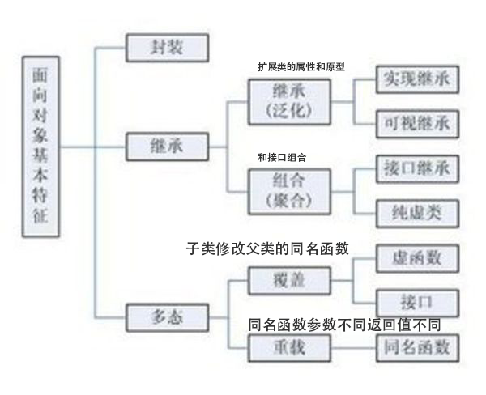
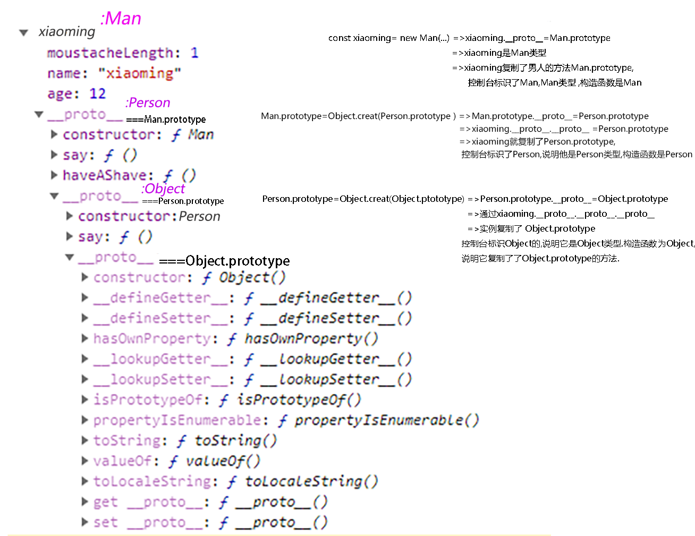
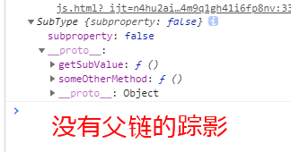
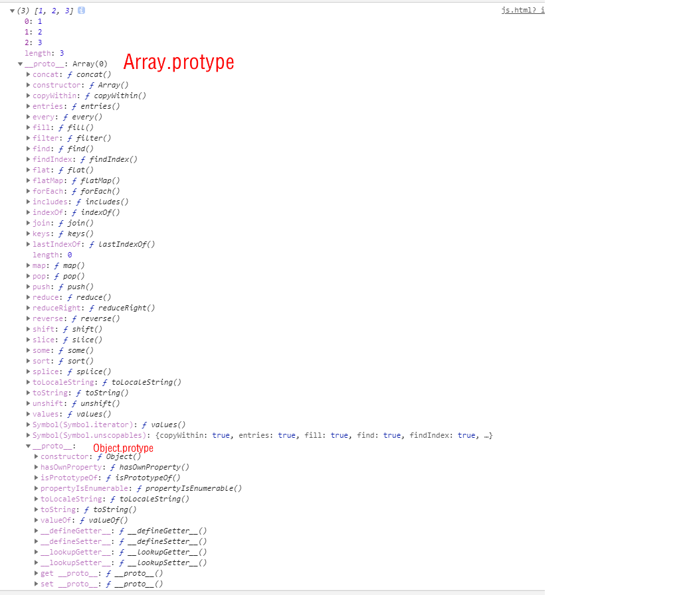

# 函数(做什么)

## 程序中的耦合和解耦（回调函数的本质就是解耦）

一、耦合

1、耦合是指两个或两个以上的体系或两种运动形式间通过相互作用而彼此影响以至联合起来的现象。

2、在软件工程中，对象之间的耦合度就是对象之间的依赖性。对象之间的耦合越高，维护成本越高，因此对象的设计应使类和构件之间的耦合最小。

3、分类：有软硬件之间的耦合，还有软件各模块之间的耦合。耦合性是程序结构中各个模块之间相互关联的度量。它取决于各个模块之间的接口的复杂程度、调用模块的方式以及哪些信息通过接口。

二、解耦

1、解耦，字面意思就是解除耦合关系。

2、在软件工程中，降低耦合度即可以理解为解耦，模块间有依赖关系必然存在耦合，理论上的绝对零耦合是做不到的，但可以通过一些现有的方法将耦合度降至最低。

3、设计的核心思想：尽可能减少代码耦合，如果发现代码耦合，就要采取解耦技术。让数据模型，业务逻辑和视图显示三层之间彼此降低耦合，把关联依赖降到最低，而不至于牵一发而动全身。原则就是A功能的代码不要写在B的功能代码中，如果两者之间需要交互，可以通过接口，通过消息，甚至可以引入框架，但总之就是不要直接交叉写。

4、观察者模式：观察者模式存在的意义就是「解耦」，它使观察者和被观察者的逻辑不再搅在一起，而是彼此独立、互不依赖。比如网易新闻的夜间模式，当用户切换成夜间模式之后，被观察者会通知所有的观察者「设置改变了，大家快蒙上遮罩吧」。QQ消息推送来了之后，既要在通知栏上弹个推送，又要在桌面上标个小红点，也是观察者与被观察者的巧妙配合。

##  函数解耦:

### 参数和函数体解耦

|          | 函数       | 构造函数                                                     | less-mixin                      | 强类型语言                                     |
| -------- | ---------- | ------------------------------------------------------------ | ------------------------------- | ---------------------------------------------- |
| 函数语句 | 相同的部分 | 实例化对象们共同属性_:_不同属性值的语句,this.mame=name<br />实例化对象们共同的原型方法:  _ _prototype_ _ | 一个css类的定义部分             | 做什么,逻辑语句封装                            |
| 参数     | 不同的地方 | 实例化对象们的不同属性值                                     | 这个css类中的属性取不同的属性值 | ==谁去做(参数为对象,面向对象,强类型语言检测)== |

```javascript
//原始js
const Koa = require('koa')
const app = new Koa()
app.use((ctx, next) => { //1,2 不同的地方 ,其他相同的地方
    ctx.body = '1',
        next()
    ctx.body += 2
})
app.use((ctx, next) => {
    ctx.body += '3',
        next()
    ctx.body += 4
})
app.use((ctx, next) => {
    ctx.body += '5',
        next()
    ctx.body += 6
})
app.listen(3000)
console.log(":3000")

```

函数封装

```javascript
const Koa = require('koa')
const app = new Koa()

function callback(m, n) { //m,n 不用的地方

    return (ctx, next) => { //函数体相同的地方
        if (!ctx.body) {
            ctx.body = m
        }else {
            ctx.body += m
        }


        next()
        ctx.body += n
    }

}

app.use(callback('1', '2'))
app.use(callback('3', '4'))
app.use(callback('5', '6'))
app.listen(3000)


```

进一步封装

```javascript
const Koa = require('koa')
const app = new Koa()

function fn(m, n) { //m,n 不用的地方

    app.use((ctx, next) => { //函数体相同的地方
        if (!ctx.body) {
            ctx.body = m
        } else {
            ctx.body += m
        }
        next()
        ctx.body += n
    })

}

fn('1', '2')
fn('3', '4')
fn('5', '6')
app.listen(3000)

```

### 语义化封装

##### 一个语义的封装成函数

无语义代码

```javascript
   function f() {
        let i = 0
        i++
        i *= 50
        console.log(i)
    }

    f()
```

语义分离了 但是未解耦

```
  function add() {
        let i = 0
        i++
        return i
    }

    function chengfa() {
    //这里耦合了
        let i = add()
        i *= 50
        console.log(i)
    }

    chengfa()
```

公共变量通信解耦

```javascript
    function add(i) {

        i++
        return i
    }

    function chengfa(i) {

        i *= 50
        console.log(i)
    }
    let i= add(1)
    chengfa(i)
```

##### 一个功能的封装成一个函数

```javascript
    //负责相加
    function add(a, b) {
        return a + b
    }

    //负责打印
    function print(data) {
        console.log(data)
    }

    const data = add(1, 2)
    print(data)

```

##### 复杂条件语句表达式分离封装起来

```javascript
var getPrice = function( price ){
 var date = new Date();
 if ( date.getMonth() >= 6 && date.getMonth() <= 9 ){ // 夏天
 return price * 0.8;
 }
 return price;
};

```

分离

```javascript
var isSummer = function(){
 var date = new Date();
 return date.getMonth() >= 6 && date.getMonth() <= 9;
};
var getPrice = function( price ){
 if ( isSummer() ){ // 夏天
 return price * 0.8;
 }
 return price;
};
```

##### component内聚(本质是构造函数封装)

耦合代码

```html
<script src="https://cdn.bootcss.com/vue/2.5.17-beta.0/vue.js"></script>
<div id="app">
    <!--点击改变value的值,value改变dom自动更新-->
    <ul>
        <li v-for="item in 4" @click="value=item" :class="value===item?'active':''">
           <button>{{item}}</button>
        </li>
    </ul>
    <br>
    {{value}}
</div>

<script>
    const vm = new Vue({
        el: '#app',
        data() {
            return {
                value: 1
            }
        }
    })

</script>

<style>
    .active {
        color: red;
    }

</style>
```

```html
<script src="https://cdn.bootcss.com/vue/2.5.17-beta.0/vue.js"></script>
<div id="app">
    <!--点击改变value的值,value改变dom自动更新-->
    <cl v-model="value"></cl>
    <br>
    {{value}}
</div>

<script>
    const cl = {
        template: ` <ul>
                        <li v-for="item in 4"
                         @click="$emit('input',item)"
                         :class="item===value?'active':''">
                           <button> {{item}}</button>
                        </li>
                       </ul>`,
        props: ['value']
    }
    const vm = new Vue({
        el: '#app',
        data() {
            return {
                value: 1
            }
        },
        components: {cl}
    })

</script>

<style>
    .active {
        color: red;
    }

</style>
```

<slot/>组件 (本质回调函数)

```html
<script src="https://cdn.bootcss.com/vue/2.5.17-beta.0/vue.js"></script>
<div id="app">
    <!--value是变量媒介,v-model参数-->
    <cl v-model="value">

        <template scope="{item}">
            <button>
                {{item}}
            </button>
        </template>
    </cl>
    {{value}}
</div>

<script>
    const cl = {
        template: ` <ul>
                        <li v-for="item in 4"
                         @click="$emit('input',item)"
                         :class="item===value?'active':''"
                       >
                     <!--    // item是变量媒介 scope是参数-->
                       <slot :item="item">


                      </slot>

                        </li>
                       </ul>`,
        props: ['value']
    }
    const vm = new Vue({
        el: '#app',
        data() {
            return {
                value: 1
            }
        },
        components: {cl}
    })

</script>

<style>
    .active {
        color: red;
    }

</style>

```

##### filter

本质也是函数封装

```html
<script src="https://cdn.bootcss.com/vue/2.5.17-beta.0/vue.js"></script>
<div id="app">
  <!--value是变量媒介,v-model参数-->
  <cl v-model="value" :data="10">

    <template scope="{item}">
      <button>
        {{item|mark(2)}}
      </button>
    </template>
  </cl>
  {{value}}
</div>

<script>
  const cl = {
    template: ` <ul>
                        <li v-for="item in data"
                         @click="$emit('input',item)"
                         :class="item===value?'active':''"
                       >
                     <!--    // item是变量媒介 scope是参数-->
                       <slot :item="item">


                      </slot>

                        </li>
                       </ul>`,
    props: ['value', 'data']
  }
  const vm = new Vue({
    el: '#app',
    data() {
      return {
        value: 1
      }
    },
    components: {cl},
    filters: {
      mark(value, n) {
        return `-${value}-`
      }
    }
  })

</script>

<style>
  .active {
    color: red;
  }

</style>

```

##### v-direct本质也是函数封装

```html
<body>
<meta charset="UTF-8">
<script src="https://cdn.bootcss.com/vue/2.5.17-beta.0/vue.js"></script>
<link href="https://cdn.bootcss.com/animate.css/3.7.0/animate.css" rel="stylesheet">
<div id="app">
    <input v-focus type="text">

</div>


</body>
<script>
    Vue.directive('focus', {
        // 当被绑定的元素插入到 DOM 中时……
        inserted: function (el) {
            // 聚焦元素
            el.focus()
        }
    })
    var vm = new Vue({
        el: "#app",
        data: {msg: 1},
    });


</script>


```

##### < route-view />解耦

```html
<script src="https://cdn.bootcss.com/vue/2.5.17-beta.0/vue.js"></script>
<script src="https://cdn.bootcss.com/vue-router/3.0.1/vue-router.min.js"></script>
<div id="app">

    <ul>
        <li v-for="item in 4">
            <!--传数据给$router-->
            <router-link :to="{path:`/${item}`}">

                {{item}}
            </router-link>

        </li>
    </ul>
    <!--读取组件信息-->
    <router-view></router-view>
</div>

<script>
    const mycomponent = {
        template: `<div>{{id}}</div>`,
        props: ['id']
    }
    const router = new VueRouter({
        linkActiveClass: 'active',
        routes: [

            {
                path: '/:id',
                name: 'id',
                // 路由解耦，parame作为组件mycomponent的属性值
                props: true,
                component:mycomponent
            }]
    })
    const vm = new Vue({
        el: '#app',
        router,
        data() {
            return {
                value: 1
            }
        }
    })

</script>

<style>
    .active {
        color: red;
    }

</style>
```


### 函数代码优化

##### 合并条件语句里的重复语句

```javascript
//原始语句
function PrintPage(currPage) {
        if (currPage <= 0) {
            currPage = 1
            console.log(currPage)
        } else if (currPage > 10) {
            currPage = 10
            console.log(currPage)
        } else {
            console.log(currPage)
        }

    }
```

```js
   //合并条件语句
   function PrintPage_(currPage) {
        if (currPage <= 0) {
            currPage = 1

        } else if (currPage > 10) {
            currPage = 10
        }
        console.log(currPage)
    }

    PrintPage_(11)
```


# 面向对象的思想(谁去做)

##### 强类型语言和弱类型语言

| 强类型                                                       | 弱类型                                                       |
| ------------------------------------------------------------ | ------------------------------------------------------------ |
| 强类型指的是每个变量和对象都必须声明类型，在编译时类型不能更改； | 提前声明,编译时才确定类型                                    |
| 强类型语言的函数声明时编译时会检查参数类型,把做什么(函数)和谁去做(类型检测)分开 | 弱类型函数没有类型检查,像什么就是什么(无类型检测),谁去做(函数) |
| 安全，效率高                                                 | 不安全,编译时间才发现错误                                    |

```javascript
   var dog = 1 //数字类

    class Dog { //dog类
        constructor(age, color) {
            this.age = age
            this.color = color
        }

        cry() {
            console.log('汪汪汪')
        }

    }

    dog = new Dog(12, 'red') //变量类型可变

    console.log(dog)

    function cry(dog) { //函数参数也不用检查类型
        dog.cry()
    }

    cry(dog)
    
```


##### 类:有共同特征的一类对象的蓝图,有共同属性和共同功能的一类事物

-  数字类 ,->数字实例123
-   字符串类,->字符串实例'ab'
-   对象类->数组类->数组实例[1,2,3]
-    人类->男人->小李

```js
function Person(id,name,age,friend){
                 this.id=id:
                 this.name=name;
                 this.age=age;
                 this.friend=friend
                 } //函数表达式,构造函数Person的内存地址可变,但是变了就没意义了

Person.prototype={..... } //给实例复制的原型
Person.number=0    //静态属性
Person.sort=funciont(){} //静态函数
```

##### 类的实例化对象

###### 返回一类事物的一个实例

```javascript
//新建一个人的信息
const xiaoli=new Person()
```

###### 实例属于什么类型: 

{id:001,name:'xiaoli'}是人类型的

###### 对象/数组描述一个对象/一组对象


# 面向对象的优点

1. 维护简单
   面向对象程序设计的一个特征就是模块化。实体可以被表示为类以及同一名字空间中具有相同功能的类，可以在名字空间中添加一个类而不影响该名字空间的其他成员。这种特征为程序的维护提供了便捷性。
2. 可扩充性
   如果有一个具有某一种功能的类，就可以扩充这个类，创建一个具有扩充功能的类。
3. 代码重用
   功能是被封装在类中的，类是作为一个独立实体而存在的，因此可以很简单的提供类库，使代码得以重复使用。

# 面向的基本特征





①重载是指不同的函数使用相同的函数名，但是函数的参数个数或类型不同。调用的时候根据函数的参数来区别不同的函数。

②覆盖（也叫重写）是指在派生类中重新对基类中的虚函数（注意是虚函数）重新实现。即函数名和参数都一样，只是函数的实现体不一样。

## 封装

### es5

##### 闭包封装

```javascript
(function(){
//私有变量和私有函数
var privateVariable = 10;
function privateFunction(){
return false;
}
//构造函数
MyObject = function(){
};
//公有方法
 MyObject.publicMethod=funciton(){ }
 //特权方法
MyObject.prototype.publicMethod = function(){
privateVariable++;
return privateFunction();
};
})();
```

##### 构造函数的设计

###### 构造函数体

```js
function(){
//相同的属性为this语句 不同的属性值部分为函数参数
this.age:argument[0]  
this.name:argument[1]
}
```

###### 原型方法

所有实例相同的方法和方法值,

Person.prototype内存地址不可改变,改变原型链就断裂了

状态属性不能放到prototype,会一改全改

```javascript
Person.prototype.run(){    
}
```

###### 静态方法

静态函数是适合所有实例用的工具函数

```javascript
Dog.Create({id:1})
Dog.find({id:1})
Dog.remove({id:2})
dog.update({id:3})
```

### class封装

```js
class的本质是创造一类的若干对象的构造函数,类是构造函数的语法糖


 Class Person{
    staticFn:()=>{...}
    prototype:{
               instaceFn(){}
               }

   }

Person.staticFn:()

Person.prototype.instaceFn()

```

## 继承

### 使用场景

本质是在不破坏原代码的基础上修改代码,代码复用机制

对原始的蓝图进行修改,产生新型号汽车的蓝图,用于生成新的汽车

```js
class StangtanaCar1000{
//一些代码
}

class StangtanaCar2000 extends StangtanaCar1000{
   //另外一些代码  
}
```


### 原理

[](./img/3.tif)


##### 实例化原理

```js
//new一个新对象 
  let obj = {}
  //复制superType.prototype给子类
  obj.__proto__ = superType.prototype
  // this===obj,通过运行函数给对象加键值,构造函数封装了一组给对象加键值的动作
  const res = superType.call(obj, 1, 2, 3)
  if (typeof res === obj) {//true
    obj = res
  } 
  console.log(obj)
```


##### 继承原理

js是如何实现基继承的呢，

1. 通过复制,复制父类的protorype用于给实例复制:

   首先子类(subType)复制父类(superType)的prototype，复制是通过`subType__proto__=superType.prototype`实现的，这些都是为了实例化对象使用。

2. 子类(subType)还要借用父类(superType)的构造函数  ,

   通过call实现的,`function subType(p1,p2){ superType.call(this,p1,p2) }`, call的作用就是复制this,传递subType里this的值


### 代码实现

##### ec5继承代码

```js

function inheritPrototype (subType, superType) {
  var prototype = Object.create(superType.prototype) //创建对象
  prototype.constructor = subType //增强对象
  subType.prototype = prototype //指定对象
}


function Person (name, age) {
  this.name = name
  this.age = age
}


inheritPrototype(Person, Object)
Person.prototype.say = function () {
  console.log('I am Person')
}


function Man (name, age, length) {
  this.moustacheLength = length
  Person.call(this, name, age)
}

inheritPrototype(Man, Person)
Man.prototype.say = function () {
  console.log('I am Man')
}
Man.prototype.haveAShave = function () {
  console.log('I have a shave')
}


const xiaoming = new Man('xiaoming', 12, 1)

console.log(xiaoming)
```

##### class继承

```js
class StangtanaCar1000{
//一些代码
}

class StangtanaCar2000 extends StangtanaCar1000{
   //另外一些代码  
}
```

```javascript
 class Point {
        static staticFn() {
            console.log('staticFn')
        }

        constructor(x, y) {
            this.x = x;
            this.y = y;
        }

        get value() {
            console.log('Getting the current value!');
            return this.x;
        }

        toString() {
            return '(' + this.x + ', ' + this.y + ')';
        }
    }

    const point = new Point(1, 2)

    console.log(point)

    class Point_extend extends Point {


        cs() {
            console.log('cs')
        }
    }

    //类能继承静态函数
    Point_extend.staticFn()

    const point_extend = new Point_extend(10, 20)

    console.log(point_extend)

```

模拟vue构造函数

```javascript
//store实例化
    const store = {
        counter: 0,
        add(n) {
            this.counter += n
        }
    }


    //组件构造器产生组件Person的工厂函数
    class Person {
        constructor({beforeCreate, created, store, data, methods, computed, watch, callbackProp, props, $father}) {
            beforeCreate()
            for (let item in data) {
                this[item] = data[item]

            }
            if (props) {
                for (let item of props) {
                    this[item] = $father[item]

                }
            }
            for (let item in methods) {

                this[item] = methods[item]
            }

            //计算属性和watch
            for (let item in {...computed, ...watch}) {
                Object.defineProperty(this, `${item}`, {
                    get: computed.com,
                    set: function () {
                        console.log('触发watch')
                    }
                })
            }

            this.$store = store

            created()
        }
    }

    //实例化组件,切换路由操作,出发这个构造函数运行-------------------------------------
    const father = new Person({
        data: {
            name: 'father',
            age: 18,
            hometownProp: 'china',
            callbackProp: function (n) {
                console.log(this.age = n)
            },
        },

        store,
        beforeCreate() {
            console.log('beforeCreateg钩子:对象将要建立')
        },
        created() {
            console.log('created钩子:对象建立了')
        },


    })


    const child = new Person({
        data: {
            name: '小黑',
            age: 2
        },
        computed: {
            com: function () {
                return this.name + this.age
            },

        },
        props: ['hometownProp', 'callbackProp']
        ,
        methods: {
            $emit(n) {
                this.callbackProp.call(this.$father, n)
            }
        },

        beforeCreate() {
            console.log('对象将要建立')
        },
        created() {
            console.log('对象建立了')
        },
        store,
        $father: father


    })

    //标签嵌套
    father.$children = child
    child.$father = father


    //onlick等事件回调才运行--------------------------------------------------------------
    child.$emit(10)
    child.$father.sex = '男'


    //onclick等事件驱动提交store负荷
    father.$store.add(10)

    console.log(father)
    console.log(child)

    document.getElementById('#app').innerHTML = child.com


```

模拟vue构造实现$father

```javascript
    var test=new function (){

        var self=this
        this.Name="test"
        this.subTest=new function(parent=self){
            this.Name="test1"
            this.parent=this
            this.PName=function(){return parent.Name}
        }
        this.subTest.parent=this
    }
    console.log(test)

    alert(test.subTest.PName())
```

### 本质

是通过复制完成的




### 注意:

##### 父类的prototype不能重新赋值

```js
//超类--------------------------  
function SuperType() {
    this.property = true;
  }

  SuperType.prototype.getSuperValue = function () {
    return this.property;
  };

//子类---------------------------------------------
  function SubType() {
    this.subproperty = false;
  }

  //继承SuperType,子类的prototype=new SuperType()
  SubType.prototype = new SuperType();
  
 //x  子类的prototype赋值了新地址
  SubType.prototype = {
    getSubValue: function () {
      return this.subproperty;
    },
    someOtherMethod: function () {
      return false;
    }
  };

  /*√ 正确做法
 
  SubType.prototype.getSubValue = function () {
    return this.subproperty;
  }
  */
//实例化----------------------------------------------------------------
  const i=new SubType()
  console.log(i)
```

以上代码展示了刚刚把SuperType 的实例赋值给原型，紧接着又将原型替换成一个对象字面量而导致的问题。由于现在的原型包含的是一个Object 的实例，而非SuperType 的实例，因此我们设想中的原型链已经被切断——SubType 和SuperType 之间已经没有关系了。




##### 属性不要放到__  proto  __因为一改全改

```javascript
   function Person() {

    }

    Person.prototype = {
        name: "Nicholas",
        say:function(){},
        friends: ["Shelby", "Court", "Van"]
    };


    const xiaoming = new Person()

    xiaoming.name = 'xiaoming' //这句没问题
    xiaoming.say=function(){   ////这句没问题
        console.log(xiaoming)
    }
    xiaoming.friends.push('xiaomao')  //这句直接修改了原型链
    console.log(xiaoming)
```

## 多态

##### **定义:**

一个函数传入不同的对象做参数，返回不同的值

##### ts实现多态

 覆盖


```ts
class Person {
  name: String;

  constructor(name) {
    this.name = name
  }

  saySomething() {

  }
}

class Man extends Person {
  constructor(name:string) {
    super(name)
  }

  saySomething() {
    console.log('I am Man')
  }
}

class Woman extends Person {
  constructor(name:string) {
    super(name)
  }

  saySomething() {
    console.log('I am Woman')
  }
}

let man = new Man('a')
let woman = new Woman('b')


function saySex(pepole:Person) { //ts这里会检查参数类型,指定谁去做
   pepole.saySomething()
}

saySex(man)
saySex(woman)

//好处是不用重写saySex, 继承Person的其他子类容易扩展

class Yao extends Person {
  constructor(name:string) {
    super(name)
  }

  saySomething() {
    console.log('I am yao')
  }
}

let yao = new Yao('yao')
saySex(yao) //好处saySex不用重写


```

##### ec5多态

###### 鸭辩模型

鸭子类型（duck typing）如果它走起路来像鸭子，叫起来也是鸭子，那么它就是鸭子。
只关注对象的行为，不关注对象本身面向接口编型 ，而不是面向实现编程，是设计模式中最重要的思想。代码演示：

```js

var duck = {
    duckSinging:function(){
        console.log('呱呱呱');
    }
}
alert('duck');

var chicken = {
    duckSinging:function(){
        console.log('呱呱呱');
    }
}

alert('chicken');

var chior = [];

var joinChior = function(animal){//谁去做:ts编译时会判断类型
    if (animal && typeof animal.duckSinging === 'function') { //typeof就是弱类型语言的判断 模仿ts类型检测                
        chior.push(animal); //做什么
        console.log('恭喜你加入合唱团');
        console.log('当前已募集'+chior.length+'只鸭子');
    }
}
joinChior(duck);
joinChior(duck);
joinChior(chicken);
```

###### 弱类型语言实现多态

语义分离,下一步使用多态
```javascript

    var googleMap = {
        show: function () {
            console.log('开始渲染谷歌地图');
        }
    };
   function renderMap() {
        googleMap.show();
    };
    renderMap(); // 输出：开始渲染谷歌地图
```

 多态:一个函数用于不同的对象

```javascript
var googleMap = {
    show: function(){
        console.log( '开始渲染谷歌地图' );
    }
};
var baiduMap = {
    show: function(){
        console.log( '开始渲染百度地图' );
    }
};
function renderMap( type ){
    if ( type === 'google' ){ //类型检测 js只能做到像什么,做不到是什么
        googleMap.show();
    }else if ( type === 'baidu' ){
        baiduMap.show();
    }
};
renderMap( 'google' ); 
renderMap( 'baidu' ); 

```
可扩展多态:js不用建立父类和超类就可以构造对象

```javascript
    var googleMap = {
        show: function(){
            console.log( '开始渲染谷歌地图' );
        }
    };
    var baiduMap = {
        show: function(){
            console.log( '开始渲染百度地图' );
        }
    };
    var renderMap = function( map ){ //ts会对map进行判断,把做什么(本函数)和谁去做(参数类型)解耦,从而省去条件语句
       if(map.show instanceof Function){//因为ts会判断map的类型,所以就不用担心map有没有show,还省去了条件语句if ( type === 'google' )  ,js模仿类型检测,map.show instanceof Function  像什么
           map.show()
       }

    };
    renderMap( 'google' );
    renderMap( 'baidu' );

    //添加新类和实例化对象
    var gaode = {
        show: function(){
            console.log( '开始渲染高德地图' );
        }
    };

    //好处是不用重写reader的情况下扩展新子类
    renderMap( 'gaode' );
```

###### 多态实现实例


```javascript
function Food(name){ 
    this.name=name; 
} 
//鱼肉类 
function Fish(name){ 
    this.food=Food; 
    this.food(name); 
} 
//骨头 
function Bone(name){ 
    this.food=Food; 
    this.food(name); 
} 
//---------------------------------------------------
//动物类 
function Animal(name){ 
    this.name=name; 
} 
//猫猫 
function Cat(name){ 
    this.animal=Animal; 
    this.animal(name); 
} 
//狗狗 
function Dog(name){ 
    this.animal=Animal; 
    this.animal(name); 
} 

var cat=new Cat("猫"); 
var fish=new Fish("鱼肉"); 

var dog=new Dog("狗"); 
var bone=new Bone("骨头"); 

//-----------------------------------------------------------------
// Master类 
function Master(name){ 
    this.nam=name; 
   
} 

Master.prototype.feed=function (animal,food){ //ts会对amimal和food检查,做什么(本函数)和谁去做(参数类型)分开
     if(animal instaceof Animal && food instance Food){// js模仿类型检测
    window.alert("给"+animal.name+" 喂"+ food.name); 
    }
} 
//创建一个主人 
var master=new Master("zs"); 
master.feed(dog,bone); 
master.feed(cat,fish);

// ------------------后期扩展----------------------------------------

//猴子 
function Monkey(name){ 
    this.animal=Animal; 
    this.animal(name); 
} 

// 桃子
function Peach(name){ 
    this.food=Food; 
    this.food(name); 
} 


var monkey=new Monkey("猴"); 
var peach=new Peach("桃"); 

 // 这样做的优点在于扩展Monkey,Peach时, Master和父类 Animal Food不需要改变

master.feed(monkey,peach);


```

# 实例化对象

### 定义

对象类型<=>引用类型<=>`{prop:'',method(){},__proto__}`

### js生成实例化对象

##### 字面量

用于新建对象(等同于new Construct())和==控制台打印==

```js
const num=1
const str='hello'
const bool=true
//----------------
const obj={a:1}
function fn(){}
const arr=[1,2,3]
const reg=/\w/ig
//----------------

<div id='app'></div>
```

```js
console.log(obj)//{a:1}
console.log(fn)//fn(){}
console.log(arr)//[1,2,3]
console.log(reg)// /\w/ig
//----------------
console.log(str)//hello
//----------------
console.log(document.getElmentById())//<div id='app'></div>

```

##### new Construct( )

```js
  function Person(name, age) {
    this.name = name;
    this.age = age
  }

  Person.prototype.sayName = function (str) {
    console.log(str+this.name)
  }

  //new------------------------------
  const xiaoming = new Person('xiaoming', 12)
  console.log(xiaoming)

  //new原理------------------------------------------
  let obj = {}
  obj.__proto__ = Person.prototype
  let res = Person.apply(obj, ['xiaohong', 13])
  if (typeof res === Object) {
    obj = res
  }

//构造函数作为普通函数使用--------------
  Person('xiaobai', 14)  //等价于Person.apply(window,['xiaobai', 14])


//原型函数作为普通函数使用------

Person.protype.sayname.call(xiaoming,'myname') //本质 先this==xiaoming,后运行函数sayName
```

 构造函数未传参的参数和普通函数一样默认undefine

```
vue对象的默认属性的值undefined构造函数调用new button(),实参传值给形参未赋值的形参为undefine
```

定义不可枚举的ownProperty

```js
    function Fn(name, age) {
        this.name = name;
        //设置ownProperty
        Object.defineProperty(this, 'age', {
            configurable: false,//不可删除
            enumerable: false,//不可枚举
            writable: true,//可读性
            value: age//value,可写
        })
    }

    const i = new Fn('小女', 21)
    console.log(Object.keys(i))
```



其他的new Construct( )

```js
new Object({a:1})
new Function('a,b','a+b')
new Array(1,2,3)
new RegExp(/\w/,'ig')
//------------------------
new String('hello'); 
//----------------------
new Vue()
```

##### Object.creat(Array.prototype,{.....})

```js
  const fn=Object.create(Function.prototype,{
    "a":{value :1,congigurable :false,enumerable :true,writable:true},
    "b":{value :2,congigurable :false,enumerable :true,writable:true},
    "c":{value :3,congigurable :false,enumerable :true,writable:true}
  })
  console.log(fn.__proto__)//Function.prototype
  console.log(fn.a)//输出 1
  console.log(fn.b)//输出 2
  console.log(fn.c)//输出 3


  const arr=Object.create(Array.prototype,{
    "a":{value :1,congigurable :false,enumerable :true,writable:true},
    "b":{value :2,congigurable :false,enumerable :true,writable:true},
    "c":{value :3,congigurable :false,enumerable :true,writable:true}
  })
  console.log(arr.__proto__)//Array.prototype
  console.log(arr.a)//输出 1
  console.log(arr.b)//输出 2
  console.log(arr.c)//输出 3


  const reg=Object.create(RegExp.prototype,{
    "a":{value :1,congigurable :false,enumerable :true,writable:true},
    "b":{value :2,congigurable :false,enumerable :true,writable:true},
    "c":{value :3,congigurable :false,enumerable :true,writable:true}
  })
  console.log(reg.__proto__)//RegExp.prototype
  console.log(reg.a)//输出 1
  console.log(reg.b)//输出 2
  console.log(reg.c)//输出 3


  const str=Object.create(String.prototype,{
    "a":{value :1,congigurable :false,enumerable :true,writable:true},
    "b":{value :2,congigurable :false,enumerable :true,writable:true},
    "c":{value :3,congigurable :false,enumerable :true,writable:true}
  })
  console.log(str.__proto__)//String.prototype
  console.log(str.a)//输出 1
  console.log(str.b)//输出 2
  console.log(str.c)//输出 3
```

### 字面量和键值对


### 引用类型的值得内存地址赋值给变量

##### 赋值给自由变量

```js
const obj={a:1}
function fn(){}
const arr=[1,2,3]
const reg=/\w/ig

const vm=new Vue({})
const el=document.getElmentById()
const str=new String('hello') 

```

函数赋值给变量

```js
    //1.函数的定义
    function sum1(a1,b1){
        return a1+b1;
    }
    sum1.age = 100;
    console.log(sum1(1,1));//2
    console.log( sum1.age )


    var sum2 = function(a1,b1){
        return a1+b1;
    };
    console.log(sum2(1,1));//2
    console.log(sum2)


    var sum3 = new Function("a1,b1","return a1+b1;");
    console.log({sum3})
    sum3.age = 100;
    console.log(sum3(1,1));//2
    console.log(sum3.age);//100

```

​             es6语法的错觉

```js
    data = {
        a: 1,
       function  () {
            console.log(123)

        }
    }


//上面等价于

    data = {
        a: 1,
       function: function  () {
            console.log(123)

        }
    }

```

##### 赋值给参数变量

对象作为vue构造函数的参数的值

```
new Vue({el:'#app'})
```

回调函数作为参数的值

```
Array.sort((a,b)=>a-b)
```

函数作为promise构造函数的参数

```javascript
new Promise((resolve,reject)=>{resolve(1)})
```

##### 赋值给this变量

obj.fn(){}

fn.call(obj)

### 函数类型的对象和()计算产生返回值


```
function fn(){}()
fn()
new Funciton()
```

### 实例的属性

##### 扩展和修改属性

==先定义obj 才能用obj.a,没赋值默认都是undifine==

       let obj = {}//要先定义obj再设置obj.a才行
    console.log(obj.a)
    console.log(obj.b)
    console.log(obj.c)
    
      let arr=[]
      console.log( arr[0],arr[1])
###### 1. obj.a

```
a为字符串
```

```js
import axios from './export'
axios.url="www.baidu.com"//改写url通过this给axios用
axios.get()
console.log(axios)

```

###### 2.obj['a'] 

[  ] 里的表达式做键值

```javascript
//字符串表达式做键值-----------------------------------

obj={

        'fn'() {
            console.log('fn')
        },
        '0'(){
            console.log(0)
        }

}

obj[”a”]
obj[’0’]

let str = 'abc'
str[1]
str['1']

 //数字表达式做键值------------------------------

let ArrayLike = { 0 : "a", 1 : "b", 2 : "c" ,length:3};
ArrayLike[2]
arry[0]


//复杂表达式做键值-------------------------------------

const i='color'  obj[i+'primary'],变量做键值[i+'primary']返回字符串

```

###### 3.Object.defineProperty()

 键值也是字符串

```
    obj = {a: 1, b: 2}

    Object.defineProperty(obj, 'c', {//可以改变其他属性的值，可以把其他属性的值赋值给自己
        configurable: false,
        enumerable: true,
        set: function () {
            this.a = 0
        },
        get: function () {
            return this.b
        }

    })
    obj.c = 3 //set触发tis.a=0
    console.log(obj)//除非get
```

```
 obj = {a: 1, b: 2, c: 3}
    Object.defineProperty(obj, 'd', {
        configurable: false,
        enumerable: false,
        writable: true,
        value: 4
    })

```


##### 删除属性

```
delate(obj.a)
```

##### 属性访问表达式

*obj['a']:*obj和['a']计算后的返回值(普通类型或者地址类型)

### 实例的方法

obj.toString( )

等价写法 Object.prototype.toString(obj)

==实质都是toString作用域里的this被赋值为obj==

### 实例化对象间的通信

等同于两个对象内的函数通信

### 常用的实例化对象类型

##### object

`{a:1,b:2,__proto__:Object.prototype}`

##### array

```js
[1,2,3]

{0:1,1:2,2:3,length:3,__proto__:Array.prototype}

Array.prototype={__proto__:Object.prototype}
```

##### new  Person

```js
const xiaoming={
name:'xiaoming',
age:12
__proto__:Person.prototype
}
//函数函数为对象
console.log(Person.number)
//函数的this===xiaoming
peson.number().call(xiaoming)

```

### 判断实例化对象的类型

##### 1.typeof

typeof只能判断区分基本类型，number、string、boolean、undefined和object,function；

```
typeof 0;  //number;
typeof true;  //boolean;
typeof undefined;  //undefined;
typeof "hello world"   //string;
typeof function(){};   //function;

typeof null; //object
typeof {};  //object;
typeof []; //object
```

从上例我们可以看出， typeof 判断对象和数组都返回object,因此它无法区分对象和数组。

##### 2.instanceof

```
var a={};
a instanceof Object  //true
a intanceof Array     //false
var b=[];
b instanceof Array  //true
b instanceof  Object //true
```

因为数组属于object中的一种，所以数组instanceof object,也是true.

```
var c='abc';
c instanceof String; //false
var d=new String();
d instanceof String  //true
```

instanceof不能区分基本类型string和boolean,除非是字符串对象和布尔对象。如上例所示。

##### 3.constructor 

```
var o={};
o.constructor==Object  //true
var arr=[];
arr.constructor==Array  //true
arr.constructor==Object //false
```

可以看出constructor可以区分Array和Object。

```
var n=true;
n.constructor==Boolean  //true
var num=1;
num.constructor==Number  //true
var str='hello world';
str.constructor==String     //true
```

```
 var num=new Number();

num.constructor==Number  //true
```

不过要注意，constructor属性是可以被修改的，会导致检测出的结果不正确

```
function Person(){
  
}
function Student(){
  
}
Student.prototype = new Person();
var John = new Student();
console.log(John.constructor==Student); // false
console.log(John.constructor==Person); // true
```

==除了undefined和null，其他类型的变量均能使用constructor判断出类型.==

##### 4.Object.prototype.toString.call()  ---------最好用

```
Object.prototype.toString.call(123)
//"[object Number]"

Object.prototype.toString.call('str')
//"[object String]"

Object.prototype.toString.call(true)
//"[object Boolean]"

Object.prototype.toString.call({})
//"[object Object]"

Object.prototype.toString.call([])
//"[object Array]"
```

个判断数组和对象的方法

```
function typeObj(obj){
      var type=Object.prototype.toString.call(obj);
      if(type=='[object Array]'){
        return 'Array';
      }elseif(type=='[object  Object]'){
        return 'Object';
      }else{
        return "obj is not object or array"
      }

}
```

Object.prototype.toString方法的在被调用的时候，会执行如下的操作步骤： 

1. 获取对象的类名（对象类型）。 

[[Class]]是一个内部属性,所有的对象(原生对象和宿主对象)都拥有该属性.在规范中,[[Class]]是这么定义的: 内部属性,[[Class]] 一个字符串值,表明了该对象的类型。

2. 然后将[object 获取的对象类型的名]组合为字符串 
3. 返回字符串 “[object Array]” 。

##### 5.jQuery中的 $.type接口

```
$.type(obj) ;

$.isArray(obj);

$.isFunction(obj);

$.isPlainObject(obj);
```

```
$.type([])    //array
$.isArray([]); //true
$.isFunction(function(){}); //true
$.isPlainObject({}); //true
$.isPlainObject([]); //false
```


