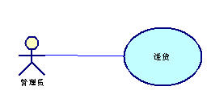

# 面向对象的思想(谁去做)

### 强类型语言和弱类型语言

| 强类型                                                       | 弱类型                                                       |
| ------------------------------------------------------------ | ------------------------------------------------------------ |
| 强类型指的是每个变量和对象都必须声明类型，在编译时类型不能更改； | 提前声明,编译时才确定类型                                    |
| 强类型语言的函数声明时编译时会检查参数类型,把做什么(函数)和谁去做(类型检测)分开 | 弱类型函数没有类型检查,像什么就是什么(无类型检测),谁去做(函数) |
| 安全，效率高                                                 | 不安全,编译时间才发现错误                                    |

```javascript
   var dog = 1 //数字类

    class Dog { //dog类
        constructor(age, color) {
            this.age = age
            this.color = color
        }

        cry() {
            console.log('汪汪汪')
        }

    }

    dog = new Dog(12, 'red') //变量类型可变

    console.log(dog)

    function cry(dog) { //函数参数也不用检查类型
        dog.cry()
    }

    cry(dog)

```


### 类的概念:

有共同特征的一类对象的特征,有共同属性和共同功能的一类事物

-  数字类 ,->数字实例123
-   字符串类,->字符串实例'ab'
-   对象类->数组类->数组实例[1,2,3]
-    人类->男人->小李

```js
//函数表达式,构造函数Person的内存地址可变,但是变了就没意义了
function Person({id,name,age,friend){
                 this.id=id:
                 this.name=name;
                 this.age=age;
                 this.friend=friend
                 }

Person.prototype={..... } //给实例复制的原型
Person.number=0    //静态属性
Person.sort=funciont(){} //静态函数
```

### 类的实例化对象的描述

##### 返回一类事物的一个实例

```javascript
//新建一个人的信息
const xiaoli=new Person()
```

##### 实例属于xx类型:

{id:001,name:'xiaoli'}是人类型的

##### 对象描述一个实例/数组一组实例


### 面向对象的优点

1. 维护简单
   面向对象程序设计的一个特征就是模块化。实体可以被表示为类以及同一名字空间中具有相同功能的类，可以在名字空间中添加一个类而不影响该名字空间的其他成员。这种特征为程序的维护提供了便捷性。
2. 可扩充性
   如果有一个具有某一种功能的类，就可以扩充这个类，创建一个具有扩充功能的类。
3. 代码重用
   功能是被封装在类中的，类是作为一个独立实体而存在的，因此可以很简单的提供类库，使代码得以重复使用。


# 面向对象的基本特征


①重载是指不同的函数使用相同的函数名，但是函数的参数个数或类型不同。调用的时候根据函数的参数来区别不同的函数。

②覆盖（也叫重写）是指在派生类中重新对基类中的虚函数（注意是虚函数）重新实现。即函数名和参数都一样，只是函数的实现体不一样。


## 封装

### es5

##### 闭包封装

```javascript
(function(){
//私有变量和私有函数
var privateVariable = 10;
function privateFunction(){
return false;
}
//构造函数
MyObject = function(){
};
//公有方法
 MyObject.publicMethod=funciton(){ }
 //特权方法
MyObject.prototype.publicMethod = function(){
privateVariable++;
return privateFunction();
};
})();
```

##### 构造函数的设计

###### 构造函数语句

```js
function(age,name,sex){
//相同的属性为this语句 不同的属性值部分为函数参数
this.age:argument[0]
this.name:argument[1]
Object.defineProperty(this, 'sex', {
            configurable: false,//不可删除
            enumerable: false,//不可枚举
            writable: true,//可读性
            value: age//value,可写
        })
}
```

###### 原型prototype

所有实例相同的方法和属性,

1. Person.prototype内存地址不可改变,改变就重写prototype了

2. 状态属性不能放到prototype,会一改全改

   ```javascript
      function Person() {
   
       }
   
       Person.prototype = {
           name: "Nicholas",
           say:function(){},
           friends: ["Shelby", "Court", "Van"]
       };
   
   
       const xiaoming = new Person()
   
       xiaoming.name = 'xiaoming' //这句没问题
       xiaoming.say=function(){   ////这句没问题
           console.log(xiaoming)
       }
       xiaoming.friends.push('xiaomao')  //这句直接修改了原型链
   
    const xiaohong=new Person()
    console.log(xiaohong) //但小红朋友没有xiaomao
   ```

3. 加入prototype.construtor属性和其他属性

```js
Person.prototype.run=(){ },
    //作用是给实例记住类型(构造函数名)
Person.prototype.construtor=Person

```

*控制台显示数据的类型*,既xiaoming.__ proto __.constructor

```js
  function Person(name, age) {
    this.name = name
    this.age = age
  }
/*xiaoming.__proto__.constructor为Person,xiaoming是Person类型*/
  const xiaoming = new Person('xiaoli', 20)
  console.log(xiaoming)
  console.log({xiaoming})
  console.log([xiaoming])
```


###### 静态方法

静态函数是适合所有实例用的工具函数

```ts
Dog.Create({id:1})
Dog.find({id:1})
Dog.remove({id:2})
dog.update({id:3})
```


### class封装

class的本质是创造一类的若干对象的构造函数,类是构造函数的语法糖

```js
 class Point {
    //静态函数
    static staticFn() {
      console.log('staticFn')
    }

    //构造函数里的this.xxx

    constructor(x, y) {
      this.x = x;
      this.y = y;
    }

    //构造函数里的Object.defineProperty
    get myprop() {
      console.log('Getting the current value!');
      return this.x;
    }

    set myprop(x) {
      this.x = x++

    }

    //ptototype
    toString() {
      return '(' + this.x + ', ' + this.y + ')';
    }
  }

  const i = new Point(1, 2)
  console.log(i)

```

### ts封装

本质是构造函数

```js
class Greeter {
 /**构造函数部分**/
  greeting: string; //这里比原生多一个变量声明,是为了类型检测
  constructor(message: string) {
    this.greeting = message;
  }

//原型属性
  greet() {
    return "Hello, " + this.greeting;
  }
}

let greeter = new Greeter("world");
console.log(greeter)

```

**修饰符**

+public(默认)

可以让 子类 实例化对象(表现在prototype上)

```ts
class Animal {
    /*构造函数部分*/
  
  public name: string;
  public constructor(theName: string) { this.name = theName; }
    /*原型部分*/
  public move(distanceInMeters: number) {
    console.log(`${this.name} moved ${distanceInMeters}m.`);
  }
}
const dog=new Animal('xiaohei')
console.log(dog)
dog.move(10)

```


#protect

​       可以被继承 不可以被实例化,和原生原理无关,只是单纯的不能运行

```ts
class Person {
  protected name: string;
  constructor(name: string) { this.name = name; }
}

class Employee extends Person {
  private department: string;

  constructor(name: string, department: string) {
    super(name)
    this.department = department;
  }

  public getElevatorPitch() {
    return `Hello, my name is ${this.name} and I work in ${this.department}.`;
  }
}

let howard = new Employee("Howard", "Sales");
console.log(howard.getElevatorPitch());
 console.log(howard.name); // 错误

```


-private

只可以自己使用 ,和原生原理无关,只是单纯的不能运行

```ts
class Animal {
  private name: string;
  constructor(theName: string) { this.name = theName; }
}

const cat=new Animal("cat")
console.log(cat) //{name: "cat"}
console.log(cat.name)// err: 'name' 是私有的.只能在类Animal内使用,原理估计是ts还没有转成原生之前先检测,就是报错,和原生无关

```

TypeScript使用的是结构性类型系统。 当我们比较两种不同的类型时，并不在乎它们从何处而来，如果所有成员的类型都是兼容的，我们就认为它们的类型是兼容的。

```ts
class Animal {
   name: string;
  constructor(theName: string) { this.name = theName; }
}

class Rhino extends Animal {
  constructor() { super("Rhino"); }
}

class Employee {
   name: string;
  constructor(theName: string) { this.name = theName; }
}

let animal = new Animal("Goat");
let rhino = new Rhino();
let employee = new Employee("Bob");

animal = rhino;
animal = employee;

```

```ts
class Animal {
    private name: string;
    constructor(theName: string) { this.name = theName; }
}

class Rhino extends Animal {
    constructor() { super("Rhino"); }
}

class Employee {
    private name: string;
    constructor(theName: string) { this.name = theName; }
}

let animal = new Animal("Goat");
let rhino = new Rhino();
let employee = new Employee("Bob");

animal = rhino;
animal = employee; // 错误: Animal 与 Employee 不兼容.
```

. readonly 

只读

你可以使用 `readonly`关键字将属性设置为只读的。 只读属性必须在声明时或构造函数里被初始化。

```ts
class Octopus {
    readonly name: string;
    readonly numberOfLegs: number = 8;
    constructor (theName: string) {
        this.name = theName;
    }
}
let dad = new Octopus("Man with the 8 strong legs");
dad.name = "Man with the 3-piece suit"; // 错误! name 是只读的.
```


## 继承

**使用场景**

本质是在不破坏原代码的基础上修改代码,代码复用机制

对原始的蓝图进行修改,产生新型号汽车的蓝图,用于生成新的汽车

```js
class StangtanaCar1000{
//一些代码
}

class StangtanaCar2000 extends StangtanaCar1000{
   //另外一些代码
}
```

### 原型链模式-函数实现继承

##### 示意图

[](./img/3.tif)


##### Person继承代码

```js

function inheritPrototype (subType, superType) {
  /*1.创建subType的prototype属性,先加入他要继承的原型
      等价于subType.prototype={__proto__=superType.prototype}*/
            var prototype = Object.create(superType.prototype) 
  /*2.向subType.prototype加入Construct属性,方便实例记住类型和然后加入其他属性
       subType.prototype={constructor : subType, __proto__:superType.prototype}              
                        ={constructor : subType, __proto__:{superType.prototype的own属性,construct:superType,__proto__:Object.prototype} */  
  prototype.constructor = subType //增强对象
    
    
  subType.prototype = prototype //指定对象
}


function Person (name, age) {
    //用于创建对象的own属性
  this.name = name
  this.age = age
}


inheritPrototype(Person, Object)
/*3.补充原型
  subType.prototype={constructor : subType,say:(){}, __proto__:{superType.prototype的own属性,construct:superType,__proto__:Object.prototype} 
*/
Person.prototype.say = function () {
  console.log('I am Person')
}


function Man (name, age, length) {
   
  this.moustacheLength = length
     //借用构造函数 另外一条继承链
  Person.call(this, name, age)
}

inheritPrototype(Man, Person)

//补充原型此处不可Man.prototype={.....}防止原型链断裂
Man.prototype.say = function () {
  console.lo g('I am Man')
}
Man.prototype.haveAShave = function () {
  console.log('I have a shave')
}


const xiaoming = new Man('xiaoming', 12, 1)

console.log(xiaoming)
```


##### 注意:

###### 父类的prototype不能被重新赋值

```js
//超类--------------------------
function SuperType() {
    this.property = true;
  }

  SuperType.prototype.getSuperValue = function () {
    return this.property;
  };

//子类---------------------------------------------
  function SubType() {
    this.subproperty = false;
  }

  /*继承SuperType,子类的prototype=new SuperType()
                               ={subproperty:false,__proto__:super.prototype}   */

  SubType.prototype = new SuperType();

 //x  子类的prototype赋值了新地址,
  SubType.prototype = {
    getSubValue: function () {
      return this.subproperty;
    },
    someOtherMethod: function () {
      return false;
    }
  };

  /*√ 正确做法

  SubType.prototype.getSubValue = function () {
    return this.subproperty;
  }
  */
//实例化----------------------------------------------------------------
  const i=new SubType()
  console.log(i)
```

以上代码展示了刚刚把SuperType 的实例赋值给原型，紧接着又将原型替换成一个对象字面量而导致的问题。由于现在的原型包含的是一个Object 的实例，而非SuperType 的实例，因此我们设想中的原型链已经被切断——SubType 和SuperType 之间已经没有关系了。


### class继承

```javascript
 class Point {
        static staticFn() {
            console.log('staticFn')
        }

        constructor(x, y) {
            this.x = x;
            this.y = y;
        }

        get value() {
            console.log('Getting the current value!');
            return this.x;
        }
       set value(x) {
      this.x = x++

        }

        toString() {
            return '(' + this.x + ', ' + this.y + ')';
        }
    }

    const point = new Point(1, 2)

    console.log(point)

    class Point_extend extends Point {


        cs() {
            console.log('cs')
        }
    }

    //类能继承静态函数
    Point_extend.staticFn()

    const point_extend = new Point_extend(10, 20)

    console.log(point_extend)

```

与 ES5 一样， 在 Class 内部可以使用get和set关键字， 对某个属性设置存值函数和取值函数， 拦截该属性的存取行为。

```js
class MyClass {

  constructor() {

    // ...

  }

  get prop() {

    return 'getter';

  }

  set prop(value) {

    console.log('setter: ' + value);

  }

}

let inst = new MyClass();

inst.prop = 123;

// setter: 123

inst.prop

// 'getter'
```

上面代码中， prop属性有对应的存值函数和取值函数， 因此赋值和读取行为都被自定义了。

存值函数和取值函数是设置在属性的 descriptor 对象上的。

```js
class CustomHTMLElement {

  constructor(element) {

    this.element = element;

  }

  get html() {

    return this.element.innerHTML;

  }

  set html(value) {

    this.element.innerHTML = value;

  }

}

var descriptor = Object.getOwnPropertyDescriptor(

  CustomHTMLElement.prototype, "html");

"get" in descriptor // true

  "set" in descriptor // true
```

上面代码中， 存值函数和取值函数是定义在html属性的描述对象上面， 这与 ES5 完全一致。

模拟vue构造函数

```javascript
//store实例化
    const store = {
        counter: 0,
        add(n) {
            this.counter += n
        }
    }


    //组件构造器产生组件Person的工厂函数
    class Person {
        constructor({beforeCreate, created, store, data, methods, computed, watch, callbackProp, props, $father}) {
            beforeCreate()
            for (let item in data) {
                this[item] = data[item]

            }
            if (props) {
                for (let item of props) {
                    this[item] = $father[item]

                }
            }
            for (let item in methods) {

                this[item] = methods[item]
            }

            //计算属性和watch
            for (let item in {...computed, ...watch}) {
                Object.defineProperty(this, `${item}`, {
                    get: computed.com,
                    set: function () {
                        console.log('触发watch')
                    }
                })
            }

            this.$store = store

            created()
        }
    }

    //实例化组件,切换路由操作,出发这个构造函数运行-------------------------------------
    const father = new Person({
        data: {
            name: 'father',
            age: 18,
            hometownProp: 'china',
            callbackProp: function (n) {
                console.log(this.age = n)
            },
        },

        store,
        beforeCreate() {
            console.log('beforeCreateg钩子:对象将要建立')
        },
        created() {
            console.log('created钩子:对象建立了')
        },


    })


    const child = new Person({
        data: {
            name: '小黑',
            age: 2
        },
        computed: {
            com: function () {
                return this.name + this.age
            },

        },
        props: ['hometownProp', 'callbackProp']
        ,
        methods: {
            $emit(n) {
                this.callbackProp.call(this.$father, n)
            }
        },

        beforeCreate() {
            console.log('对象将要建立')
        },
        created() {
            console.log('对象建立了')
        },
        store,
        $father: father


    })

    //标签嵌套
    father.$children = child
    child.$father = father


    //onlick等事件回调才运行--------------------------------------------------------------
    child.$emit(10)
    child.$father.sex = '男'


    //onclick等事件驱动提交store负荷
    father.$store.add(10)

    console.log(father)
    console.log(child)

    document.getElementById('#app').innerHTML = child.com


```

模拟vue构造实现$father

```javascript
    var test=new function (){

        var self=this
        this.Name="test"
        this.subTest=new function(parent=self){
            this.Name="test1"
            this.parent=this
            this.PName=function(){return parent.Name}
        }
        this.subTest.parent=this
    }
    console.log(test)

    alert(test.subTest.PName())
```

### ts继承

#### 子类继承一个父类

```ts
class Animal {
  //own属性
  age: number
  constructor(age: number) {
    this.age = age;
  }
  //原型属性
  move(distanceInMeters: number = 0) {
    console.log(`Animal moved ${distanceInMeters}m.`);
  }
}

class Dog extends Animal {
  bark() {
    console.log('Woof! Woof!');
  }
}

const dog = new Dog(10);
dog.bark();
dog.move(10);
dog.bark();

```

###### ==带泛型==

```ts
class GenericNumber<T> {
    zeroValue: T;
    add: (x: T, y: T) => T;
}

let myGenericNumber = new GenericNumber<number>();
myGenericNumber.zeroValue = 0;
myGenericNumber.add = function(x, y) { return x + y; };
```

#### 类实现一个接口

```ts
interface ClockInterface {
    currentTime: Date;
}

class Clock implements ClockInterface {
    currentTime: Date;
    constructor(h: number, m: number) { }
}
```

```ts
interface ClockInterface {
  currentTime: Date;
  setTime(d: Date);
}

class Clock implements ClockInterface {
  currentTime: Date;
  setTime(d: Date) {
    this.currentTime = d;
  }
  constructor(h: number, m: number) { }
}
const i= new Clock(1,2)
i.setTime(new Date)
console.log(i)

```

当你操作类和接口的时候，你要知道类是具有两个类型的：静态部分的类型和实例的类型。 你会注意到，当你用构造器签名去定义一个接口并试图定义一个类去实现这个接口时会得到一个错误：

```ts
interface ClockConstructor {
    new (hour: number, minute: number);
}

class Clock implements ClockConstructor {
    currentTime: Date;
    constructor(h: number, m: number) { }
}
```

```ts
interface ClockInterface {
  tick();
}

//定义 new Class
interface ClockConstructor {
  new (hour: number, minute: number): ClockInterface;
}


class DigitalClock implements ClockInterface {
  constructor(h: number, m: number) { }
  tick() {
    console.log("beep beep");
  }
}
class AnalogClock implements ClockInterface {
  constructor(h: number, m: number) { }
  tick() {
    console.log("tick tock");
  }
}


function createClock(ctor: ClockConstructor, hour: number, minute: number): ClockInterface {
  return new ctor(hour, minute);
}
let digital = createClock(DigitalClock, 12, 17);
let analog = createClock(AnalogClock, 7, 32);

```

###### ==带泛型==

```ts
interface ClockInterface<T> {
  currentTime: T;
}

class Clock implements ClockInterface<Date> {
  currentTime: Date;

  constructor(h: number, m: number) {
  }
}

```

#### 类实现多个接口

```js
interface InterfaceOne {
    //
    sports():void;
}
interface InterfaceTwo {
    //
    swimming():void
}
// 接口集成接口
interface InterfaceThree extends InterfaceOne,InterfaceTwo {
    //
    coding():void;
}

class ParentCls {
    name:string;
    constructor(name:string){
        this.name = name
    }
    //
    ktv(){
        console.log(this.name + '唱歌');
    }
}
// 继承父类实现多接口
class SubCls extends ParentCls implements InterfaceTwo, InterfaceOne {

    // 实现接口
    sports(){
        console.log(this.name + '运动')
    }

    swimming(){
        console.log(this.name + '游泳')
    }
}
let subCls = new SubCls('小明');
subCls.sports()
subCls.swimming();
subCls.ktv()

//
class SubCls2 extends ParentCls implements InterfaceThree {
    //
    coding(){
        console.log(this.name + '写代码');
    }
    sports(){
        console.log(this.name + '运动');
    }
    swimming(){
        console.log(this.name + '游泳')
    }
}
let subCls2 = new SubCls2('小王');
subCls2.coding();
subCls2.sports();
subCls2.ktv();
subCls.swimming();
```

## 多态

### **定义:**

一个函数传入不同的对象做参数，返回不同的值

### 覆盖

##### es5实现覆盖

###### e1

鸭子类型（duck typing）如果它走起路来像鸭子，叫起来也是鸭子，那么它就是鸭子。
只关注对象的行为，不关注对象本身面向接口编型 ，而不是面向实现编程，是设计模式中最重要的思想。代码演示：

```js
var duck = {
    duckSinging:function(){
        console.log('呱呱呱');
    }
}
alert('duck');

var chicken = {
    duckSinging:function(){
        console.log('呱呱呱');
    }
}

alert('chicken');

var chior = [];

var joinChior = function(animal){//谁去做:ts编译时会判断类型
    if (animal && typeof animal.duckSinging === 'function') { //typeof就是弱类型语言的判断 模仿ts类型检测
        chior.push(animal); //做什么
        console.log('恭喜你加入合唱团');
        console.log('当前已募集'+chior.length+'只鸭子');
    }
}
joinChior(duck);
joinChior(duck);
joinChior(chicken);
```

###### e2

语义分离,下一步使用多态

```javascript
    var googleMap = {
        show: function () {
            console.log('开始渲染谷歌地图');
        }
    };
   function renderMap() {
        googleMap.show();
    };
    renderMap(); // 输出：开始渲染谷歌地图
```

 多态:一个函数用于不同的对象

```javascript
var googleMap = {
    show: function(){
        console.log( '开始渲染谷歌地图' );
    }
};
var baiduMap = {
    show: function(){
        console.log( '开始渲染百度地图' );
    }
};
function renderMap( type ){
    if ( type === 'google' ){ //类型检测 js只能做到像什么,做不到是什么
        googleMap.show();
    }else if ( type === 'baidu' ){
        baiduMap.show();
    }
};
renderMap( 'google' );
renderMap( 'baidu' );

```

可扩展多态:js不用建立父类和超类就可以构造对象

```javascript
    var googleMap = {
        show: function(){
            console.log( '开始渲染谷歌地图' );
        }
    };
    var baiduMap = {
        show: function(){
            console.log( '开始渲染百度地图' );
        }
    };
    var renderMap = function( map ){ //ts会对map进行判断,把做什么(本函数)和谁去做(参数类型)解耦,从而省去条件语句
       if(map.show instanceof Function){//因为ts会判断map的类型,所以就不用担心map有没有show,还省去了条件语句if ( type === 'google' )  ,js模仿类型检测,map.show instanceof Function  像什么
           map.show()
       }

    };
    renderMap( 'google' );
    renderMap( 'baidu' );

    //添加新类和实例化对象
    var gaode = {
        show: function(){
            console.log( '开始渲染高德地图' );
        }
    };

    //好处是不用重写reader的情况下扩展新子类
    renderMap( 'gaode' );
```

###### e3


```javascript
function Food(name){
    this.name=name;
}
//鱼肉类
function Fish(name){
    this.food=Food;
    this.food(name);
}
//骨头
function Bone(name){
    this.food=Food;
    this.food(name);
}
//---------------------------------------------------
//动物类
function Animal(name){
    this.name=name;
}
//猫猫
function Cat(name){
    this.animal=Animal;
    this.animal(name);
}
//狗狗
function Dog(name){
    this.animal=Animal;
    this.animal(name);
}

var cat=new Cat("猫");
var fish=new Fish("鱼肉");

var dog=new Dog("狗");
var bone=new Bone("骨头");

//-----------------------------------------------------------------
// Master类
function Master(name){
    this.nam=name;

}

Master.prototype.feed=function (animal,food){ //ts会对amimal和food检查,做什么(本函数)和谁去做(参数类型)分开
     if(animal instaceof Animal && food instance Food){// js模仿类型检测
    window.alert("给"+animal.name+" 喂"+ food.name);
    }
}
//创建一个主人
var master=new Master("zs");
master.feed(dog,bone);
master.feed(cat,fish);

// ----------------------后期扩展-------------------------

//猴子
function Monkey(name){
    this.animal=Animal;
    this.animal(name);
}

// 桃子
function Peach(name){
    this.food=Food;
    this.food(name);
}


var monkey=new Monkey("猴");
var peach=new Peach("桃");

 // 这样做的优点在于扩展Monkey,Peach时, Master和父类 Animal Food不需要改变

master.feed(monkey,peach);


```


##### ts实现覆盖

uml类图


```ts
class Person {
  name: String;

  constructor(name) {
    this.name = name
  }

  saySomething() {

  }
}

class Man extends Person {
  constructor(name:string) {
    super(name)
  }

  saySomething() {
    console.log('I am Man')
  }
}

class Woman extends Person {
  constructor(name:string) {
    super(name)
  }

  saySomething() {
    console.log('I am Woman')
  }
}

let man = new Man('a')
let woman = new Woman('b')


function saySex(pepole:Person) { //ts这里会检查参数类型,指定谁去做
   pepole.saySomething()
}

saySex(man)
saySex(woman)

//好处是不用重写saySex, 继承Person的其他子类容易扩展

class Yao extends Person {
  constructor(name:string) {
    super(name)
  }

  saySomething() {
    console.log('I am yao')
  }
}

let yao = new Yao('yao')
saySex(yao) //好处saySex不用重写


```

### 重载

函数重载这个概念是在一些强类型语言中才有的，在JS中依据不同参数类型或参数个数执行一些不同函数体的实现很常见，依托于TypeScript，就会有需要用到这种声明的地方。

关于函数重载，必须要把精确的定义放在前面，最后函数实现时，需要使用 `|`操作符或者`?`操作符，把所有可能的输入类型全部包含进去，以具体实现。如下例子1 和 例子3

##### js参数个数实现重载

```js
  function fn(i, m) {
    if (arguments.length === 1) {
      return 1
    } else if (arguments.length === 2) {
      return 2
    } else {
      return 0
    }

  }

  console.log(fn(), fn(1), fn(1, 2))

```

##### ts实现重载

*e1*
例如我们有一个add函数，它可以接收string类型的参数进行拼接，也可以接收number类型的参数进行相加。

```tsx
// 上边是声明
function add (arg1: string, arg2: string): string
function add (arg1: number, arg2: number): number
// 因为我们在下边有具体函数的实现，所以这里并不需要添加 declare 关键字

// 下边是实现
function add (arg1: string | number, arg2: string | number) {
  // 在实现上我们要注意严格判断两个参数的类型是否相等，而不能简单的写一个 arg1 + arg2
  if (typeof arg1 === 'string' && typeof arg2 === 'string') {
    return arg1 + arg2
  } else if (typeof arg1 === 'number' && typeof arg2 === 'number') {
    return arg1 + arg2
  }
}
```

TypeScript 中的函数重载也只是多个函数的声明，具体的逻辑还需要自己去写，他并不会真的将你的多个重名 function 的函数体进行合并

*e2*：

```tsx
interface User {
  name: string;
  age: number;
}

declare function test(para: User | number, flag?: boolean): number;
```

在这个 test 函数里，我们的本意可能是当传入参数 para 是 User 时，不传 flag，当传入 para 是 number 时，传入 flag。TypeScript 并不知道这些，当你传入 para 为 User 时，flag 同样允许你传入：

```csharp
const user = {
  name: 'Jack',
  age: 666
}

// 没有报错，但是与想法违背
const res = test(user, false);
```

使用函数重载能帮助我们实现：

```tsx
interface User {
  name: string;
  age: number;
}

declare function test(para: User): number;
declare function test(para: number, flag: boolean): number;

const user = {
  name: 'Jack',
  age: 666
};

// bingo
// Error: 参数不匹配
const res = test(user, false);
```

实际项目中，你可能要多写几步，如在 class 中：

```tsx
interface User {
  name: string;
  age: number;
}

const user = {
  name: 'Jack',
  age: 123
};

class SomeClass {

  /**
   * 注释 1
   */
  public test(para: User): number;
  /**
   * 注释 2
   */
  public test(para: number, flag: boolean): number;
  public test(para: User | number, flag?: boolean): number {
    // 具体实现
    return 11;
  }
}

const someClass = new SomeClass();


// ok
someClass.test(user);
someClass.test(123, false);

// Error
someClass.test(123);
someClass.test(user, false);
```

***一些不需要函数重载的场景(并不绝对，如上例子2)***

函数重载的意义在于能够让你知道传入不同的参数得到不同的结果，如果传入的参数不同，但是得到的结果（类型）却相同，那么这里就不要使用函数重载（没有意义）。
如果函数的返回值类型相同，那么就不需要使用函数重载

```swift
function func (a: number): number
function func (a: number, b: number): number

// 像这样的是参数个数的区别，我们可以使用可选参数来代替函数重载的定义

function func (a: number, b?: number): number

// 注意第二个参数在类型前边多了一个`?`

// 亦或是一些参数类型的区别导致的
function func (a: number): number
function func (a: string): number

// 这时我们应该使用联合类型来代替函数重载
function func (a: number | string): number
```

# 实例化对象

### 定义

实例<=>对象<=>引用类型<=>`{ownprop:'',ownmethod(){},__proto__:{....}}形式`

### js生成实例化对象

|          | 字面量          | new Construct( )                                             | Object.creat(Construct.ptotype)                       |
| -------- | --------------- | ------------------------------------------------------------ | ----------------------------------------------------- |
| **原理** | 同new Construct | const obj = {}<br/>  obj.__proto__ = Person.prototype<br/>  const   res = Person.apply(obj, ['xiaohong', 13])<br/>  if (typeof res === Object) {<br/>    obj = res<br/>  } | const obj={ }<br />obj.__ proto __=Construct.protoype |


##### 字面量

用于新建对象和==控制台打印==

```js
const num=1
const str='hello'
const bool=true
//----------------
const obj={a:1}
function fn(){}
const arr=[1,2,3]
const reg=/\w/ig
//----------------

<div id='app'></div>
```

```js
console.log(obj)//{a:1}
console.log(fn)//fn(){}
console.log(arr)//[1,2,3]
console.log(reg)// /\w/ig
//----------------
console.log(str)//hello
//----------------
console.log(document.getElmentById())//<div id='app'></div>

```

##### new Construct( )

```js
new Object({a:1})
new Function('a,b','a+b')
new Array(1,2,3)
new RegExp(/\w/,'ig')
//------------------------
new String('hello');
//----------------------
new Vue()
```

自定义对象类型

```js
  function Person(name, age) {
    this.name = name;
    this.age = age
  }

  Person.prototype.sayName = function (str) {
    console.log(str+this.name)
  }

  //new-----------------------------------------------------
  const xiaoming = new Person('xiaoming', 12)
  console.log(xiaoming)

  //new原理---------------------------------------------------
  let obj = {}
  obj.__proto__ = Person.prototype
  let res = Person.apply(obj, ['xiaohong', 13])
  if (typeof res === Object) {
    obj = res
  }

//构造函数作为普通函数使用-------------------------------------------
  Person('xiaobai', 14)  //等价于Person.apply(window,['xiaobai', 14])


//原型函数作为普通函数使用---------------------------------------

Person.prototype.sayname.call(xiaoming,'myname') //本质 先this==xiaoming,后运行函数sayName
```

 构造函数默认参数值和普通函数默认参数值一样默认undefined

```
vue实例的prop的默认值为undefined
函数实参传值给形参未赋值的形参为undefine
```

定义不可枚举的ownProperty

```js
    function Fn(name, age) {
        this.name = name;
        //设置ownProperty
        Object.defineProperty(this, 'age', {
            configurable: false,//不可删除
            enumerable: false,//不可枚举
            writable: true,//可读性
            value: age//value,可写
        })
    }

    const i = new Fn('小女', 21)
    console.log(Object.keys(i))
```

##### Object.creat(Array.prototype,{.....})

```js
  const fn=Object.create(Function.prototype,{
    "a":{value :1,congigurable :false,enumerable :true,writable:true},
    "b":{value :2,congigurable :false,enumerable :true,writable:true},
    "c":{value :3,congigurable :false,enumerable :true,writable:true}
  })
  console.log(fn.__proto__)//Function.prototype
  console.log(fn.a)//输出 1
  console.log(fn.b)//输出 2
  console.log(fn.c)//输出 3


  const arr=Object.create(Array.prototype,{
    "a":{value :1,congigurable :false,enumerable :true,writable:true},
    "b":{value :2,congigurable :false,enumerable :true,writable:true},
    "c":{value :3,congigurable :false,enumerable :true,writable:true}
  })
  console.log(arr.__proto__)//Array.prototype
  console.log(arr.a)//输出 1
  console.log(arr.b)//输出 2
  console.log(arr.c)//输出 3


  const reg=Object.create(RegExp.prototype,{
    "a":{value :1,congigurable :false,enumerable :true,writable:true},
    "b":{value :2,congigurable :false,enumerable :true,writable:true},
    "c":{value :3,congigurable :false,enumerable :true,writable:true}
  })
  console.log(reg.__proto__)//RegExp.prototype
  console.log(reg.a)//输出 1
  console.log(reg.b)//输出 2
  console.log(reg.c)//输出 3


  const str=Object.create(String.prototype,{
    "a":{value :1,congigurable :false,enumerable :true,writable:true},
    "b":{value :2,congigurable :false,enumerable :true,writable:true},
    "c":{value :3,congigurable :false,enumerable :true,writable:true}
  })
  console.log(str.__proto__)//String.prototype
  console.log(str.a)//输出 1
  console.log(str.b)//输出 2
  console.log(str.c)//输出 3
```

### 字面量和对象键值对


### 引用类型的值得内存地址赋值给变量

##### 赋值给自由变量

```js
const obj={a:1}
function fn(){}
const arr=[1,2,3]
const reg=/\w/ig

const vm=new Vue({})
const el=document.getElmentById()
const str=new String('hello')

```

函数赋值给变量

```js
    //1.函数的定义
    function sum1(a1,b1){
        return a1+b1;
    }
    sum1.age = 100;
    console.log(sum1(1,1));//2
    console.log( sum1.age )


    var sum2 = function(a1,b1){
        return a1+b1;
    };
    console.log(sum2(1,1));//2
    console.log(sum2)


    var sum3 = new Function("a1,b1","return a1+b1;");
    console.log({sum3})
    sum3.age = 100;
    console.log(sum3(1,1));//2
    console.log(sum3.age);//100

```

​             es6语法的错觉

```js
    data = {
        a: 1,
       function  () {
            console.log(123)

        }
    }


//上面等价于

    data = {
        a: 1,
       function: function  () {
            console.log(123)

        }
    }

```

##### 赋值给参数变量

对象作为vue构造函数的参数的值

```
new Vue({el:'#app'})
```

回调函数作为参数的值

```
Array.sort((a,b)=>a-b)
```

```javascript
new Promise((resolve,reject)=>{resolve(1)})
```

##### 赋值给this变量

obj.fn(){}

fn.call(obj)

### 函数类型的变量和()计算产生返回值


```
function fn(){}()
fn()
new Funciton()
```

### 实例的ownProperty更删改查

```js
var newEvent = new Event('build', { bubbles: true, cancelable: true, composed: true })
console.log(newEvent.bubbles)
newEvent.bubbles=false
```

##### 属性的添加/更改

==先定义obj 才能用obj.a,没赋值默认都是undefined==

       let obj = {}//要先定义obj再设置obj.a才行
    console.log(obj.a)
    console.log(obj.b)
    console.log(obj.c)
    
      let arr=[]
      console.log( arr[0],arr[1])
###### 1. obj.a

```
a为字符串
```

```js
import axios from './export'
axios.url="www.baidu.com"//改写url通过this给axios用
axios.get()
console.log(axios)

```

######  2. obj['a'] 

[  ] 里的表达式做键值

```javascript
//字符串表达式做键值-----------------------------------

obj={

        'fn'() {
            console.log('fn')
        },
        '0'(){
            console.log(0)
        }

}

obj[”a”]
obj[’0’]

let str = 'abc'
str[1]
str['1']

 //数字表达式做键值------------------------------

let ArrayLike = { 0 : "a", 1 : "b", 2 : "c" ,length:3};
ArrayLike[2]
arry[0]


//复杂表达式做键值-------------------------------------

const i='color'  obj[i+'primary'],变量做键值[i+'primary']返回字符串

```


###### 3.Object.defineProperty()

 键值也是字符串

```
    obj = {a: 1, b: 2}

    Object.defineProperty(obj, 'c', {//可以改变其他属性的值，可以把其他属性的值赋值给自己
        configurable: false,
        enumerable: true,
        set: function () {
            this.a = 0
        },
        get: function () {
            return this.b
        }

    })
    obj.c = 3 //set触发tis.a=0
    console.log(obj)//除非get
```

```
 obj = {a: 1, b: 2, c: 3}
    Object.defineProperty(obj, 'd', {
        configurable: false,
        enumerable: false,
        writable: true,
        value: 4
    })

```

###### 4,new Construct(prop )批量增加

##### 删除属性

```
delate(obj.a)
```

##### 属性访问表达式

*obj['a']:*     obj和['a']计算后的返回值(普通类型或者地址类型)

### 实例的原型方法

obj.toString( )

等价写法 Object.prototype.toString.call(obj)

==实质都是toString作用域里的this被赋值为obj==

### 常用的实例化对象类型

##### object

`{a:1,b:2,__proto__:Object.prototype}`

##### array

```js
[1,2,3]

{0:1,1:2,2:3,length:3,__proto__:Array.prototype}
```

##### Person

```js
const xiaoming={
name:'xiaoming',
age:12
__proto__:Person.prototype
}
//函数为对象
peson.sayName.call(xiaoming)
```

### 判断实例的类型

##### 1.typeof

typeof只能判断区分基本类型，number、string、boolean、undefined和object,function；

```js
typeof 0;  //number;
typeof true;  //boolean;
typeof undefined;  //undefined;
typeof "hello world"   //string;
typeof function(){};   //function;

typeof null; //object
typeof {};  //object;
typeof []; //object
```

从上例我们可以看出， typeof 判断对象和数组都返回object,因此它无法区分对象和数组。

##### 2.instanceof

```js
var a={};
a instanceof Object  //true
a intanceof Array     //false
var b=[];
b instanceof Array  //true
b instanceof  Object //true
```

因为数组属于object中的一种，所以数组instanceof object,也是true.

```js
var c='abc';
c instanceof String; //false
var d=new String();
d instanceof String  //true
```

instanceof不能区分基本类型string和boolean,除非是字符串对象和布尔对象。如上例所示。

##### 3.constructor

可以看出constructor可以区分Array和Object。

```js
var o={};
o.constructor===Object  //true

var arr=[];
arr.constructor===Array  //true
arr.constructor===Object //false
```

```js
var bool=true;
bool.constructor===Boolean  //true

var num=1;
num.constructor===Number  //true

var str='hello world';
str.constructor===String     //true
 
var num=new Number();
num.constructor===Number  //true
```

不过要注意，constructor属性是可以被修改的，会导致检测出的结果不正确

```js
function Person(){

}
function Student(){

}
Student.prototype = new Person();
var John = new Student();
console.log(John.constructor===Student); // false
console.log(John.constructor===Person); // true
```

==除了undefined和null，其他类型的变量均能使用constructor判断出类型.==

##### 4.Object.prototype.toString.call(p:)  ---------最好用

```
Object.prototype.toString.call(123)
//"[object Number]"

Object.prototype.toString.call('str')
//"[object String]"

Object.prototype.toString.call(true)
//"[object Boolean]"

Object.prototype.toString.call({})
//"[object Object]"

Object.prototype.toString.call([])
//"[object Array]"
```

个判断数组和对象的方法


```
$.type(obj) ;

$.isArray(obj);

$.isFunction(obj);

$.isPlainObject(obj);
```

```
$.type([])    //array
$.isArray([]); //true
$.isFunction(function(){}); //true
$.isPlainObject({}); //true
$.isPlainObject([]); //false
```


# UML

### 结构元素

结构元素包括，类，对象，接口，用例，参与者。

##### 类图


类图图示

   类图是UML中最基本的元素了吧？根据OO的思想“天下一切皆对象”，而类是对象的抽象。
   左侧图示为一个类图。顶端“ClassName”表示类名
   中间部分为该类的属性，其中分别表示为可访问性，属性名，以及属性的数据类型。
   第三部分为该类的方法，包括方法的可访问性，方法名，方法的参数以及方法的返回值。
   需要说明的是：

- ​     “#”表示protected
  ​     “+”表示Public
  ​     “-”表示private
  ​       “i”表示internal(内部的)


##### 对象图


右侧图示为一对象图，该对象为类className类的一个实例对象

该图第一部分说明了该对象为className的一个实例，第二部分指定了该实例的属性值。该图指定的是一个特殊的实例的对象，如果要代表className的所有的对象可省略掉对象名，即为“:ClassName”。

##### 接口


左图为一个比较简单的接口事例图示。与类图差不多，该图示分为三部分，第一部分为接口名，为了更明确的标明其“接口”的身份通常以“I”开头。第二部分为属性，第三部分为方法。


##### 用例与参与者

下图为一简单的用例视图。小人表示参与者，而椭圆表示的是用例。




##### 包


右侧图示为一包图，该图示为一名称为Utility的工具包。

包用来组织类，被包含在包里的类一般通过如Utility::StrUtility的形式来反应该类的路径。

### 类和类之间的关系

*各种关系的强弱顺序：*

泛化 = 实现 > 组合 > 聚合 > 关联 > 依赖


-->
—>

◇->

◆->

--▷
-▷


#####  1、依赖关系---->

==虚线==

似乎是参数关系


从上图我们可以看到，Driver的drive方法只有传入了一个Car对象才能发挥作用，因此我们说Driver类依赖于Car类。在UML类图中，依赖关系用一条带有箭头的虚线表示。


##### 2、关联关系—>


   关联是类之间的联系，如篮球队员与球队之间的关联（下图所示）。其中，关联两边的"employee"和“employer”标示了两者之间的关系，而数字表示两者的关系的限制，是关联两者之间的多重性。通常有“*”（表示所有，不限），“1”（表示有且仅有一个），“0...”（表示0个或者多个），“0，1”（表示0个或者一个），“n...m”(表示n到m个都可以),“m...*”（表示至少m个）。
   在关联中有一种叫“限定关联”，还有一种谓之自身关联。另外，对象之间的关联就没那么复杂，只是将类的关联实例化而已。

关联关系又可进一步分为单向关联、双向关联和自关联。


自关联在UML类图中用一个带有箭头且指向自身的直线表示。上图的意思就是Node类包含类型为Node的成员变量，也就是“自己包含自己”。

*依赖vs关联的区别：*

1）从类之间关系的强弱程度来分，关联表示类之间的很强的关系；依赖表示类之间的较弱的关系；
从类之间关系的时间角度来分，关联表示类之间的“持久”关系，这种关系一般表示一种重要的业务之间的关系，需要保存的，或者说需要==“持久化”==的，或者说需要保存到数据库中的。比如学生管理系统中的Student类和Class（班级）类，一个Student对象属于哪个Class是一个重要的业务关系，如果这种关系不保存，系统就无法管理。另外，依赖表示类之间的是==一种“临时、短暂”==关系，这种关系是不需要保存的，比如Student类和StuEditScreen（学生登录界面）类之间就是一种依赖关系，StuEditScreen类依赖Student类，依赖Student对象的信息来显示编辑学生信息。
2）设计类之间的关系是遵循的原则：首先判断类之间是否是一种“关联”关系，若不是再判断是否是“依赖关系”，一般情况下若不是关联，就是依赖关系
3）依赖一般情况下是以下几种情况之一：a、ClassA中某个方法的参数类型是ClassB；这种情况成为耦合；b、ClassA中某个方法的参数类型是ClassB的一个属性；这种情况成为紧耦合；c、ClassA中某个方法的实现实例化ClassB；d、ClassA中某个方法的返回值的类型是ClassB；如果出现了上述四种情况之一，两个类很有可能就是“依赖”关系。
4）依赖关系（Dependency）：是类与类之间的连接，依赖总是单向的。依赖关系代表一个类依赖于另一个类的定义。下面的例子中class A 依赖与class B、C、D。

##### 3、聚合关系◇->

==箭头聚合成菱形==


一个类可能有几个部分类聚集在一起而成。如：电脑主机由CPU，主板，光驱....等组成。类与类之间是“整体-部分”的关系。


上图中的Car类与Engine类就是聚合关系（Car类中包含一个Engine类型的成员变量）。由上图我们可以看到，UML中聚合关系用带空心菱形和箭头的直线表示。聚合关系强调是“整体”包含“部分”，但是“部分”可以脱离“整体”而单独存在。比如上图中汽车包含了发动机，而发动机脱离了汽车也能单独存在。

##### 4、组合关系◆->

 ==强聚合 实心==


组成是强类型的聚集，每个部分体只能属于一个整体。如桌子由桌腿和桌面组成。


组合关系与聚合关系见得最大不同在于：这里的“部分”脱离了“整体”便不复存在。显然，嘴是头的一部分且不能脱离了头而单独存在。在UML类图中，组合关系用一个带实心菱形和箭头的直线表示。

##### 5、实现关系--▷

==接口继承:虚线+三角形==

| ==空三角== | ==#==                |
| ---------- | -------------------- |
| 表示继承   | 表示受保护给之类继承 |


这种关系对应implement关键字，在UML类图中用带空心三角形的虚线表示。如下图中，Car类与Ship类都实现了Vehicle接口。


##### 6、泛化关系—▷

==类继承==


 继承关系对应的是extend关键字，在UML类图中用带空心三角形的直线表示，如下图所示中，Student类与Teacher类继承了Person类。

# 未整理UML

## **一. 基本定义**

在UML中，类使用包含类名、属性和操作且带有分隔线的长方形来表示，如定义一个Employee类，它包含属性name、age和email，以及操作modifyInfo()，在UML类图中该类如图1所示：


对应的代码如下

```java

public class Employee {
	private String name;
	private int age;
	private String email;
	
	public void modifyInfo() {
		......
	}
}
```

类图分三层，

第一层显示类的名称，如果是抽象类，就用斜体显示

第二层，为类的特性，通常就是字段和属性

第三层是类的操作，通常是方法或者行为。

 

## **二. 方法详解**

第三部分是类的操作(Operations)：操作是类的任意一个实例对象都可以使用的行为，是类的成员方法。

UML规定操作的表示方式为：

​                              可见性 名称(参数列表) [ : 返回类型]

其中：

- “可见性”的定义与属性的可见性定义相同。
- “名称”即方法名，用一个字符串表示。
- “参数列表”表示方法的参数，其语法与属性的定义相似，参数个数是任意的，多个参数之间用逗号“，”隔开。
- “返回类型”是一个可选项，表示方法的返回值类型，依赖于具体的编程语言，可以是基本数据类型，也可以是用户自定义类型，还可以是空类型(void)，如果是构造方法，则无返回类型。

“ + ” 表示 public “ - ” 表示 private  “ # ” 表示 protected


方法method1 对应代码

```java
public void method1(Object par) {
 
        do something ......
 
}
```

操作method1的可见性为public(+)，带入了一个Object类型的参数par，返回值为空(void)；

操作method2的可见性为protected(#)，无参数，返回值为String类型；

操作method3的可见性为private(-)，包含两个参数，其中一个参数为int类型，另一个为int[]类型，返回值为int类型。

 

## **三. 关系**


图片为标准类图关系类型的定义，太过于抽象化，下面我会列出一些常用的通俗关系

**1.继承关系 ： 空心三角形 + 实线**

如下图所示中，Student类与Teacher类继承了Person类


```java
//父类
public class Person {
protected String name;
protected int age;
 
public void move() {
        ……
}
 
    public void say() {
    ……
    }
}
 
//子类
public class Student extends Person {
private String studentNo;
 
public void study() {
    ……
    }
}
 
//子类
public class Teacher extends Person {
private String teacherNo;
 
public void teach() {
    ……
    }
}
```

**2.接口关系：空心三角形 + 虚线**

如下图中，Car类与Ship类都实现了Vehicle接口。


```java
public interface Vehicle {
public void move();
}
 
public class Ship implements Vehicle {
public void move() {
    ……
    }
}
 
public class Car implements Vehicle {
public void move() {
    ……
    }
}
```

**3. 关联关系** ：

 **a.单向关联  实线箭头**

例如：顾客(Customer)拥有地址(Address)，则Customer类与Address类具有单向关联关系，如图3所示：


```java
public class Customer {
private Address address;
……
}
 
public class Address {
……
}
```

**b.双向关联  实线**

例如：顾客(Customer)购买商品(Product)并拥有商品，反之，卖出的商品总有某个顾客与之相关联。因此，Customer类和Product类之间具有双向关联关系


```java
public class Customer {
private Product[] products;
……
}
 
public class Product {
private Customer customer;
……
}
```

***c. 自关联***

用一个带有箭头且指向自身的直线表示。


上图的意思就是Node类包含类型为Node的成员变量，也就是“自己包含自己”。

**4.聚合关系 空心的菱形 + 实线箭头**

例如：汽车发动机(Engine)是汽车(Car)的组成部分，但是汽车发动机可以独立存在，因此，汽车和发动机是聚合关系


在代码实现聚合关系时，成员对象通常作为构造方法、Setter方法或业务方法的参数注入到整体对象中，图6对应的Java代码片段如下：

```java
public class Car {
	private Engine engine;
 
    //构造注入
	public Car(Engine engine) {
		this.engine = engine;
	}
    
    //设值注入
public void setEngine(Engine engine) {
    this.engine = engine;
}
……
}
 
public class Engine {
	……
}
```

**5.组合关系 实心的菱形 + 实线箭头**

例如：人的头(Head)与嘴巴(Mouth)，嘴巴是头的组成部分之一，而且如果头没了，嘴巴也就没了，因此头和嘴巴是组合关系


```java
public class Head {
	private Mouth mouth;
 
	public Head() {
		mouth = new Mouth(); //实例化成员类
	}
……
}
 
public class Mouth {
	……
}
```

**6.依赖关系 虚线箭头**

动物依赖于氧气和水。他们之间是依赖关系


```java
ublic abstract class Animal{
    public Metabolism (Oxygen oxygen, Water water){
 
    }
 
    //do something .......
}
```

编程是一门技术，更加是一门艺术。UML 类图也不是一学就会的，需要有一个慢慢熟练的过程。所谓学无止境。大家加油！！

 

# 设计模式


## 观察者模式

### 介绍：

- 发布 & 订阅

- 一对多

- 观察者模式所做的工作就是在解耦，让耦合的双方都依赖于抽象，而不是依赖于具体。从而使得各自的变化都不会影响到另一边的变化。

### 设计原则验证：

  - 主题和观察者分离，不是主动触发而是被动监听，两者解耦
  - 符合开放封闭原则

### UML类图：

[](https://user-images.githubusercontent.com/20960902/44190421-5250fa00-a159-11e8-96e5-782168015ef3.png)

### 代码实现：

例子1

- 点咖啡，点好后坐等被叫

```js
// 发布者
class Subject {
  constructor() {
    this.state = 0
    this.observers = []
  }
  getState() {
    return this.state
  }
  setState(state) {
    this.state = state
    this.notifyAllObservers()
  }
  attach(observer) {
    this.observers.push(observer)
  }
    //，当状态变化，触发每个观察者的函数
  notifyAllObservers() {
    this.observers.forEach(observer => {
      observer.update()
    })
  }
}

// 观察者，
class Observer {
    //参数传入subject实例
  constructor(name, subject) {
    this.name = name
    this.subject = subject
         //主动把自己的函数加入到发布者的observers名单， 等待被发布者触发
    this.subject.attach(this)

  }
  update() {
    console.log(`${this.name} update, state: ${this.subject.getState()}`)
  }
}

// 测试代码
let s = new Subject()
let o1 = new Observer('o1', s)
let o2 = new Observer('o2', s)
let o3 = new Observer('o3', s)

s.setState(1)
s.setState(2)
s.setState(3)
```

例2

```
var Observable = {//doc
  callbacks: [],
  add: function(fn) {
    this.callbacks.push(fn);
  },
  fire: function() {
    this.callbacks.forEach(function(fn) {
      fn();
    })
  }
}
Observable.add(function() {
  alert(1)
})

Observable.add(function() {
  alert(2)
})
Observable.fire(); // 1, 2
```

### 使用场景：

##### 事件监听：

```
var doc = $(document);
    function f2(){
        console.log("done");
    }
    function f1(){
        setTimeout(function(){
            doc.trigger("done")
        }, 1000);
    }
    doc.on("done", f2);
    f1();
```


网页事件绑定
[](https://user-images.githubusercontent.com/20960902/44190429-639a0680-a159-11e8-88f8-765517d2b5fa.png)

##### Promise

[](https://user-images.githubusercontent.com/20960902/44190477-947a3b80-a159-11e8-8e3a-0afde3f3d01b.png)
[](https://user-images.githubusercontent.com/20960902/44190438-6c8ad800-a159-11e8-9a48-c319526b6ad2.png)

##### jQuery callbacks

[](https://user-images.githubusercontent.com/20960902/44190487-a22fc100-a159-11e8-8ccc-1bdb595a4bab.png)

##### nodeJs 自定义事件

```js
// jquery callbacks
var callbacks = $.Callbacks() // 注意大小写
callbacks.add(function(info) {
  console.log('fn1', info)
})
callbacks.add(function(info) {
  console.log('fn2', info)
})
callbacks.add(function(info) {
  console.log('fn3', info)
})
callbacks.fire('gogogo') // 发布
callbacks.fire('fire')
```

##### node Stream 用到了自定义事件：

```js
/ nodejs 自定义事件
const EventEmitter = require('events').EventEmitter

const emitter1 = new EventEmitter()
emitter1.on('some', () => {
  // 监听 some 事件
  console.log('some event is occured 1')
})
emitter1.on('some', () => {
    // 监听 some 事件
    console.log('some event is occured 2')
  })
  // 触发 some 事件
emitter1.emit('some')


const emitter = new EventEmitter()
emitter.on('sbowName', name => {
  console.log('event occured ', name)
})
emitter.emit('sbowName', 'zhangsan') // emit 时候可以传递参数过去

---

// 任何构造函数都可以继承 EventEmitter 的方法 on emit
class Dog extends EventEmitter {
  constructor(name) {
    super()
    this.name = name
  }
}
var simon = new Dog('simon')
simon.on('bark', function() {
  console.log(this.name, ' barked')
})
setInterval(() => {
  simon.emit('bark')
}, 500)
```

##### vue 和 react 组件生命周期触发

[](https://user-images.githubusercontent.com/20960902/44190524-cb505180-a159-11e8-85bc-8c2ece27789e.png)

##### vue watch

[](https://user-images.githubusercontent.com/20960902/44190533-d4d9b980-a159-11e8-8829-d3054ba1ba9c.png)

##### nodeJs 中： 处理 http 请求；多进程通讯

```js
/ node 处理 http 请求
var http = require('http')

function serverCallback(req, res) {
  var method = req.method.toLowerCase() // 获取请求的方法
  if (method === 'get') {}
  if (method === 'post') {
    // 接收 post 请求的内容
    var data = ''
    req.on('data', function(chunk) {
      // “一点一点”接收内容
      console.log('chunk', chunk.toString())
      data += chunk.toString()
    })
    req.on('end', function() {
      // 接收完毕，将内容输出
      console.log('end')
      res.writeHead(200, { 'Content-type': 'text/html' })
      res.write(data)
      res.end()
    })
  }

}
http.createServer(serverCallback).listen(8081) // 注意端口别和其他 server 的冲突
console.log('监听 8081 端口……')
```

## 单例模式

介绍：

- 系统中被唯一使用的

- 一个类只有一个实例。

登陆框、购物车…

说明：

- 单例模式需要用到 java 的特性（private）
- ES6 中没有（typescript 除外）
- 只能用 java 代码来演示 UML 图的内容

场景：

- jquery 只有一个 $

- 模拟登陆框

- 购物车

- vuex 和 redux 中的 store

设计原则验证：

  - 符合单一职责原则，只实例化唯一的对象
  - 没法具体开放封闭原则，但是绝对不违反开放封闭原则

**jQuery**

```js
// jQuery 只有一个 $
if (window.jQuery != null) {
  return window.jQuery
} else {
  // init
}
```

```js
class SingleObject {
  login() {
    console.log('login...')
  }
}
SingleObject.getInstance = (function() {
  let instance
  return function() {
    if (!instance) {
      instance = new SingleObject();
    }
    return instance
  }
})()

// 测试
let obj1 = SingleObject.getInstance()
obj1.login()
let obj2 = SingleObject.getInstance()
obj2.login()
console.log(obj1 === obj2)
```

```js
class LoginForm {
  constructor() {
    this.state = 'hide'
  }
  show() {
    if (this.state === 'show') {
      console.log('已经显示')
      return
    }
    this.state = 'show'
    console.log('登录框已显示')
  }
  hide() {
    if (this.state === 'hide') {
      console.log('已经隐藏')
      return
    }
    this.state = 'hide'
    console.log('登录框已隐藏')
  }
}
LoginForm.getInstance = (function() {
  let instance
  return function() {
    if (!instance) {
      instance = new LoginForm();
    }
    return instance
  }
})()

// 一个页面中调用登录框
let login1 = LoginForm.getInstance()
login1.show()
  // login1.hide()

// 另一个页面中调用登录框
let login2 = LoginForm.getInstance()
login2.show()

// 两者是否相等
console.log('login1 === login2', login1 === login2)
```

### 1、前端的JavaScript单例模式

单例模式是非常常用的设计模式，前端的JavaScript中单例模式代码可能 如下所示：


```jsx
var GameManager = (function () {
    var singleton;
    function Construct() {
        //定义一些属性
        this.grid_x = 18;//x网格数量
        this.grid_y = 11;//y网格数量
        this.grideSize = 100;//网格大小
        this.xOffset = 40;// 场景偏移量
        this.yOffset = 40;// 场景偏移量
        this.playing = true;
        this.starMapArray = [];
        //。。。    
    }
    singleton = new Construct();
    return singleton;
})();

/**定义一些方法 */
GameManager.someFunction = function () {
        console.log("Hello World");
}
```

是的，正如你看到的，单例对象的方法属性定义时是不需要prototype关键字的；在使用该对象时，在需要的地方直接调用即可:


```css
GameManager.someFunction();
```


### 2、Node.js的单例模式

总所都知，Node.js中是用module.exports来管理模块的；
 假设有这样一个DealManager 模块 (文件为DealManager .js)：


```jsx
var DealManager = function () {};
DealManager.prototype.init = function () {
    console.log('hello world');
};

module.exports = DealManager;
```

这个模块在node.js中的使用通常是这样的：


```php
var dealManager = require('./managers/DealManager');
...
var myDealManager = new dealManager();
myDealManager.init();
```

代码中可以定义多个dealManager实例对象；

因为module.exports本身是单例的；所以，在Node.js中创建单例模块比前端更容易一些,下面是DealManager在Node.js中的单例写法(DealManager_Singleton .js)：


```jsx
var DealManager = function () {};

module.exports.init = function () {
    console.log('hello world');
};

module.exports.DealManager = DealManager;
```

module.exports.DealManager表示给module.exports添加了一个属性；
 module.exports.init 表示在这个模块的作用域内（DealManager_Singleton .js）添加一个init方法；这样，就产生了一个包含init方法的单例的DealManager对象了；

如果这时候，继续使用前面的调用方式，将得到一个错误提示：


```tsx
var myDealManager = new dealManager();
                    ^

TypeError: dealManager is not a constructor
    at Object.<anonymous> (D:\nodejs\server\app.js:39:21)
    at Module._compile (module.js:570:32)
    at Object.Module._extensions..js (module.js:579:10)
    at Module.load (module.js:487:32)
    at tryModuleLoad (module.js:446:12)
    at Function.Module._load (module.js:438:3)
    at Module.runMain (module.js:604:10)
```

这时候，dealManager已经不能使用new 方法了；它的正确的使用方法如下：


```jsx
var dealManager = require('./managers/DealManager_Singleton');
dealManager.init();
```

这时的运行结果如下：

```css
D:\nodejs\server\>node app.js
hello world
```

app.js代码就不列出了，相信你看这篇文章的时候，已经知道怎么创建和运行一个可以输出"hello world"的app.js的。


## Mixin（混入）模式

### 概念

Mixin模式就是一些提供能够被一个或者一组子类简单继承功能的类,意在重用其功能。在面向对象的语言中，我们会通过接口继承的方式来实现功能的复用。但是在javascript中，我们没办法通过接口继承的方式，但是我们可以通过javascript特有的原型链属性，将功能引用复制到原型链上，达到功能的注入。

### 示例

下面通过一个简单的例子来演示这个模式

```js
var Car = function(settings) {
  this.model = settings.model || "no model provided"
  this.color = settings.color || "no color provided"
}

var Mixin = function() {}

Mixin.prototype = {
  driveForward: function() {
    console.log("drive forward")
  },
  driveBackward: function() {
    console.log("drive backward")
  },
  driveSideways: function() {
    console.log("drive sideways")
  }
}

//混入模式的实现
function Merge(recClass, giveClass) {
  if(arguments.length > 2) {
    for(var i = 2, lenth = arguments.length; i < lenth ; ++ i) {
      var methodName = arguments[i]
      recClass.prototype[methodName] = giveClass.prototype[methodName]
    }
  }else {
    for(var methodName in giveClass.prototype) {
      if(!recClass.prototype[methodName]) {
        recClass.prototype[methodName] = giveClass.prototype[methodName]
      }
    }
  }
}

Merge(Car, Mixin, "driveForward", "driveBackward")

var myCar = new Car({
  model: "BMW",
  color: "blue"
})

myCar.driveForward()    //drive forward
myCar.driveBackward()   //drive backward

//不指定特定方法名的时候，将后者所有的方法都添加到前者里
Merge(Car, Mixin)

var mySportsCar = new Car({
  model: "Porsche",
  color: "red"
})

mySportsCar.driveForward()  //drive forward
```

### 优缺点

优点
有助于减少系统中的重复功能及增加函数复用。当一个应用程序可能需要在各种对象实例中共享行为时，我们可以通过在Mixin中维持这种共享功能并专注于仅实现系统中真正不同的功能，来轻松避免任何重复。

缺点
有些人认为将功能注入对象原型中会导致原型污染和函数起源方面的不确定性。

### Vue混入功能研究

vue中关于混入的代码目录/src/core/global-api/mixin.js
可以看到vue源码中是通过mergeOptions来合并配置到options上

```js
export function initMixin (Vue: GlobalAPI) {
  Vue.mixin = function (mixin: Object) {
    this.options = mergeOptions(this.options, mixin)
    return this
  }
}
```

下面我们来看合并配置的相关代码/src/core/instance/init.js
当执行new Vue的时候options._isComponent为false，会走else的分支

```js
export function initMixin (Vue: Class<Component>) {
  Vue.prototype._init = function (options?: Object) {
    const vm: Component = this
    // a uid
    vm._uid = uid++

    let startTag, endTag
    /* istanbul ignore if */
    if (process.env.NODE_ENV !== 'production' && config.performance && mark) {
      startTag = `vue-perf-start:${vm._uid}`
      endTag = `vue-perf-end:${vm._uid}`
      mark(startTag)
    }

    // a flag to avoid this being observed
    vm._isVue = true
    // merge options
    if (options && options._isComponent) {
      // optimize internal component instantiation
      // since dynamic options merging is pretty slow, and none of the
      // internal component options needs special treatment.
      initInternalComponent(vm, options)
    } else {
      vm.$options = mergeOptions(  //合并配置
        resolveConstructorOptions(vm.constructor),
        options || {},
        vm
      )
    }
    /* istanbul ignore else */
    if (process.env.NODE_ENV !== 'production') {
      initProxy(vm)
    } else {
      vm._renderProxy = vm
    }
    // expose real self
    vm._self = vm
    initLifecycle(vm)
    initEvents(vm)
    initRender(vm)
    callHook(vm, 'beforeCreate')
    initInjections(vm) // resolve injections before data/props
    initState(vm)
    initProvide(vm) // resolve provide after data/props
    callHook(vm, 'created')

    /* istanbul ignore if */
    if (process.env.NODE_ENV !== 'production' && config.performance && mark) {
      vm._name = formatComponentName(vm, false)
      mark(endTag)
      measure(`vue ${vm._name} init`, startTag, endTag)
    }

    if (vm.$options.el) {
      vm.$mount(vm.$options.el)
    }
  }
}
```

下面来看mergeOptions的实现src/core/util/options.js
mergeField将this.options(parent)和需要混入的对象mixin(child)合并在this.options上面

```js
/**
 * Merge two option objects into a new one.
 * Core utility used in both instantiation and inheritance.
 */
export function mergeOptions (
  parent: Object,
  child: Object,
  vm?: Component
): Object {
  if (process.env.NODE_ENV !== 'production') {
    checkComponents(child)
  }

  if (typeof child === 'function') {
    child = child.options
  }

  normalizeProps(child, vm)
  normalizeInject(child, vm)
  normalizeDirectives(child)
  const extendsFrom = child.extends
  if (extendsFrom) {
    parent = mergeOptions(parent, extendsFrom, vm)
  }
  if (child.mixins) {
    for (let i = 0, l = child.mixins.length; i < l; i++) {
      parent = mergeOptions(parent, child.mixins[i], vm)
    }
  }
  const options = {}
  let key
  for (key in parent) {
    mergeField(key)
  }
  for (key in child) {
    if (!hasOwn(parent, key)) {
      mergeField(key)
    }
  }
  function mergeField (key) {
    const strat = strats[key] || defaultStrat
    options[key] = strat(parent[key], child[key], vm, key)
  }
  return options
}
```

## 

## js原型链模式

构造函数模式中拥有了类和实例的概念,且实例和实例质检是相互独立开的–实例的识别

```
function CreateJsPerson(name,age) {
    this.name=name;
    this.age=age;
    this.writeJs = function () {
        console.log("my name is "+ this.name +", i can write js la la");
    };
};

var p1 = new CreateJsPerson("liuyifei",18);
var p2 = new CreateJsPerson("maotai",22);
console.log(p1.writeJs===p2.writeJs); //false
```

共享数据
\- 给予构造函数模式的原型解决了 方法或者属性的共有问题, 把实例质检相同的属性和方法提取成共有的属性和方法, 想让谁公有就把他放在
CreateJsPerson.prototype上即可.

```
function CreateJsPerson(name,age) {
    this.name=name;
    this.age=age;
    CreateJsPerson.prototype.writeJs = function () {
        console.log("my name is "+ this.name +", i can write js la la");
    };
};

var p1 = new CreateJsPerson("liuyifei",18);
var p2 = new CreateJsPerson("maotai",22);
console.log(p1.writeJs===p2.writeJs); //true
```

原型特点
1,每个函数数据类型(普通函数,类)都有一个天生自带的属性: prototype(原型),并且这个属性是一个对象数据类型的值 2,并且在prototype上的[浏览器](https://www.2cto.com/os/liulanqi/)天生给添加了一个属性constructor(构造函数),属性值是当前函数(类)本身 3.每个对象数据类型(普通的对象,实例,prototy…)也天生自带一个属性: __proto__属性值是当前实例所属类的原型(protorytype).

```
function Fn() {
    this.x = 100;
}
Fn.prototype.getX = function () {
    console.log(this.x);
};
var f1 = new Fnl;
var f2 = new Fn2;
```


Object是JS中所有对象数据类型的基类(最顶层的类)
\- 1,f1 instanceof Object -> true 因为f1通过**proto**可以向上级查找,不管多少级,最后总能找到Object.
\- 2,在Object.prototype上没有**proto**这个属性


3,原型链模式
f1.hashOwnProperty(“x”); //hasOwnProperty是f1的一个属性 但是我们发现在f1的私有属性上没有这个方法,那么如何处理呢? 通过对象名.属性名 的方式来获取属性值的时候,首先,对象的私有属性上进行查找,如果私有中存在属性,则返回私有属性值 如果私有中没有则通过**proto**来向上级查找,找到类的原型,(类的原型上定义了属性和方法都是当前实例的共有属性和方法) 原型上存在的话,获取的是公有的属性值. 如果原型上也没有,则继续通过原型上的**proto**继续向上查找,一直找到objecet.prototype为止. 这种机制就是原型链模式

```
function Fn() {
    this.x = 100;
    this.sum=function () {

    };
};
Fn.prototype.getX = function () {
    console.log(this.x);
};
Fn.prototype.sum=function () {};

var f1 = new Fnl;
var f2 = new Fn2;
f1.getX===f2.getX; //true
f1.__proto__.getX === f2.getX; //true
f1.getX === Fn.prototype.getX; //true
f1.sum ===f2.__proto__.sum;//false
f1.sum === Fn.prototype.sum;//false  跳过自己私有的去查询
```

在IE浏览器中我们原型链模式也是同样的原理,到那时IE浏览器怕你通过**proto**把公有的修改,禁止我们用**proto**

```
//f1.hasOwnProperty --> f1.__proto__.__proto__.hasOwnProperty
f1.sum = function () {
    //修改自己的sum
};
f1.__proto__.sum=function () {
    //修改类原型上的sum
};
Fn.prototype.sum=function () {
     //修改类原型上的sum
}
```


### js原型链模式的扩展

this 原型扩展

```js
function Fn() {
    this.x = 100;
    this.y = 200;
    this.getY=function () {
        console.log(this.y);
    }
}

Fn.prototype={
    constructor: Fn, //如果不写,则contractor指向了object
    y:300,
    getX: function () {
        console.log(this.x);
    },
    getY: function () {
        console.log(this.y);
    }
};
var f = new Fn;
f.getX(); // 100
```

在原型模式总,this常用的有2种情况:

在类中this.xxx=xxx; this–>当前类的实例 某个方法中this–>看执行时候”.”前面是谁就是谁

看执行顺序时候

1,需要首先确定this的指向,(this是谁) 2,把this替换成对应的代码 3,按照原型链的查找机制,一步步查找结果

```
f.getX(); // console.log(f.x)-->100
f.__proto__.getX(); //console.log(f.__proto__.x) -->undefined
Fn.prototype.getX(); // undefined
Fn.prototype.getY(); //  300
```

### 数组去重–扩展数组原型方法

```
Array.prototype.myUnique = function () {
    // this -> ary
    var obj={};
    for(var i=0;i ary
// Array.prototype.myUnique(); //this->Array.prototype
console.log(ary);
```

### 链式写法

链式写法原理: 执行完成数组的一个方法可以紧接着执行下一个方法 ary为什么可以使用sort方法? -> 因为sort是array.prototype上的公有方法,而数组ary是Array的一个实例,所以ary可以使用sort方法–>数组才能使用我们array原型上定义的属性和方法 sort执行完成后,返回的是一个排序后的”数组”,可以继续执行reverse() reverse执行完成的返回值是一个数组,可以继续执行pop pop执行完成的返回值是那个元素,不是一个数组了.

```
var ary=[12,11,21,12,45,12,44,12,55,66,44,55,66];

arr.sort(function (a,b){
    return a - b;
}).reverse().pop();
console.log(ary);
```

所以再次push报错了

```
arr.sort(function (a,b){
    return a - b;
}).reverse().pop().push("maotai");
```

Array.prototype.myUnique = function () {    // this -> ary    var obj={};    for(var i=0;i

### 思考

在数组原型上有一个方法叫slice,我们要求自己实现一个mySlice,要求和原来的slice功能一模一样

```
Array.prototype.mySlice=function () {
    < js code >
};
```

考虑情况:
 \- slice(n,m);
 \- slice(n);
 \- n和m是负数
 \- n

```
(5).plus(10).reduce(2)  5+10-2
Number.prototype.plus = function(num){}
Number.prototype.reduce = function(num){}
```

### 批量设置原型上的公有属性

```
function Fn() {
    this.x = 100;
}
Fn.prototype.getX=function () {
    console.log(this.x);
};
Fn.prototype.getY=function () {
    console.log(this.Y);
};
```

如果这样添加,那还是比较麻烦的.

解决办法:
 \- 1, 设置别名

```
var pro = Fn.prototype; //把原来的原型的地址赋值给我们的pro,现在操作的是同一个内存空间.
function Fn() {
    this.x = 100;
}
var pro=Fn.prototype;
pro.getX=function () {
    console.log(this.x);
};
pro.getY=function () {
    console.log(this.Y);
};
```

2,重构原型对象的方式

### 默认地: 函数原型链如下

```
function Fn() {
    this.x = 100;
}
```


重构方式扩展

重构原型对象的方式–>自己新开辟一个堆内存,存储我们公有的属性和方法,把浏览器原来给Fn.prototype开辟的那个替换掉.

```
function Fn() {
    this.x = 100;
}
Fn.prototype={ //对象形式重新开辟内存
    a: function () {

    },
    b: function () {

    }
}
```


存在的问题:
 \- constractor没了, 被指向到了object
 \- 只有浏览器天生给Fn.prototype开辟的堆内存里才有constractor,而我们自己开辟的这个堆内存没有这个属性,这样constractor指向的不再是Fn了,而是object了.

```
console.log(f.constructor); // 没做任何处理钱是,object
```


为了和原来保持一致,我们需要手动的增加constractor的指向.


用这种方式给内置类添加公有属性

```
Array.prototype.unnique = function () {
    constractor: Array,
    unique: function () {
    }    
};
console.dir(Array.prototype);
```

// 发现无效,我们这种方式会吧之前已经存在于原型上的属性和方法给替换掉,所以这种方式修改内置类的话,浏览器是给屏蔽掉的.

### 存在重写问题

但是我们可一个个的修改内置的方法,当我们通过下述方式在数组的原型上增加方法,如果方法名和原来的内置的重复了,会吧人家内置的修改掉.我们以后在内置原型上增加方法,命名都要加特殊的前缀.

```
Array.prototype.sort=function () {
    console.log(this); //this-> ary, 我们当前操作的数组
    console.log("ok");
};

var ary = [1,2,2,3,1,1,2,3,3,3,4];
ary.sort();
console.log(ary);


// 输出 ok,而非排序后的结果.
```