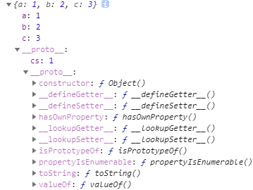

[^1]: prototype:原型 
[^2]: Property: 属性
[^3]: number-able 可计数的

# Object的静态函数

### Object.is()  / ===  比较实例是否相等

##### 相同处:

引用类型:比较内存地址

```
Object.is([],[]) //false
[]===[]//false
```

普通类型:直接比较值

##### 两处不同：

```
+0 === -0 //true
NaN === NaN // false

Object.is(+0, -0) // false
Object.is(NaN, NaN) // true
```

### Object.defineProperty

```js
    //定义-------------------------------------------------------------------------------------
   const obj = {a: 1, b: 2, c: 3}
    Object.defineProperty(obj, 'd', {
        configurable: false,
        enumerable: false,
        writable: true,
        value: 4
    })
    //获取原型--------------------------------------------------------------------------------------
    console.log(Object.getPrototypeOf(obj)) //@return:回构造函数 @param:任意实例化对象
    console.log(obj.__proto__)
    console.log(obj.constructor)
    console.log(Object.prototype.isPrototypeOf(obj)) //true

    //枚举------------------------------------------------------------------------------------------------
    //列出所有属性包括不可枚举
    a = Object.getOwnPropertyNames(obj)
    console.log(a)   //[a,b,c,d]

    //列出可以枚举的属性----------------------------

    b = Object.keys(obj)
    console.log(b) //["a", "b", "c"]


    //枚举出属性和值
    for (key in obj) {
        console.log(key + ':' + obj[key])
    }
    /*
        a:1
        b:2
        c:3
    */

    //判断属性的位置----------------------------------------------------------------------------------
    // 判断属性d 在不在obj

    console.log("d" in obj)  //true
    console.log("constructor" in obj) //true

    //判断是否有自己的d属性

    console.log(obj.hasOwnProperty('d')) //true
    console.log(obj.hasOwnProperty('constructor')) //false

    //判断属性是否可以枚举-----------------------------------------------------------------------------
    console.log(obj.propertyIsEnumerable('d')) //false

```

```js
    obj = {a: 1, b: 2}

    Object.defineProperty(obj, 'c', {//可以改变其他属性的值，可以把其他属性的值赋值给自己
        configurable: false,
        enumerable: true,
        set: function () {
            this.a = 0
        },
        get: function () {
            return this.b
        }

    })
    obj.c = 3 //set触发tis.a=0
    console.log(obj)//除非get
```


### Object.ctreat

```js
  const arr=Object.create({cs:1},{
    "a":{value :1,congigurable :false,enumerable :true,writable:true},
    "b":{value :2,congigurable :false,enumerable :true,writable:true},
    "c":{value :3,congigurable :false,enumerable :true,writable:true}
  })
```




# Object实例化对象的属性

### Object.prototype


### ownProperty

```js
const obj={a:1}
obj.hasOwnProperty(a) 返回boolen    
Object.getOwnPropertyNames(obj)//['a']
```

### key

```js
obj.propertyIsEnumerable('a')
obj.propertyIsEnumerable(propertyName)返回boolen 判断指定属性是否可以枚举
```

# Object实例化属性判断&Object静态函数列出对象的属性:

==注:只有属性判断类型用的Object的实例方法==

 * 判断:in ,in判断对象是否有某属性(返回Boolean,in操作符是针对key的)

 ```javascript
 //例如
 'constructor' in {a:1}
 
 '__proto__' in {a:1}
 
 'a'in{a:1}
 
 0 in [1,2] //true
 
 'hasOwnProperty'in{a:1}
 ```

###  __Prototype[^1]:__

 * 判断:Person.prototype.isprototypeof(xiaoming),
 * 列出: Object.getPrototypeOf(obj)

###  __ownProperty[^2]:__ 

 * 判断:obj.hasOwnProperty(propertyName) ,arr.hasOwnProperty('length')
* 列出:Object.getOwnPropertyNames(obj)

#####  ennumerable[^3]

###### 判断

obj.propertyIsEnumerable(propertyName) ,
arr.propertyIsEnumerable(0)

###### 枚举出对象

1. for....in操作符 列出可枚举的key (in操作符是针对key的)

```
for....in
```

2. for....of 枚举出可枚举的value,用于可迭代类型(array)

```
for....of
```

3.   Object.keys(obj) 列出可枚举的key返回数组

````js
 Object.keys(obj)['a','b']
 console.log(Object.keys(arr)) //["0", "1", "2"]
````

4. Object.values(obj)列出可枚举的value返回数组

```
  Object.values(obj)
```

5. Object.entries遍历对象

```
Object.entries(object) //['name', 'wang'],['age', 18]
```

###### 枚举类型转JSON

  JSON.stringify( )   列出obj返回json字符串

     JSON.stringify(obj) 
###### 合并枚举类型

1. Object.assign静态函数合并而不改变内存地址

  ```js
  Object.assign({a: 1}, {a:10,b: 20})//{a: 10,b: 22}
  Object.assign({a: 1}, [1, 2, 3])//{0: 1, 1: 2, 2: 3, a: 1}
  Object.assign({a: 1}, '123') //{0: "1", 1: "2", 2: "3", a: 1} //字符串自动封装对象了
  Object.assign(vue_instance,{msg:'msg'})
  ```

  ```js
  Object.assign([1,2,3],[4,5,6]//[1,2,3]
  Object.assign([1,2,3],'456') //["4", "5", "6"]
  ```

2. 操作符合并后新建内存地址存储

  ```js
  const obj = {a: 1}, obj2 = {a:10,b: 20}
  console.log({...obj,...obj2}) //{a:10,b: 20}
  ```

  ```js
  const obj = [10], obj2 =[10,20]
  console.log([...obj,...obj2]) //[10,10,20]
  ```
  ```js
  Object.assign({},{a:1})
  ```
