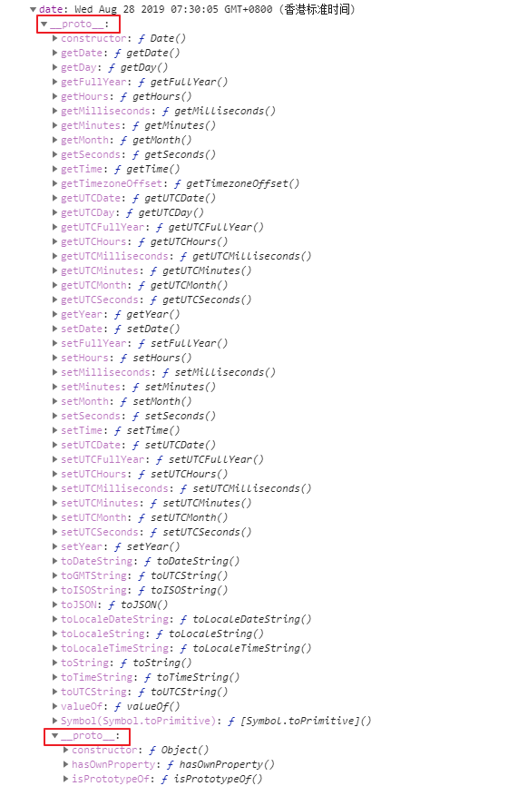
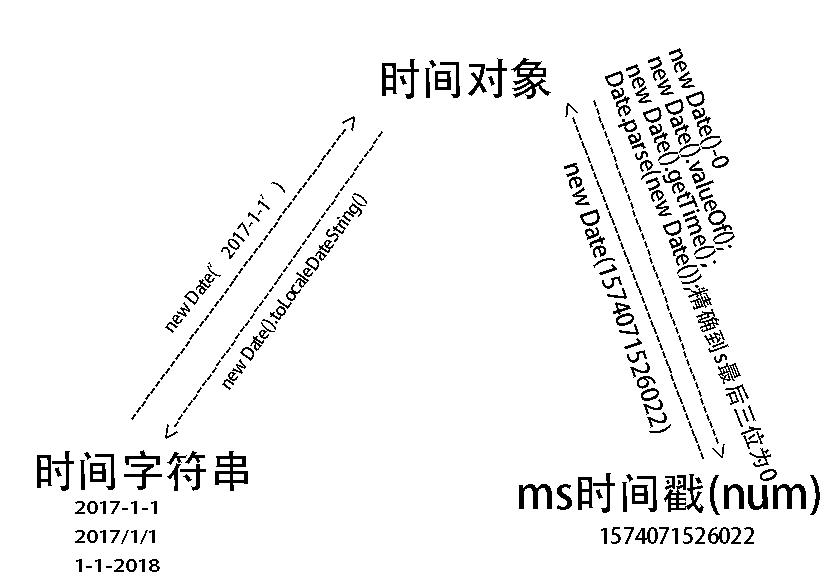

# new  Date()

```js
new Date()//返回当前时间对象,字面量为Tue Sep 03 2019 20:30:41 GMT+0800 (香港标准时间)
```
```js
new Date('2017-05-03')//字面量为Wed May 03 2017 00:00:00 GMT+0800 (香港标准时间)
```
```js
new Data('ms时间戳')//Wed May 03 2017 00:00:00 GMT+0800 (香港标准时间)
new Data('s时间戳*1000')//Wed May 03 2017 00:00:00 GMT+0800 (香港标准时间)
```

#  实例键值对和表达式




### 时间对象获得字符串或时间戳数字

 **时间戳:**是指格林威治时间1970年01月01日00时00分00秒(北京时间1970年01月01日08时00分00秒)起至现在的总秒数 




正则replace时间字符串格式                                                              

```js
 //第一种
 function getLocalTime(ms) {     
   return new Date(parseInt(ms) * 1000).toLocaleString().replace(/:\d{1,2}$/,' ');     
 }     
 alert(getLocalTime(1293072805)); //结果是2010年12月23日 10:53

 //第二种    
 function getLocalTime(ms) {     
     return new Date(parseInt(ms) * 1000).toLocaleString().substr(0,17)
 }     
 alert(getLocalTime(1293072805));  //   2010/12/23 上午10:53
 //第三种  
     function getLocalTime(ms) {     
       return new Date(parseInt(ms) * 1000).toLocaleString().replace(/年|月/g, "-").replace(/日/g, " ");      
    }     
     alert(getLocalTime(1177824835)); //格式为：2010-10-20 10:00:00
```
