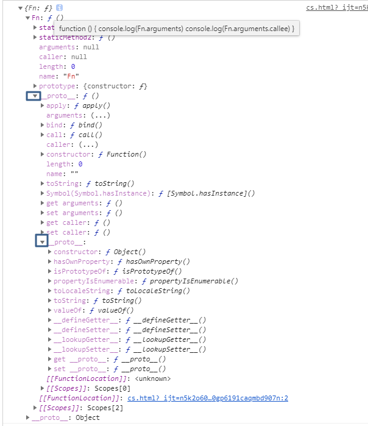

# 新建函数对象

### 字面量

```js
    //1.函数的定义
    function Fn(a1,b1){
        return a1+b1;
    }
    Fn.age = 100;
    console.log(Fn(1,1));//2
    console.log( Fn.age )
```

```js
   var Fn2 = function(a1,b1){
        return a1+b1;
    };
    console.log(Fn2(1,1));//2
    console.log(Fn2)
```

​                               es6语法造成的误解

```js
  data = {
    a: 1,
    function() {
      console.log(123)

    }
  }


  //上面等价于

  data = {
    a: 1,
    function: function () {
      console.log(123)

    }
  }

```

### new Function

```js
var Fn3 = new Function("a1,b1","return a1+b1;");
console.log({Fn3})
Fn3.age = 100;
console.log(Fn3(1,1));//2
console.log(Fn3.age);//100
```

​                     字符串转函数

```js
  const obj = {}
  const arr = [{name: 'article'}, {name: 'goods'}]
  arr.forEach(item => obj[item.name] = new Function('return ' + JSON.stringify(item))
  )
  console.log(obj)

  console.log(obj.article())
```

### 参数个数模拟重载

```js
  function fn(i, m) {
    if (arguments.length === 1) {
      return 1
    } else if (arguments.length === 2) {
      return 2
    } else {
      return 0
    }

  }

  console.log(fn(), fn(1), fn(1, 2))


##### 函数是可以和()计算的特殊对象

###### return 设置返回值

1. 制造新指令fn()(返回任意值) 
2. 闭包(返回函数)
3. 柯利化函数(返回函数)
4. new Fn(p1,px)(返回Fn类型的对象)

​```javascript
//1.直接生成对象,无构造函数参与
obj={a:1,b:2}
obj=new Object({a:1,b:2})
//2.构造函数版生成对象,构造函数参与

function Fn(a,b) {
  this.a=a;
  this.b=b
}
Fn.prototype={c:3} //固定部分

obj=new Fn()
```


# 实例键值对和表达式

```js
  const Fn = function () {
    console.log(Fn.arguments)
    console.log(Fn.arguments.callee)
  }
  Fn.staticMethod1 = function () {
  }
  Fn.staticMethod2 = function () {
  }
  Fn.prototype={}
  console.log({Fn})
```




### __ proto __:Function.protype

```javascript
  //1.原型属性Function.prototype---------------
   console.log({'Function.protype': Object.getPrototypeOf(fn)})
  /*{ 
    apply: ? apply()
    arguments: (...)
    bind: ? bind()
    call: ? call()
    caller: (...)
    constructor: ? Function()
    length: 0
    name: ""
    toString: ? toString()
    Symbol(Symbol.hasInstance): ? [Symbol.hasInstance]()
    get arguments: ? ()
    set arguments: ? ()
    get caller: ? ()
    set caller: ? ()
    }*/

```

### OwnProperty

```js
  //2.Own属性,Function构造生成---------------------    
    console.log(Object.getOwnPropertyNames(Fn))//(6)["length", "name", "arguments", "caller", "prototype","staticMethod1","staticMethod2"]

```

### keys

```js
    //3.ennumerable:静态变量,静态方法--------------------
     console.log(Object.keys(Fn)) //[staticMethod1,staticMethod2]

     //for..in还能枚举出 

    for (item in f) {
        console.log(item) //staticMethod1,staticMethod2

    }
```

